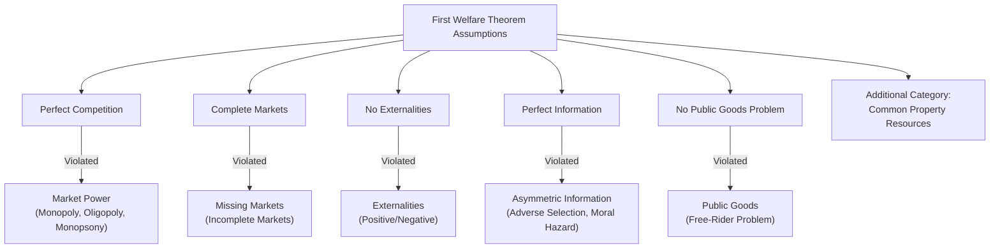

## Taxonomy of Market Failures

### Overview

Market failure occurs when the unregulated interaction of self-interested agents in a market fails to produce a Pareto efficient outcome, i.e., when the First Fundamental Theorem of Welfare Economics' underlying assumptions are violated. Understanding market failure requires a systematic taxonomy of *which* assumption breaks down, since each category implies a distinct diagnosis and a different class of corrective policy tools.

### The Diagnostic Logic: Linking Failures to FFT Assumptions

**Key Points**

- The First Welfare Theorem requires: perfect competition (price-taking), complete markets, no externalities, perfect information, and no public goods problems.
- Each category of market failure below corresponds to the violation of one or more of these conditions.
- Classifying a real-world problem correctly is the essential first step in public economics, because the *type* of failure determines the *type* of appropriate remedy (a Pigouvian tax fixes an externality but does nothing for a public goods problem, for example).

### 1. Market Power (Imperfect Competition)

**Key Points**

- Occurs when firms or consumers can influence price rather than acting as price-takers, violating the perfect-competition assumption.
- **Monopoly**: a single seller restricts output below the competitive level to raise price above marginal cost, producing a deadweight loss. The profit-maximizing condition $MR = MC$ diverges from the efficient condition $P = MC$.
- **Oligopoly**: a small number of firms exercise mutual strategic influence over price/output (analyzed via Cournot, Bertrand, or Stackelberg models), generally producing outcomes between perfect competition and monopoly.
- **Monopsony**: a single buyer (e.g., a dominant employer in a local labor market) restricts the quantity purchased below the competitive level, depressing the price paid (e.g., wages) below the value of marginal product.
- **Standard remedies**: antitrust/competition policy, price regulation (rate-of-return or price-cap regulation for natural monopolies), breaking up market power, or public provision in extreme natural-monopoly cases.

$$\text{Monopoly deadweight loss} = \frac{1}{2}(Q_c - Q_m)(P_m - P_c)$$

where $Q_c, P_c$ are competitive quantity/price and $Q_m, P_m$ are monopoly quantity/price.

### 2. Externalities

**Key Points**

- Arise when an agent's production or consumption decision directly affects the utility or production possibilities of a third party **outside** any market transaction or price mechanism.
- **Negative externalities** (e.g., pollution): private marginal cost is less than social marginal cost, leading the market to **overproduce** relative to the efficient quantity.
- **Positive externalities** (e.g., education, vaccination, R&D spillovers): private marginal benefit is less than social marginal benefit, leading the market to **underproduce** relative to the efficient quantity.
- **Production vs. consumption externalities**, and **unidirectional vs. reciprocal** externalities, are further sub-classifications used in more detailed treatments (e.g., Coasean bargaining problems involve reciprocal externalities).
- **Standard remedies**: Pigouvian taxes/subsidies, cap-and-trade / tradable permits, Coasean bargaining (when transaction costs are low and property rights are well-defined), direct regulation/quantity standards.

$$MSC = MPC + MEC \quad \text{(negative externality; } MEC = \text{marginal external cost)}$$

### 3. Public Goods

**Key Points**

- Defined by two properties: **non-excludability** (impossible or costly to prevent non-payers from consuming) and **non-rivalry** (one person's consumption does not diminish availability to others).
- Pure public goods (national defense, basic research, lighthouse-style examples) generate a **free-rider problem**: since no one can be excluded, individuals understate their true willingness to pay, and private markets systematically **underprovide** these goods relative to the efficient level.
- The efficient provision condition, the **Samuelson condition**, requires summing marginal rates of substitution across all consumers (rather than equating a single MRS to MRT as with private goods):

$$\sum_{i=1}^n MRS_i = MRT$$

- **Impure public goods** (club goods — excludable but non-rival; common-pool resources — rivalrous but non-excludable) occupy the other two quadrants of the excludability/rivalry matrix and generate related but distinct failure modes.
- **Standard remedies**: public provision funded through general taxation, Lindahl pricing (theoretical), voluntary contribution mechanisms, and mechanism design solutions (e.g., Vickrey-Clarke-Groves mechanisms) to induce truthful preference revelation.

### 4. Asymmetric Information

**Key Points**

- Arises when one party to a transaction has information relevant to the exchange that the other party lacks, violating the perfect-information assumption.
- **Adverse selection**: information asymmetry exists *before* the transaction, allowing the informed party to select into transactions favorable to them at the uninformed party's expense (Akerlof's "market for lemons" — low-quality sellers drive out high-quality sellers when buyers cannot distinguish quality, potentially causing market unraveling/collapse).
- **Moral hazard**: information asymmetry (or unobservable action) exists *after* the transaction, allowing one party to alter behavior in a way harmful to the other once insured/contracted against risk (e.g., reduced care-taking after purchasing insurance).
- **Signaling and screening**: market responses that attempt to mitigate asymmetric information — the informed party signals quality (e.g., education as a signal of ability, per Spence), or the uninformed party designs a menu of contracts to screen types (e.g., insurance deductible menus).
- **Standard remedies**: mandatory disclosure requirements, licensing/certification, mandated insurance pooling (e.g., community rating with mandates to prevent selection death spirals), reputation mechanisms, and contract design (screening/signaling).

### 5. Missing or Incomplete Markets

**Key Points**

- Occurs when a market for a good, service, risk, or contingency simply does not exist, even though its existence could generate mutually beneficial trade — often because of high transaction costs, absent property rights, or the difficulty of writing and enforcing contracts over long horizons or uncertain states of the world.
- Classic examples: missing insurance markets for certain idiosyncratic or long-horizon risks (e.g., some forms of long-term care insurance, insurance against structural unemployment from technological change), and missing futures markets for goods far in the future.
- Distinct from asymmetric information failures, though the two often co-occur and reinforce each other (a missing market can itself be *caused* by adverse selection, for example — the market "unravels" to non-existence).
- **Standard remedies**: government provision of the missing market function (e.g., social insurance programs like unemployment insurance or Social Security, which substitute for private markets that would otherwise fail to form), regulatory mandates, or market-design interventions to reduce transaction costs.

### 6. Common Property Resources / Open-Access Resources

**Key Points**

- A resource that is **rivalrous** (one person's use depletes what's available to others) but **non-excludable** (no one can be prevented from using it) — the mirror image of a club good in the excludability/rivalry matrix.
- Leads to the **"tragedy of the commons"**: because no individual user bears the full social cost of their extraction/use, the resource is overexploited relative to the socially efficient level (classic examples: overfishing, groundwater depletion, unregulated grazing land, traffic congestion).
- Structurally similar to a negative externality problem, but specifically tied to a depletable, shared resource stock rather than a generic third-party spillover.
- **Standard remedies**: assigning property rights (privatization or communal management institutions, per Elinor Ostrom's work on self-governing commons), tradable quotas (e.g., individual transferable fishing quotas), Pigouvian-style extraction taxes, or direct regulation of access/harvest limits.

### Excludability–Rivalry Matrix (Classifying Goods)

|  | Excludable | Non-Excludable |
| --- | --- | --- |
| **Rivalrous** | Private Goods (e.g., food, clothing) — no inherent market failure | Common-Pool Resources (e.g., fisheries, groundwater) — overuse/tragedy of the commons |
| **Non-Rivalrous** | Club Goods (e.g., cable TV, toll roads with capacity) — potential underuse if priced above marginal cost (which is near zero) | Public Goods (e.g., national defense, clean air) — free-rider problem, underprovision |

### Summary Table: Failure Type, Diagnosis, and Remedy

| Failure Type | FFT Assumption Violated | Typical Direction of Inefficiency | Standard Remedy |
| --- | --- | --- | --- |
| Market Power | Perfect competition | Underproduction relative to competitive level | Antitrust, price regulation |
| Negative Externality | No externalities | Overproduction | Pigouvian tax, cap-and-trade |
| Positive Externality | No externalities | Underproduction | Pigouvian subsidy |
| Public Goods | No public goods problem | Underprovision | Public provision, tax-financed supply |
| Asymmetric Information | Perfect information | Selection distortion / market unraveling | Disclosure, screening, mandates |
| Missing Markets | Complete markets | Foregone mutually beneficial trade | Government provision, market design |
| Common Property Resources | No externalities (resource-specific) | Overexploitation | Property rights, quotas, extraction taxes |

### Interactions and Overlaps Between Categories

**Key Points**

- Market failures frequently **co-occur and interact**: health insurance markets combine adverse selection (asymmetric information) with, in some designs, elements of a public-good-like problem (e.g., herd immunity from vaccination has externality characteristics layered on top of information problems in insurance markets).
- Correcting one failure can sometimes **exacerbate** another if not carefully designed — e.g., mandating insurance to solve adverse selection can worsen moral hazard if not paired with appropriate cost-sharing (deductibles, co-insurance).
- [Inference] This interaction is a central reason public economics emphasizes careful diagnosis before intervention: applying an externality-style remedy (a tax) to what is fundamentally a public-goods or information problem is likely to be ineffective or even counterproductive.

### Government Failure: The Necessary Counterpoint

**Key Points**

- Identifying a market failure is a **necessary but not sufficient** condition for beneficial government intervention — the relevant comparison is always market outcome **versus realistically achievable government intervention**, not market outcome versus a hypothetical frictionless planner.
- **Government failure** — regulatory capture, information constraints facing regulators, public choice/political-economy distortions, administrative costs — can mean that intervention fails to improve, or even worsens, the outcome relative to the (inefficient) market baseline.
- [Inference] This comparative institutional analysis framing (market failure vs. government failure, not market failure vs. perfection) is a recurring methodological theme across applied public economics, particularly in debates over the scope and design of intervention.

**Related Topics**

- Externalities and the Coase Theorem
- Public Goods and the Free-Rider Problem
- Asymmetric Information: Adverse Selection and Moral Hazard
- Common-Pool Resources and the Tragedy of the Commons
- Pigouvian Taxes and Subsidies
- Antitrust and Competition Policy
- Government Failure and Public Choice Theory
- Coase Theorem and Property Rights