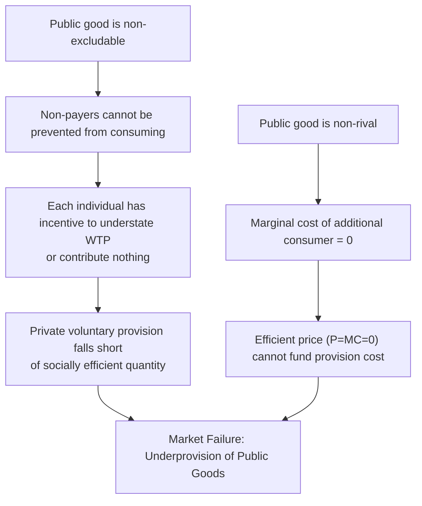

## Public Goods and Non-Excludability

### Overview

Public goods represent one of the clearest and most consequential departures from the conditions required for competitive markets to achieve Pareto efficiency. Defined by two structural properties — non-rivalry and non-excludability — public goods create incentive problems that private markets systematically fail to solve, motivating a distinct body of theory (efficient provision conditions, mechanism design) and a central policy role for government or collective provision.

### Defining Properties

**Key Points**

- **Non-rivalry (non-rivalrousness)**: one individual's consumption of the good does not reduce the quantity or quality available to any other individual. The marginal cost of serving an additional consumer is zero.
- **Non-excludability**: it is technologically infeasible, or prohibitively costly, to prevent any individual — including non-payers — from consuming the good once it is provided.
- A good is a **pure public good** only if it exhibits *both* properties simultaneously. Goods possessing only one property fall into related but distinct categories (club goods, common-pool resources — see the excludability/rivalry matrix).
- Classic examples: national defense, basic scientific research, lighthouse services (the traditional textbook example, though historically contested), clean air, herd immunity from widespread vaccination, over-the-air broadcast signals (pre-encryption).

### The Excludability–Rivalry Matrix

|  | Excludable | Non-Excludable |
| --- | --- | --- |
| **Rivalrous** | Private Goods (food, clothing) | Common-Pool Resources (fisheries, groundwater) |
| **Non-Rivalrous** | Club Goods (cable TV, uncongested toll roads) | **Public Goods** (national defense, basic research) |

**Key Points**

- **Club goods** (excludable, non-rival) can be efficiently priced and provided privately via exclusion mechanisms (subscription fees, membership), since non-payers can be kept out even though additional consumption is costless up to a capacity constraint.
- **Common-pool resources** (non-excludable, rivalrous) suffer from a distinct failure — the tragedy of the commons — rather than the free-rider/underprovision problem specific to public goods.
- Many real-world goods are **impure public goods**, exhibiting partial rivalry (congestion effects, as in an uncongested highway becoming congested) or partial excludability (encryption technology making a broadcast signal excludable).

### The Free-Rider Problem

**Key Points**

- Because non-payers cannot be excluded from consuming a public good once it exists, each individual has an incentive to **understate** their true willingness to pay, hoping to consume the good while letting others bear the cost of provision — this is the **free-rider problem**.
- If every individual free-rides, the good will be **underprovided or not provided at all** by voluntary private contributions, even when the *aggregate* social value of the good far exceeds its cost.
- This is a strategic (game-theoretic) failure distinct from a simple preference-revelation problem: even individuals who value the good highly may rationally choose to contribute less than their true valuation, anticipating others' contributions.

### Efficient Provision: The Samuelson Condition

For a private good, efficient provision requires equating a *single* consumer's marginal rate of substitution to the marginal rate of transformation: $MRS_i = MRT$. Because a public good is consumed simultaneously and identically by everyone, efficiency requires summing marginal valuations **across all consumers**, since each unit of the good delivers utility to every person at once (Samuelson, 1954):

$$\sum_{i=1}^n MRS_i = MRT$$

Equivalently, in terms of marginal benefits and marginal cost:

$$\sum_{i=1}^n MB_i(G) = MC(G)$$

where $G$ is the quantity of the public good and $MB_i$ is individual $i$'s marginal benefit.

**Key Points**

- This is often called the **Samuelson Rule** or **Bowen-Lindahl-Samuelson condition**, reflecting contributions by Erik Lindahl (1919), Howard Bowen (1943), and Paul Samuelson (1954).
- The efficient condition requires **vertically summing** individual demand/marginal benefit curves (adding willingness to pay for the *same* unit across individuals), in contrast to the **horizontal summation** used to derive aggregate demand for private goods (adding *quantities demanded* at a given price).

### Diagram: Vertical Summation for Public Goods vs. Horizontal Summation for Private Goods

<svg xmlns="http://www.w3.org/2000/svg" viewBox="0 0 680 420" font-family="sans-serif">
<text x="340" y="24" text-anchor="middle" font-size="16" font-weight="bold">Vertical Summation of Demand for Public Goods (svg_diagram)</text>
<line x1="80" y1="360" x2="620" y2="360" stroke="#333" stroke-width="2" />
<line x1="80" y1="360" x2="80" y2="50" stroke="#333" stroke-width="2" />
<text x="630" y="365" font-size="13">Quantity G</text>
<text x="60" y="45" font-size="13">Price / MB</text>
<line x1="80" y1="320" x2="500" y2="80" stroke="#2980b9" stroke-width="2" />
<text x="505" y="78" font-size="11" fill="#2980b9">MB_A (individual A)</text>
<line x1="80" y1="280" x2="500" y2="180" stroke="#27ae60" stroke-width="2" />
<text x="505" y="178" font-size="11" fill="#27ae60">MB_B (individual B)</text>
<path d="M 80 240 L 200 155 L 500 60" stroke="#c0392b" stroke-width="2.5" fill="none" />
<text x="380" y="55" font-size="11" fill="#c0392b" font-weight="bold">Sum MB_A + MB_B (vertical sum)</text>
<line x1="80" y1="300" x2="620" y2="300" stroke="#7f8c8d" stroke-dasharray="4,3" />
<text x="625" y="305" font-size="11" fill="#7f8c8d">MC (supply)</text>
<circle cx="250" cy="132" r="4" fill="#8e44ad" />
<text x="260" y="128" font-size="11" fill="#8e44ad">Efficient G*: ΣMB = MC</text>
</svg>

At the efficient quantity $G^*$, the vertically summed marginal benefit curve intersects the marginal cost curve — reflecting that *all* consumers simultaneously enjoy each unit provided, so their marginal valuations for that unit are additive rather than competing for a fixed quantity.

### Worked Numerical Example

**Setup**: Two individuals with inverse demand (marginal benefit) for a public good $G$:

$$MB_A = 100 - 2G, \quad MB_B = 60 - G$$

Marginal cost of provision: $MC = 40$.

**Step 1 — Vertical summation**:

$$\sum MB = (100 - 2G) + (60 - G) = 160 - 3G$$

**Step 2 — Set equal to MC**:

$$160 - 3G = 40 \implies 3G = 120 \implies G^* = 40$$

**Output**: The efficient quantity of the public good is $G^* = 40$. At this quantity, $MB_A = 100 - 80 = 20$ and $MB_B = 60 - 40 = 20$, summing to $40 = MC$, confirming the Samuelson condition holds.

**Key Points**

- Note that neither individual's *own* marginal benefit ($20$ each) equals the marginal cost ($40$) individually — only the **sum** does. This illustrates why a private market, where each consumer independently equates their own $MB$ to price, would undersupply the good relative to $G^*$.

### Lindahl Pricing and Its Limitations

**Key Points**

- **Lindahl equilibrium**: a theoretical solution in which each individual pays a personalized "Lindahl price" per unit of the public good, equal to their own marginal benefit at the efficient quantity ($p_A = MB_A(G^*)$, $p_B = MB_B(G^*)$), with prices summing to the marginal cost.
- In the worked example above, individual A would pay a Lindahl price of $20$ and individual B would pay $20$, jointly covering the $MC = 40$ — and each individual, facing their personalized price, would voluntarily choose exactly $G^*$.
- **Fundamental limitation**: Lindahl pricing requires the government (or mechanism) to *know* each individual's true marginal benefit function — but since preferences for public goods are not revealed through ordinary market purchases, individuals face the same incentive to misrepresent their valuation as in any free-rider setting, undermining Lindahl's practical applicability as anything beyond a theoretical benchmark.

### Preference Revelation Mechanisms

**Key Points**

- The core informational challenge is: how can society learn individuals' true valuations for a public good when self-interested reporting is subject to strategic manipulation?
- **Vickrey-Clarke-Groves (VCG) mechanisms** are a class of mechanism-design solutions that make truthful revelation of valuations a **dominant strategy** for each participant, by structuring payments so that each individual's payment depends only on the *externality* their reported valuation imposes on others (not on their own reported value directly).
- [Inference] VCG-style mechanisms achieve efficient public goods provision in theory but face practical limitations in real-world implementation — including budget balance problems (VCG payments generally do not sum to exactly cover the cost), computational complexity, and vulnerability to collusion — which is why they remain primarily a theoretical/laboratory benchmark rather than a widely deployed real-world financing mechanism for most public goods.
- **Voluntary contribution mechanisms** (e.g., crowdfunding, charitable giving, threshold/assurance contracts requiring a minimum funding level before the good is provided) represent practical, imperfect real-world attempts to mitigate — though not eliminate — free-riding.

### Empirical and Experimental Evidence

**Key Points**

- Laboratory public-goods games (where subjects choose how much of an endowment to contribute to a shared pot that is multiplied and redistributed equally) consistently find that **actual contributions exceed the free-riding prediction of zero** but remain **below the socially efficient level**, and contributions tend to decay over repeated rounds absent punishment mechanisms.
- Introducing **peer punishment** or **reputation/repeated interaction** in experimental settings tends to sustain higher contribution levels over time, suggesting social/behavioral factors partially — but not fully — offset the pure free-rider prediction.
- [Inference] This experimental gap between the pure free-rider theoretical prediction and observed behavior is widely discussed in behavioral public economics, though the standard Samuelson/free-rider framework remains the baseline theoretical benchmark against which such deviations are measured.

### Government Provision as the Standard Remedy

**Key Points**

- Since voluntary private provision systematically underprovides public goods, the standard remedy is **provision funded through compulsory general taxation**, which sidesteps the free-rider problem by making payment (via taxes) independent of any individual's ability to opt out of consumption.
- This does **not** imply government must directly *produce* the good — government can finance provision while contracting production to private firms (e.g., government-funded, privately-built infrastructure or defense equipment).
- Determining the *efficient quantity* to provide (via the Samuelson condition) remains an informational challenge even for government provision, since aggregate preferences must still be estimated (via voting mechanisms, cost-benefit analysis, or political processes) rather than directly observed as in a Lindahl equilibrium.

### Impure Public Goods and Real-World Complications

**Key Points**

- **Congestible public goods**: goods that are non-rival up to a capacity constraint but become rivalrous beyond it (e.g., an uncongested park, a highway before traffic congestion sets in) — efficient provision analysis must account for the point at which congestion externalities emerge.
- **Excludable public goods (club goods)** can sometimes be converted from a market-failure category into a privately-provided club good via technological or institutional innovation (e.g., encrypted satellite broadcast converting a previously non-excludable signal into an excludable one).
- **Global public goods** (climate stability, pandemic preparedness, basic scientific knowledge) extend the free-rider problem to the international level, where no supranational taxing authority exists to enforce compulsory financing, making international cooperation and treaty design central policy tools.

**Related Topics**

- Taxonomy of Market Failures
- Samuelson Condition and Efficient Public Goods Provision
- Lindahl Equilibrium and Personalized Pricing
- Externalities and the Coase Theorem
- Common-Pool Resources and the Tragedy of the Commons
- Mechanism Design and VCG Mechanisms
- Voting Models and Public Choice Theory
- Club Goods and Congestion Pricing