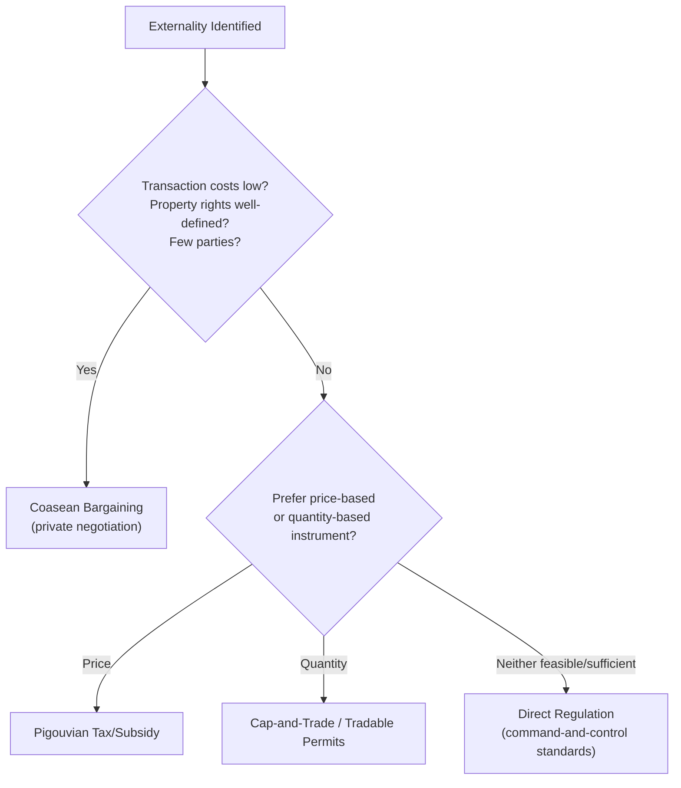

## Externalities and Spillover Effects

### Overview

An externality arises when the action of one economic agent — in production or consumption — directly affects the utility or production possibilities of another agent, without that effect being mediated through prices. Because the party generating the spillover does not bear (or receive) its full cost (or benefit), private decisions diverge from socially efficient ones, causing markets to systematically over- or under-produce the good in question. Externalities are among the most widely studied market failures in public economics, with a rich set of both market-based and regulatory corrective tools.

### Formal Definition

An externality exists when the utility or production function of one agent depends on a variable controlled by another agent, outside of any market transaction:

$$u_i = u_i(x_i, x_j) \quad \text{or} \quad f_i(x_i) = f_i(x_i, x_j)$$

where $x_j$ is an action or output level chosen by agent $j$ that enters agent $i$'s utility or production function directly, and $j$ does not internalize this effect when choosing $x_j$.

**Key Points**

- The defining feature is that the effect occurs **outside the price system** — agent $j$ neither pays for imposing a cost, nor is paid for conferring a benefit, on agent $i$.
- This creates a **wedge between private and social marginal cost/benefit**, the central diagnostic feature of an externality problem.

### Taxonomy of Externality Types

**1. Negative Production Externality** — a firm's production imposes costs on others (e.g., industrial pollution damaging downstream water users).

**2. Positive Production Externality** — a firm's production confers benefits on others (e.g., a firm's R&D generating knowledge spillovers that other firms can use).

**3. Negative Consumption Externality** — an individual's consumption imposes costs on others (e.g., secondhand smoke, loud noise).

**4. Positive Consumption Externality** — an individual's consumption confers benefits on others (e.g., vaccination reducing disease transmission to others, home landscaping improving neighbors' property values).

**Key Points**

- **Unidirectional externalities**: the effect flows one way (a factory pollutes a river; downstream users cannot reciprocally affect the factory).
- **Reciprocal externalities**: both parties' actions mutually affect each other (e.g., two neighboring farmers whose land-use choices each affect the other's pest exposure) — this distinction matters for Coasean bargaining solutions, since reciprocal cases can have more symmetric bargaining outcomes.
- **Network externalities** (a related but distinct concept): the value of a good to one consumer depends on how many other consumers use it (e.g., telecommunications, social media platforms) — these operate through indirect market effects, but the classic case of an unpriced network effect on non-adopters can also be modeled as an externality.

### The Wedge Between Private and Social Cost/Benefit

For a **negative production externality**:

$$MSC = MPC + MEC$$

where $MSC$ = marginal social cost, $MPC$ = marginal private cost, $MEC$ = marginal external cost.

For a **positive consumption externality**:

$$MSB = MPB + MEB$$

where $MSB$ = marginal social benefit, $MPB$ = marginal private benefit, $MEB$ = marginal external benefit.

**Key Points**

- A firm generating a negative production externality equates $MPC = P$ (or $MR = MPC$), producing quantity $Q_{market}$ — but the efficient quantity $Q^*$ satisfies $MSC = P$, which occurs at a **lower** output level since $MSC > MPC$. The market **overproduces**.
- A positive consumption externality leads consumers to equate $MPB$ to price, consuming $Q_{market}$ — but efficiency requires $MSB = P$, occurring at a **higher** consumption level since $MSB > MPB$. The market **underproduces**.

### Diagram: Negative Externality — Overproduction and Deadweight Loss

<svg xmlns="http://www.w3.org/2000/svg" viewBox="0 0 660 420" font-family="sans-serif">
<text x="330" y="24" text-anchor="middle" font-size="16" font-weight="bold">Negative Production Externality (svg_diagram)</text>
<line x1="80" y1="360" x2="600" y2="360" stroke="#333" stroke-width="2" />
<line x1="80" y1="360" x2="80" y2="50" stroke="#333" stroke-width="2" />
<text x="605" y="365" font-size="13">Quantity Q</text>
<text x="60" y="45" font-size="13">Price / Cost</text>
<line x1="80" y1="330" x2="560" y2="90" stroke="#2980b9" stroke-width="2" />
<text x="565" y="88" font-size="11" fill="#2980b9">MPC (private supply)</text>
<line x1="80" y1="290" x2="560" y2="50" stroke="#c0392b" stroke-width="2" />
<text x="565" y="48" font-size="11" fill="#c0392b">MSC = MPC + MEC</text>
<line x1="80" y1="90" x2="560" y2="320" stroke="#27ae60" stroke-width="2" />
<text x="565" y="322" font-size="11" fill="#27ae60">Demand = MSB = MPB</text>
<line x1="440" y1="360" x2="440" y2="150" stroke="#7f8c8d" stroke-dasharray="4,3" />
<text x="435" y="375" font-size="11" fill="#7f8c8d">Q_market</text>
<line x1="340" y1="360" x2="340" y2="195" stroke="#7f8c8d" stroke-dasharray="4,3" />
<text x="335" y="375" font-size="11" fill="#7f8c8d">Q* (efficient)</text>
<path d="M 340 195 L 440 150 L 440 235 Z" fill="#e74c3c" opacity="0.4" />
<text x="450" y="200" font-size="11" fill="#c0392b" font-weight="bold">Deadweight Loss</text>
</svg>

**Key Points**

- The market equilibrium at $Q_{market}$ (where $MPC = MPB$) exceeds the efficient quantity $Q^*$ (where $MSC = MSB$).
- The shaded triangle represents the **deadweight loss**: for every unit produced between $Q^*$ and $Q_{market}$, the social cost of production exceeds the social benefit consumers derive, representing a pure efficiency loss to society.

### Corrective Tool 1: Pigouvian Taxes and Subsidies

**Key Points**

- A **Pigouvian tax**, named for Arthur Pigou, is set equal to the marginal external cost at the efficient quantity: $t = MEC(Q^*)$, raising the firm's private marginal cost to equal the social marginal cost and inducing the firm to voluntarily reduce output to $Q^*$.
- Symmetrically, a **Pigouvian subsidy** equal to the marginal external benefit at $Q^*$ corrects underprovision from a positive externality.
- **Key requirement**: the regulator must know both the marginal damage/benefit function and the efficient quantity — informational demands that are often difficult to satisfy precisely in practice.

$$t^* = MEC(Q^*) = MSC(Q^*) - MPC(Q^*)$$

**Example**

A factory's private marginal cost of production is $MPC = 10 + 2Q$. Pollution imposes an external cost of $MEC = 4$ per unit (constant). Market demand is $P = 50 - Q$. Without correction, the market equates $MPC = P$: $10 + 2Q = 50 - Q \Rightarrow Q_{market} = 13.3$. With the externality internalized, $MSC = 14 + 2Q$, and efficiency requires $14 + 2Q = 50 - Q \Rightarrow Q^* = 12$. A Pigouvian tax of $t = 4$ per unit, raising the firm's effective marginal cost to $MPC + t = 14 + 2Q$, induces the firm to voluntarily choose $Q^*= 12$.

### Corrective Tool 2: Cap-and-Trade / Tradable Permits

**Key Points**

- Rather than setting a **price** on the externality (as a Pigouvian tax does), a cap-and-trade system sets a **quantity** limit (the "cap") on total externality-generating activity (e.g., total emissions) and allows firms to trade permits representing the right to generate one unit of the externality.
- Under a cap-and-trade system, the market-clearing permit price emerges endogenously and, in a well-functioning market, converges toward the Pigouvian tax rate that would achieve the same quantity target — the two instruments are theoretically equivalent under certainty (Weitzman's "prices vs. quantities" analysis shows this equivalence breaks down under uncertainty about costs/benefits).
- Achieves **cost-effectiveness**: because permits are tradable, abatement occurs disproportionately among firms with the lowest abatement costs, minimizing the total cost of reaching any given aggregate reduction target.
- Real-world examples: the U.S. Acid Rain Program (SO2 trading), the EU Emissions Trading System (EU ETS), various regional carbon cap-and-trade programs.

### Corrective Tool 3: The Coase Theorem

**Key Points**

- **Statement**: If property rights are clearly defined and transaction costs are negligible, private parties can bargain to an efficient allocation of resources regardless of the initial assignment of property rights — externalities can be "internalized" through voluntary negotiation without government intervention.
- The **assignment of property rights still matters for the distribution** of gains (who pays whom), but not for the *efficiency* of the final outcome — this is the theorem's central and often-misunderstood claim.
- **Critical limitations**: the theorem's efficiency result depends heavily on transaction costs being low, which fails when there are many affected parties (bargaining costs scale poorly with the number of agents), information asymmetries about damages/benefits, or enforcement/verification difficulties — precisely the conditions under which most real-world externalities (pollution affecting millions, climate change) occur.
- [Inference] The Coase Theorem is generally treated in public economics less as a practical policy prescription for large-scale externalities and more as a benchmark clarifying that the *fundamental* problem is the absence of a market/price for the externality — and that assigning tradable property rights (as in cap-and-trade) is one way of manufacturing such a market even when direct bilateral bargaining is infeasible.

### Corrective Tool 4: Direct Regulation (Command-and-Control)

**Key Points**

- Sets explicit quantity or technology standards (e.g., maximum emissions per facility, mandated pollution-control equipment) rather than relying on price signals.
- **Advantages**: administratively simpler to monitor and enforce in some contexts, provides certainty about the physical outcome (e.g., a hard cap on a specific pollutant), useful when the damage function is highly nonlinear or has a dangerous threshold effect.
- **Disadvantages**: typically **not cost-effective** relative to market-based instruments, since it does not allow abatement to be concentrated among the lowest-cost firms — uniform standards impose the same requirement regardless of firms' differing abatement costs.

### Positive Externalities in Public Economics: Education and R&D

**Key Points**

- **Education** is a canonical positive-externality good: an individual's education raises not only their own productivity/earnings (private benefit) but also generates broader social benefits (higher civic participation, lower crime, productivity spillovers to co-workers) not captured in the individual's private return calculation — motivating public subsidization or provision of education.
- **R&D and innovation** generate **knowledge spillovers**: once created, ideas are largely non-rival, and firms cannot fully appropriate the social value of their innovations (competitors free-ride on spillover knowledge), leading to systematic **underinvestment** in R&D relative to the socially efficient level absent intervention.
- **Standard remedies**: patents and intellectual property protection (creating temporary excludability to restore private incentives), R&D tax credits/subsidies, public funding of basic research, and government-university-industry research partnerships.

### Network Externalities: A Distinct but Related Concept

**Key Points**

- Occur when a good's value to a consumer increases with the number of other consumers using it (telephones, social networks, certain software platforms).
- Unlike classic Pigouvian externalities, network effects are frequently **partially or fully internalized through the price mechanism** in modern platform markets (e.g., platforms subsidizing early adopters, understanding that scale increases the good's value to all users) — meaning the *market failure* framing applies most cleanly to network effects that remain genuinely unpriced.
- [Inference] Network externalities are often discussed as a distinct topic within industrial organization and platform economics rather than treated identically to classic Pigouvian externality analysis, since strategic firm behavior (not just missing markets) plays a central role in their internalization.

### Summary Table: Externality Types and Corrective Tools

| Externality Type | Market Outcome | Efficient Direction of Correction | Common Tool |
| --- | --- | --- | --- |
| Negative Production | Overproduction | Reduce output | Pigouvian tax, cap-and-trade, regulation |
| Positive Production | Underinvestment | Increase output | Subsidy, patents, public funding |
| Negative Consumption | Overconsumption | Reduce consumption | Excise tax, regulation (e.g., smoking bans) |
| Positive Consumption | Underconsumption | Increase consumption | Subsidy, mandates (e.g., vaccination) |

**Related Topics**

- Taxonomy of Market Failures
- Coase Theorem and Property Rights
- Pigouvian Taxation: Design and Incidence
- Cap-and-Trade and Tradable Permit Systems
- Public Goods and Non-Excludability
- Common-Pool Resources and the Tragedy of the Commons
- Intellectual Property and Innovation Policy
- Climate Change Economics and Carbon Pricing