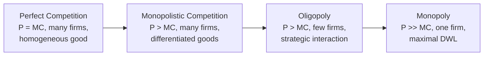

## Imperfect Competition and Market Power

### Definition and Scope

Imperfect competition describes any market structure departing from the perfectly competitive benchmark of atomistic firms, homogeneous products, free entry/exit, and perfect information. Market power is the ability of a firm (or coalition of firms) to profitably set price above marginal cost, i.e., to act as a "price maker" rather than a "price taker." In public economics, this matters because market power causes a deadweight loss even without externalities or public goods — it is a standalone justification for antitrust policy, price regulation, and public provision.

### Why Market Power Constitutes Market Failure

Under perfect competition, price equals marginal cost ($P = MC$) at the market-clearing equilibrium, satisfying the condition for Pareto efficiency in production and consumption. A firm with market power restricts output below the competitive level to raise price above marginal cost, creating a wedge:

$$P > MC$$

This wedge means some mutually beneficial trades (transactions where a consumer's willingness to pay exceeds the marginal cost of production) do not occur, generating deadweight loss (DWL). Unlike externalities, this inefficiency arises purely from strategic output restriction, not from unpriced spillovers.

### The Standard Monopoly Model

**Setup**

A monopolist faces the entire market demand curve $P(Q)$ and chooses quantity $Q$ to maximize profit:

$$\pi(Q) = P(Q)Q - C(Q)$$

**First-Order Condition**

$$\frac{d\pi}{dQ} = P(Q) + Q\frac{dP}{dQ} - C'(Q) = 0$$

$$\Rightarrow MR(Q) = MC(Q)$$

Because demand slopes downward, marginal revenue lies below price: $MR = P\left(1 + \frac{1}{\epsilon}\right)$, where $\epsilon$ is the price elasticity of demand (negative). Setting $MR = MC$ therefore implies $P > MC$.

**Lerner Index**

The markup can be expressed as:

$$\frac{P - MC}{P} = -\frac{1}{\epsilon}$$

This is the standard measure of market power: the less elastic the demand a firm faces, the larger its markup over marginal cost.

**Diagram: Monopoly Deadweight Loss (svg_diagram)**

<svg xmlns="http://www.w3.org/2000/svg" viewBox="0 0 640 420">
<text x="320" y="24" text-anchor="middle" font-size="16" font-weight="bold" fill="#1a1a1a">Monopoly Deadweight Loss (svg_diagram)</text>
<line x1="70" y1="360" x2="600" y2="360" stroke="#333" stroke-width="1.5" />
<line x1="70" y1="360" x2="70" y2="50" stroke="#333" stroke-width="1.5" />
<text x="600" y="378" font-size="13" fill="#333">Quantity</text>
<text x="40" y="55" font-size="13" fill="#333">Price</text>
<line x1="70" y1="80" x2="560" y2="340" stroke="#2b6cb0" stroke-width="2" />
<text x="565" y="345" font-size="12" fill="#2b6cb0">Demand (P)</text>
<line x1="70" y1="80" x2="560" y2="210" stroke="#2b6cb0" stroke-width="1.5" stroke-dasharray="4,3" />
<text x="565" y="212" font-size="12" fill="#2b6cb0">MR</text>
<line x1="70" y1="300" x2="560" y2="180" stroke="#c53030" stroke-width="2" />
<text x="565" y="180" font-size="12" fill="#c53030">MC</text>
<line x1="300" y1="360" x2="300" y2="240" stroke="#666" stroke-width="1" stroke-dasharray="3,3" />
<line x1="70" y1="240" x2="300" y2="240" stroke="#666" stroke-width="1" stroke-dasharray="3,3" />
<text x="285" y="378" font-size="12" fill="#333">Q_m</text>
<text x="40" y="244" font-size="12" fill="#333">P_m</text>
<line x1="420" y1="360" x2="420" y2="250" stroke="#999" stroke-width="1" stroke-dasharray="2,2" />
<line x1="70" y1="250" x2="420" y2="250" stroke="#999" stroke-width="1" stroke-dasharray="2,2" />
<text x="405" y="378" font-size="12" fill="#333">Q_c</text>
<text x="40" y="254" font-size="12" fill="#333">P_c</text>
<polygon points="300,240 420,250 420,215 300,195" fill="#e53e3e" fill-opacity="0.35" />
<text x="335" y="230" font-size="12" fill="#742a2a" font-weight="bold">DWL</text>
</svg>

The competitive outcome occurs where demand crosses MC ($Q_c, P_c$). The monopolist instead produces where $MR = MC$ ($Q_m$), charging $P_m > P_c$. The shaded triangle is deadweight loss — surplus destroyed because $Q_m < Q_c$.

### Welfare Decomposition

Total surplus loss from monopoly can be decomposed into:

- **Consumer surplus transferred to producer**: rectangle $(P_m - P_c) \times Q_m$ — a pure transfer, not inefficiency per se.
- **Deadweight loss**: triangle between $Q_m$ and $Q_c$, representing foregone trades — this is the efficiency cost.

**Harberger Triangle Estimates**

Arnold Harberger's classic 1954 estimates suggested monopoly deadweight loss in the U.S. economy was surprisingly small (under 0.1% of GNP), because DWL is a second-order effect (proportional to the square of the price distortion). [Unverified — modern estimates vary substantially depending on assumed elasticities and whether rent-seeking costs are included.]

### Rent-Seeking and X-Inefficiency

Two extensions raise the welfare cost of market power beyond the Harberger triangle:

**Rent-seeking (Tullock, 1967; Posner, 1975)**: Firms spend real resources (lobbying, advertising, legal fees) to obtain or defend monopoly rents. If competition for the rent dissipates the entire rectangle $(P_m - MC) \times Q_m$, the welfare loss equals the full rectangle, not just the triangle. This is central to public choice and regulatory economics.

**X-inefficiency (Leibenstein, 1966)**: Absent competitive pressure, monopolists may fail to minimize costs, so actual cost curves lie above the technically feasible minimum. [Inference — the magnitude of X-inefficiency is difficult to measure empirically and remains contested.]

### Sources of Market Power

**Key Points**

- **Economies of scale / natural monopoly**: average cost declining over the relevant range of demand, making a single producer efficient (e.g., transmission networks, water utilities).
- **Legal barriers**: patents, copyrights, licenses, franchises granted by government.
- **Control of essential inputs**: exclusive ownership of a critical resource or technology.
- **Network effects**: value to each user rises with the number of users, tipping markets toward dominant platforms.
- **Product differentiation**: branding, location, or quality differences that reduce substitutability (monopolistic competition).
- **Strategic behavior**: predatory pricing, exclusive contracts, mergers to acquire dominance.

### Natural Monopoly

A natural monopoly exists when a single firm can supply the entire market at lower cost than two or more firms, formally when the cost function is subadditive:

$$C(Q_1 + Q_2) < C(Q_1) + C(Q_2)$$

This typically arises from high fixed costs and low marginal costs (e.g., pipelines, rail track, electricity grids). Because average cost is falling, marginal-cost pricing ($P = MC$) yields losses (since $MC < AC$ throughout), creating the classic **natural monopoly regulatory dilemma**:

- **Marginal-cost pricing**: efficient but requires a subsidy equal to the loss.
- **Average-cost pricing**: breaks even but is allocatively inefficient ($P > MC$), and still yields the second-best output level.
- **Ramsey pricing**: price above marginal cost in inverse proportion to elasticity across multiple products/segments, minimizing DWL subject to a break-even (zero-profit) constraint.

**Ramsey Pricing Rule (multi-product)**

$$\frac{P_i - MC_i}{P_i} = \lambda \cdot \frac{1}{\epsilon_i}$$

where $\lambda$ is a Lagrange multiplier reflecting the revenue constraint, and markups are inversely related to each segment's elasticity — the "inverse elasticity rule."

### Oligopoly Models

**Cournot Competition (quantity setting)**

Firms simultaneously choose quantities $q_i$, taking rivals' output as given. For $n$ symmetric firms with linear demand $P = a - bQ$ and constant marginal cost $c$:

$$q_i^* = \frac{a - c}{b(n+1)}$$

As $n \to \infty$, price converges to marginal cost, recovering the competitive outcome — illustrating that market power diminishes with the number of competitors.

**Bertrand Competition (price setting)**

With homogeneous goods and constant marginal cost, even two firms competing in prices drive $P = MC$ (the **Bertrand paradox**), since any firm undercutting captures the whole market. Resolutions include capacity constraints, product differentiation, and repeated-game collusion.

**Stackelberg (sequential quantity leadership)**

A first-mover commits to output before followers react, generally securing a larger share and higher profit than the Cournot outcome — an application of subgame-perfect equilibrium.

**Monopolistic Competition (Chamberlin)**

Many firms, differentiated products, free entry. Long-run equilibrium has $P > MC$ (some market power from differentiation) but zero economic profit (due to entry), and firms operate with excess capacity relative to the minimum-efficient scale.

### Diagram: Market Structure Spectrum

### Measuring Market Power

**Structural Measures**

- **Concentration ratio (CR_k)**: sum of market shares of the top $k$ firms.
- **Herfindahl-Hirschman Index (HHI)**: $HHI = \sum_{i=1}^n s_i^2 \times 10{,}000$, where $s_i$ is firm $i$'s market share. U.S. antitrust guidelines generally treat $HHI > 2500$ as "highly concentrated."

**Direct Measures**

- **Lerner Index**: $\frac{P - MC}{P}$, though marginal cost is often unobserved and must be estimated.
- **Markup estimation (production function approach, De Loecker–Warzynski)**: infers markups from the wedge between a flexible input's revenue share and its output elasticity, avoiding the need to directly observe price or marginal cost. [Inference regarding external validity — results are sensitive to production function specification and have generated ongoing methodological debate in the empirical IO literature.]

### Policy Responses

**Antitrust / Competition Policy**

- Prohibits collusion (price-fixing, market allocation) and abuse of dominance.
- Merger review uses HHI thresholds and predicted price effects (merger simulation models).
- Enforced in the U.S. via the Sherman Act (1890), Clayton Act (1914), and FTC Act (1914); analogous regimes exist under EU competition law (Articles 101–102 TFEU).

**Price Regulation**

- **Rate-of-return regulation**: caps the regulated firm's allowed profit as a percentage of capital base; can induce over-capitalization (**Averch–Johnson effect**).
- **Price-cap regulation (RPI − X)**: caps price growth relative to inflation minus an efficiency factor, providing stronger incentives for cost reduction than rate-of-return regulation.

**Public Provision or Ownership**

- Government directly supplies the good/service where regulation is difficult to enforce or natural monopoly costs are severe (e.g., some water and transit systems).

**Structural Remedies**

- Breakups, divestitures, or mandated access to essential facilities ("essential facilities doctrine") to restore competitive conditions.

### Worked Example

**Setup**: Inverse demand $P = 100 - Q$; constant marginal cost $MC = 20$.

**Competitive outcome**: Set $P = MC$: $100 - Q = 20 \Rightarrow Q_c = 80$, $P_c = 20$.

**Monopoly outcome**: $TR = (100-Q)Q = 100Q - Q^2$, so $MR = 100 - 2Q$. Set $MR = MC$: $100 - 2Q = 20 \Rightarrow Q_m = 40$, $P_m = 60$.

**Deadweight loss**:

$$DWL = \frac{1}{2}(P_m - MC)(Q_c - Q_m) = \frac{1}{2}(60-20)(80-40) = \frac{1}{2}(40)(40) = 800$$

**Lerner Index**: $\frac{60-20}{60} = 0.667$, indicating substantial market power (consistent with linear demand at the monopoly point, where $|\epsilon| = 1.5$).

### Second-Best Considerations

When market power coexists with other distortions (e.g., externalities, taxes), the **theory of the second best** (Lipsey–Lancaster, 1956) warns that correcting market power in isolation need not raise welfare. For example, a monopolist producing a good with a negative externality may already under-produce relative to the social optimum for two offsetting reasons — market power restricts output while the externality calls for even further restriction — so the "right" policy depends on the net effect, not on treating each distortion independently. [Inference — the sign and magnitude of the net welfare effect are context-specific and require case-by-case modeling.]

### Common Pitfalls

- Confusing accounting profit with economic profit when assessing whether "market power" exists — persistent positive accounting profit does not necessarily imply $P > MC$ if fixed costs are high.
- Treating concentration (HHI) as automatically equivalent to market power; conduct and entry conditions matter, not market structure alone.
- Assuming the Harberger triangle captures the *total* welfare cost of monopoly, ignoring rent-seeking and dynamic (innovation) effects.

**Related Topics**

- Natural Monopoly Regulation and Ramsey Pricing (deeper treatment)
- Externalities and the Second-Best Problem
- Public Goods and Market Failure
- Antitrust Economics and Merger Analysis
- Price Discrimination and Welfare
- Network Effects and Platform Markets
- Regulatory Capture and Public Choice Theory
- Dynamic/Schumpeterian Efficiency vs. Static Efficiency Trade-offs