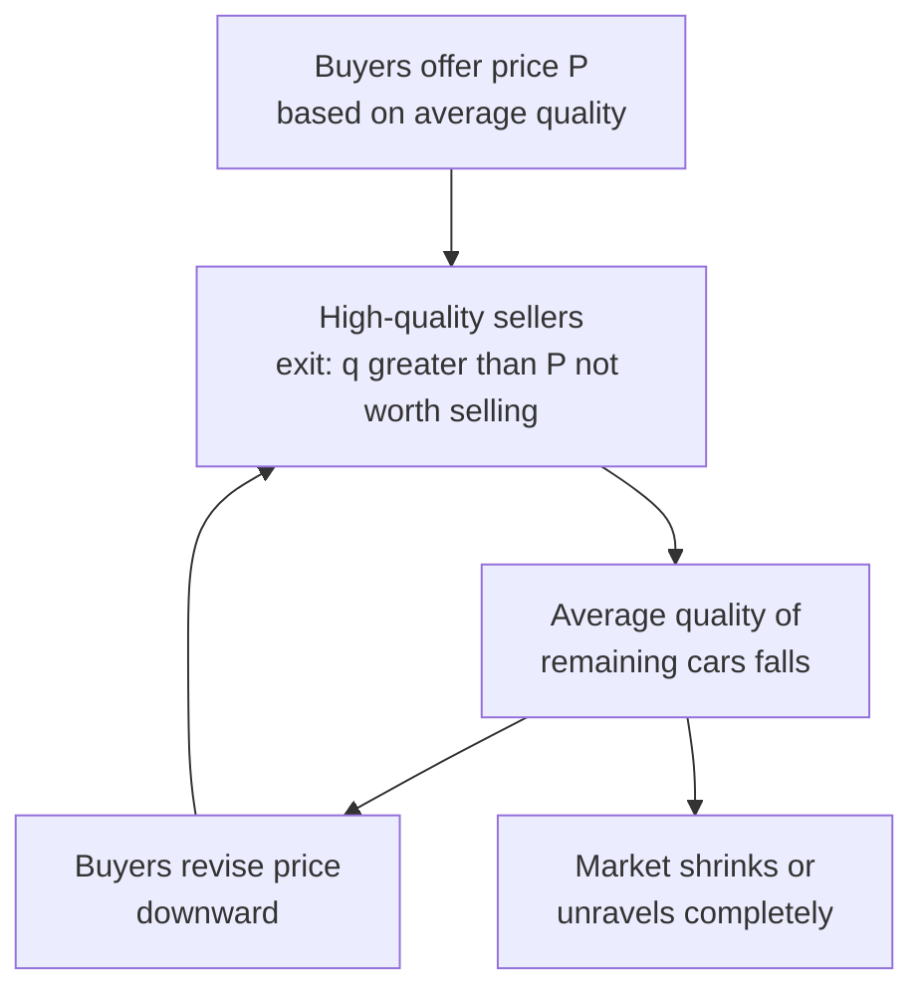

## Asymmetric Information

### Definition and Scope

Asymmetric information exists when one party to a transaction possesses relevant information that the other party lacks. In public economics, this is a canonical source of market failure distinct from externalities and market power: markets can fail to clear efficiently — or fail entirely — purely because of the informational gap, even when all parties act rationally and no party has market power. The foundational contributions are Akerlof (1970), Spence (1973), and Rothschild–Stiglitz (1976), which jointly earned the 2001 Nobel Prize.

Two broad categories are distinguished by *when* the informational asymmetry matters relative to the transaction:

- **Adverse selection**: hidden information exists *before* the contract (hidden type/characteristics).
- **Moral hazard**: hidden action occurs *after* the contract (hidden action/behavior).

### Adverse Selection: The Market for Lemons

**Akerlof's Model (1970)**

Consider a used car market where sellers know car quality $q \in [0,1]$ but buyers only know the distribution of quality. Let seller value be $q$ and buyer value be $\frac{3}{2}q$ (buyers value quality more, generating gains from trade). If buyers cannot distinguish quality, they offer a single price $P$ based on the *expected* quality of cars offered at that price.

**The unraveling mechanism**: At any price $P$, only sellers with $q \le P$ offer their cars (since sellers with higher-quality cars value them more than $P$). This lowers the average quality of cars actually on the market, which lowers buyers' willingness to pay, which drives out the next tier of sellers — a downward spiral that can **unravel the market entirely**, even though gains from trade exist at every quality level.

**Formal condition for market collapse**: If buyer value is $b \cdot E[q \mid \text{traded}]$ and seller value is $q$, trade occurs only if $b \cdot E[q] \ge P$. With $q$ uniformly distributed on $[0,1]$ and only cars with $q \le P$ offered, $E[q \mid q \le P] = P/2$. Equilibrium requires $b \cdot (P/2) \ge P$, i.e., $b \ge 2$. If $b < 2$, no positive price sustains any trade — **complete market failure** despite positive surplus being available at every quality level.

**Diagram: Adverse Selection Unraveling**

### Adverse Selection in Insurance Markets

**Key Points**

- Insurers cannot perfectly observe individual risk type (high-risk vs. low-risk).
- Pooling contracts (single price for all) attract disproportionately high-risk individuals, since insurance is relatively cheap for them.
- This raises average claims cost, forcing premiums up, which drives out lower-risk individuals — the same unraveling logic as the lemons model.
- In the extreme, only the highest-risk types remain insured, or the market fails entirely (the **adverse selection death spiral**).

**Rothschild–Stiglitz Separating Equilibrium (1976)**

Competitive insurers cannot profitably offer a single pooling contract because a rival could "cream-skim" low-risk customers with a cheaper, less comprehensive policy. In equilibrium (if one exists), insurers offer a **menu of contracts** that separates types via self-selection:

- High-risk individuals receive full insurance at an actuarially fair premium for their risk class.
- Low-risk individuals receive only *partial* insurance (higher deductible/co-pay) at a lower premium — accepting more residual risk in exchange for a lower price, which high-risk types would not find worthwhile.

This separating equilibrium is **second-best**: low-risk individuals are inefficiently under-insured relative to the full-information benchmark, purely to prevent high-risk types from mimicking them. [Inference — a pure-strategy separating equilibrium may fail to exist for some population compositions, a well-known robustness issue in the original model, later addressed by Wilson (1977) and Riley (1979).]

### Signaling (Spence, 1973)

When the *informed* party can take a costly action to credibly reveal type, signaling can (partially) resolve adverse selection.

**Education as a signal**: Suppose worker productivity $\theta \in \{L, H\}$ is unobserved by firms, but education cost $c(e, \theta)$ is lower for high-ability workers (single-crossing property: $\frac{\partial c/\partial e}{\partial \theta} < 0$). Even if education adds *zero* productive value, high-ability workers acquire more of it because it is cheaper for them to do so, and firms rationally pay higher wages to more-educated workers.

**Separating equilibrium condition**: Education level $e^*$ separates types if:

$$c(e^*, L) > w(H) - w(L) > c(e^*, H)$$

i.e., the signal is costly enough to deter low-ability mimicry but cheap enough for high-ability workers to find worthwhile.

**Welfare implication**: Signaling can be **privately rational but socially wasteful** — if education has no productive value, resources spent signaling are a pure deadweight loss relative to a world with full information (a "rat race" or wasteful signaling equilibrium). [Inference — real-world education plausibly has both signaling and human-capital value; disentangling the two empirically remains contested.]

### Screening

The complementary mechanism where the *uninformed* party designs a menu of contracts to induce self-selection (as in Rothschild–Stiglitz above). Screening differs from signaling in who moves first: in screening, the uninformed principal offers the menu; in signaling, the informed agent chooses the costly action unprompted.

### Moral Hazard

**Definition**: Hidden action that occurs *after* a contract is signed, where one party cannot fully observe or verify the other's behavior/effort.

**Ex ante moral hazard**: Behavior that affects the *probability* of a loss (e.g., an insured driver takes less care because insurance covers accident costs).

**Ex post moral hazard**: Behavior that affects the *magnitude* of a claim once a loss has occurred (e.g., overconsumption of healthcare because insurance covers the marginal cost).

**Formal setup (principal-agent)**: An agent chooses unobservable effort $e$ at private cost $c(e)$, affecting output/outcome probabilistically. The principal can only condition payment on the observed outcome $x$, not on $e$ directly. The **first-best** (effort observable) allocation is generally unattainable; the **second-best** contract must satisfy:

- **Participation constraint (IR)**: agent's expected utility from accepting the contract $\ge$ reservation utility.
- **Incentive compatibility constraint (IC)**: agent's chosen effort must maximize their own expected utility given the contract — since the principal cannot dictate effort directly.

This generates a fundamental **efficiency-risk tradeoff**: full insurance (constant payment regardless of outcome) eliminates the agent's risk-bearing but destroys all effort incentives; performance-based pay restores incentives but forces the agent to bear risk they would prefer to avoid. Optimal contracts balance this tradeoff, typically leaving the agent under-insured relative to first-best risk-sharing.

### Diagram: Adverse Selection vs. Moral Hazard Timeline

<svg xmlns="http://www.w3.org/2000/svg" viewBox="0 0 640 260">
<text x="320" y="24" text-anchor="middle" font-size="16" font-weight="bold" fill="#1a1a1a">Timing of Information Problems (svg_diagram)</text>
<line x1="60" y1="90" x2="580" y2="90" stroke="#333" stroke-width="2" />
<circle cx="150" cy="90" r="6" fill="#2b6cb0" />
<text x="150" y="70" text-anchor="middle" font-size="12" fill="#2b6cb0" font-weight="bold">Hidden type exists</text>
<circle cx="320" cy="90" r="6" fill="#c53030" />
<text x="320" y="70" text-anchor="middle" font-size="12" fill="#c53030" font-weight="bold">Contract signed</text>
<circle cx="490" cy="90" r="6" fill="#2f855a" />
<text x="490" y="70" text-anchor="middle" font-size="12" fill="#2f855a" font-weight="bold">Outcome realized</text>
<text x="150" y="130" text-anchor="middle" font-size="12" fill="#333">Adverse Selection</text>
<text x="150" y="148" text-anchor="middle" font-size="11" fill="#666">(hidden info, pre-contract)</text>
<text x="410" y="180" text-anchor="middle" font-size="12" fill="#333">Moral Hazard</text>
<text x="410" y="198" text-anchor="middle" font-size="11" fill="#666">(hidden action, post-contract)</text>
<line x1="320" y1="150" x2="490" y2="150" stroke="#c53030" stroke-width="1.5" stroke-dasharray="4,3" />
</svg>

### Market and Policy Responses

**Private Market Mechanisms**

- **Signaling**: warranties, brand reputation, professional certifications, education credentials.
- **Screening**: menus of insurance contracts (deductible/premium combinations), credit scoring, underwriting questionnaires.
- **Monitoring**: auditing, collateral requirements, co-payments and deductibles (reduce moral hazard by making the agent bear part of the risk).
- **Reputation and repeated interaction**: repeated games can sustain honest disclosure even without formal contracts (folk theorem intuition).

**Public Policy Responses**

- **Mandatory disclosure regulation**: lemon laws, mandatory nutrition/financial product labeling, "truth in lending."
- **Community rating and guaranteed issue**: prohibiting insurers from pricing on observed risk factors, combined with an **individual mandate** to prevent adverse selection against the pool (the rationale behind mandates in health insurance reform, e.g., the ACA's individual mandate).
- **Public provision of insurance**: government as insurer of last resort (e.g., social insurance, deposit insurance) where private markets unravel — this is a central justification for programs like unemployment insurance and public health coverage.
- **Standardized products**: limiting contract menus to prevent excessive cream-skimming and simplify comparison.

### Adverse Selection vs. Moral Hazard: Comparison

| Dimension | Adverse Selection | Moral Hazard |
| --- | --- | --- |
| Hidden element | Type/characteristic | Action/effort |
| Timing | Before contract | After contract |
| Core mechanism | Self-selection into/out of market | Incentive distortion given contract |
| Classic example | Lemons market, health insurance risk pools | Insured driving carelessly, manager shirking |
| Typical remedy | Screening, signaling, mandates | Deductibles, co-insurance, monitoring, performance pay |

### Worked Example: Insurance Pooling Threshold

**Setup**: Two risk types, Low ($p_L = 0.1$ probability of $1000 loss) and High ($p_H = 0.4$ probability of $1000 loss), each 50% of the population. Insurer cannot distinguish types.

**Pooled actuarially fair premium**:

$$\pi_{pool} = \bar{p} \times 1000 = \left(\frac{0.1 + 0.4}{2}\right) \times 1000 = 250$$

Low-risk individuals face a fair premium of only $100 ($p_L \times 1000$) but are charged $250 under pooling — a $150 implicit subsidy to high-risk types. If low-risk individuals have an outside option (e.g., self-insurance) valued below $250 but above $100, they exit the pool, raising $\bar{p}$ toward $p_H$ and pushing the premium toward $400 — illustrating the unraveling dynamic in numerical form.

### Common Pitfalls

- Conflating adverse selection and moral hazard — the policy remedies differ (mandates/screening vs. deductibles/monitoring), so misdiagnosing which is at play leads to ineffective interventions.
- Assuming signaling is always wasteful — when the signal is correlated with genuinely useful information the principal could not otherwise verify cheaply, signaling can improve allocative efficiency despite its private cost.
- Treating full insurance as unambiguously optimal — ignoring the risk-incentive tradeoff central to moral hazard leads to over-prescribing complete coverage.
- Assuming Rothschild–Stiglitz separating equilibria always exist — existence depends on the population mix of types; this is a known theoretical fragility, not a universal result.

**Related Topics**

- Principal-Agent Theory and Optimal Contract Design
- Health Insurance Markets and the Individual Mandate
- Signaling vs. Human Capital Theories of Education
- Credit Rationing and Asymmetric Information in Capital Markets
- Mechanism Design and Revelation Principle
- Social Insurance as a Response to Market Failure
- Behavioral Public Economics (bounded rationality interacting with information asymmetries)