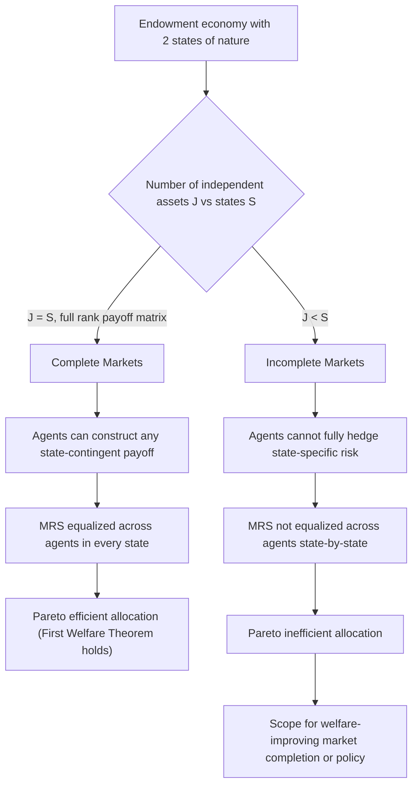

## Missing and Incomplete Markets

### Definition and Conceptual Foundation

Missing markets refer to situations where no market exists for a good, service, or contingency for which there would be positive demand and supply at some price, yet no exchange mechanism has formed to allow trade to occur. Incomplete markets refer to a related but distinct situation where markets exist but fail to cover all possible states of the world, time periods, or risk contingencies that economic agents would value insuring against or trading across. Both concepts describe departures from the Arrow-Debreu framework of complete contingent claims markets, in which a market exists for every good, in every location, at every date, and in every possible state of nature.

The Arrow-Debreu general equilibrium model provides the theoretical benchmark against which missing and incomplete markets are measured. In that framework, if a complete set of markets existed for all present and future contingencies, competitive equilibrium would achieve Pareto efficiency under the First Welfare Theorem. When markets are missing or incomplete, this efficiency result breaks down, and the resulting allocation is generally Pareto inefficient, creating scope for welfare-improving intervention.

### Distinguishing Missing Markets from Incomplete Markets

**Missing Markets**: A market fails to exist entirely for a good or contingency. Classic examples include markets for many public goods (clean air, national defense), certain forms of insurance (insurance against unemployment risk in the absence of government programs, insurance against a decline in one's own human capital), and markets for goods that would require trading across generations not yet born (future generations cannot bid in today's markets to protect resources for their own use).

**Incomplete Markets**: A market exists for a good or asset but does not span all relevant states of the world. Financial markets are a canonical example. An economy has $S$ possible states of nature but fewer than $S$ linearly independent traded assets, so agents cannot construct arbitrary state-contingent payoff bundles through portfolio combinations. Formally, if $J$ is the number of independent assets and $S$ is the number of states, markets are complete if and only if $J = S$ and the payoff matrix has full rank; if $J < S$, markets are incomplete.

### Causes of Missing and Incomplete Markets

**Transaction Costs**: When the cost of establishing and operating a market exceeds the gains from trade it would generate, the market will not form. This is especially relevant for goods with low aggregate value relative to the fixed costs of setting up exchange infrastructure, contracts, and enforcement mechanisms.

**Asymmetric Information**: Adverse selection and moral hazard can prevent markets from forming even when there are potential gains from trade. Akerlof's "market for lemons" analysis demonstrates how information asymmetry between buyers and sellers can cause a market to unravel entirely, collapsing to zero trade even though both parties would benefit from exchange under symmetric information. Insurance markets are particularly susceptible: markets for insuring against risks that are difficult to verify or that the insured party can influence (health status, effort levels) often fail to emerge or remain severely incomplete.

**Non-Excludability and Public Good Characteristics**: Goods that are non-excludable cannot easily be sold in a market because sellers cannot prevent non-payers from consuming the good. This is a primary driver of missing markets for public goods (see Chapter: Public Goods for a full treatment of non-excludability and non-rivalry).

**Absence of Property Rights**: Markets require well-defined, enforceable, and transferable property rights. Where these are absent, as with many open-access common-pool resources or environmental amenities, no market can form because there is no legal basis for exchange (see Chapter: Common Property Resources).

**Missing Futures and Contingent Claims Markets**: Markets often fail to exist for goods to be delivered far in the future or contingent on uncertain future states, because:

- Enforcement of long-dated contracts is costly or infeasible
- The relevant future states of the world are difficult to specify or verify ex ante
- Agents who would demand or supply the good in the future (including unborn future generations) cannot participate in current markets

**Externalities in Market Formation**: The private return to creating a market (e.g., an exchange or clearinghouse) may be less than the social return, so profit-maximizing entrepreneurs under-invest in market-creating infrastructure relative to the social optimum.

### Formal Welfare Analysis

Consider a two-period, two-state endowment economy with states $s \in \{1, 2\}$ occurring with probability $\pi_1$ and $\pi_2 = 1 - \pi_1$. An agent has state-contingent consumption $(c_1, c_2)$ and expected utility:

$$U = \pi_1 u(c_1) + \pi_2 u(c_2)$$

If a complete set of Arrow securities exists (one security paying off in state 1 only, another paying off in state 2 only), the agent can freely reallocate consumption across states subject only to the budget constraint:

$$q_1 c_1 + q_2 c_2 = q_1 e_1 + q_2 e_2$$

where $q_s$ is the price of the Arrow security for state $s$ and $e_s$ is the endowment in state $s$. The resulting allocation satisfies the efficiency condition that the marginal rate of substitution between state-contingent consumption equals the price ratio for every agent, equalizing risk-adjusted marginal utility across agents.

If instead only a single non-contingent bond is traded (markets are incomplete), the agent's budget set collapses to:

$$c_1 + c_2 = e_1 + e_2 \text{ (in present value terms, with a single discount factor)}$$

This constraint does not allow the agent to independently choose consumption in each state; state-specific risk cannot be hedged. The resulting equilibrium generally fails to equalize marginal rates of substitution across agents state-by-state, so the allocation is Pareto inefficient relative to the complete-markets benchmark whenever agents have heterogeneous exposure to state-specific risk.

### Diagram: Complete vs. Incomplete Markets Consumption Possibilities

### Classic Examples of Missing Markets

**Insurance Against Human Capital Risk**: There is no market in which a young worker can insure against the risk that their chosen career or skill set becomes obsolete or low-earning. Unlike physical capital, human capital cannot be pledged as collateral (it cannot be repossessed), which prevents the emergence of a market for equity claims against future labor income.

**Markets for Unborn Generations**: Future generations cannot participate in today's markets to purchase claims on environmental quality, exhaustible resources, or fiscal sustainability, even though they have a clear stake in these outcomes. This missing market is central to the economic case for public intervention in environmental policy and public debt management (see Chapter: Intergenerational Equity and Chapter: Environmental Externalities).

**Catastrophic and Systemic Risk Insurance**: Private insurance markets often fail to offer coverage against risks that are highly correlated across the insured population (pandemics, systemic financial crises, widespread natural disasters), because the law of large numbers—which underpins conventional insurance pooling—does not apply when losses are not independent across policyholders.

**Markets for Certain Public Goods**: Basic research, national defense, and other pure public goods generally have no market at all due to non-excludability, requiring public provision or alternative mechanisms.

### Classic Examples of Incomplete Markets

**Equity Markets**: Publicly traded equity allows investors to hold claims on firm profits, but the menu of available securities is far smaller than the space of possible future states of the economy, so investors cannot perfectly hedge idiosyncratic or systemic risks.

**Health Insurance Markets**: Health insurance contracts typically do not cover every possible health contingency (e.g., certain congenital conditions, experimental treatments) and often feature exclusions, caps, or waiting periods that leave some states of the world uninsured.

**Unemployment Insurance**: Private markets for unemployment insurance are essentially absent or severely limited due to adverse selection (workers with higher unemployment risk disproportionately seek coverage) and moral hazard (insured workers may reduce job-search effort), which is a central justification for public unemployment insurance programs.

**Annuity Markets**: Markets for annuities that insure against outliving one's savings (longevity risk) exist but are famously "thin," a phenomenon known as the annuity puzzle, attributed to adverse selection, bequest motives, and pre-existing partial annuitization through public pension systems.

### Policy Implications and Government Response

**Direct Public Provision**: When a market is missing due to non-excludability (public goods) or the impossibility of private enforcement (intergenerational contracts), the government may directly provide the good or service, financing it through taxation rather than market prices.

**Mandated or Subsidized Insurance**: Governments frequently address missing insurance markets by mandating participation (compulsory social insurance, such as public pension and unemployment insurance systems) to overcome adverse selection death spirals, or by subsidizing private insurance to increase market thickness.

**Market-Completing Institutions**: Policy can sometimes act to complete markets rather than substitute for them entirely, for example through:

- Loan guarantee programs that allow lenders to offer credit for otherwise uninsurable risks (student loans, agricultural credit)
- Government-sponsored enterprises created to develop secondary markets (mortgage markets)
- Regulatory mandates requiring standardized contracts that reduce transaction costs and information asymmetry

**Second-Best Considerations**: Because missing and incomplete markets are pervasive and cannot all be corrected simultaneously, policy analysis in this domain is fundamentally a second-best problem. Correcting one market failure without addressing related missing markets does not guarantee a welfare improvement; the theory of the second best (Lipsey and Lancaster) implies that policy must be evaluated in light of the full constellation of existing distortions, not treated as if other markets were complete. [Inference: the practical magnitude of second-best interactions in any specific missing-market intervention requires empirical, case-specific analysis rather than a general theoretical conclusion.]

### Relationship to Other Market Failure Categories

Missing and incomplete markets overlap conceptually with, but are analytically distinct from, other market failure categories:

- **Public goods** (Chapter: Public Goods) are a specific cause of missing markets driven by non-excludability and non-rivalry
- **Externalities** (Chapter: Externalities) can be reframed, following the Coasian tradition, as a missing market for the externality-generating activity itself; if a market for the right to pollute (or be free from pollution) existed and transaction costs were zero, the externality could in principle be internalized through bargaining
- **Asymmetric information** (Chapter: Asymmetric Information) is frequently the underlying cause of missing insurance and credit markets, particularly through adverse selection
- **Imperfect competition** is distinct from missing markets, since a market exists but does not clear at competitive prices, whereas missing markets involve no exchange mechanism at all

### Diagram: Taxonomy of Causes Leading to Missing or Incomplete Markets (svg_diagram)

<svg xmlns="http://www.w3.org/2000/svg" viewBox="0 0 900 480">
<text x="450" y="30" font-size="18" font-weight="bold" text-anchor="middle" fill="#1a1a1a">Causes of Missing and Incomplete Markets (svg_diagram)</text>
<rect x="370" y="55" width="160" height="45" rx="6" fill="#2c5f8a" />
<text x="450" y="83" font-size="13" fill="white" text-anchor="middle">Missing / Incomplete Markets</text>
<line x1="450" y1="100" x2="140" y2="150" stroke="#555" stroke-width="1.5" />
<line x1="450" y1="100" x2="320" y2="150" stroke="#555" stroke-width="1.5" />
<line x1="450" y1="100" x2="500" y2="150" stroke="#555" stroke-width="1.5" />
<line x1="450" y1="100" x2="680" y2="150" stroke="#555" stroke-width="1.5" />
<line x1="450" y1="100" x2="800" y2="150" stroke="#555" stroke-width="1.5" />
<rect x="60" y="150" width="160" height="55" rx="6" fill="#4a7fa5" />
<text x="140" y="172" font-size="12" fill="white" text-anchor="middle">Transaction</text>
<text x="140" y="188" font-size="12" fill="white" text-anchor="middle">Costs</text>
<rect x="240" y="150" width="160" height="55" rx="6" fill="#4a7fa5" />
<text x="320" y="172" font-size="12" fill="white" text-anchor="middle">Asymmetric</text>
<text x="320" y="188" font-size="12" fill="white" text-anchor="middle">Information</text>
<rect x="420" y="150" width="160" height="55" rx="6" fill="#4a7fa5" />
<text x="500" y="172" font-size="12" fill="white" text-anchor="middle">Non-Excludability</text>
<text x="500" y="188" font-size="12" fill="white" text-anchor="middle">(Public Goods)</text>
<rect x="600" y="150" width="160" height="55" rx="6" fill="#4a7fa5" />
<text x="680" y="172" font-size="12" fill="white" text-anchor="middle">Absent / Unenforceable</text>
<text x="680" y="188" font-size="12" fill="white" text-anchor="middle">Property Rights</text>
<rect x="720" y="150" width="160" height="55" rx="6" fill="#4a7fa5" />
<text x="800" y="172" font-size="12" fill="white" text-anchor="middle">Contracting with</text>
<text x="800" y="188" font-size="12" fill="white" text-anchor="middle">Future / Unborn Agents</text>
<line x1="140" y1="205" x2="140" y2="240" stroke="#555" stroke-width="1.5" />
<line x1="320" y1="205" x2="320" y2="240" stroke="#555" stroke-width="1.5" />
<line x1="500" y1="205" x2="500" y2="240" stroke="#555" stroke-width="1.5" />
<line x1="680" y1="205" x2="680" y2="240" stroke="#555" stroke-width="1.5" />
<line x1="800" y1="205" x2="800" y2="240" stroke="#555" stroke-width="1.5" />
<rect x="30" y="240" width="220" height="60" rx="6" fill="#7fa3c0" />
<text x="140" y="265" font-size="11" fill="white" text-anchor="middle">Example: thin markets for</text>
<text x="140" y="280" font-size="11" fill="white" text-anchor="middle">low-value niche goods</text>
<rect x="210" y="240" width="220" height="60" rx="6" fill="#7fa3c0" />
<text x="320" y="258" font-size="11" fill="white" text-anchor="middle">Example: unemployment</text>
<text x="320" y="273" font-size="11" fill="white" text-anchor="middle">and health insurance</text>
<text x="320" y="288" font-size="11" fill="white" text-anchor="middle">adverse selection</text>
<rect x="390" y="240" width="220" height="60" rx="6" fill="#7fa3c0" />
<text x="500" y="265" font-size="11" fill="white" text-anchor="middle">Example: national defense,</text>
<text x="500" y="280" font-size="11" fill="white" text-anchor="middle">basic research</text>
<rect x="570" y="240" width="220" height="60" rx="6" fill="#7fa3c0" />
<text x="680" y="258" font-size="11" fill="white" text-anchor="middle">Example: open-access</text>
<text x="680" y="273" font-size="11" fill="white" text-anchor="middle">fisheries, unregulated</text>
<text x="680" y="288" font-size="11" fill="white" text-anchor="middle">common resources</text>
<rect x="690" y="240" width="200" height="60" rx="6" fill="#7fa3c0" />
<text x="790" y="258" font-size="11" fill="white" text-anchor="middle">Example: environmental</text>
<text x="790" y="273" font-size="11" fill="white" text-anchor="middle">quality, long-run</text>
<text x="790" y="288" font-size="11" fill="white" text-anchor="middle">fiscal sustainability</text>
<line x1="450" y1="300" x2="450" y2="340" stroke="#555" stroke-width="1.5" />
<rect x="270" y="340" width="360" height="50" rx="6" fill="#c0392b" />
<text x="450" y="360" font-size="12" fill="white" text-anchor="middle">Result: Pareto Inefficient Allocation</text>
<text x="450" y="377" font-size="12" fill="white" text-anchor="middle">(First Welfare Theorem does not apply)</text>
<line x1="450" y1="390" x2="450" y2="420" stroke="#555" stroke-width="1.5" />
<rect x="240" y="420" width="420" height="45" rx="6" fill="#27632a" />
<text x="450" y="447" font-size="12" fill="white" text-anchor="middle">Policy Response: Public Provision, Mandated Insurance, Market-Completing Institutions</text>
</svg>

### Empirical and Applied Considerations

Empirical identification of missing markets is inherently challenging because, by definition, no price or quantity data exist for a market that does not form. Researchers instead infer welfare losses from missing markets by:

- Comparing outcomes across regions or time periods with differing degrees of market completeness (e.g., comparing consumption smoothing in villages with and without access to formal credit or insurance)
- Studying the effects of policy interventions that introduce new markets or insurance products (randomized rollouts of index insurance in developing agricultural economies)
- Structural modeling that calibrates the welfare cost of market incompleteness using consumption-based asset pricing models [Inference: the precision of such welfare-cost estimates depends heavily on model specification and calibration choices, and estimates vary substantially across studies]

**Next Steps**

- Public Goods and the Free-Rider Problem
- Externalities and Coasian Bargaining
- Asymmetric Information: Adverse Selection and Moral Hazard
- Common Property Resources and Open-Access Problems
- Social Insurance as a Response to Missing Private Insurance Markets
- Intergenerational Equity and Missing Markets for Future Generations
- The Theory of the Second Best
- General Equilibrium with Incomplete Markets (GEI) Models