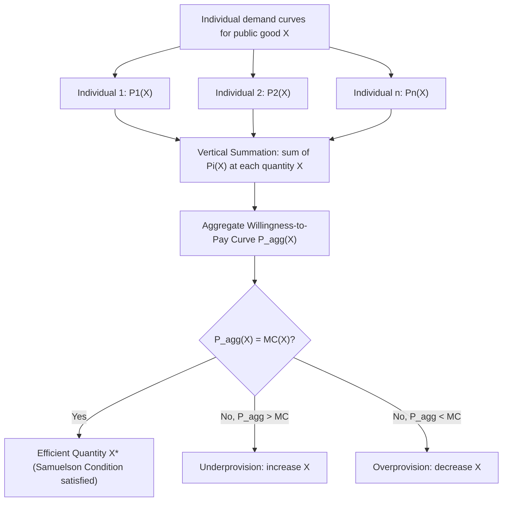

## Samuelson Condition for Efficient Provision

### Origin and Statement of the Condition

The Samuelson Condition, introduced by Paul Samuelson in his 1954 paper "The Pure Theory of Public Expenditure," provides the formal efficiency criterion for the optimal provision of a pure public good in an economy with one or more private goods. It is the public-goods analogue of the tangency condition for efficient private-good allocation, but with a crucial modification arising from the joint, non-rival nature of public-good consumption.

The condition states that the Pareto-efficient quantity of a pure public good is reached where the **sum of individual marginal rates of substitution** (between the public good and the numeraire private good) equals the **marginal rate of transformation**:

$$\sum_{i=1}^{n} MRS_i^{X,Y} = MRT^{X,Y}$$

where $X$ is the public good, $Y$ is the private good (numeraire), $MRS_i^{X,Y}$ is individual $i$'s marginal rate of substitution between $X$ and $Y$, and $MRT^{X,Y}$ is the marginal rate of transformation between $X$ and $Y$ along the economy's production possibility frontier.

Equivalently, in terms of marginal willingness to pay (MWTP), if $MB_i$ denotes individual $i$'s marginal benefit (in monetary terms) from an additional unit of the public good and $MC$ denotes the marginal cost of producing it:

$$\sum_{i=1}^{n} MB_i = MC$$

### Derivation from the Social Planner's Problem

Consider an economy with $n$ individuals, one pure public good $X$, and one private good $Y$ used as numeraire. Each individual $i$ has utility $U_i(X, Y_i)$, where $X$ enters every individual's utility function identically (since consumption of the public good is joint and non-rival), while $Y_i$ is individual $i$'s private consumption. The economy's resource constraint (production possibility frontier) is:

$$F(X, Y) = 0, \quad \text{where } Y = \sum_{i=1}^n Y_i$$

A social planner maximizing individual 1's utility subject to holding all other individuals' utilities at fixed reservation levels $\bar{U}_2, \ldots, \bar{U}_n$, and subject to the resource constraint, solves:

$$\max_{X, Y_1, \ldots, Y_n} U_1(X, Y_1) \quad \text{s.t.} \quad U_i(X, Y_i) \geq \bar{U}_i \, \forall i \geq 2, \quad F(X, Y) = 0$$

Forming the Lagrangian with multipliers $\lambda_i$ on each utility constraint and $\mu$ on the resource constraint, and taking first-order conditions with respect to $X$ and each $Y_i$, the private-good first-order conditions yield $\lambda_i \frac{\partial U_i}{\partial Y_i} = \mu \frac{\partial F}{\partial Y}$ for each $i$. The public-good first-order condition, by contrast, aggregates the marginal utility contributions of **all** individuals simultaneously, because a single unit of $X$ enters every individual's utility function at once:

$$\sum_{i=1}^n \lambda_i \frac{\partial U_i}{\partial X} = \mu \frac{\partial F}{\partial X}$$

Dividing through and substituting $MRS_i^{X,Y} = \dfrac{\partial U_i / \partial X}{\partial U_i / \partial Y_i}$ and $MRT^{X,Y} = \dfrac{\partial F / \partial X}{\partial F / \partial Y}$ yields the Samuelson Condition:

$$\sum_{i=1}^n MRS_i^{X,Y} = MRT^{X,Y}$$

### Contrast with the Private-Good Efficiency Condition

The critical distinction from private-good markets lies in how individual demands aggregate. For a private good, efficient allocation requires each individual's MRS to separately equal the MRT:

$$MRS_i^{X,Y} = MRT^{X,Y} \quad \text{for each individual } i$$

This is achieved in a competitive market because each individual faces the same price and independently chooses consumption until their own MRS equals that price ratio; individual consumption quantities differ ($x_i \neq x_j$ generally), but the common price ensures each person's MRS matches the MRT.

For a pure public good, all individuals consume the same total quantity ($x_i = X$ for all $i$), but they may have very different marginal valuations of that quantity depending on their preferences and income. Efficiency therefore requires **summing** marginal valuations across individuals rather than equating each one individually to the MRT, because the resource cost of the marginal unit is borne once but its benefit accrues to everyone simultaneously.

### Graphical Derivation: Vertical Summation of Demand Curves

The Samuelson Condition has a direct graphical counterpart in the construction of the aggregate demand curve for a public good. Whereas market demand for a private good is obtained by **horizontal summation** of individual demand curves (summing quantities demanded at a common price), the aggregate "demand" for a public good is obtained by **vertical summation** of individual demand curves (summing the prices, i.e., marginal willingness to pay, that individuals would pay for a common quantity).

Formally, if $P_i(X)$ denotes individual $i$'s inverse demand curve (marginal willingness to pay for quantity $X$), the aggregate willingness-to-pay curve is:

$$P^{agg}(X) = \sum_{i=1}^n P_i(X)$$

The efficient quantity $X^*$ is found where this vertically-summed aggregate willingness-to-pay curve intersects the marginal cost curve:

$$P^{agg}(X^*) = MC(X^*)$$

### Illustrative Numerical Example

Suppose an economy has two individuals with inverse demand (marginal willingness to pay) curves for a public good $X$:

$$P_1(X) = 100 - X, \qquad P_2(X) = 60 - 0.5X$$

and a constant marginal cost of provision $MC = 90$.

The aggregate willingness-to-pay curve is obtained by vertical summation:

$$P^{agg}(X) = P_1(X) + P_2(X) = (100 - X) + (60 - 0.5X) = 160 - 1.5X$$

Setting $P^{agg}(X) = MC$:

$$160 - 1.5X = 90$$

$$1.5X = 70$$

$$X^* = 46.67$$

At this quantity, individual 1's marginal willingness to pay is $P_1(46.67) = 100 - 46.67 = 53.33$, and individual 2's is $P_2(46.67) = 60 - 0.5(46.67) = 36.67$. Their sum, $53.33 + 36.67 = 90$, exactly equals marginal cost, confirming the Samuelson Condition holds at $X^*$.

Note that neither individual's willingness to pay alone equals marginal cost; efficiency requires their **combined** valuation to equal the cost of the marginal unit, since both consume the full quantity $X^*$ jointly.

### Why Market Provision Fails to Achieve the Samuelson Condition

In a decentralized market setting where the public good is voluntarily financed through individual contributions, each individual, acting non-cooperatively, sets their contribution level by maximizing their own utility while treating others' contributions as given (a Nash equilibrium in contribution levels). This individually rational behavior yields an equilibrium where each individual sets:

$$MRS_i^{X,Y} = MRT^{X,Y}$$

for their own marginal contribution, rather than internalizing that their contribution benefits all other consumers as well. Because each contributor ignores the positive externality their contribution confers on others, the summed condition $\sum_i MRS_i = MRT$ is not met by the aggregation of individually optimal contributions; instead, the market outcome under private voluntary provision generically yields a public good quantity below the Samuelson-efficient level:

$$X^{Nash} < X^*$$

This result, formalized in the voluntary contribution / private provision literature (Bergstrom, Blume, and Varian, 1986, among others), is the free-rider problem expressed in the language of the Samuelson framework (see Chapter: Pure versus Impure Public Goods and Chapter: Free-Rider Problem and Voluntary Contribution Mechanisms for extended treatment).

### The Lindahl Equilibrium as a Decentralized Solution Concept

The Lindahl equilibrium is a theoretical construct in which each individual faces a **personalized price** ("Lindahl price") for the public good, $p_i$, set such that each individual's privately optimal demand, given that price, coincides with the Samuelson-efficient quantity $X^*$ for every individual simultaneously. Formally, Lindahl prices satisfy:

$$p_i = MRS_i^{X,Y}(X^*) \quad \text{for each } i, \quad \text{and} \quad \sum_{i=1}^n p_i = MC(X^*) = MRT^{X,Y}(X^*)$$

The Lindahl equilibrium demonstrates that, in principle, a price system tailored to individual valuations of the public good can decentralize the Samuelson-efficient outcome, mirroring how competitive prices decentralize efficient private-good allocation. However, the Lindahl mechanism is not incentive-compatible: because an individual's Lindahl price depends on their revealed valuation, each individual has an incentive to understate their true $MRS_i$ to reduce their assigned share of the financing burden, reintroducing the free-rider/preference-revelation problem at the mechanism-design level (see Chapter: Lindahl Pricing and Preference Revelation Mechanisms).

### Extensions and Qualifications

**Impure and Congestible Public Goods**: The pure Samuelson Condition applies strictly only to goods with zero rivalry across the full relevant range. For congestible public goods, the efficiency condition must be modified to include a congestion cost term reflecting the negative externality that additional users impose on existing users once the good becomes rival at high utilization (see Chapter: Pure versus Impure Public Goods).

**Multiple Public Goods**: The condition generalizes directly to an economy with $k$ public goods $X_1, \ldots, X_k$; efficiency requires the analogous vertically-summed condition to hold for each public good separately (holding other public good quantities fixed), i.e., $\sum_i MRS_i^{X_j, Y} = MRT^{X_j, Y}$ for each $j = 1, \ldots, k$.

**Distributional Considerations**: The Samuelson Condition characterizes Pareto efficiency for a **given** distribution of utility levels $\bar{U}_2, \ldots, \bar{U}_n$ used in the planner's problem; different distributional weightings will generally imply different efficient quantities $X^*$ if preferences are non-homothetic or income effects are present, since $MRS_i$ typically depends on the individual's private-good consumption $Y_i$, which itself depends on how the financing burden is distributed. [Inference: the practical sensitivity of $X^*$ to the assumed distribution of financing burdens is context- and preference-specification-dependent, and can be substantial when income effects on public-good valuation are strong.]

**Second-Best Environments**: When public expenditure must be financed through distortionary taxation rather than lump-sum transfers, the efficient provision rule is modified to the Atkinson-Stern condition, which adjusts the right-hand side of the Samuelson Condition to account for the marginal cost of public funds (MCF), generally implying a lower optimal provision level than the first-best Samuelson rule when MCF exceeds one (see Chapter: Optimal Provision under Distortionary Taxation).

### Diagram: Samuelson Efficiency Condition (svg_diagram)

<svg xmlns="http://www.w3.org/2000/svg" viewBox="0 0 700 420">
<text x="350" y="28" font-size="17" font-weight="bold" text-anchor="middle" fill="#1a1a1a">Samuelson Condition: Vertical Summation (svg_diagram)</text>
<line x1="70" y1="360" x2="650" y2="360" stroke="#333" stroke-width="1.5" />
<line x1="70" y1="360" x2="70" y2="50" stroke="#333" stroke-width="1.5" />
<text x="660" y="365" font-size="12" fill="#333">Quantity X</text>
<text x="35" y="50" font-size="12" fill="#333">Price / MWTP</text>
<path d="M 70,120 L 500,340" stroke="#4a7fa5" stroke-width="2" fill="none" />
<text x="510" y="345" font-size="11" fill="#4a7fa5">P1(X)</text>
<path d="M 70,220 L 350,340" stroke="#27632a" stroke-width="2" fill="none" />
<text x="360" y="345" font-size="11" fill="#27632a">P2(X)</text>
<path d="M 70,70 L 560,340" stroke="#c0392b" stroke-width="3" fill="none" />
<text x="570" y="335" font-size="11" fill="#c0392b" font-weight="bold">P_agg = P1+P2</text>
<line x1="70" y1="200" x2="650" y2="200" stroke="#555" stroke-width="1.5" stroke-dasharray="5,4" />
<text x="660" y="204" font-size="11" fill="#555">MC</text>
<line x1="330" y1="200" x2="330" y2="360" stroke="#888" stroke-width="1" stroke-dasharray="3,3" />
<circle cx="330" cy="200" r="4" fill="#c0392b" />
<text x="330" y="380" font-size="12" text-anchor="middle" fill="#1a1a1a">X*</text>
<text x="330" y="40" font-size="11" text-anchor="middle" fill="#c0392b">P_agg(X*) = MC</text>
</svg>

**Related Topics**

- Pure versus Impure Public Goods
- Free-Rider Problem and Voluntary Contribution Mechanisms
- Lindahl Pricing and Preference Revelation Mechanisms
- Optimal Provision under Distortionary Taxation (Atkinson-Stern Condition)
- Marginal Cost of Public Funds
- Bergstrom-Blume-Varian Neutrality Result in Private Provision
- Congestion and Efficient Provision of Impure Public Goods
- Public Goods Experiments and Empirical Tests of Free-Riding