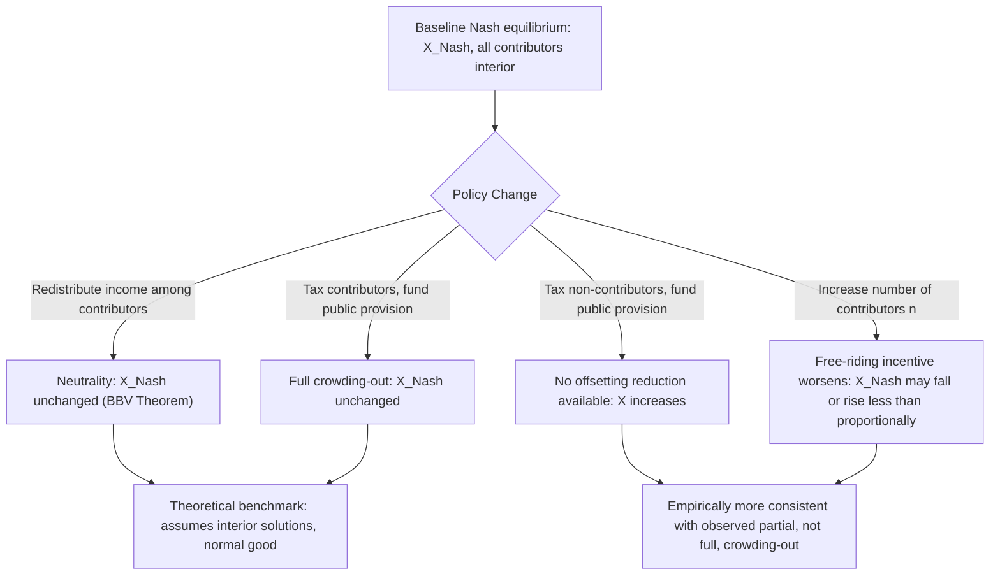

## Private Provision and Voluntary Contributions

### Overview

Private provision refers to the supply of a public good financed through the voluntary, uncoerced contributions of individuals or private organizations, in contrast to compulsory financing through taxation. Because pure public goods are non-excludable, voluntary private provision is structurally vulnerable to the free-rider problem, and the theoretical and empirical literature on this topic examines both the extent of the resulting underprovision and the conditions under which private contribution mechanisms can nonetheless sustain meaningful levels of public good supply.

This topic builds directly on the Nash equilibrium analysis of voluntary contributions introduced in the treatment of the free-rider problem, extending it to comparative statics, income and preference heterogeneity, and the institutional variations observed in real-world private provision, including charitable giving, corporate philanthropy, and community-based collective action.

### The Baseline Voluntary Contribution Model

Consider $n$ individuals with quasi-concave utility $U_i(X, Y_i)$ over a public good $X = \sum_{j=1}^n g_j$ (the sum of all contributions) and private consumption $Y_i = w_i - g_i$. Each individual chooses $g_i \geq 0$ to maximize utility, taking the contributions of others, $G_{-i} = \sum_{j \neq i} g_j$, as given. The best-response function for individual $i$ is:

$$g_i^*(G_{-i}) = \arg\max_{g_i \geq 0} U_i(g_i + G_{-i}, w_i - g_i)$$

A Nash equilibrium is a vector $(g_1^*, \ldots, g_n^*)$ such that each $g_i^*$ is a best response to the others' equilibrium contributions simultaneously. As established in the free-rider analysis, this yields $\sum_i MRS_i \neq MRT$ in general (specifically $X^{Nash} < X^*$), because each contributor's first-order condition only sets their own $MRS_i = MRT$, ignoring the externality conferred on the other $n-1$ individuals.

### Comparative Statics: The Neutrality (Crowding-Out) Result

A central theoretical result in this literature, due to Warr (1983) and generalized by Bergstrom, Blume, and Varian (1986), is the **neutrality theorem**: under the assumptions that (i) the public good is normal for all contributing individuals, and (ii) all individuals contribute a strictly positive amount in the initial equilibrium, any redistribution of income among the set of contributors leaves the total equilibrium quantity of the public good, $X^{Nash}$, completely unchanged.

The intuition is that contributors adjust their voluntary contributions to exactly offset the redistribution: if income is taken from individual $A$ and given to individual $B$ (both of whom were contributing positively), $B$'s increased income raises their desired contribution, while $A$'s reduced income lowers theirs, and in the Nash equilibrium these adjustments exactly cancel because the equilibrium condition depends only on the aggregate income of contributors, not its distribution.

The same logic extends to **public provision financed by taxing contributors**: if the government taxes existing private contributors by $\Delta T_i$ and uses the proceeds to publicly supply an equivalent amount of the public good, contributors reduce their voluntary giving by exactly $\Delta T_i$ each, leaving total provision $X$ unchanged (full crowding-out). This result has substantial implications for public finance, implying that government grants to public goods financed by taxing the same population that already voluntarily contributes may have no net effect on total provision. [Inference: the neutrality result is a knife-edge theoretical benchmark that depends on interior solutions and the normal-good assumption; substantial empirical literature finds crowding-out effects that are typically positive but incomplete (partial crowding-out) rather than the full, one-for-one offset predicted by the strict theorem, likely reflecting corner solutions, non-normality, and departures from pure self-interest.]

### Diagram: Comparative Statics of Voluntary Provision

### Group Size and the Severity of Underprovision

The severity of free-riding in voluntary contribution settings is closely related to group size, following the logic developed by Mancur Olson in *The Logic of Collective Action* (1965). Olson argued that small groups are more likely to successfully provide public goods voluntarily than large groups, for several interrelated reasons:

- In small groups, each member's contribution constitutes a non-trivial share of the total, so the free-riding temptation is weaker and the effect of a single individual's defection is more noticeable and consequential to others
- Small groups face lower coordination and monitoring costs, making it easier to observe who is and is not contributing and to apply social sanctions
- In sufficiently small or asymmetric groups, particularly where one member's valuation of the public good is very high relative to others, that member may find it individually optimal to provide the good unilaterally even without others' contributions (the "exploitation of the great by the small," where large or high-valuation members bear a disproportionate share of the financing burden)

Formally, in the Nash equilibrium of a voluntary contribution game with heterogeneous individuals, if one individual's valuation is sufficiently high relative to the others, that individual becomes the *sole* contributor in equilibrium (a corner solution in which the remaining individuals contribute zero and fully free-ride), while the aggregate quantity still falls short of the Samuelson-efficient level because those free-riding individuals' valuations are not reflected at all in the financing decision.

### Illustrative Numerical Example: Group Size and Provision

Consider $n$ identical individuals with quasi-linear utility $U_i(X, Y_i) = \alpha \ln(X) + Y_i$, as in the free-rider problem analysis. In the symmetric Nash equilibrium with a single interior contributor pattern, $X^{Nash} = \alpha$ regardless of $n$, while the Samuelson-efficient quantity is $X^* = n\alpha$. Define the "provision ratio" as:

$$\frac{X^{Nash}}{X^*} = \frac{\alpha}{n\alpha} = \frac{1}{n}$$

This illustrates Olson's core insight in a specific parametric form: the proportion of the efficient quantity that is achieved through voluntary provision declines as $\dfrac{1}{n}$ with group size, formalizing the intuition that private voluntary provision becomes an increasingly poor substitute for public financing as the relevant population grows. [Inference: this exact inverse relationship is an artifact of the specific quasi-linear-log functional form used here; the general qualitative conclusion that free-riding worsens with group size is robust across a wide class of specifications, but the precise functional relationship depends on preferences and the distribution of valuations.]

### Conditions Favoring More Successful Private Provision

Despite the theoretical prediction of significant underprovision, empirical and field evidence shows that voluntary private provision, particularly of local and community-scale public goods, often achieves quantities well above the pure Nash prediction. Conditions associated with more successful private provision include:

**Warm-Glow and Impure Altruism**: Andreoni's (1989, 1990) "impure altruism" model posits that individuals derive utility not only from the total quantity of the public good provided, but also directly from the act of giving itself (a private "warm glow" benefit), which is modeled as an additional argument in the utility function: $U_i(X, Y_i, g_i)$, where $g_i$ enters separately from its contribution to $X$. Because the warm-glow component is a private, non-rival benefit specific to the contributor, it is not subject to free-riding, and its presence weakens (though does not eliminate) both the crowding-out prediction and the severity of underprovision relative to the pure public-goods model.

**Reciprocity, Reputation, and Social Recognition**: Public acknowledgment of contributions (donor recognition walls, published donor lists) can substantially raise voluntary giving by converting part of the contribution decision into a signal of status, wealth, or civic virtue, effectively introducing a private, excludable benefit alongside the public good component.

**Threshold and Assurance Mechanisms**: Provision-point mechanisms, in which contributions are only collected and the good is only provided if a specified funding threshold is reached (and contributions are refunded otherwise), reduce individuals' fear that their contribution will be wasted on an underfunded project, which can sustain higher voluntary contribution levels than an open-ended contribution scheme; this is the theoretical basis for many crowdfunding platform designs.

**Repeated Interaction and Community Enforcement**: In small, repeated-interaction communities (as extensively documented by Elinor Ostrom's research on collective governance of common-pool resources and local public goods), informal social sanctions, reciprocity norms, and reputational concerns can sustain cooperative contribution levels well above the one-shot Nash prediction, though such outcomes typically depend on community-specific institutional and social features that do not generalize easily to large, anonymous populations (see Chapter: Common Property Resources for the closely related analysis of self-governance in common-pool resource settings).

**Matching Grants and Leverage**: Many charitable and philanthropic institutions use matching grants (a third party commits to match individual contributions at some ratio) specifically to counteract free-riding incentives by effectively lowering the "price" of giving; empirical studies of matching grant campaigns generally find that matches increase the number of contributors ("extensive margin") more reliably than they increase the average size of individual gifts ("intensive margin"). [Inference: the relative effectiveness of large versus small match ratios, and of matching versus simple rebate/subsidy schemes, remains an active empirical research question with mixed findings across studies and contexts.]

### Corporate and Institutional Private Provision

Beyond individual voluntary contributions, private provision of public-good-like benefits also occurs through corporate philanthropy, private foundations, and industry associations funding shared research, standards development, or advocacy. These institutional forms of private provision are subject to the same fundamental free-rider logic among competing firms (an individual firm may prefer that industry peers fund a costly public-relations campaign or lobbying effort from which all firms benefit), but are often partially mitigated through industry association dues (a quasi-compulsory financing mechanism analogous to a club-good membership fee) or through the private, excludable benefits of enhanced reputation and brand differentiation that accompany the philanthropic activity (again resembling Andreoni's warm-glow mechanism, in this context applied to corporate incentives).

### Empirical Approaches to Measuring Private Provision and Crowding-Out

Empirical estimation of the extent of crowding-out from private provision has employed several strategies:

- **Cross-sectional and panel regressions** relating individual or aggregate charitable giving to government grants received by the same charitable causes, typically finding partial rather than complete crowding-out, with estimated crowding-out coefficients varying considerably across studies, causes, and time periods
- **Natural experiments and policy discontinuities**, exploiting sudden changes in government funding for specific public goods or charities to estimate the private-giving response
- **Laboratory public goods experiments** with induced treatments varying group size, matching mechanisms, communication, and punishment options, allowing controlled tests of the comparative statics predicted by the theoretical model

[Inference: because charitable-giving data used in empirical crowding-out studies is frequently drawn from tax records or survey self-reports, results can be sensitive to measurement error and selection effects, which the literature has approached with varying identification strategies; a single consensus point estimate for the "typical" degree of crowding-out is not established in the literature.]

### Policy Implications

The theoretical and empirical findings on private provision inform several areas of applied public economics:

- The BBV neutrality result cautions against assuming that government grants to public goods will straightforwardly translate into equivalent increases in total provision, particularly for causes with an established base of private donors
- The warm-glow and reputational mechanisms identified in the literature suggest that policies encouraging public recognition, matching incentives, or transparency about others' contributions can enhance private provision without direct government expenditure
- Olson's group-size logic provides a rationale for favoring compulsory, tax-financed provision over voluntary mechanisms specifically for large-scale, dispersed-benefit public goods (national defense, environmental quality), while suggesting that small-scale, spatially concentrated public goods (local park maintenance, neighborhood associations) may be more amenable to successful voluntary or club-based provision
- Tax deductions and other subsidies for charitable giving can be analyzed as a price subsidy on private contribution, and their efficiency depends on the price elasticity of giving relative to the degree of crowding-out and warm-glow motivation present in the specific context

**Next Steps**

- The Free-Rider Problem
- Samuelson Condition for Efficient Provision
- Bergstrom-Blume-Varian Neutrality Theorem
- Andreoni's Impure Altruism and Warm-Glow Giving Model
- Olson's Logic of Collective Action and Group Size Effects
- Common Property Resources and Ostrom's Self-Governance Framework
- Matching Grants and the Economics of Charitable Giving
- Empirical Estimation of Crowding-Out in Public Finance