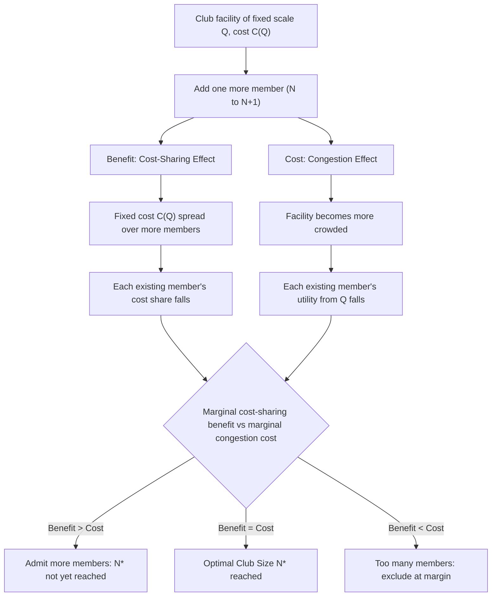

## Club Goods and the Theory of Clubs

### Definition and Position in the Goods Taxonomy

Club goods are goods that are excludable but non-rival, or non-rival only up to some capacity threshold beyond which congestion sets in. They occupy the upper-left cell of the standard excludability-rivalry taxonomy (see Chapter: Pure versus Impure Public Goods), distinguishing them from pure public goods (non-excludable and non-rival), private goods (excludable and rival), and common-pool resources (non-excludable and rival). Because exclusion is technologically or contractually feasible, club goods can be financed through membership fees, subscriptions, or admission charges, which sidesteps the free-rider problem that plagues pure public goods, but they introduce a distinct economic problem: determining the socially optimal size of the club (membership) and the optimal scale of the shared facility.

Buchanan's (1965) paper "An Economic Theory of Clubs" formalized this class of problems, establishing what is now known as club theory, which analyzes the joint determination of optimal facility size, optimal membership (club size), and the associated membership fee, treating club size itself as an economic choice variable subject to a trade-off between cost-sharing benefits and congestion costs.

### The Buchanan Model: Formal Structure

Consider a club providing a shared facility (a swimming pool, golf course, or similar amenity) of capacity or scale $Q$, shared among $N$ members. Let $x$ denote each member's private consumption of a numeraire good. Each member's utility depends on their private consumption, the scale of the shared facility, and — critically — the number of other members sharing it, since congestion reduces the benefit each member derives from a facility of given size as membership grows:

$$U = U(x, Q, N)$$

with $\dfrac{\partial U}{\partial Q} > 0$ (larger facility is preferred, holding membership fixed) and $\dfrac{\partial U}{\partial N} < 0$ for $N$ beyond some threshold (congestion reduces utility, holding facility size fixed, once crowding sets in).

The total cost of providing the facility, $C(Q)$, is shared equally among the $N$ members (in the simplest symmetric version of the model), so each member's share of the cost is $\dfrac{C(Q)}{N}$, and each member's budget constraint is:

$$x + \frac{C(Q)}{N} = w$$

where $w$ is member income. The club's problem is to jointly choose $Q$ and $N$ to maximize the utility of a representative member (in the homogeneous-membership case).

### First-Order Conditions and Optimal Club Size

Substituting the budget constraint into the utility function and maximizing with respect to $Q$ and $N$ yields two first-order conditions.

**Optimal facility size** (holding $N$ fixed): The marginal benefit of facility scale must equal its marginal cost, shared among members:

$$\frac{\partial U/\partial Q}{\partial U/\partial x} = \frac{1}{N} \cdot \frac{\partial C}{\partial Q}$$

This is a Samuelson-like condition applied within the club: the sum of the $N$ members' marginal rates of substitution between the shared facility and the private good (each member's MRS multiplied by $N$, since all $N$ members benefit from facility scale identically in the homogeneous case) equals the marginal cost of facility expansion, mirroring the vertical-summation logic of pure public goods but restricted to the club's membership rather than the whole economy.

**Optimal membership size** (holding $Q$ fixed): The optimal number of members balances two competing effects: additional members allow the fixed cost of the facility to be shared among more people (reducing each member's cost share, a benefit), against the marginal congestion cost that an additional member imposes on all existing members (a cost). The first-order condition sets the marginal benefit of cost-sharing equal to the marginal congestion cost:

$$\frac{C(Q)}{N^2} = -N \cdot \frac{\partial U/\partial N}{\partial U /\partial x}$$

The left-hand side represents the per-member reduction in cost share from adding one more member (spreading fixed facility costs across a larger membership); the right-hand side represents the aggregate congestion cost imposed on all $N$ existing members by the marginal entrant, measured in units of the private numeraire good.

### Diagram: Optimal Club Size Trade-off

### The U-Shaped Average Cost Curve Interpretation

An intuitive way to visualize the club-size problem is through an average-cost-per-member curve as a function of membership $N$, holding facility scale $Q$ fixed. As $N$ increases from a low level, average cost per member (the shared facility cost divided across more people) falls, since fixed facility costs are spread over a larger base. But beyond some point, congestion effects begin to reduce the *effective* quality or availability of the facility to each member, which can be represented as an increase in the "effective cost" per member (interpreting congestion as an implicit cost, since it reduces utility for a given nominal price). The combination of these two opposing forces produces a U-shaped average cost curve in $N$, and the optimal club size $N^*$ corresponds to its minimum point — analogous to the standard U-shaped average total cost curve in production theory, but with congestion externalities substituting for diminishing returns to a fixed factor as the source of rising costs at large scale.

### Illustrative Numerical Example

Suppose a club faces facility cost $C(Q) = 1000$ (fixed, for a facility of a given scale), and each additional member beyond the facility's comfortable capacity imposes congestion disutility on all existing members, represented in a simplified reduced form as a per-member congestion cost of $c(N) = 2N$ (in units of the private numeraire), reflecting that congestion cost per member rises linearly with total membership.

**Average cost-sharing benefit per member**: $\dfrac{1000}{N}$ (declining in $N$).

**Marginal congestion cost per existing member from one more entrant**: approximated here as $2$ (constant marginal effect per added member, for simplicity), so the aggregate congestion cost imposed on the $N$ existing members is $2N$.

Setting the marginal reduction in the fixed-cost share (in absolute value, $\dfrac{1000}{N^2}$) equal to the marginal aggregate congestion cost ($2N$, using the simplified specification above) gives the optimal club size condition:

$$\frac{1000}{N^2} = 2N \implies N^3 = 500 \implies N^* \approx 7.94$$

Rounding to a feasible integer membership, the optimal club size is approximately 8 members, at which point the marginal benefit of spreading fixed costs across one additional member is just offset by the marginal congestion cost that member imposes on the group. [Inference: this stylized numerical example uses a simplified congestion cost specification chosen for tractability; the specific functional form of congestion costs in any real facility (which typically depends on physical capacity constraints, peak-versus-off-peak usage patterns, and the nature of the shared amenity) would need to be empirically estimated for practical application.]

### Membership Fees and the Financing of Clubs

Given the optimal facility scale $Q^*$ and optimal membership $N^*$, the corresponding equilibrium membership fee (the per-member charge) is determined by the requirement that total fee revenue exactly covers the facility cost:

$$\text{Fee} = \frac{C(Q^*)}{N^*}$$

In the homogeneous-membership version of the model, this uniform fee is efficient because all members are identical and benefit equally from the facility (given non-rivalry up to the congestion threshold). When members are heterogeneous in their valuation of the club good or in the congestion externality they impose (e.g., peak-hour versus off-peak users of a shared facility), efficient club pricing generally requires differentiated fees or usage-based pricing (such as time-of-day pricing or congestion tolls) analogous to Lindahl-style personalized pricing, rather than a single uniform membership fee (see Chapter: Lindahl Equilibrium and Lindahl Pricing for the closely related personalized-pricing logic in the pure public goods case).

### Multiple and Heterogeneous Clubs

Buchanan's original framework assumed a single, homogeneous club. Subsequent extensions of club theory consider economies with multiple clubs of potentially different sizes and facility scales, into which heterogeneous individuals sort based on their preferences for club size, facility quality, and willingness to pay. Under certain conditions (perfect information, costless mobility between clubs, and a sufficiently rich menu of club types), competitive club formation can approximate an efficient allocation in which individuals sort into clubs matching their preferences — a result conceptually related to the Tiebout model of local public goods, in which households "vote with their feet" by choosing jurisdictions whose tax-and-service bundles match their preferences (see Chapter: Fiscal Federalism and the Tiebout Model). The key formal connection is that both club theory and the Tiebout model rely on a form of preference-revelation through costless sorting rather than through direct price-based mechanisms, though club theory typically emphasizes a single facility's internal congestion economics while the Tiebout model emphasizes inter-jurisdictional competition over public service bundles more broadly.

### Real-World Applications of Club Theory

**Recreational and Membership Facilities**: Golf clubs, private gyms, swimming pools, and country clubs are textbook applications, where club theory directly informs decisions about membership caps, tiered membership pricing (reflecting differing congestion externalities imposed at different usage times), and facility expansion decisions.

**Toll Roads and Congestible Infrastructure**: Toll roads function as club goods below their congestion threshold (additional users impose negligible cost on others) but transition toward common-pool/rival characteristics as traffic approaches capacity; congestion pricing (variable tolls that rise during peak periods) is a direct application of club-theoretic optimal pricing to internalize the congestion externality identified in the Buchanan framework.

**Subscription and Digital Platforms**: Streaming services, software-as-a-service platforms, and other digital subscription products are club goods in the sense that exclusion is straightforward (via account authentication) and marginal cost of an additional subscriber is often near zero (particularly for digital content with no meaningful congestion), though server capacity and bandwidth constraints can reintroduce congestion effects at sufficiently large or concentrated usage levels.

**Homeowners' Associations and Gated Communities**: Shared amenities within residential developments (community pools, private roads, security services) are financed through mandatory association dues, which function analogously to club membership fees, with the "club size" corresponding to the number of housing units in the development, a quantity typically fixed by the physical scale of the development at the time of design rather than dynamically adjusted as in the pure Buchanan model.

**International Organizations and Alliance Structures**: Some analyses in international political economy apply club-good logic to military alliances (e.g., NATO) and international standard-setting bodies, where membership confers shared benefits (collective defense, harmonized standards) subject to free-rider concerns among members and potential congestion or coordination costs as membership expands. [Inference: the applicability of the strict Buchanan congestion-cost framework to these more complex political and institutional settings is more illustrative than a literal quantitative model, given the qualitative and multidimensional nature of the "congestion" costs involved.]

### Relationship to Local Public Goods and Fiscal Federalism

Club theory provides an important conceptual bridge between the theory of pure public goods (Samuelson) and the theory of local public goods and fiscal federalism. A "local public good" — a public good whose benefits are confined to a spatially bounded jurisdiction, such as a municipal park — can be understood as a special case of a club good in which the "club" is the jurisdiction itself and membership is achieved through residency rather than an explicit membership fee. This connection underlies why club theory is often taught alongside, and is foundational to, the subsequent development of the Tiebout model and broader fiscal federalism literature, which examine how the number and size of local jurisdictions can be optimized in ways directly analogous to the optimal-club-size problem analyzed here (see Chapter: Fiscal Federalism and the Tiebout Model).

### Limitations of the Basic Club Model

The Buchanan framework rests on several simplifying assumptions whose relaxation is the subject of extended literature:

- **Homogeneous membership**: The basic model assumes identical members; heterogeneity in preferences, income, or congestion contribution requires more complex sorting and pricing analysis
- **Costless exclusion**: The model assumes exclusion is costless once the decision to exclude is made; in practice, monitoring and enforcement of exclusion (ticketing, membership verification, security) can itself be a significant resource cost that should be incorporated into $C(Q)$
- **Static analysis**: The basic model is a static, one-period optimization; dynamic considerations (facility depreciation, membership turnover, capacity investment under uncertainty) require intertemporal extensions
- **Perfect divisibility of club size and facility scale**: The continuous first-order conditions derived above assume $N$ and $Q$ can be treated as continuous variables; in practice, indivisibilities (a facility can only be built at certain discrete scales) can create corner solutions or multiple local optima not captured by the simple calculus-based approach

**Related Topics**

- Pure versus Impure Public Goods
- Fiscal Federalism and the Tiebout Model
- Congestion Pricing and Efficient Provision of Impure Public Goods
- Lindahl Equilibrium and Lindahl Pricing
- Common Property Resources and Comparison with Club Goods
- Local Public Goods and Jurisdictional Sorting
- Optimal Facility Scale and Capacity Investment under Congestion