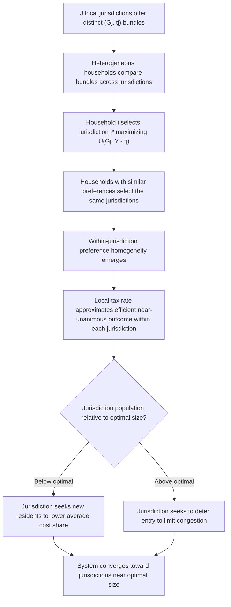

## Tiebout Model of Local Public Goods

### Origin and Central Proposition

The Tiebout model, developed by Charles Tiebout in his 1956 paper "A Pure Theory of Local Expenditures," offers a market-like solution to the preference-revelation problem inherent in public goods provision (see Chapter: The Free-Rider Problem and Chapter: Lindahl Equilibrium and Lindahl Pricing), but applied specifically to the local, rather than national, provision of public goods. Tiebout's central proposition is that when many local jurisdictions offer differentiated bundles of local public goods and taxes, and households are free to move between jurisdictions at low cost, households will sort themselves ("vote with their feet") into the jurisdiction whose tax-and-service package most closely matches their own preferences. This mobility-driven sorting process, Tiebout argued, can substitute for the missing market mechanism (and the associated preference-revelation problem) that afflicts public goods provided at higher levels of government, where exit is far more costly.

Tiebout's model was formulated partly as a direct response to Samuelson's (1954, 1955) demonstration that no decentralized market mechanism could be relied upon to reveal true preferences for public goods, since individuals face an incentive to free-ride on others' preference revelation. Tiebout argued that this pessimistic conclusion, while correct for national public goods, need not apply to *local* public goods, because household mobility between jurisdictions creates something analogous to a market choice mechanism, even without any explicit market for the public good itself.

### The Household's Locational Choice Problem

In the Tiebout framework, a household chooses a community $j$ from a set of available jurisdictions $\{1, 2, \ldots, J\}$, each offering a distinct bundle of local public good provision $G_j$ and an associated tax price $t_j$ (typically modeled as a local property tax rate or per-capita tax). The household's decision problem is:

$$\max_j U(G_j, Y - t_j)$$

where $Y$ is household income and $Y - t_j$ is private consumption net of the local tax burden in jurisdiction $j$. Because the household can freely relocate to whichever jurisdiction $j^*$ maximizes their utility, the choice of residence functions as an implicit "purchase" decision, analogous to selecting among differentiated products in a private market, revealing the household's preference ranking over local public good bundles through the observable act of choosing where to live.

### The Seven Key Assumptions of the Tiebout Model

Tiebout's original formulation, and its influence, rest on a set of stylized assumptions, several of which are highly restrictive relative to real-world conditions. The standard list of assumptions includes:

1. **Perfect mobility**: Households can move costlessly and freely to the jurisdiction offering their preferred bundle of local public goods and taxes, with no relocation costs, no restrictions on movement, and full information about the offerings of every jurisdiction
2. **Full information**: Households have complete knowledge of the revenue and expenditure patterns (taxes and public good provision) of every jurisdiction under consideration
3. **A large number of communities**: Enough jurisdictions exist, offering a sufficiently varied menu of tax-and-service bundles, that households can find a jurisdiction closely matching their particular preferences
4. **No employment/locational constraints**: Household location choice is driven solely by preferences over local public goods and taxes, unconstrained by place-of-work considerations or other locational ties (commuting costs, family ties, and similar restrictions are assumed away)
5. **No inter-jurisdictional externalities (spillovers)**: The public goods provided by one jurisdiction generate no benefits or costs that spill over to residents of other jurisdictions, so each jurisdiction's optimal provision decision can be analyzed independently of what neighboring jurisdictions provide
6. **An optimal city size exists for each bundle of public services**, reflecting cost economies or diseconomies of scale in providing local public services, analogous to the optimal club size concept in Buchanan's club theory (see Chapter: Club Goods and the Theory of Clubs)
7. **Communities below optimal size seek to attract new residents (to lower average costs per resident via cost-sharing), while communities above optimal size seek to deter new residents (to reduce congestion costs)**, generating a dynamic that pushes the system of jurisdictions toward an equilibrium in which each community operates near its optimal size, and preference-homogeneous households sort into distinct communities matched to their preferred service level

### Formal Sorting Mechanism and Equilibrium

In a Tiebout equilibrium, households sort into jurisdictions such that, within each jurisdiction, residents have relatively homogeneous preferences for local public goods (since heterogeneous households would each move to whichever jurisdiction most closely matches their individual preference, resulting in preference-clustering across jurisdictions rather than within any single jurisdiction). This has an important implication: within a Tiebout equilibrium jurisdiction, since residents share similar valuations of the local public good, the ordinary problem of preference heterogeneity that necessitates personalized Lindahl pricing at the national level becomes far less severe at the local level, since a single uniform local tax rate can approximate an efficient, near-unanimous outcome for the sorted, relatively homogeneous population within that jurisdiction.

### Connection to Club Theory

The Tiebout model is closely related in formal structure to Buchanan's theory of clubs (see Chapter: Club Goods and the Theory of Clubs): each local jurisdiction can be understood as a "club" whose membership is achieved through residency rather than an explicit membership fee, and whose "optimal size" trade-off mirrors the club-theoretic balance between cost-sharing benefits (spreading fixed public infrastructure costs over more residents) and congestion costs (crowding of local public services, such as schools or parks, as population grows). The key distinguishing feature of the Tiebout model relative to pure club theory is its emphasis on *competition among multiple jurisdictions* for mobile residents, introducing an inter-jurisdictional market-like discipline on local government behavior that has no direct counterpart in the single-club Buchanan framework.

### The "Tiebout Hypothesis" and Efficiency in Local Public Finance

The broader theoretical claim associated with Tiebout's model — often called the **Tiebout Hypothesis** — is that competition among local jurisdictions for mobile residents disciplines local governments to provide public services efficiently (avoiding waste, since inefficient jurisdictions will lose residents to more efficient competitors) and that the resulting equilibrium sorting of households across jurisdictions approximates a Pareto-efficient allocation of local public goods, effectively resolving the preference-revelation problem that Samuelson identified as insoluble at the national level.

This has motivated substantial empirical research testing for evidence of Tiebout sorting, generally examining:

- **Capitalization of local public goods and taxes into property values**: If Tiebout sorting operates as theorized, differences in local public good provision (school quality, in particular) net of tax burdens should be capitalized into local housing prices, since households bid up the price of housing in jurisdictions offering more favorable service-to-tax ratios. The hedonic property value literature, beginning with Oates (1969), has found substantial empirical support for capitalization effects, particularly with respect to local school quality, providing indirect evidence consistent with Tiebout-style sorting behavior
- **Evidence of preference-based residential sorting**: Studies examining whether households with similar demographic characteristics, income levels, or stated preferences for public services cluster together across jurisdictions in patterns consistent with Tiebout sorting

[Inference: while capitalization studies provide suggestive evidence consistent with Tiebout sorting, disentangling the specific causal contribution of local public goods sorting from other correlated factors driving residential location choice (school quality signaling different neighborhood characteristics more broadly, for instance) remains a substantive empirical and methodological challenge in this literature.]

### Critiques and Limitations of the Tiebout Model

**Unrealistic Mobility Assumptions**: The assumption of costless, frictionless mobility is strongly at odds with reality; moving involves substantial transaction costs (real estate fees, moving costs, disruption to employment and social networks, school-transfer costs for children), which limits the extent to which households can freely relocate purely in response to local tax-and-service differentials.

**Employment and Locational Constraints**: Real household location decisions are heavily influenced by job location and commuting considerations, which the basic Tiebout model assumes away; in practice, households often must accept a jurisdiction's public-good bundle as a secondary consideration relative to employment access.

**Imperfect Information**: Households in practice have limited and imperfect information about the detailed tax and expenditure patterns of alternative jurisdictions, weakening the preference-revelation mechanism that Tiebout sorting is meant to provide.

**Zoning, Exclusionary Practices, and Income Sorting**: A substantial body of subsequent literature has examined how local governments use zoning regulations (minimum lot sizes, prohibitions on multi-family housing) to effectively exclude lower-income households from higher-service, higher-tax jurisdictions, converting the Tiebout sorting mechanism into a vehicle for income-based residential segregation rather than pure preference-based sorting. This "exclusionary zoning" critique suggests that observed sorting patterns may reflect income stratification and barriers to entry as much as genuine preference matching, raising distributional concerns about the equity implications of Tiebout-style local government competition (see Chapter: Fiscal Federalism and Chapter: Local Public Finance and Property Taxation for extended treatment).

**Externalities and Spillovers Across Jurisdictions**: The assumption of no inter-jurisdictional spillovers is frequently violated in practice; local public goods such as pollution control, regional transportation infrastructure, and even school quality (through regional labor market effects) often generate benefits or costs that cross jurisdictional boundaries, undermining the assumption that each jurisdiction's provision decision can be optimized independently. This is closely related to broader concerns in the fiscal federalism literature about the appropriate assignment of public good provision responsibilities across levels of government based on the geographic scope of benefits (see Chapter: Fiscal Federalism and the Decentralization Theorem).

**Race to the Bottom Concerns**: Critics have argued that inter-jurisdictional tax competition, rather than disciplining governments toward efficient service provision as the Tiebout Hypothesis suggests, may instead induce a "race to the bottom" in local tax rates and public service provision, particularly for redistributive local spending, as jurisdictions compete to avoid attracting low-income residents or fiscal burdens; the theoretical and empirical validity of race-to-the-bottom dynamics versus efficiency-enhancing competition remains contested in the fiscal federalism literature. [Inference: the balance of evidence on whether local tax competition is primarily efficiency-enhancing (as the Tiebout Hypothesis implies) or primarily welfare-reducing (as race-to-the-bottom concerns suggest) likely depends on the specific policy domain, type of local expenditure, and institutional context under study, rather than admitting a single general conclusion.]

**Non-Existence or Multiplicity of Equilibrium**: Formal general-equilibrium treatments of the Tiebout model (Westhoff, 1977; Epple, Filimon, and Romer, 1984, 1993, among others) have shown that a stable, well-defined Tiebout equilibrium with the properties Tiebout informally described does not always exist under general preference and income distributions, and that when it does exist, it need not be unique; existence is more readily established under restrictive assumptions such as single-crossing preferences (whereby household demand for local public goods varies monotonically with income) that generate a strict ordering of jurisdictions by income and service level.

### Diagram: Tiebout Sorting Across Jurisdictions (svg_diagram)

<svg xmlns="http://www.w3.org/2000/svg" viewBox="0 0 760 380">
<text x="380" y="28" font-size="17" font-weight="bold" text-anchor="middle" fill="#1a1a1a">Tiebout Sorting Across Jurisdictions (svg_diagram)</text>
<rect x="40" y="70" width="180" height="90" rx="6" fill="#2c5f8a" />
<text x="130" y="100" font-size="12" fill="white" text-anchor="middle">Jurisdiction A</text>
<text x="130" y="120" font-size="11" fill="white" text-anchor="middle">Low tax, low service</text>
<text x="130" y="138" font-size="11" fill="white" text-anchor="middle">(G_A, t_A)</text>
<rect x="290" y="70" width="180" height="90" rx="6" fill="#4a7fa5" />
<text x="380" y="100" font-size="12" fill="white" text-anchor="middle">Jurisdiction B</text>
<text x="380" y="120" font-size="11" fill="white" text-anchor="middle">Medium tax, medium</text>
<text x="380" y="138" font-size="11" fill="white" text-anchor="middle">service (G_B, t_B)</text>
<rect x="540" y="70" width="180" height="90" rx="6" fill="#27632a" />
<text x="630" y="100" font-size="12" fill="white" text-anchor="middle">Jurisdiction C</text>
<text x="630" y="120" font-size="11" fill="white" text-anchor="middle">High tax, high service</text>
<text x="630" y="138" font-size="11" fill="white" text-anchor="middle">(G_C, t_C)</text>
<line x1="130" y1="160" x2="130" y2="210" stroke="#555" stroke-width="1.5" />
<line x1="380" y1="160" x2="380" y2="210" stroke="#555" stroke-width="1.5" />
<line x1="630" y1="160" x2="630" y2="210" stroke="#555" stroke-width="1.5" />
<rect x="40" y="210" width="180" height="60" rx="6" fill="#c0392b" opacity="0.85" />
<text x="130" y="235" font-size="11" fill="white" text-anchor="middle">Households preferring</text>
<text x="130" y="252" font-size="11" fill="white" text-anchor="middle">minimal services relocate here</text>
<rect x="290" y="210" width="180" height="60" rx="6" fill="#c0392b" opacity="0.85" />
<text x="380" y="235" font-size="11" fill="white" text-anchor="middle">Households with moderate</text>
<text x="380" y="252" font-size="11" fill="white" text-anchor="middle">demand for services relocate here</text>
<rect x="540" y="210" width="180" height="60" rx="6" fill="#c0392b" opacity="0.85" />
<text x="630" y="235" font-size="11" fill="white" text-anchor="middle">Households valuing high</text>
<text x="630" y="252" font-size="11" fill="white" text-anchor="middle">service levels relocate here</text>
<line x1="130" y1="270" x2="380" y2="310" stroke="#888" stroke-width="1" stroke-dasharray="3,3" />
<line x1="630" y1="270" x2="380" y2="310" stroke="#888" stroke-width="1" stroke-dasharray="3,3" />
<rect x="230" y="310" width="300" height="50" rx="6" fill="#1a1a1a" />
<text x="380" y="332" font-size="11" fill="white" text-anchor="middle">Result: within-jurisdiction preference</text>
<text x="380" y="348" font-size="11" fill="white" text-anchor="middle">homogeneity; near-efficient local outcomes</text>
</svg>

### Empirical Testing Strategies

Beyond property value capitalization studies, researchers have tested Tiebout-related predictions using:

- **Median voter model integration**: Since Tiebout predicts within-jurisdiction preference homogeneity, many applied local public finance studies combine the Tiebout sorting framework with the median voter model (assuming local spending levels are set by majority vote among relatively homogeneous residents) to jointly explain both *why* local jurisdictions differ in service levels and *how* the level within a given jurisdiction is determined (see Chapter: Median Voter Theorem and Public Choice for the complementary demand-side determination mechanism)
- **Migration response studies**: Examining whether households' observed migration patterns respond to changes in local tax rates or public service quality in the manner the Tiebout model predicts, controlling for confounding factors such as employment opportunities and cost of living
- **Direct surveys of stated relocation motives**: Survey-based approaches asking households directly about the role of local taxes and services in relocation decisions, though such self-reported measures carry the standard limitations of survey-based preference elicitation

### Policy Relevance and Contemporary Applications

The Tiebout framework remains foundational to the theory of fiscal federalism and continues to inform debates over:

- The appropriate degree of fiscal decentralization, since the Tiebout Hypothesis provides a formal efficiency rationale for assigning public good provision to the lowest level of government capable of internalizing the relevant benefit area (a principle closely related to the subsidiarity concept and the fiscal federalism Decentralization Theorem)
- The design and regulation of local zoning policy, given the exclusionary zoning critique's implications for housing affordability and economic segregation
- Debates over inter-jurisdictional tax competition policy, including proposals for tax harmonization or revenue-sharing arrangements intended to mitigate race-to-the-bottom concerns while preserving the efficiency-enhancing aspects of jurisdictional competition

**Related Topics**

- Club Goods and the Theory of Clubs
- Fiscal Federalism and the Decentralization Theorem
- Median Voter Theorem and Public Choice
- Property Tax Capitalization and Local Public Finance
- Exclusionary Zoning and Residential Sorting
- Lindahl Equilibrium and Lindahl Pricing
- Local Public Goods versus National Public Goods
- Inter-Jurisdictional Tax Competition and Race-to-the-Bottom Debates