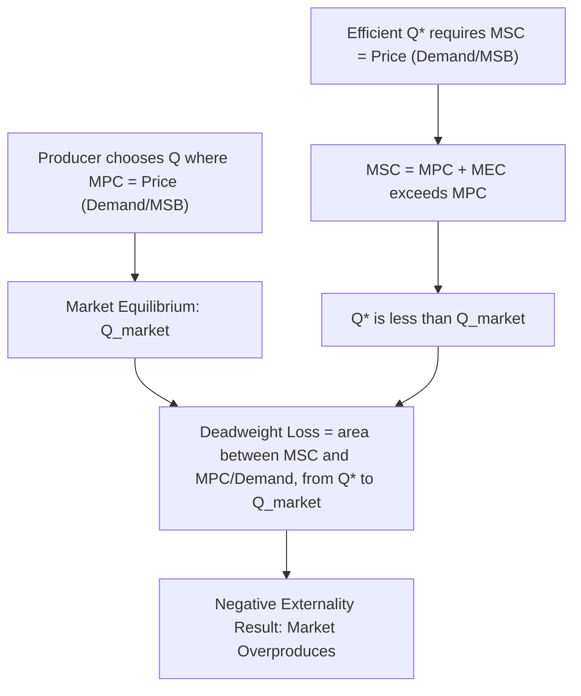
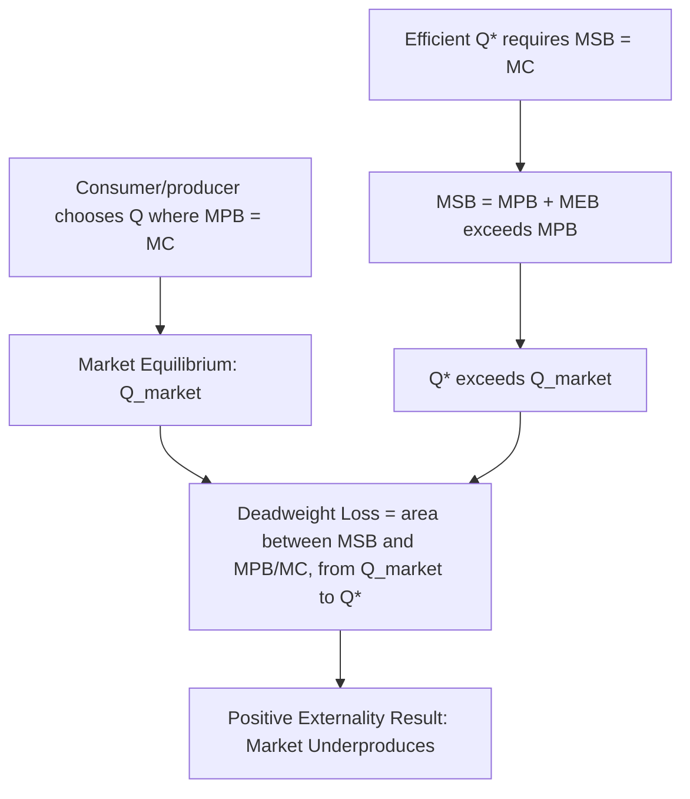

## Positive and Negative Externalities

### Definition and Core Concept

An externality exists when the action of one economic agent (a consumer or producer) directly affects the utility or production possibilities of another agent, outside of any market transaction and without compensation reflected in market prices. The defining feature of an externality is that it is an unpriced, non-market effect: the price mechanism that ordinarily coordinates and internalizes the costs and benefits of economic activity fails to reflect this side effect, causing decentralized decision-makers to ignore it when choosing their level of activity.

Formally, if an agent's production or consumption activity level $q$ directly enters the utility or production function of another agent $j$ (i.e., $U_j$ or $\pi_j$ depends on $q$ chosen by agent $i$), and this dependence is not mediated through any price that agent $i$ faces, then $q$ generates an externality on agent $j$. Externalities can be **negative** (imposing an uncompensated cost on others, such as pollution) or **positive** (conferring an uncompensated benefit on others, such as a beekeeper's bees pollinating a neighboring orchard).

### The Divergence Between Private and Social Cost/Benefit

The central analytical device for understanding externalities is the distinction between **private** and **social** marginal cost or benefit.

For a **negative externality** in production, the marginal social cost (MSC) of an activity exceeds the marginal private cost (MPC) faced by the producer, because the producer's decision-making does not incorporate the external damage imposed on third parties:

$$MSC(Q) = MPC(Q) + MEC(Q)$$

where $MEC(Q)$ is the marginal external cost imposed on third parties at output level $Q$.

For a **positive externality**, the marginal social benefit (MSB) of an activity exceeds the marginal private benefit (MPB) captured by the decision-maker, because some of the benefit accrues to third parties without compensation:

$$MSB(Q) = MPB(Q) + MEB(Q)$$

where $MEB(Q)$ is the marginal external benefit conferred on third parties.

### Market Outcomes Under Externalities: Formal Analysis

**Negative Production Externality**: A profit-maximizing firm chooses output where marginal private cost equals price (or marginal private benefit, in the more general case): $MPC(Q^{market}) = P$. The socially efficient output level, by contrast, requires $MSC(Q^*) = P$ (or, more generally, $MSC = MSB$ in a full general-equilibrium treatment). Since $MSC > MPC$ at every output level (given a positive external cost), and both cost curves are typically upward-sloping, the market equilibrium output exceeds the socially efficient output:

$$Q^{market} > Q^*$$

The market **overproduces** goods with negative production externalities. The resulting welfare loss (deadweight loss) is the area between the MSC and MPC (or demand/MSB) curves, between $Q^*$ and $Q^{market}$, representing the excess social cost incurred on units of output beyond the efficient level.

**Positive Consumption or Production Externality**: By symmetric logic, if $MSB > MPB$, private decision-makers who base their choices only on $MPB$ will choose an activity level where $MPB(Q^{market}) = MC$, which falls short of the efficient quantity where $MSB(Q^*) = MC$. Since $MSB > MPB$ at every quantity, and assuming standard downward-sloping benefit and upward-sloping cost curves:

$$Q^{market} < Q^*$$

The market **underproduces** (or under-consumes) goods and activities that generate positive externalities.

### Diagram: Negative Externality — Overproduction

### Diagram: Positive Externality — Underproduction

### Illustrative Numerical Example: Negative Externality

Suppose a firm's marginal private cost is $MPC(Q) = 10 + 2Q$, and its production generates pollution imposing a marginal external cost of $MEC(Q) = Q$ on nearby residents. Market demand (equal to marginal social benefit, assuming no consumption externality) is $P = 100 - Q$.

**Market equilibrium** (ignoring the externality): $MPC(Q) = P$

$$10 + 2Q = 100 - Q \implies 3Q = 90 \implies Q^{market} = 30$$

**Socially efficient output**: $MSC(Q) = MPC(Q) + MEC(Q) = 10 + 2Q + Q = 10 + 3Q$, set equal to demand:

$$10 + 3Q = 100 - Q \implies 4Q = 90 \implies Q^* = 22.5$$

The market overproduces by $Q^{market} - Q^* = 30 - 22.5 = 7.5$ units. The deadweight loss from this overproduction is the triangular area between the MSC and MPC curves over the interval $[22.5, 30]$:

$$DWL = \frac{1}{2} \times (Q^{market} - Q^*) \times MEC(Q^{market}) = \frac{1}{2} \times 7.5 \times 30 = 112.5$$

### Illustrative Numerical Example: Positive Externality

Suppose an individual's marginal private benefit from getting vaccinated is $MPB(Q) = 50 - Q$ (where $Q$ represents the vaccination rate in the population, in a simplified representative-agent framing), and vaccination also reduces disease transmission risk to others, generating a marginal external benefit of $MEB(Q) = 20 - 0.5Q$. Marginal cost of vaccination is constant, $MC = 30$.

**Market equilibrium**: $MPB(Q) = MC$

$$50 - Q = 30 \implies Q^{market} = 20$$

**Socially efficient level**: $MSB(Q) = MPB(Q) + MEB(Q) = (50 - Q) + (20 - 0.5Q) = 70 - 1.5Q$, set equal to $MC$:

$$70 - 1.5Q = 30 \implies 1.5Q = 40 \implies Q^* \approx 26.67$$

The market underprovides vaccination by approximately $26.67 - 20 = 6.67$ units relative to the social optimum, illustrating the classic public-health rationale for subsidizing or mandating vaccination (see "Policy Responses" below and Chapter: Corrective Taxes and Subsidies — Pigouvian Policy for the general instrument-design treatment).

### Classification of Externalities

**Production Externalities**: Arise when one firm's production process directly affects another firm's production possibilities or costs, without market compensation. Examples: a factory's air pollution raising a downstream firm's operating costs (negative); a beekeeper's hives improving pollination and yields at a neighboring orchard (positive).

**Consumption Externalities**: Arise when one individual's consumption directly affects another individual's utility. Examples: secondhand smoke reducing the utility of nearby non-smokers (negative); an individual's vaccination reducing disease transmission risk to others (positive); a homeowner's well-maintained garden increasing neighbors' enjoyment of the streetscape (positive).

**Externalities Between Production and Consumption**: A firm's production activity can affect a consumer's utility directly (industrial noise reducing residents' quality of life), or a consumer's activity can affect a firm's production costs (traffic congestion generated by commuters raising delivery costs for local businesses).

**Network Externalities**: A special category of (typically positive) consumption externality in which the value of a good to a user increases with the number of other users of the same good (telecommunications networks, social media platforms, software with strong ecosystem effects). Network externalities generate multiple equilibria and tipping dynamics distinct from standard externality analysis and are frequently treated as a specialized subfield (see Chapter: Network Externalities and Industrial Organization).

**Pecuniary versus Technological (Real) Externalities**: An important distinction, emphasized in the literature following Viner (1931), separates **technological (real) externalities**, which directly affect another agent's production or utility function outside the price system (the type analyzed above and requiring corrective policy), from **pecuniary externalities**, which operate purely through the price system (e.g., increased demand for a good raises its price, affecting other buyers) and do not represent a market failure requiring correction, since they reflect the normal, efficient functioning of competitive markets in reallocating resources in response to changing scarcity. [Inference: distinguishing pecuniary from technological externalities in specific applied contexts (e.g., whether certain financial-market spillovers are "merely" pecuniary or reflect genuine informational or technological externalities) is a recurring source of debate in applied welfare economics.]

**Intertemporal and Global Externalities**: Externalities can span across time (a firm's current resource extraction affecting future generations' resource availability) or across national borders (greenhouse gas emissions in one country affecting climate outcomes globally). These variants raise distinct challenges for corrective policy design given the absence of enforceable cross-border or cross-generational property rights or contracting mechanisms (connecting to the discussion of missing markets for future generations; see Chapter: Missing and Incomplete Markets).

### The Coasian Perspective: Externalities as a Missing Market Problem

Ronald Coase's (1960) "The Problem of Social Cost" reframed the standard externality analysis by arguing that externalities are fundamentally a problem of **missing markets and poorly defined or costly-to-enforce property rights**, rather than an inherent failure requiring government correction in all cases. The Coase Theorem states that, in the absence of transaction costs and given well-defined property rights (regardless of to whom those rights are initially assigned), private bargaining between the affected parties will lead to an efficient allocation of resources, internalizing the externality without government intervention.

Formally, if property rights over the externality-generating activity are clearly assigned (either the polluter has a right to pollute, or the affected party has a right to be free from pollution) and transaction costs of bargaining are zero, the involved parties will bargain to the efficient output level $Q^*$ regardless of the initial rights assignment, because any output level other than $Q^*$ leaves unexploited gains from trade between the two parties (the "victim" would be willing to pay the polluter to reduce output up to $Q^*$, or vice versa, whenever a net gain from further bargaining remains available).

The Coase Theorem's chief practical limitation is that most real-world externality situations, particularly those involving diffuse harm to large numbers of affected parties (air pollution affecting an entire city, greenhouse gas emissions affecting the entire globe), involve substantial transaction costs — the costs of identifying all affected parties, negotiating and enforcing an agreement among them, and preventing free-riding among the many potential beneficiaries of a successful bargain (itself a public-goods problem nested within the bargaining process) — which is precisely why government corrective policy (Pigouvian taxation, cap-and-trade, or direct regulation) remains the dominant practical approach to widespread externalities despite the Coasian insight (see Chapter: Coase Theorem and Property Rights Solutions and Chapter: Corrective Taxes and Subsidies — Pigouvian Policy for extended treatment of both the bargaining solution and the tax/regulatory alternative).

### Diagram: Externality Taxonomy (svg_diagram)

<svg xmlns="http://www.w3.org/2000/svg" viewBox="0 0 760 400">
<text x="380" y="28" font-size="17" font-weight="bold" text-anchor="middle" fill="#1a1a1a">Taxonomy of Externalities (svg_diagram)</text>
<rect x="290" y="55" width="180" height="45" rx="6" fill="#1a1a1a" />
<text x="380" y="83" font-size="12" fill="white" text-anchor="middle">Externality</text>
<line x1="380" y1="100" x2="200" y2="140" stroke="#555" stroke-width="1.5" />
<line x1="380" y1="100" x2="560" y2="140" stroke="#555" stroke-width="1.5" />
<rect x="100" y="140" width="200" height="45" rx="6" fill="#c0392b" />
<text x="200" y="168" font-size="12" fill="white" text-anchor="middle">Negative (MSC &gt; MPC)</text>
<rect x="460" y="140" width="200" height="45" rx="6" fill="#27632a" />
<text x="560" y="168" font-size="12" fill="white" text-anchor="middle">Positive (MSB &gt; MPB)</text>
<line x1="200" y1="185" x2="120" y2="230" stroke="#555" stroke-width="1.5" />
<line x1="200" y1="185" x2="280" y2="230" stroke="#555" stroke-width="1.5" />
<line x1="560" y1="185" x2="480" y2="230" stroke="#555" stroke-width="1.5" />
<line x1="560" y1="185" x2="640" y2="230" stroke="#555" stroke-width="1.5" />
<rect x="30" y="230" width="180" height="55" rx="6" fill="#e07b6f" />
<text x="120" y="252" font-size="11" fill="white" text-anchor="middle">Production</text>
<text x="120" y="268" font-size="10" fill="white" text-anchor="middle">Factory pollution</text>
<rect x="220" y="230" width="180" height="55" rx="6" fill="#e07b6f" />
<text x="280" y="252" font-size="11" fill="white" text-anchor="middle">Consumption</text>
<text x="280" y="268" font-size="10" fill="white" text-anchor="middle">Secondhand smoke</text>
<rect x="390" y="230" width="180" height="55" rx="6" fill="#6fa87a" />
<text x="480" y="252" font-size="11" fill="white" text-anchor="middle">Production</text>
<text x="480" y="268" font-size="10" fill="white" text-anchor="middle">Bee pollination</text>
<rect x="580" y="230" width="150" height="55" rx="6" fill="#6fa87a" />
<text x="655" y="252" font-size="11" fill="white" text-anchor="middle">Consumption</text>
<text x="655" y="268" font-size="10" fill="white" text-anchor="middle">Vaccination</text>
<line x1="380" y1="285" x2="380" y2="320" stroke="#555" stroke-width="1.5" />
<rect x="230" y="320" width="300" height="55" rx="6" fill="#2c5f8a" />
<text x="380" y="342" font-size="11" fill="white" text-anchor="middle">Cross-cutting variants:</text>
<text x="380" y="360" font-size="11" fill="white" text-anchor="middle">Network, Intertemporal, Global,</text>
<text x="380" y="374" font-size="10" fill="white" text-anchor="middle">Pecuniary (not a market failure)</text>
</svg>

### Real-World Examples

**Negative Externalities**:

- **Air and water pollution** from industrial production, imposing health and environmental costs on nearby populations and ecosystems
- **Greenhouse gas emissions**, generating a global negative externality (climate change) affecting all countries regardless of the emissions source
- **Traffic congestion**, where each additional driver marginally slows travel for all other road users without compensating them
- **Noise pollution** from airports, construction, or nightlife venues affecting nearby residents
- **Antibiotic overuse**, contributing to antimicrobial resistance that raises future treatment costs and risks for the broader population, an example of an intertemporal negative externality

**Positive Externalities**:

- **Basic research and innovation spillovers**, where a firm's or researcher's discoveries can be built upon by others (imperfectly protected by patents), generating social returns to R&D that exceed the private returns captured by the innovator, a central justification for public R&D subsidies (see Chapter: Public Goods and Innovation Policy)
- **Education**, generating external benefits through a more productive, informed citizenry, lower crime rates, and positive intergenerational effects, beyond the private return captured by the educated individual in the form of higher wages
- **Vaccination and herd immunity**, as illustrated in the numerical example above
- **Restoration or preservation of historic buildings and green spaces**, enhancing neighborhood aesthetic value and property values for surrounding residents beyond the private benefit to the property owner
- **Bee pollination services**, the classic example examined empirically by Meade (1952) and subsequently reexamined by Cheung (1973), whose empirical study of actual contractual arrangements between beekeepers and orchard owners in Washington State found that private bargaining (in the Coasian tradition) had in practice emerged to address this externality through side payments and contracts, challenging the assumption that such externalities are necessarily "unpriced" in all real-world settings

### Policy Responses (Overview)

While detailed treatment of each corrective instrument is provided in dedicated chapters, the standard menu of policy responses to externalities includes:

- **Pigouvian taxes and subsidies**: A tax equal to the marginal external cost (for negative externalities) or a subsidy equal to the marginal external benefit (for positive externalities), set at the efficient output level, that aligns private incentives with social costs and benefits (see Chapter: Corrective Taxes and Subsidies — Pigouvian Policy)
- **Property rights and Coasian bargaining**: Establishing clear, tradable property rights and relying on private negotiation to reach an efficient outcome, viable primarily when the number of affected parties is small and transaction costs are low (see Chapter: Coase Theorem and Property Rights Solutions)
- **Quantity regulation and cap-and-trade systems**: Direct government limits on the externality-generating activity (emissions caps, zoning restrictions) or market-based tradable permit systems that achieve a target aggregate quantity at least cost across heterogeneous polluters (see Chapter: Cap-and-Trade and Tradable Permit Systems)
- **Direct regulation ("command-and-control")**: Mandated technology standards, performance standards, or outright prohibitions, often used when monitoring individual externality-generating behavior is difficult or when uniform standards are administratively simpler than price-based instruments, albeit typically at higher aggregate cost than price-based approaches when firms face heterogeneous abatement costs

### Distinguishing Externalities from Other Market Failures

Externalities should be conceptually distinguished from the related but separate market failure categories of public goods and missing markets, though the categories overlap substantially. A pure public good can be understood as an extreme case of a positive consumption externality in which the externality is so pervasive (affecting all members of society equally and non-rivalrously) that it constitutes an entirely distinct analytical category with its own efficiency condition (the Samuelson Condition; see Chapter: Samuelson Condition for Efficient Provision). Coase's reframing of externalities as arising from missing markets for the externality-generating activity itself directly connects this topic to the broader treatment of missing and incomplete markets (see Chapter: Missing and Incomplete Markets).

**Related Topics**

- Coase Theorem and Property Rights Solutions
- Corrective Taxes and Subsidies — Pigouvian Policy
- Cap-and-Trade and Tradable Permit Systems
- Missing and Incomplete Markets
- Samuelson Condition for Efficient Provision
- Network Externalities and Industrial Organization
- Public Goods and Innovation Policy
- Global and Intertemporal Externalities (Climate Change, Antimicrobial Resistance)