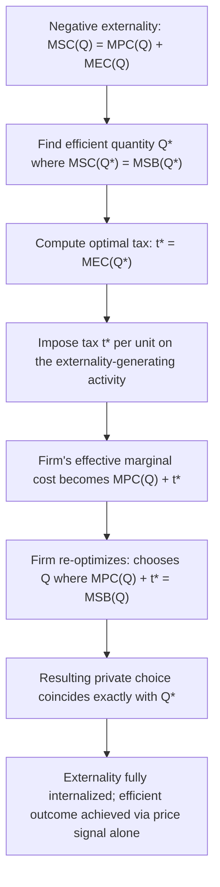

## Pigouvian Taxes and Subsidies

### Origin and Core Principle

Pigouvian taxation, named after the British economist Arthur C. Pigou following his 1920 work *The Economics of Welfare*, is the foundational corrective policy instrument for addressing externalities through the price mechanism. The core principle is to impose a per-unit tax on an activity generating a negative externality (or a per-unit subsidy on an activity generating a positive externality) equal in magnitude to the marginal external cost or benefit at the socially efficient output level, thereby forcing (or inducing) private decision-makers to internalize the externality and align their private optimization with the social optimum.

The Pigouvian approach directly targets the wedge between marginal private cost/benefit and marginal social cost/benefit identified in the standard externality analysis (see Chapter: Positive and Negative Externalities): rather than relying on regulation, quantity restrictions, or private bargaining, it corrects the price signal itself so that decentralized markets, now facing the "true" social cost or benefit, produce the efficient outcome without further government micromanagement of quantities.

### Formal Derivation: The Pigouvian Tax on a Negative Externality

Consider a competitive market with private supply (marginal private cost) $MPC(Q)$ and demand (marginal social benefit, assuming no consumption externality) $MSB(Q) = P(Q)$. Production generates a marginal external cost $MEC(Q)$ on third parties, so marginal social cost is:

$$MSC(Q) = MPC(Q) + MEC(Q)$$

The efficient quantity $Q^*$ satisfies $MSC(Q^*) = MSB(Q^*)$. The optimal Pigouvian tax, $t^*$, is set equal to the marginal external cost evaluated **at the efficient quantity**:

$$t^* = MEC(Q^*)$$

Imposing this tax raises the firm's effective marginal cost schedule to $MPC(Q) + t^*$. The firm, still maximizing private profit but now facing this augmented cost, chooses output where:

$$MPC(Q) + t^* = MSB(Q)$$

Because $t^* = MEC(Q^*)$ by construction, this condition becomes $MPC(Q) + MEC(Q^*) = MSB(Q)$, which is satisfied precisely at $Q = Q^*$ (since at that quantity, $MPC(Q^*) + MEC(Q^*) = MSC(Q^*) = MSB(Q^*)$ by definition of the efficient point). The tax thus induces the firm to voluntarily choose the socially efficient quantity, even though the firm's objective remains pure private profit maximization; the tax has fully internalized the externality into the firm's private decision calculus.

### Formal Derivation: The Pigouvian Subsidy on a Positive Externality

By symmetric logic, for an activity generating a positive externality with marginal external benefit $MEB(Q)$ accruing to third parties, marginal social benefit is $MSB(Q) = MPB(Q) + MEB(Q)$, and the optimal Pigouvian subsidy per unit is:

$$s^* = MEB(Q^*)$$

Providing this subsidy to the private decision-maker (consumer or producer) raises their effective marginal private benefit to $MPB(Q) + s^*$, inducing them to choose $Q^*$ by the same internalization logic as above.

### Diagram: Pigouvian Tax Mechanism

### Illustrative Numerical Example: Pigouvian Tax

Using the negative-externality example from the externalities analysis: $MPC(Q) = 10 + 2Q$, $MEC(Q) = Q$, and market demand $P = 100 - Q$ (equal to MSB). The efficient quantity was previously derived as $Q^* = 22.5$ (see Chapter: Positive and Negative Externalities for the full derivation).

**Optimal Pigouvian tax**:

$$t^* = MEC(Q^*) = 22.5$$

**Verification**: With the tax imposed, the firm faces effective marginal cost $MPC(Q) + t^* = 10 + 2Q + 22.5 = 32.5 + 2Q$. Setting this equal to demand:

$$32.5 + 2Q = 100 - Q \implies 3Q = 67.5 \implies Q = 22.5$$

This confirms $Q = Q^* = 22.5$, exactly as predicted. Total tax revenue collected is $t^* \times Q^* = 22.5 \times 22.5 = 506.25$, and the deadweight loss of 112.5 identified in the unregulated market equilibrium (see Chapter: Positive and Negative Externalities) is fully eliminated at the optimal tax level.

### Illustrative Numerical Example: Pigouvian Subsidy

Using the positive-externality vaccination example: $MPB(Q) = 50 - Q$, $MEB(Q) = 20 - 0.5Q$, $MC = 30$, with efficient quantity $Q^* \approx 26.67$ (see Chapter: Positive and Negative Externalities).

**Optimal Pigouvian subsidy**:

$$s^* = MEB(Q^*) = 20 - 0.5(26.67) \approx 6.67$$

**Verification**: With the subsidy, the individual's effective marginal benefit becomes $MPB(Q) + s^* = (50 - Q) + 6.67 = 56.67 - Q$. Setting equal to $MC = 30$:

$$56.67 - Q = 30 \implies Q = 26.67$$

confirming the subsidized private choice matches the efficient quantity $Q^*$.

### The "Double Dividend" Hypothesis

An influential extension of Pigouvian tax theory, particularly in the environmental economics literature, is the **double dividend hypothesis**: the proposition that revenue raised from a Pigouvian (e.g., carbon or pollution) tax can be used to reduce other, pre-existing distortionary taxes (such as labor income taxes), generating a "second dividend" of reduced deadweight loss from the broader tax system, in addition to the "first dividend" of corrected environmental externality.

The theoretical validity of a *strong* double dividend (where the combined welfare gain from environmental correction plus revenue recycling exceeds what would be achieved by an equivalent revenue-neutral labor tax cut alone, holding environmental quality fixed) is contested in the public finance literature. A key complicating consideration is the **tax interaction effect**: a Pigouvian tax on a consumption good tends to narrow the tax base and can exacerbate the pre-existing distortion in labor markets by effectively reducing the real return to labor (since the taxed good becomes more expensive, reducing the purchasing power of after-tax wages), which works against the revenue-recycling benefit. The consensus in the literature (following Bovenberg and de Mooij, 1994, and subsequent work) is that a *weak* form of the double dividend — using Pigouvian revenue to cut distortionary taxes is preferable to returning it via lump-sum rebates — is well supported, whereas the *strong* form (net welfare gain relative to a non-environmental tax reform) is not guaranteed and depends on the specific magnitude of the tax interaction effect relative to the revenue-recycling benefit. [Inference: the quantitative balance between these offsetting effects is empirically context-dependent, varying with labor supply elasticities, the specific tax system modeled, and the environmental benefit valuation used, so no single general numerical conclusion applies across all applications.]

### Practical Challenges in Setting the Optimal Pigouvian Tax

**Informational Requirements**: Calculating $t^* = MEC(Q^*)$ requires the regulator to know both the marginal external damage function and the efficient quantity, which in turn requires knowledge of the full MSC and MSB curves — an informationally demanding requirement rarely satisfied with precision in practice, particularly for externalities with complex, uncertain, or scientifically disputed damage functions (climate change damage estimates being a prominent example).

**Heterogeneous Marginal Damages**: The basic model assumes a single, well-defined marginal external cost function; in practice, the same activity (e.g., a unit of a given pollutant) may cause different marginal damages depending on location (population density near the emission source), timing, or cumulative environmental conditions, complicating the design of a single uniform tax rate and motivating research into spatially or temporally differentiated Pigouvian taxes.

**Uncertainty over Costs and Benefits — Prices versus Quantities**: A classic contribution by Weitzman (1974) demonstrates that the choice between a price instrument (a Pigouvian tax, fixing marginal cost to polluters while letting the quantity of abatement vary) and a quantity instrument (a cap or tradable permit system, fixing the quantity while letting the price vary) is not welfare-neutral under uncertainty about the marginal abatement cost curve. Specifically, Weitzman shows that price instruments are preferable when the marginal damage curve is relatively flat and the marginal abatement cost curve is relatively steep (uncertain quantity outcomes are more costly than uncertain price outcomes in this configuration), while quantity instruments are preferable in the opposite case (steep marginal damage curve, flat marginal abatement cost curve), because bounding the quantity of the externality-generating activity becomes more valuable when damages escalate sharply beyond some threshold (see Chapter: Cap-and-Trade and Tradable Permit Systems for the complementary quantity-based instrument and its own set of design considerations).

**Political Economy Constraints**: Pigouvian taxes, particularly on politically salient goods (carbon taxes on energy, "sin taxes" on tobacco and sugary beverages), often face substantial political resistance related to their visible price effects and potentially regressive incidence on lower-income households (who may spend a higher share of income on the taxed good), which has motivated policy designs combining Pigouvian taxation with revenue rebates or targeted assistance to offset distributional concerns.

**Tax Avoidance, Evasion, and Leakage**: Practical implementation must also account for behavioral responses beyond the intended quantity adjustment, including cross-border "leakage" (production shifting to jurisdictions without an equivalent tax, particularly relevant for carbon taxes applied unilaterally by a single country or region) and potential tax avoidance or evasion that can undermine the intended internalization effect.

### Diagram: Price versus Quantity Instruments Under Uncertainty (svg_diagram)

<svg xmlns="http://www.w3.org/2000/svg" viewBox="0 0 760 400">
<text x="380" y="28" font-size="17" font-weight="bold" text-anchor="middle" fill="#1a1a1a">Weitzman Prices vs Quantities (svg_diagram)</text>

<text x="190" y="55" font-size="13" font-weight="bold" text-anchor="middle" fill="`#2c5f8a`">Steep MEC, Flat MAC</text>

<line x1="60" y1="340" x2="330" y2="340" stroke="#333" stroke-width="1.5" />

<line x1="60" y1="340" x2="60" y2="80" stroke="#333" stroke-width="1.5" />

<path d="M 60,320 L 300,100" stroke="`#c0392b`" stroke-width="2" fill="none" />

<text x="305" y="95" font-size="10" fill="`#c0392b`">MEC (steep)</text>

<path d="M 60,180 L 300,220" stroke="`#27632a`" stroke-width="2" fill="none" />

<text x="305" y="225" font-size="10" fill="`#27632a`">MAC (flat)</text>

<text x="190" y="365" font-size="11" text-anchor="middle" fill="`#1a1a1a`">Quantity instrument preferred</text>

<text x="190" y="380" font-size="10" text-anchor="middle" fill="#555">(bounding Q limits large damage)</text>

<text x="570" y="55" font-size="13" font-weight="bold" text-anchor="middle" fill="`#2c5f8a`">Flat MEC, Steep MAC</text>

<line x1="440" y1="340" x2="710" y2="340" stroke="#333" stroke-width="1.5" />

<line x1="440" y1="340" x2="440" y2="80" stroke="#333" stroke-width="1.5" />

<path d="M 440,260 L 680,220" stroke="`#c0392b`" stroke-width="2" fill="none" />

<text x="685" y="218" font-size="10" fill="`#c0392b`">MEC (flat)</text>

<path d="M 440,320 L 680,100" stroke="`#27632a`" stroke-width="2" fill="none" />

<text x="685" y="98" font-size="10" fill="`#27632a`">MAC (steep)</text>

<text x="570" y="365" font-size="11" text-anchor="middle" fill="`#1a1a1a`">Price instrument preferred</text>

<text x="570" y="380" font-size="10" text-anchor="middle" fill="#555">(bounding price avoids high cost spikes)</text>

</svg>

### Real-World Applications

**Carbon Taxes**: A direct application of Pigouvian principles to greenhouse gas emissions, implemented in various forms across jurisdictions including Sweden (one of the earliest and highest-rate carbon taxes), British Columbia, and several EU member states, typically set (at least nominally) with reference to estimates of the social cost of carbon — an estimate of the present-value marginal damage from an additional ton of $CO_2$ emissions — though actual enacted rates frequently diverge from economists' estimated efficient levels due to the political economy constraints discussed above.

**Tobacco, Alcohol, and Sugar-Sweetened Beverage Taxes ("Sin Taxes")**: Often justified partly on Pigouvian grounds (external costs imposed on the healthcare system, secondhand smoke, alcohol-related accidents affecting others) and partly on internality-correction grounds (addressing self-control problems or information failures affecting the consumer's own future well-being, a distinct rationale from pure externality correction, since these effects are internal to the consuming individual rather than genuinely external — see Chapter: Behavioral Public Economics and Internalities for this related but conceptually distinct justification).

**Congestion Pricing**: Urban road-user charges (London's Congestion Charge, Singapore's Electronic Road Pricing, various U.S. express-lane tolling schemes) are Pigouvian taxes on the negative congestion externality that each additional driver imposes on other road users, typically varying by time of day to reflect the time-varying marginal external cost of congestion.

**Pigouvian Subsidies for Positive Externalities**: R&D tax credits and direct public research funding (correcting for knowledge spillovers that private firms cannot fully capture through patents), subsidies or tax credits for vaccination and preventive healthcare, and subsidies for solar panel installation or electric vehicle purchases (intended to correct for the positive externality of reduced fossil-fuel-related emissions relative to the counterfactual) are all applications of the subsidy side of Pigouvian theory. [Inference: whether the specific subsidy rates chosen in these real-world programs correspond closely to economists' estimates of the relevant marginal external benefit, as opposed to being set based on budgetary or political considerations, varies considerably by program and jurisdiction.]

### Relationship to Alternative Corrective Instruments

Pigouvian taxation should be understood as one instrument within a broader menu of corrective policy responses to externalities, each with distinct informational requirements, distributional implications, and performance under uncertainty:

| Instrument | Fixes | Lets Vary | Best Suited When |
| --- | --- | --- | --- |
| Pigouvian Tax/Subsidy | Price (marginal cost/benefit to agent) | Quantity | Marginal damage curve relatively flat; abatement costs uncertain and steep |
| Cap-and-Trade / Tradable Permits | Quantity (aggregate emissions cap) | Price (permit price) | Marginal damage curve relatively steep; bounding quantity of harm is critical |
| Coasian Bargaining | Neither directly; relies on negotiated outcome | Both, via bargaining | Small number of affected parties, low transaction costs, well-defined property rights |
| Command-and-Control Regulation | Technology or performance standard | N/A (mandated compliance) | Difficult-to-monitor externalities, or when uniform standards are administratively simpler |

The choice among these instruments in practice reflects a combination of the Weitzman price-versus-quantity considerations discussed above, administrative and monitoring feasibility, political economy constraints, and the specific informational demands each instrument places on the regulator (see Chapter: Cap-and-Trade and Tradable Permit Systems and Chapter: Coase Theorem and Property Rights Solutions for detailed treatment of the alternative instruments).

**Related Topics**

- Positive and Negative Externalities
- Coase Theorem and Property Rights Solutions
- Cap-and-Trade and Tradable Permit Systems
- Weitzman's Prices versus Quantities under Uncertainty
- The Double Dividend Hypothesis and Tax Interaction Effects
- Social Cost of Carbon and Environmental Valuation Methods
- Behavioral Public Economics and Internalities ("Sin Taxes")
- Marginal Cost of Public Funds and Optimal Tax Design