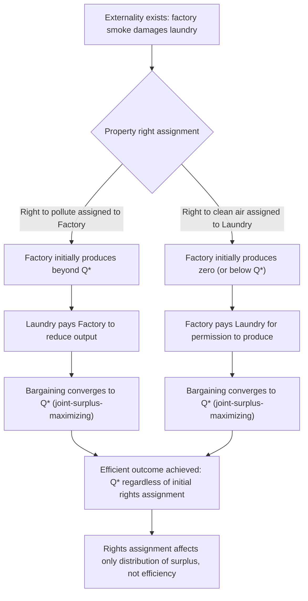

## The Coase Theorem

### Origin and Statement

The Coase Theorem originates from Ronald Coase's 1960 article "The Problem of Social Cost," published in the *Journal of Law and Economics*, which fundamentally reframed the economic analysis of externalities established by Pigou. The theorem, as subsequently formalized and named by George Stigler, states:

**If property rights are clearly defined and transaction costs are zero (or sufficiently low), private bargaining between affected parties will result in an efficient allocation of resources, regardless of the initial assignment of property rights.**

This is a striking result because it implies that externalities do not necessarily require government intervention (Pigouvian taxes, subsidies, or direct regulation) to be resolved efficiently; under the theorem's conditions, private negotiation alone can internalize the externality and reach the same efficient outcome that a perfectly calibrated Pigouvian tax would achieve, and the specific legal assignment of rights affects only the *distribution* of wealth between the parties, not the *efficiency* of the final resource allocation.

### Formal Illustration: A Two-Party Bargaining Model

Consider a factory (Firm A) whose production generates smoke that damages a nearby laundry (Firm B). Let $Q$ be the factory's output level, $\pi_A(Q)$ be the factory's private profit (increasing in $Q$), and $D(Q)$ be the damage imposed on the laundry (increasing in $Q$, representing lost profit or increased cleaning costs). The socially efficient output level, $Q^*$, maximizes joint surplus:

$$\max_Q \left[ \pi_A(Q) - D(Q) \right]$$

yielding the first-order condition $\pi_A'(Q^*) = D'(Q^*)$ — output should be expanded only up to the point where the factory's marginal profit from an additional unit equals the marginal damage imposed on the laundry.

**Case 1: Property right assigned to the factory (right to pollute)**. Absent any obligation to compensate the laundry, the factory will choose $Q$ to maximize $\pi_A(Q)$ alone, generally producing more than $Q^*$. However, the laundry can offer the factory a payment to reduce output. Since joint surplus $\pi_A(Q) - D(Q)$ is maximized at $Q^*$, there exist mutually beneficial payments the laundry can offer for any output reduction from a level above $Q^*$ down toward $Q^*$ (the laundry's marginal benefit from reduced damage, $D'(Q)$, exceeds the factory's marginal profit forgone, $\pi_A'(Q)$, for any $Q > Q^*$), so both parties can gain from bargaining down to $Q^*$. Bargaining stops exactly at $Q^*$, because beyond that point, further reductions would cost the factory more in forgone profit than they save the laundry in avoided damage, and no further mutually beneficial trade exists.

**Case 2: Property right assigned to the laundry (right to be free from pollution)**. The laundry can now legally block the factory's output. Absent any payment, the factory would need to obtain the laundry's permission to produce anything. However, the factory can offer the laundry a payment to permit output. Since joint surplus is maximized at $Q^*$, there exist mutually beneficial payments the factory can offer to increase output from zero up to $Q^*$ (the factory's marginal profit from producing a unit, $\pi_A'(Q)$, exceeds the marginal damage to the laundry, $D'(Q)$, for any $Q < Q^*$), so both parties gain from bargaining up to $Q^*$, at which point further output increases would cost the laundry more in additional damage than they benefit the factory in additional profit.

In both cases, bargaining converges to the identical efficient output level $Q^*$; only the direction and magnitude of side payments — and hence the distribution of surplus between the two parties — differs depending on the initial assignment of the property right.

### Diagram: Coasian Bargaining Under Alternative Rights Assignments

### Illustrative Numerical Example

Let the factory's profit be $\pi_A(Q) = 100Q - Q^2$ and laundry damage be $D(Q) = Q^2$. Joint surplus is:

$$S(Q) = \pi_A(Q) - D(Q) = 100Q - Q^2 - Q^2 = 100Q - 2Q^2$$

Maximizing: $S'(Q) = 100 - 4Q = 0 \implies Q^* = 25$.

**Under Case 1 (factory holds the right to pollute)**: Absent bargaining, the factory maximizes $\pi_A(Q) = 100Q - Q^2$ alone, giving $\pi_A'(Q) = 100 - 2Q = 0 \implies Q_{unbargained} = 50$. At $Q = 50$: $\pi_A(50) = 100(50) - 2500 = 2500$, and $D(50) = 2500$, so joint surplus is zero. Bargaining down to $Q^* = 25$: $\pi_A(25) = 2500 - 625 = 1875$, $D(25) = 625$, joint surplus $= 1875 - 625 = 1250$ — a joint surplus gain of 1250 from bargaining, which the laundry can share with the factory through a side payment that leaves both parties better off than the no-bargaining outcome.

**Under Case 2 (laundry holds the right to clean air)**: Absent bargaining, the laundry would block all production, $Q = 0$, giving zero profit to the factory and zero damage (joint surplus $= 0$). Bargaining up to $Q^* = 25$ again yields joint surplus of 1250, this time with the factory compensating the laundry for permitting the output.

In both cases, the efficient quantity $Q^* = 25$ and the maximized joint surplus of 1250 are identical; only who pays whom, and the resulting division of the 1250 in gains from bargaining, differs by the initial rights assignment.

### Key Assumptions Underlying the Theorem

**Zero (or Sufficiently Low) Transaction Costs**: The theorem's efficiency result depends critically on the assumption that negotiating, monitoring, and enforcing a bargain between the parties is costless or negligibly costly. This includes the costs of identifying the relevant parties, communicating and negotiating terms, and enforcing compliance with the agreed outcome.

**Well-Defined and Enforceable Property Rights**: The legal system must clearly assign the relevant right (to pollute, or to be free from pollution) to one party or the other, and that assignment must be enforceable through the courts or another credible mechanism, or bargaining has no stable legal reference point around which to negotiate.

**No Wealth Effects on Valuation (in the strict version)**: The specific numerical outcome (efficient quantity $Q^*$) is invariant to the rights assignment only if the parties' valuations of the externality do not depend on their wealth position; if wealth effects are present (a party's willingness to pay or willingness to accept for a given change in externality exposure depends on how much wealth they hold, which differs under the two rights assignments due to the different side-payment flows), the precise efficient quantity can, in principle, differ slightly between the two rights assignments, though the general qualitative prediction that some efficient bargain will be reached typically still holds. [Inference: the practical magnitude of such wealth effects on the specific efficient quantity is generally considered a secondary theoretical refinement rather than a first-order concern in most applied treatments, though it has been the subject of some technical debate in the literature following Coase's original formulation.]

**Perfect Information**: Both parties are assumed to have full information about their own valuations, the other party's valuations, and the underlying damage and profit functions, allowing them to identify and agree upon the surplus-maximizing bargain without costly information-gathering or the risk of bargaining failure due to asymmetric information.

**Rational, Non-Strategic Bargaining Behavior**: The theorem implicitly assumes that bargaining proceeds efficiently to the surplus-maximizing outcome, abstracting from strategic bargaining behavior (such as holdout problems, threats, or bargaining breakdown due to disagreement over the division of surplus) that can prevent efficient agreements even when mutually beneficial trades exist in principle.

### The Central Practical Limitation: Transaction Costs

The Coase Theorem's primary practical significance lies less in its literal applicability (which is limited) and more in what it reveals about *why* markets fail to resolve externalities: the theorem implies that inefficient externality outcomes fundamentally reflect the presence of **positive transaction costs** that prevent efficient bargains from being reached, rather than an inherent, unavoidable failure of markets to handle externalities in principle. This reframing shifts the analytical focus toward identifying and, where possible, reducing the specific transaction costs that block Coasian bargaining, rather than assuming government intervention is always the only remedy.

Transaction costs that commonly prevent Coasian bargaining in practice include:

**Large Numbers of Affected Parties**: When an externality affects many dispersed individuals (air pollution across an entire city, greenhouse gas emissions affecting the entire globe), the costs of identifying all affected parties, aggregating their preferences, and coordinating a unified negotiating position become prohibitive. This is compounded by a **nested free-rider problem**: successfully organizing a bargaining coalition among the many affected parties is itself a public-goods problem (see Chapter: The Free-Rider Problem), since any individual affected party has an incentive to let others bear the organizing and negotiating costs while free-riding on the resulting bargain.

**Holdout and Strategic Bargaining Problems**: Even with a moderate number of parties, strategic behavior (each party attempting to extract a larger share of the bargaining surplus by threatening to withhold agreement) can cause bargaining to break down or become costly and protracted, particularly when unanimous agreement among multiple affected parties is required for the bargain to be implemented.

**Difficulty in Defining and Enforcing Property Rights**: Some externalities involve harms that are difficult to precisely define, measure, or attribute to a specific source (diffuse, cumulative environmental damage with multiple contributing polluters), making the underlying property right ambiguous or costly to establish and enforce even before bargaining can begin.

**Information Asymmetries**: In practice, parties often have private information about their own costs, benefits, or valuations, which can lead to inefficient bargaining outcomes or bargaining failure, a well-established result in the mechanism-design and bargaining-theory literature (Myerson-Satterthwaite theorem) showing that efficient bilateral trade cannot generally be guaranteed under two-sided private information, even with otherwise favorable bargaining conditions.

### Diagram: Transaction Costs as the Boundary of Coasian Applicability (svg_diagram)

<svg xmlns="http://www.w3.org/2000/svg" viewBox="0 0 740 380">
<text x="370" y="28" font-size="17" font-weight="bold" text-anchor="middle" fill="#1a1a1a">Transaction Costs and Coasian Applicability (svg_diagram)</text>
<line x1="80" y1="330" x2="680" y2="330" stroke="#333" stroke-width="1.5" />
<text x="680" y="350" font-size="12" text-anchor="middle" fill="#333">Number of Affected Parties / Complexity</text>
<line x1="80" y1="330" x2="80" y2="60" stroke="#333" stroke-width="1.5" />
<text x="45" y="60" font-size="12" fill="#333">Transaction Cost</text>
<path d="M 80,310 Q 300,150 660,80" stroke="#c0392b" stroke-width="3" fill="none" />
<rect x="100" y="270" width="160" height="50" rx="6" fill="#27632a" opacity="0.85" />
<text x="180" y="290" font-size="10" fill="white" text-anchor="middle">Two-party dispute</text>
<text x="180" y="305" font-size="10" fill="white" text-anchor="middle">(low TC): Coase applies</text>
<rect x="480" y="90" width="180" height="50" rx="6" fill="#c0392b" opacity="0.85" />
<text x="570" y="110" font-size="10" fill="white" text-anchor="middle">Global externality</text>
<text x="570" y="125" font-size="10" fill="white" text-anchor="middle">(high TC): Coase breaks down</text>

<text x="370" y="365" font-size="11" text-anchor="middle" fill="`#1a1a1a`">As transaction costs rise, government correction (Pigouvian tax, regulation) becomes relatively more attractive</text>

</svg>

### Empirical Investigation: The Cheung Study of Bee Pollination

Steven Cheung's 1973 empirical study, "The Fee Structure and the Contractual Arrangements for Bee Pollination," examined the beekeeper-orchard externality often cited (following Meade, 1952) as a textbook example of an unpriced positive externality (bee pollination of orchard crops). Cheung's field investigation of actual contractual practices in Washington State found that beekeepers and orchard owners had, in practice, developed detailed private contracts — with payments flowing in both directions depending on the relative value of pollination versus nectar to each party for different crops — directly consistent with Coasian bargaining, challenging the assumption that this particular externality was genuinely unpriced or required government correction. This finding is frequently cited as supportive real-world evidence for the Coase Theorem's core mechanism in a setting where transaction costs (a relatively small, geographically concentrated, repeat-dealing set of parties) were plausibly low. [Inference: the generalizability of the low-transaction-cost bee-pollination case to externalities involving much larger or more diffuse groups of affected parties is limited, and Cheung's study is best understood as illustrating the theorem's applicability under favorable conditions rather than as evidence that Coasian bargaining can resolve externalities generally.]

### Applications and Extensions

**Assignment of Legal Liability Rules**: The Coase Theorem has had substantial influence on the economic analysis of law (law and economics), informing analysis of how liability rules (strict liability, negligence standards, property rules versus liability rules, following the influential Calabresi and Melamed 1972 framework) should be designed when transaction costs prevent Coasian bargaining, since the theorem implies that the *efficiency* consequences of legal rule design become paramount precisely in the high-transaction-cost settings where bargaining cannot be relied upon to correct any initial inefficiency, even though the *distributive* consequences of rule design remain important on independent equity grounds.

**Cap-and-Trade as an Institutionalized Coasian Solution**: Tradable pollution permit systems (cap-and-trade) can be understood as a hybrid instrument that uses government action to establish a clear, enforceable property right (the aggregate emissions cap, divided into tradable permits) specifically in order to enable low-transaction-cost bargaining (permit trading) among the many affected emitters, combining Coasian market-based reallocation with government-established rights definition to overcome the large-numbers transaction-cost problem that would otherwise block direct multi-party negotiation (see Chapter: Cap-and-Trade and Tradable Permit Systems).

**Land Use, Nuisance Law, and Zoning**: Coasian analysis has informed the economic study of nuisance law and zoning regulation, examining how property rights over land use externalities (noise, aesthetic externalities between neighboring landowners) are assigned and enforced, and under what conditions private agreements (restrictive covenants, easements) versus public zoning regulation are the more efficient mechanism for resolving land-use conflicts.

### Coase Theorem versus Pigouvian Taxation: A Comparative Perspective

| Dimension | Coasian Bargaining | Pigouvian Taxation |
| --- | --- | --- |
| Government role | Minimal — defines and enforces property rights only | Active — must estimate marginal damage and set/collect tax |
| Informational requirement | Parties themselves must know their own valuations; regulator need not know damage function | Regulator must estimate the marginal external cost/benefit function |
| Best suited to | Small number of parties, low transaction costs, well-defined rights | Large numbers of diffuse parties, high transaction costs |
| Distributional effect | Depends on initial rights assignment; can be highly unequal | Depends on tax incidence and how revenue is used |
| Risk of failure | Bargaining breakdown, holdout problems, large-numbers free-riding | Tax set incorrectly due to imperfect information on damages |

The two approaches are best understood as complementary rather than strictly competing: the Coase Theorem identifies the theoretical benchmark and the specific transaction-cost conditions under which private bargaining suffices, while Pigouvian and other government-led corrective instruments become progressively more relevant as real-world transaction costs rise above the threshold at which private bargaining can be expected to achieve an efficient outcome (see Chapter: Corrective Taxes and Subsidies — Pigouvian Policy for the complementary treatment).

**Related Topics**

- Positive and Negative Externalities
- Corrective Taxes and Subsidies — Pigouvian Policy
- Cap-and-Trade and Tradable Permit Systems
- Law and Economics: Liability Rules and Property Rules
- The Free-Rider Problem (Nested Collective Action in Bargaining Coalitions)
- Myerson-Satterthwaite Theorem and Bilateral Trade under Asymmetric Information
- Missing and Incomplete Markets
- Empirical Tests of the Coase Theorem in Applied Settings