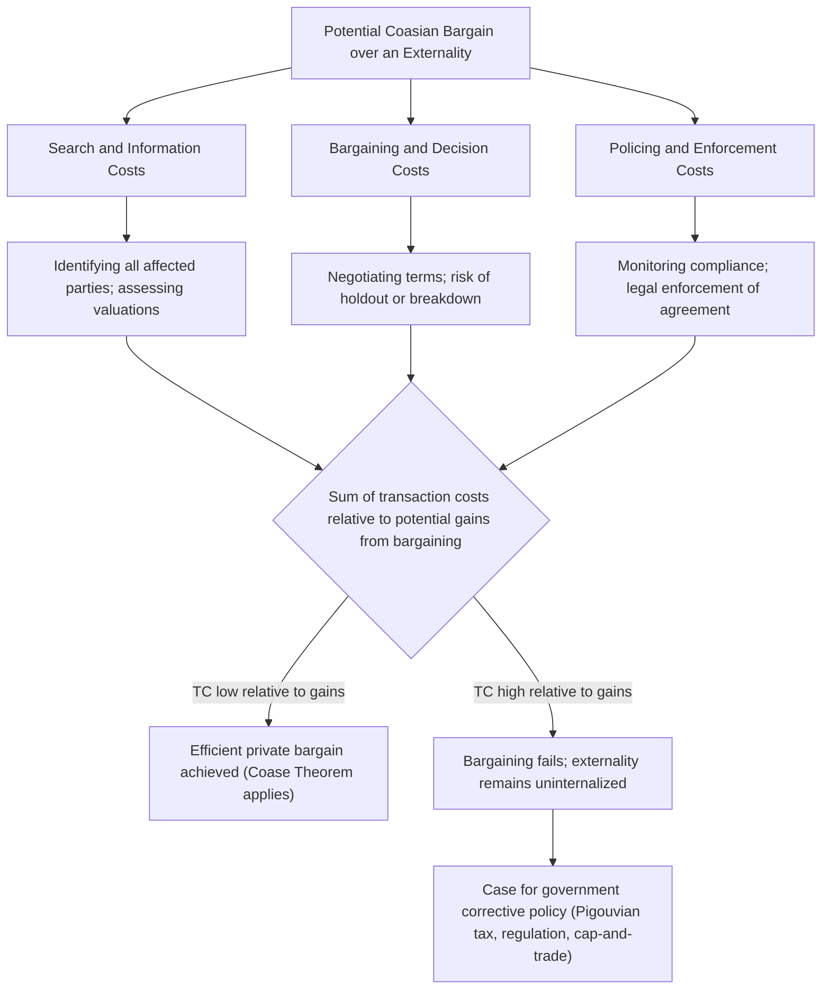

## Property Rights and Transaction Costs

### Conceptual Foundation

Property rights and transaction costs form the analytical foundation underlying the Coase Theorem and, more broadly, the institutional economics approach to externalities and market failure. Property rights define the bundle of legally and socially recognized entitlements an individual or entity holds over a resource, including the right to use it, exclude others from it, derive income from it, and transfer or sell it. Transaction costs encompass the full range of costs incurred in defining, negotiating, monitoring, and enforcing exchanges of these rights. Together, these two concepts explain both why markets fail to internalize externalities in many real-world settings and what institutional conditions are required for private bargaining, as described by the Coase Theorem, to succeed as an efficient corrective mechanism (see Chapter: The Coase Theorem).

### The Structure of Property Rights

Property rights are typically decomposed, following the influential taxonomy developed by legal scholars and economists (notably Honoré, 1961, and subsequently Alchian and Demsetz, 1973, in the economics literature), into several distinct component rights that can, in principle, be held by different parties simultaneously:

- **The right to use** the resource (usus)
- **The right to exclude** others from using the resource
- **The right to derive income** from the resource (usufruct)
- **The right to transfer, sell, or bequeath** the resource (alienability)
- **The right to the residual value** of the resource after other claims are satisfied

A property right is described as **complete** or **well-defined** when all of these component rights are clearly assigned to a specific party and enforceable through the legal system or another credible institutional mechanism. Many market failures, including those associated with externalities and common-pool resources, can be traced to the *absence* or *incompleteness* of one or more of these component rights, particularly the right to exclude, which is central to whether a good behaves as excludable or non-excludable in the standard goods taxonomy (see Chapter: Pure versus Impure Public Goods).

### Alchian and Demsetz: Property Rights as an Economizing Institution

Alchian and Demsetz (1973) developed an influential theory in which property rights are understood as an economic institution that emerges (or fails to emerge) based on a cost-benefit calculation: societies develop and enforce property rights over a resource when the benefits of doing so (primarily, internalizing externalities and creating incentives for efficient investment and resource management) exceed the costs of establishing and enforcing those rights (surveying, monitoring, adjudicating disputes, and excluding non-owners).

This framework directly explains the historical emergence of property rights institutions in response to changing relative scarcity and technology. Demsetz's (1967) earlier and highly influential companion paper, "Toward a Theory of Property Rights," examined the historical emergence of private property rights over beaver-hunting grounds among indigenous peoples in eastern Canada, arguing that formal property rights emerged specifically in response to the increased value of furs following the expansion of the international fur trade, which raised the benefit of excluding others (preventing overhunting, or a "tragedy of the commons" outcome) sufficiently to justify the costs of establishing and enforcing hunting-ground boundaries — an illustration of the general principle that property rights institutions evolve endogenously as the relative costs and benefits of defining and enforcing them shift.

### Taxonomy of Transaction Costs

Transaction costs, following the framework developed by Oliver Williamson and the broader New Institutional Economics tradition, can be decomposed into several distinct categories relevant to the analysis of externalities and Coasian bargaining:

**Search and Information Costs**: The costs of identifying the relevant parties to a potential transaction (all individuals affected by an externality), and of gathering the information needed to assess the value of the resource or the magnitude of the externality to each party.

**Bargaining and Decision Costs**: The costs of negotiating the terms of an agreement once the relevant parties have been identified, including the time, effort, and potential for costly delay or breakdown associated with reaching mutual agreement, particularly when many parties must reach a unanimous or near-unanimous consensus.

**Policing and Enforcement Costs**: The costs of monitoring compliance with an agreement once reached, and of enforcing the agreement (through legal action or other mechanisms) in the event of non-compliance or disputes over interpretation.

### Diagram: Transaction Cost Taxonomy and Its Effect on Coasian Bargaining

### The Relationship Between Number of Parties and Transaction Costs

A central empirical and theoretical regularity is that transaction costs typically rise, often more than proportionally, with the number of parties involved in a potential externality-resolving bargain. This relationship explains why Coasian bargaining is far more commonly observed and empirically documented in small-numbers, bilateral or few-party settings (neighboring landowners, the beekeeper-orchard example examined by Cheung, 1973 — see Chapter: The Coase Theorem) than in large-numbers settings involving dispersed, numerous affected parties (air pollution affecting an entire metropolitan population, greenhouse gas emissions affecting the global population).

This relationship can be understood through several compounding mechanisms:

- **Combinatorial complexity of negotiation**: As the number of parties $n$ grows, the number of pairwise relationships and potential coalition structures relevant to reaching a comprehensive agreement grows rapidly, raising the informational and coordination burden of reaching a single agreed outcome
- **The nested free-rider problem in coalition formation**: Successfully organizing a coalition of affected parties to bargain collectively with an externality generator is itself a public good (the resulting bargain benefits all affected parties, including those who did not contribute to the costly organizing effort), so the standard free-rider logic (see Chapter: The Free-Rider Problem) applies recursively to the *formation* of the bargaining coalition itself, independent of the underlying bargaining problem over the externality
- **Heterogeneity in valuations across a large population**: A larger group of affected parties is more likely to include individuals with widely varying valuations of the externality, increasing the difficulty of reaching a single, unanimously acceptable settlement compared to a small group with more homogeneous interests

### Property Rights Assignment Rules: Property Rules versus Liability Rules

The influential Calabresi and Melamed (1972) framework in law and economics distinguishes two broad approaches to protecting an assigned entitlement, with direct implications for how transaction costs interact with property rights design:

**Property Rules**: The entitlement holder can only be deprived of their right through a voluntary transaction at a price the holder finds acceptable (an injunction preventing the externality-generating activity unless the affected party consents). Property rules work well and preserve efficiency when transaction costs are low, since they force the parties to bargain to a mutually agreeable, and hence efficient, outcome — directly implementing the Coase Theorem's bargaining mechanism.

**Liability Rules**: The entitlement can be taken or infringed upon without the holder's prior consent, provided the infringing party pays an objectively determined (often court-assessed) compensation amount after the fact. Liability rules are generally favored when transaction costs are too high for direct bargaining to be practical (numerous affected parties, information asymmetries preventing accurate valuation through negotiation), since they allow an efficient outcome to be approximated through ex post compensation rather than requiring the parties to negotiate a price ex ante.

The choice between property rules and liability rules is thus itself informed by an assessment of the transaction costs likely to be faced under each regime: legal and regulatory design should favor property-rule protection (enabling Coasian bargaining) in low-transaction-cost settings, and liability-rule protection (substituting court-determined compensation for negotiated agreement) in high-transaction-cost settings where direct bargaining is unlikely to succeed.

### Diagram: Property Rules versus Liability Rules by Transaction Cost Regime (svg_diagram)

<svg xmlns="http://www.w3.org/2000/svg" viewBox="0 0 720 340">
<text x="360" y="28" font-size="17" font-weight="bold" text-anchor="middle" fill="#1a1a1a">Property Rules vs Liability Rules (svg_diagram)</text>
<line x1="60" y1="290" x2="660" y2="290" stroke="#333" stroke-width="1.5" />
<text x="660" y="310" font-size="11" text-anchor="middle" fill="#333">Transaction Costs (increasing)</text>
<rect x="80" y="180" width="260" height="90" rx="6" fill="#27632a" opacity="0.85" />
<text x="210" y="210" font-size="12" fill="white" text-anchor="middle">Low Transaction Costs</text>
<text x="210" y="230" font-size="11" fill="white" text-anchor="middle">Property Rule favored</text>
<text x="210" y="248" font-size="10" fill="white" text-anchor="middle">(injunction; parties bargain</text>
<text x="210" y="262" font-size="10" fill="white" text-anchor="middle">to efficient outcome)</text>
<rect x="380" y="180" width="260" height="90" rx="6" fill="#c0392b" opacity="0.85" />
<text x="510" y="210" font-size="12" fill="white" text-anchor="middle">High Transaction Costs</text>
<text x="510" y="230" font-size="11" fill="white" text-anchor="middle">Liability Rule favored</text>
<text x="510" y="248" font-size="10" fill="white" text-anchor="middle">(court-assessed damages</text>
<text x="510" y="262" font-size="10" fill="white" text-anchor="middle">approximate efficiency)</text>

<text x="360" y="330" font-size="11" text-anchor="middle" fill="`#1a1a1a`">(Calabresi and Melamed, 1972)</text>

</svg>

### Ostrom's Extension: Self-Governance of Common-Pool Resources

Elinor Ostrom's Nobel Prize-winning research (notably *Governing the Commons*, 1990) extended the property rights and transaction cost framework by documenting numerous empirical cases in which communities successfully developed durable, self-enforcing institutional arrangements for managing common-pool resources (irrigation systems, fisheries, forests) without relying on either pure private property rights or centralized government regulation — the two solutions traditionally emphasized in the "tragedy of the commons" literature (Hardin, 1968). Ostrom identified a set of institutional design principles (clearly defined resource and user boundaries, rules matched to local conditions, collective-choice arrangements allowing users to participate in rule modification, effective monitoring, graduated sanctions for rule violations, low-cost conflict resolution mechanisms) that reduce the effective transaction costs of collective self-governance, enabling communities to internalize resource-use externalities without either full privatization (assigning individual property rights) or full nationalization/centralized regulation. This body of work is directly complementary to the Coasian framework in identifying a "third way" of addressing externalities and property-rights gaps through polycentric, community-level institutional design rather than through either markets or top-down government regulation alone (see Chapter: Common Property Resources for the full treatment of common-pool resource governance).

### Historical and Empirical Illustrations

**Enclosure Movements and Agricultural Land**: The historical enclosure of previously common agricultural land in England (occurring over several centuries, with major waves particularly from the 16th through 19th centuries) is frequently analyzed through the Alchian-Demsetz lens: as agricultural productivity-enhancing innovations (crop rotation, selective breeding) increased the returns to individualized investment and management, the benefits of assigning individual, exclusive property rights over previously communally managed land increased relative to the costs of enclosure (surveying, fencing, legal formalization), leading to a historical shift toward private property arrangements. [Inference: while this economic logic provides a coherent explanatory framework, the specific historical drivers of any given enclosure episode were also shaped by political, distributional, and legal factors beyond the pure efficiency-based property-rights framework, and historians continue to debate the relative weight of efficiency versus redistributive motives in specific historical episodes.]

**Fisheries and Individual Transferable Quotas (ITQs)**: The transition of many fisheries from open-access (non-excludable, rival, and thus prone to overexploitation) toward individual transferable quota systems represents a direct policy application of the property-rights-as-solution logic: by assigning tradable, well-defined harvest rights to individual fishers, ITQ systems create the excludability and enforceability needed for market-based, self-interested conservation incentives to emerge, reducing the transaction costs that previously prevented Coasian-style internalization of the overfishing externality among a large number of otherwise uncoordinated fishers.

**Digital and Intellectual Property Rights**: The evolving assignment of property rights over digital content, data, and intellectual property in the internet era provides a contemporary illustration of the Alchian-Demsetz framework in action: as digital technologies have changed both the value of excludability (through subscription and encryption-based monetization models) and the cost of establishing and enforcing exclusion (through digital rights management technology), the scope and structure of intellectual property rights have evolved substantially, with continuing debate over the appropriate balance between excludability (incentivizing content creation and innovation) and the efficiency losses associated with restricting access to a fundamentally non-rival good (see Chapter: Public Goods and Innovation Policy for the related trade-off).

### Policy and Institutional Design Implications

The property rights and transaction cost framework carries several general implications for policy design in the context of externalities and market failure:

- **Reducing transaction costs directly can be a policy objective in its own right**, distinct from directly correcting the externality through taxation or regulation; policies that simplify property rights registration, reduce litigation costs, standardize contracts, or improve information availability about affected parties' preferences can enable more Coasian bargains to succeed without requiring direct government intervention in setting quantities or prices
- **Government-created property rights (such as tradable pollution permits) can be understood as a deliberate institutional response to a large-numbers transaction cost problem**, using government authority to establish an initial, enforceable rights structure specifically in order to enable subsequent low-transaction-cost private trading (see Chapter: Cap-and-Trade and Tradable Permit Systems), rather than relying on direct multi-party bargaining from the outset
- **The appropriate scope of intellectual property protection reflects an ongoing balancing exercise** between the Alchian-Demsetz benefit of exclusion (incentivizing costly investment in innovation) and the efficiency losses associated with restricting access to non-rival information goods, a tension inherent in nearly all intellectual property policy design
- **Institutional design for common-pool resources should consider the full menu of governance options** — private property rights, government regulation, and community-based self-governance institutions (following Ostrom) — rather than assuming that only privatization or centralized regulation can resolve common-pool resource dilemmas

**Related Topics**

- The Coase Theorem
- Common Property Resources and Ostrom's Governance Framework
- Cap-and-Trade and Tradable Permit Systems
- Law and Economics: Property Rules versus Liability Rules (Calabresi-Melamed)
- Alchian-Demsetz Theory of Property Rights Emergence
- Pure versus Impure Public Goods
- Individual Transferable Quotas and Fisheries Management
- Public Goods and Intellectual Property Policy