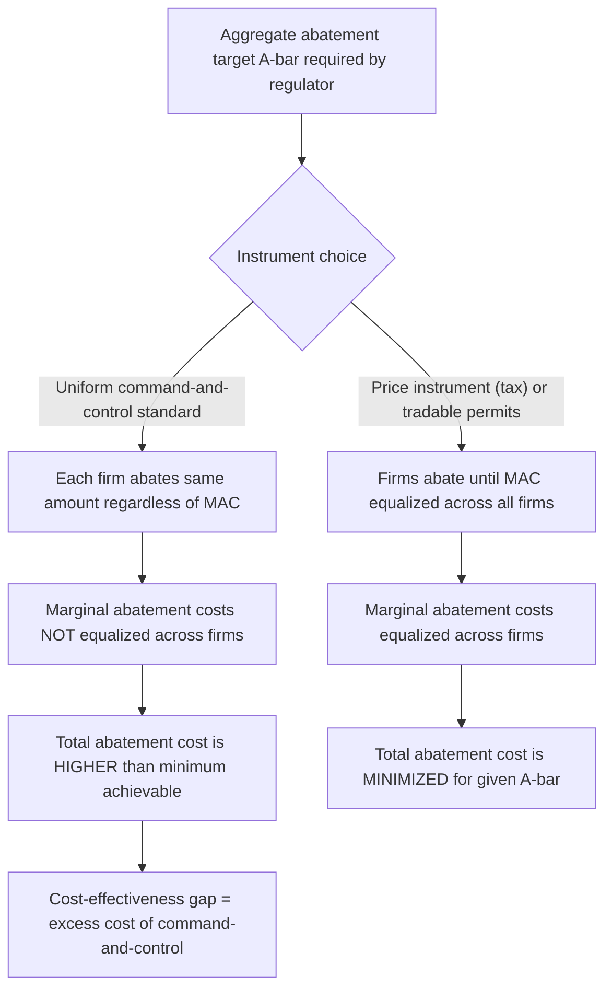

## Command-and-Control Regulation

### Definition and Position Among Corrective Instruments

Command-and-control regulation refers to a category of direct government intervention in which a regulatory authority mandates specific behaviors, technologies, or performance outcomes for externality-generating activities, backed by legal enforcement and penalties for non-compliance, rather than relying on price-based instruments (Pigouvian taxes, subsidies) or quantity-based market mechanisms (cap-and-trade) to indirectly induce efficient behavior through altered incentives. The term "command-and-control" is used, often somewhat pejoratively within economics, to contrast this direct regulatory approach with market-based instruments that economists frequently regard as more cost-effective (see Chapter: Corrective Taxes and Subsidies — Pigouvian Policy and Chapter: Cap-and-Trade and Tradable Permit Systems).

Command-and-control regulation encompasses two principal subtypes: **technology (design) standards**, which mandate the specific equipment, process, or method a regulated entity must use, and **performance (standards-based) regulation**, which mandates a specific outcome or emissions/output level that a regulated entity must achieve, while leaving the method of compliance to the entity's discretion.

### Formal Comparison: Cost-Effectiveness of Uniform Standards versus Price Instruments

The central economic critique of command-and-control regulation, particularly uniform technology or performance standards applied identically across heterogeneous firms, concerns **cost-effectiveness**: achieving a given aggregate reduction in an externality-generating activity at the lowest possible total cost across the regulated population.

Consider two firms with differing marginal abatement cost (MAC) curves for reducing a pollutant, $MAC_1(a_1)$ and $MAC_2(a_2)$, where $a_i$ denotes abatement (reduction from an unregulated baseline) by firm $i$. A given aggregate abatement target $\bar{A} = a_1 + a_2$ is achieved at **minimum total cost** when the marginal abatement costs of both firms are **equalized**:

$$MAC_1(a_1^*) = MAC_2(a_2^*)$$

This is the standard "equimarginal principle" applied to pollution abatement: total abatement cost is minimized when no further cost savings can be achieved by reallocating the abatement burden between firms (if $MAC_1 > MAC_2$, total cost could be reduced by having firm 2 abate more and firm 1 abate less, since firm 2's marginal cost of the next unit of abatement is lower).

A **uniform command-and-control standard** — requiring both firms to abate the same amount, $a_1 = a_2 = \bar{A}/2$, or to meet the same emissions rate — generally fails to equalize marginal abatement costs across firms with heterogeneous cost structures, since it ignores the firm-specific information about the shape and level of each firm's MAC curve. This results in the same aggregate abatement target being achieved at **higher total cost** than under a cost-effective price or quantity instrument (a uniform Pigouvian tax, or a cap-and-trade system with free trading) that allows abatement effort to flow toward the lowest-cost abaters.

### Illustrative Numerical Example

Suppose two firms have marginal abatement cost functions $MAC_1(a_1) = 2a_1$ and $MAC_2(a_2) = 4a_2$, and the regulator requires a total abatement of $\bar{A} = 30$ units.

**Uniform command-and-control standard** (each firm abates 15 units):

$$TC_{CAC} = \int_0^{15} 2a_1 \, da_1 + \int_0^{15} 4a_2 \, da_2 = [a_1^2]_0^{15} + [2a_2^2]_0^{15} = 225 + 450 = 675$$

**Cost-effective allocation** (equalizing marginal abatement costs, $2a_1 = 4a_2$, subject to $a_1 + a_2 = 30$):

From $2a_1 = 4a_2$, we get $a_1 = 2a_2$. Substituting: $2a_2 + a_2 = 30 \implies a_2 = 10, \, a_1 = 20$.

$$TC_{efficient} = \int_0^{20} 2a_1 \, da_1 + \int_0^{10} 4a_2 \, da_2 = [a_1^2]_0^{20} + [2a_2^2]_0^{10} = 400 + 200 = 600$$

The uniform command-and-control approach costs 675 to achieve the same 30-unit aggregate abatement target that a cost-effective, marginal-cost-equalizing allocation achieves at a cost of 600 — an excess cost of 75, or roughly 12.5% above the minimum achievable cost, purely as a consequence of failing to allocate abatement effort according to each firm's cost structure. [Inference: the magnitude of this cost-effectiveness gap in any specific real-world regulatory context depends on the actual degree of heterogeneity in regulated firms' abatement cost structures, which varies substantially by industry and pollutant; the numerical illustration here is intended to demonstrate the underlying mechanism rather than to represent an empirically calibrated real-world magnitude.]

### Diagram: Cost-Effectiveness Gap Under Uniform Standards

### Circumstances Favoring Command-and-Control Regulation

Despite the cost-effectiveness critique, command-and-control regulation remains widely used and can be economically justified under several conditions:

**Difficulty Monitoring Emissions or Output Directly**: Price and quantity instruments generally require the regulator to measure the regulated quantity (emissions, effluent discharge) with reasonable accuracy in order to assess taxes or verify compliance with a cap. When direct, continuous, and low-cost measurement of the externality-generating activity is technologically infeasible or prohibitively expensive (certain forms of diffuse water pollution, some categories of hazardous waste), a technology or design standard that is more easily verified through inspection (mandating a specific type of pollution control equipment, for instance) may be the only practically enforceable option.

**High Stakes, Irreversibility, and Catastrophic Risk**: When the potential harm from a regulated activity is severe, irreversible, or involves risks to human health and safety where a price-based approach's reliance on firms' voluntary cost-benefit responses to a tax is considered an unacceptable risk-management strategy (nuclear safety standards, workplace safety regulations, mandatory safety equipment in high-hazard industries), direct mandates are often favored over price signals, reflecting a judgment that the social cost of any firm choosing to "pay the tax and pollute anyway" is unacceptably high regardless of the tax rate.

**Administrative Simplicity and Lower Information Requirements for Firms**: Uniform technology or performance standards can, in some cases, impose lower administrative and compliance-monitoring costs than a complex tax or tradable permit system, particularly for regulating a very large number of small, geographically dispersed sources (individual vehicle emissions standards, residential building codes) where the transaction costs of operating a market-based instrument (metering, trading infrastructure, market oversight) might exceed the cost-effectiveness gains from equalizing marginal abatement costs.

**Political and Institutional Path Dependence**: Historical regulatory frameworks (in the United States, much of the foundational environmental legislation of the 1970s, including the original Clean Air Act and Clean Water Act, was structured predominantly around command-and-control technology and performance standards) can create institutional inertia, established enforcement infrastructure, and political constituencies that favor continuation of existing regulatory approaches even where market-based alternatives might, in principle, achieve equivalent environmental outcomes at lower cost.

**Distributional and Equity Considerations**: Command-and-control standards that apply uniformly to all regulated entities can be perceived as more equitable in a specific procedural sense (identical treatment of all firms) compared to price-based instruments, under which firms with higher abatement costs effectively "purchase" the right to pollute more by paying higher total tax or permit costs — a distinction with genuine political salience even though, from a pure efficiency standpoint, the price instrument achieves the same aggregate environmental outcome at lower total resource cost to society.

### Types of Command-and-Control Instruments in Detail

**Technology (Design) Standards**: Mandate the specific equipment or process a regulated entity must adopt (requiring scrubbers on smokestacks, catalytic converters on vehicles, specific wastewater treatment technology). Technology standards have the advantage of straightforward verification (inspectors can confirm the mandated equipment is installed) but the significant disadvantage of removing firms' flexibility to find lower-cost or more innovative means of achieving the same environmental outcome, and can create disincentives for firms to develop or adopt superior abatement technologies beyond the mandated standard, since compliance is defined by the specific technology rather than the underlying performance outcome.

**Performance (Emissions or Ambient) Standards**: Mandate a specific emissions rate, total output cap, or ambient environmental quality target for each regulated entity (a maximum parts-per-million discharge limit, a maximum tons-per-year emissions cap per facility), while leaving the entity free to choose how to achieve compliance (technology choice, input substitution, output reduction, or other means). Performance standards preserve more firm-level flexibility than technology standards and can therefore achieve a given individual-firm target at lower cost than a technology mandate, though they still generally fail to equalize marginal abatement costs *across* firms when applied uniformly, unlike a tradable permit system that allows abatement effort to flow toward the lowest-cost firms across the entire regulated population.

**Outright Bans and Prohibitions**: The most stringent form of command-and-control regulation, prohibiting an activity or substance entirely (bans on specific hazardous chemicals, prohibitions on certain fishing gear or methods, bans on specific pesticides) rather than merely limiting or taxing it. Bans are typically reserved for cases where the marginal damage function is judged to rise so steeply, or the risk of harm is judged so severe and poorly characterized, that any positive level of the activity is considered unacceptable, effectively representing a corner-solution application of the standard marginal-cost/marginal-benefit framework in which the efficient quantity is judged to be at or near zero.

### Real-World Applications and Regulatory Frameworks

**U.S. Clean Air Act (Original Framework)**: The 1970 Clean Air Act and its early amendments established National Ambient Air Quality Standards and required specific technology-based emissions limits (New Source Performance Standards, Best Available Control Technology requirements) for major industrial pollution sources, representing a canonical command-and-control regulatory framework; subsequent amendments, notably the 1990 Amendments establishing the sulfur dioxide cap-and-trade program for acid rain reduction, introduced market-based elements alongside the continuing command-and-control foundation, illustrating the practical trend toward hybrid regulatory approaches combining both instrument types (see Chapter: Cap-and-Trade and Tradable Permit Systems).

**Vehicle Emissions and Fuel Economy Standards**: Corporate Average Fuel Economy (CAFE) standards in the United States and similar fuel-economy or emissions-rate mandates in other jurisdictions represent performance-standard command-and-control regulation applied to vehicle manufacturers, requiring fleet-average fuel efficiency or emissions targets while leaving manufacturers flexibility in the specific engineering approaches used to meet the target.

**Occupational Safety and Health Regulation**: Workplace safety standards (mandated protective equipment, machine guarding requirements, exposure limits for hazardous substances) administered by agencies such as the U.S. Occupational Safety and Health Administration are predominantly command-and-control in structure, reflecting the judgment that worker safety risks warrant direct mandated minimum standards rather than reliance on price-based incentives alone.

**Building Codes and Land-Use Zoning**: Construction and land-use regulations (mandated fire-safety equipment, structural standards, zoning restrictions on permissible land uses) represent widespread applications of command-and-control regulation to externalities associated with the built environment, generally justified on grounds of monitoring difficulty (verifying compliance with a performance-based safety outcome directly is often more difficult than verifying compliance with a specific prescribed construction standard) and the severe, safety-critical nature of the potential harms involved.

### Diagram: Menu of Corrective Instruments by Informational and Institutional Context (svg_diagram)

<svg xmlns="http://www.w3.org/2000/svg" viewBox="0 0 760 380">
<text x="380" y="28" font-size="17" font-weight="bold" text-anchor="middle" fill="#1a1a1a">Choosing Among Corrective Instruments (svg_diagram)</text>
<rect x="290" y="55" width="180" height="45" rx="6" fill="#1a1a1a" />
<text x="380" y="83" font-size="12" fill="white" text-anchor="middle">Externality Identified</text>
<line x1="380" y1="100" x2="140" y2="150" stroke="#555" stroke-width="1.5" />
<line x1="380" y1="100" x2="380" y2="150" stroke="#555" stroke-width="1.5" />
<line x1="380" y1="100" x2="620" y2="150" stroke="#555" stroke-width="1.5" />
<rect x="40" y="150" width="200" height="70" rx="6" fill="#4a7fa5" />
<text x="140" y="175" font-size="11" fill="white" text-anchor="middle">Low TC, few parties,</text>
<text x="140" y="192" font-size="11" fill="white" text-anchor="middle">measurable damage</text>
<text x="140" y="209" font-size="10" fill="white" text-anchor="middle">→ Coasian bargaining</text>
<rect x="280" y="150" width="200" height="70" rx="6" fill="#27632a" />
<text x="380" y="175" font-size="11" fill="white" text-anchor="middle">Many parties,</text>
<text x="380" y="192" font-size="11" fill="white" text-anchor="middle">measurable emissions,</text>
<text x="380" y="209" font-size="10" fill="white" text-anchor="middle">→ Tax or cap-and-trade</text>
<rect x="520" y="150" width="200" height="70" rx="6" fill="#c0392b" />
<text x="620" y="175" font-size="11" fill="white" text-anchor="middle">Hard to monitor,</text>
<text x="620" y="192" font-size="11" fill="white" text-anchor="middle">catastrophic/irreversible risk</text>
<text x="620" y="209" font-size="10" fill="white" text-anchor="middle">→ Command-and-control</text>
<line x1="140" y1="220" x2="140" y2="260" stroke="#555" stroke-width="1.5" />
<line x1="380" y1="220" x2="380" y2="260" stroke="#555" stroke-width="1.5" />
<line x1="620" y1="220" x2="620" y2="260" stroke="#555" stroke-width="1.5" />
<rect x="40" y="260" width="200" height="60" rx="6" fill="#7fa3c0" />
<text x="140" y="285" font-size="10" fill="white" text-anchor="middle">Efficient outcome via</text>
<text x="140" y="300" font-size="10" fill="white" text-anchor="middle">private negotiation</text>
<rect x="280" y="260" width="200" height="60" rx="6" fill="#6fa87a" />
<text x="380" y="285" font-size="10" fill="white" text-anchor="middle">Cost-effective aggregate</text>
<text x="380" y="300" font-size="10" fill="white" text-anchor="middle">abatement, MAC equalized</text>
<rect x="520" y="260" width="200" height="60" rx="6" fill="#e07b6f" />
<text x="620" y="285" font-size="10" fill="white" text-anchor="middle">Verifiable compliance,</text>
<text x="620" y="300" font-size="10" fill="white" text-anchor="middle">bounded worst-case risk</text>

<text x="380" y="355" font-size="11" text-anchor="middle" fill="`#1a1a1a`">Trade-off: cost-effectiveness (favors market instruments) vs monitoring feasibility and risk tolerance (favors CAC)</text>

</svg>

### Hybrid and Transitional Approaches

Contemporary environmental and regulatory policy increasingly combines command-and-control elements with market-based instruments rather than relying exclusively on either approach:

- **Technology standards as a regulatory floor combined with performance-based flexibility above the floor**: Many regulations establish a minimum required technology or performance level (a command-and-control floor addressing catastrophic-risk or monitoring-difficulty concerns) while allowing firms that exceed the minimum standard to generate tradable credits, blending the risk-bounding benefits of direct mandates with the cost-effectiveness benefits of market-based trading at the margin
- **Safety-valve provisions in cap-and-trade systems**: Some tradable permit systems incorporate a price ceiling (a "safety valve," under which additional permits become available at a fixed price if the market price rises above a threshold) or a price floor, representing a hybrid of quantity-based (command-and-control-adjacent, in the sense of setting a firm cap) and price-based regulatory design intended to manage the cost uncertainty concerns highlighted in the Weitzman prices-versus-quantities framework (see Chapter: Corrective Taxes and Subsidies — Pigouvian Policy)
- **Phased transitions from command-and-control to market-based instruments**: Several major environmental programs (notably the U.S. sulfur dioxide cap-and-trade program under the 1990 Clean Air Act Amendments) have historically transitioned specific pollutants or sectors from an existing command-and-control framework toward market-based cap-and-trade regulation once adequate emissions-monitoring infrastructure was developed, illustrating how monitoring-cost constraints — one of the central justifications for command-and-control regulation identified above — can diminish over time as measurement technology improves, shifting the balance of instrument choice toward more cost-effective market-based alternatives

**Related Topics**

- Positive and Negative Externalities
- Corrective Taxes and Subsidies — Pigouvian Policy
- Cap-and-Trade and Tradable Permit Systems
- Weitzman's Prices versus Quantities under Uncertainty
- The Coase Theorem
- Equimarginal Principle in Pollution Abatement
- Regulatory Design and Cost-Benefit Analysis in Environmental Policy
- U.S. Clean Air Act and the Evolution of Environmental Regulation