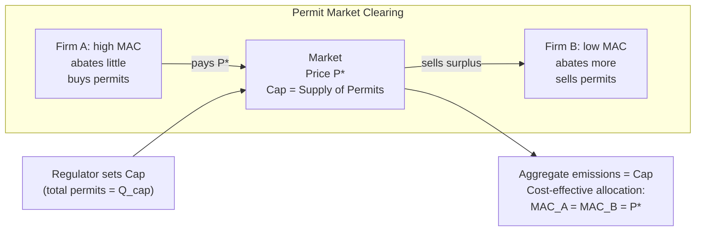

## Tradable Permits and Cap-and-Trade Systems

### Overview

Tradable permit systems (cap-and-trade) are a market-based instrument for correcting negative externalities, most commonly environmental pollution. Rather than mandating a specific abatement technology or a fixed emissions level per firm (command-and-control), the regulator sets an aggregate cap on total allowable emissions and issues permits (allowances) summing to that cap. Firms may buy and sell permits among themselves, so abatement is reallocated toward whichever firms can reduce emissions most cheaply.

### Theoretical Foundation

**The externality problem**

Pollution is a classic negative production externality: a firm's private marginal cost (PMC) of production is lower than the social marginal cost (SMC), because the firm does not bear the cost of environmental damage it imposes on third parties. The gap between SMC and PMC is the marginal external cost (MEC):

$$SMC(Q) = PMC(Q) + MEC(Q)$$

Absent correction, the market produces at $Q_{market}$, where $PMC = MB$, rather than the socially efficient $Q^*$, where $SMC = MB$. This is the standard case for Pigouvian intervention.

**Coase's insight and the permit solution**

Coase (1960) showed that if property rights are well-defined and transaction costs are low, private bargaining can achieve the efficient outcome regardless of the initial allocation of rights. Tradable permits operationalize this insight: the regulator creates a new, scarce, well-defined property right (the right to emit one unit of pollutant) and lets the market allocate it efficiently through trade, while the *level* of the right (the cap) is fixed by the regulator based on the socially desired quantity of pollution — an assessment individual bargaining wouldn't reliably produce given diffuse victims and high transaction costs at the ambient level.

### Mechanism Design

**Basic structure**

1. The regulator determines a total allowable emissions level (the cap), ideally set where $SMC = MB$.
2. Permits (allowances) are created, each authorizing emission of one unit (e.g., one ton of $CO_2$) over a compliance period.
3. Permits are distributed to firms either by **grandfathering** (free allocation based on historical emissions) or by **auction** (firms pay for permits, often government revenue).
4. Firms must hold permits equal to their actual emissions at the end of the compliance period.
5. A secondary market allows firms to buy or sell permits; firms whose marginal abatement cost (MAC) exceeds the permit price will buy, and firms whose MAC is below the permit price will abate and sell surplus permits.

**Equilibrium condition**

In competitive equilibrium, every firm sets its abatement level so that its marginal abatement cost equals the permit price $P^*$:

$$MAC_i(a_i) = P^*  \quad \forall i$$

Because all firms face the same marginal price, the market achieves **cost-effectiveness**: the given aggregate abatement target is reached at minimum total cost, since marginal abatement costs are equalized across all sources. This is true regardless of the initial permit allocation — grandfathering versus auctioning affects the distribution of wealth and rents, not the efficiency of the final abatement pattern (this is the "independence property" or "separation" of efficiency from distribution in permit markets).

### Cap-and-Trade vs. Pigouvian Tax

Both instruments can achieve the same efficient allocation under conditions of perfect information, but they differ in what is held fixed and how they perform under uncertainty.

| Dimension | Pigouvian Tax | Cap-and-Trade |
| --- | --- | --- |
| Fixed variable | Price (tax rate) | Quantity (total emissions) |
| Emissions outcome | Uncertain (depends on firms' response to price) | Certain (bounded by cap) |
| Price outcome | Certain (set by regulator) | Uncertain (determined by market) |
| Revenue | Generates tax revenue directly | Generates revenue only if auctioned |
| Administrative need | Requires accurate estimate of MEC | Requires accurate estimate of efficient quantity |
| Adjustment to inflation/growth | Requires periodic legislative revision | Cap can be set on a declining schedule ex ante |

**Weitzman (1974) "Prices vs. Quantities":** When the regulator faces uncertainty about firms' abatement costs, the relative efficiency of a price instrument (tax) versus a quantity instrument (permits) depends on the relative slopes of the marginal benefit (marginal damage) and marginal cost curves.

- If the marginal damage curve is relatively **flat** compared to marginal abatement cost (i.e., damages don't escalate sharply with small quantity deviations, but abatement costs are highly sensitive to the target), **price instruments (taxes)** are preferred, since a quantity error under a cap could impose very large cost overruns on firms.
- If the marginal damage curve is relatively **steep** (small increases in pollution cause disproportionately large harm, such as near an ecological threshold), **quantity instruments (permits/caps)** are preferred, since it is more important to guarantee the emissions ceiling is not exceeded than to minimize cost variability.

$$\text{Prefer taxes if: } |MB'| < |MC'|, \quad \text{Prefer quantities if: } |MB'| > |MC'|$$

### Price Volatility and Stabilization Mechanisms

Because the permit price is market-determined, it can be volatile in response to demand shocks (e.g., economic recessions reduce output and abatement demand, crashing permit prices, as observed in the EU ETS during 2008–2013). Common design responses include:

- **Price floors** (minimum auction reserve prices)
- **Price ceilings / cost-containment reserves** (releasing additional permits if price exceeds a threshold, effectively hybridizing the system with a tax-like cap on price)
- **Banking and borrowing**: allowing firms to save unused permits for future periods (banking) or use future periods' allowances early (borrowing), which smooths price volatility intertemporally
- **Market Stability Reserves (MSR)**: an EU ETS mechanism that algorithmically withholds or releases permits based on the volume of permits in circulation, dampening supply-side volatility

### Real-World Implementations

**EU Emissions Trading System (EU ETS)**

The largest cap-and-trade system globally, covering power generation, industry, and (since 2012) aviation. It operates in multi-year "phases," moving progressively from free allocation toward auctioning, and introduced the Market Stability Reserve in 2019 to address a persistent permit oversupply that had suppressed prices in early phases.

**U.S. Acid Rain Program (SO2 Trading)**

Established under the 1990 Clean Air Act Amendments to reduce sulfur dioxide emissions from power plants. Widely cited as an early empirical success: emissions fell well below targets and compliance costs were substantially lower than predicted under command-and-control alternatives, largely because trading allowed abatement to concentrate at low-cost plants.

**California Cap-and-Trade Program**

Covers major GHG emission sources in California; linked with Quebec's system, forming a joint carbon market (Western Climate Initiative). Includes an auction floor price and an allowance price containment reserve.

**Regional Greenhouse Gas Initiative (RGGI)**

A cap-and-trade system among a group of northeastern and mid-Atlantic U.S. states covering the power sector, notable for auctioning nearly all its permits from inception (unlike the EU ETS's initial reliance on grandfathering) and for directing much of the auction revenue to state energy-efficiency programs.

### Design Issues and Critiques

**Market power**

If permit trading markets are thin or dominated by a few large emitters, a dominant firm could withhold permits strategically to raise rival costs, undermining the cost-effectiveness result that assumes price-taking behavior.

**Hot spots**

Because a cap-and-trade system controls only the *aggregate* quantity of emissions, trading can allow pollution to concentrate geographically — a firm in a densely populated area may buy permits rather than abate, worsening local ambient pollution even as aggregate emissions fall. This is a significant equity and environmental-justice critique, especially relevant for non-uniformly-mixed pollutants (unlike $CO_2$, which is a global pollutant where location doesn't matter for damage).

**Allocation method and windfall profits**

Grandfathered permits can create windfall profits for incumbent polluters, especially if they pass through the opportunity cost of holding permits into output prices (as observed in EU ETS phase I for electricity generators), raising both efficiency (no direct issue, per the independence property) and distributional/political-economy concerns.

**Interaction with other policies**

When a cap-and-trade system is layered with other emissions-reducing policies (e.g., renewable energy subsidies) covering the same capped sector, the additional abatement from the second policy can simply free up permits for use elsewhere in the capped sector, leaving aggregate emissions unchanged — a phenomenon sometimes called the "waterbed effect."

### Worked Example

Suppose two firms, A and B, each currently emit 100 tons of a pollutant (200 tons total), and the regulator sets a cap of 120 tons (allocating 60 permits to each firm, grandfathered).

Marginal abatement cost functions (cost of the $a$-th ton abated):

$$MAC_A(a) = 2a, \qquad MAC_B(a) = 0.5a$$

**Without trading:** each firm must abate 40 tons to meet its individual allocation.

- Firm A's cost: $\int_0^{40} 2a \, da = 1{,}600$
- Firm B's cost: $\int_0^{40} 0.5a \, da = 400$
- Total cost: $2{,}000$

**With trading:** total abatement required is still 80 tons (200 − 120), but it is allocated to equalize marginal cost. Setting $MAC_A(a_A) = MAC_B(a_B) = P^*$ with $a_A + a_B = 80$:

$$2a_A = 0.5a_B, \quad a_A + a_B = 80$$

Solving: $a_B = 4a_A$, so $a_A + 4a_A = 80 \Rightarrow a_A = 16, \, a_B = 64$.

- Firm A abates 16 tons, buys permits for the remaining 24 tons it would otherwise have needed to cut.
- Firm B abates 64 tons, sells its surplus (24 permits) to Firm A.
- Equilibrium price: $P^* = 2(16) = 0.5(64) = 32$.
- Firm A's abatement cost: $\int_0^{16} 2a\,da = 256$, plus payment for 24 permits at $32 = 768$, total outlay $1{,}024$ (but this includes a transfer, not a real resource cost).
- Firm B's abatement cost: $\int_0^{64} 0.5a\,da = 1{,}024$, minus revenue from selling 24 permits at $32 = 768$, net cost $256$.
- **Total real abatement cost** (excluding transfers): $256 + 1{,}024 = 1{,}280$, versus $2{,}000$ without trading — a savings of $720$, achieved purely by reallocating *who* abates, with the same total quantity reduced.

### Diagram: Permit Market Equilibrium





```
### Related Topics
- Pigouvian taxes and optimal corrective taxation
- Coase Theorem and transaction costs
- Command-and-control regulation vs. market-based instruments
- Double dividend hypothesis (revenue recycling from auctioned permits)
- Carbon border adjustment mechanisms (CBAM)
- Renewable Portfolio Standards and policy interaction effects
- International linkage of carbon markets
- Social cost of carbon estimation


```