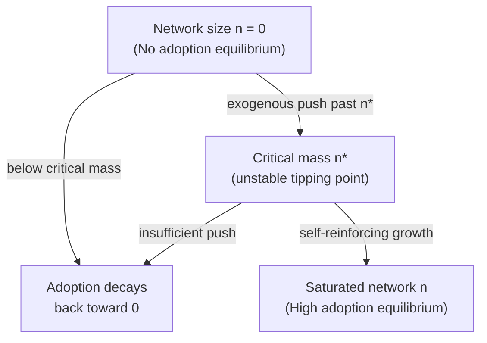

## Network Externalities


### Overview

Network externalities (also called network effects) occur when the value an individual derives from consuming a good or joining a network depends on the number of other agents who also consume that good or belong to that network. This differs from classical environmental externalities in that the "externality" typically runs *between consumers of the same good* rather than between a producer/consumer and an uninvolved third party, but it is treated under the same public economics framework because private decisions fail to account for the full social value created, leading to systematic market failure and a role for corrective policy.

### Theoretical Foundation

**Definition and classification**

A positive network externality exists when:

$$\frac{\partial U_i}{\partial n} > 0$$

where $U_i$ is individual $i$'s utility from consuming the good and $n$ is the number of other adopters. Network externalities are typically divided into:

- **Direct network effects**: utility rises mechanically with the number of other users of the *same* good (e.g., telephone networks, social media — more users directly means more people to call or interact with).
- **Indirect network effects**: utility rises through a complementary market whose supply or quality improves with the size of the primary network (e.g., more users of an operating system attracts more third-party software developers, which in turn makes the OS more valuable).

Negative network externalities (congestion effects) also exist, where $\partial U_i / \partial n < 0$ — for example, a communication network degraded by overcrowding, or a private club losing exclusivity value as membership grows. These are analytically closer to congestion externalities in public goods theory.

**Wedge between private and social value**

When an individual decides whether to join a network, they weigh only their own private benefit of joining against the price. They do not account for the fact that their joining also raises the utility of all *existing* members (in the direct-effects case). This creates a positive externality analogous to the standard Pigouvian case, but the marginal external benefit is a function of network size itself, not fixed:

$$SMB(n) = PMB(n) + \underbrace{n \cdot \frac{\partial U}{\partial n}}_{\text{external benefit to existing members}}$$

Because $SMB > PMB$ at every relevant network size, the market — left alone — under-provides adoption relative to the social optimum, mirroring the standard "positive externality implies underprovision" result from Pigouvian theory, but the wedge widens endogenously as the network grows (unlike a typical fixed per-unit external benefit).

### Demand-Side Economies of Scale and Multiple Equilibria

Unlike classical externalities, network externalities generate demand-side (rather than supply-side) economies of scale, producing a demand curve that can be **upward-sloping** over some range — the more people who already use a good, the more new adopters value it, which can generate:

**Critical mass and tipping**

There is typically a threshold network size $n^*$ below which the network is not self-sustaining (adoption naturally decays toward zero) and above which it is self-reinforcing (adoption grows toward the maximum). This produces multiple equilibria:

- $n = 0$ (no adoption) — a stable low equilibrium
- $n = n^*$ (critical mass) — typically an unstable equilibrium/tipping point
- $n = \bar n$ (full/saturated adoption) — a stable high equilibrium

**Diagrammatic representation**





```
This multiplicity implies that policy or strategic firm behavior (e.g., subsidizing early adopters, seeding the market) can matter enormously for *which* equilibrium is reached, even when the underlying preferences are unchanged — a feature absent from standard single-equilibrium Pigouvian externality models.

**Path dependence and lock-in**
Because early adoption decisions influence which equilibrium the market settles into, historical accident, timing, and expectations can lock in an outcome that is not necessarily welfare-maximizing. The classic (and contested) illustrative case is the QWERTY keyboard layout, held up as an example of a technologically inferior standard persisting due to switching costs and coordination failure, though the empirical strength of this specific example has been disputed by economic historians (Liebowitz and Margolis).

### Market Failure and the Case for Intervention

**Underprovision at the margin**
Because individual adopters do not internalize the positive spillover their adoption confers on others, and because coordination among a large dispersed set of potential adopters is costly, the market can:
1. Fail to reach critical mass entirely, leaving a socially valuable network unrealized ($n=0$ trap)
2. Settle at a stable high-adoption equilibrium that is nonetheless *smaller* than the social optimum, since even post-tipping adoption decisions ignore external benefits to others

**Expectations and coordination failure**
Adoption of a network good is fundamentally a coordination problem: an individual's willingness to adopt depends on their *expectation* of how many others will adopt. Multiple self-fulfilling expectations equilibria can coexist, meaning market outcomes are not uniquely pinned down by fundamentals alone — a form of market failure distinct from the standard externality wedge, closer to the coordination-failure literature than to Pigouvian analysis per se.

### Corrective Policy Options

**Subsidies to jump-start adoption**
A government (or a private platform) can subsidize early users to push the network past $n^*$, after which self-sustaining growth takes over and the subsidy can be withdrawn. This mirrors an "infant industry" argument but grounded in coordination failure rather than learning-by-doing.

**Standard-setting and interoperability mandates**
Government-mandated interoperability (e.g., requiring telecom carriers to interconnect, or requiring platforms to support data portability) can prevent a single firm from artificially fragmenting the market to protect proprietary lock-in, allowing the full social value of network size to be realized regardless of which specific firm's network a consumer joins.

**Public provision of network infrastructure**
Where the network effect is embedded in physical infrastructure (rail gauge standards, electrical grid frequency, early telephone networks), governments have historically intervened directly by mandating a single standard or provisioning the network directly, since private coordination among numerous firms/consumers to select a single standard is itself costly and prone to failure.

**Competition policy tension**
Network externalities create a policy tension: the same forces that justify intervention to *reach* efficient scale (subsidize, mandate interoperability) also tend to produce dominant-firm/monopoly outcomes once a network wins ("winner-take-most" markets), raising a distinct competition-policy question of whether and how to regulate a network monopolist after tipping has occurred (this connects to, but is analytically separate from, the initial underprovision problem).

### Contrast with Classical Externalities

| Dimension | Classical (e.g., pollution) | Network Externality |
|---|---|---|
| Direction typical concern | Negative (overproduction) | Positive (underprovision), though congestion cases are negative |
| Source of spillover | Production/consumption affecting uninvolved third parties | Consumption affecting *other consumers of the same good* |
| Size of externality | Often roughly constant per unit | Grows endogenously with network size |
| Equilibrium structure | Typically unique equilibrium | Multiple equilibria possible (tipping, critical mass) |
| Standard corrective tool | Pigouvian tax/subsidy, cap-and-trade | Coordination-focused: subsidies to reach critical mass, interoperability mandates, standard-setting |
| Policy timing sensitivity | Static correction can be applied at any time | Timing matters enormously (must intervene before/at critical mass) |

### Worked Example

Suppose a communications platform has potential user base normalized to $[0,1]$, and an individual with adoption cost $c$ (heterogeneous across users, uniformly distributed on $[0,1]$) adopts if their benefit exceeds cost:
$$B(n) = v \cdot n \geq c$$
where $n$ is the fraction of the population already adopted and $v$ is a scaling parameter for network value.

In equilibrium, the marginal adopter has $c = v \cdot n$, and since $c$ is uniform on $[0,1]$, the fraction with cost below $vn$ is $vn$ itself, giving the fixed-point condition:
$$n = v \cdot n$$

This has solutions $n = 0$ always, and $n = 1$ (full adoption) if $v \geq 1$. If $v < 1$, only $n=0$ is an equilibrium — the network never gets off the ground even though, if it *were* somehow fully adopted, many users would value it highly. This illustrates the coordination-failure trap: full adoption can be a stable, and even socially superior, equilibrium — but unreachable from zero without an external push (e.g., a subsidy or seeding strategy sufficient to move initial adoption to $n^* = 1/v$, past which self-reinforcing growth takes over).

### Related Topics
- Pigouvian taxes and subsidies (contrast in externality direction and correction)
- Public goods and non-rivalry (network goods share club-good characteristics)
- Coordination games and multiple equilibria in game theory
- Two-sided markets and platform economics
- Antitrust policy for dominant digital platforms
- Standard-setting organizations and technology lock-in
- Congestion externalities and club theory


```