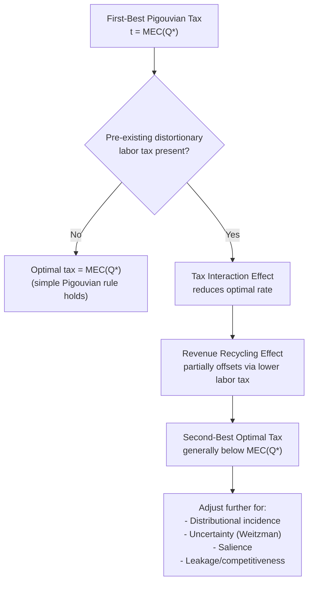

## Optimal Environmental Taxation


### Overview

Optimal environmental taxation studies how to set taxes on polluting activities when the government has other objectives beyond correcting the externality itself — chiefly raising revenue efficiently and pursuing distributional goals — and when the underlying assumptions of the simple Pigouvian model (certainty, lump-sum redistribution, a single distorting margin) do not hold. It builds on basic Pigouvian theory but integrates it into the broader optimal taxation literature, most notably through the "double dividend" debate.

### Theoretical Foundation

**The simple Pigouvian benchmark**

In the textbook case, the optimal tax equals marginal external damage at the efficient quantity:

$$t^* = MEC(Q^*)$$

This restores $PMC + t^* = SMC$, so that private decisions internalize the full social cost and the market reaches the efficient output $Q^*$ where $SMC = MB$.

**Why this benchmark is insufficient in a full public finance setting**

The simple rule assumes: (i) all other markets are undistorted, (ii) revenue can be returned lump-sum without further distortion, and (iii) the regulator has perfect information about $MEC$. Relaxing each assumption generates the core results of optimal environmental tax theory.

### The Double Dividend Hypothesis

**First dividend**: the direct welfare gain from correcting the externality (standard Pigouvian logic).

**Second (weak/strong) dividend**: the possibility that using environmental tax revenue to reduce other distortionary taxes (e.g., labor income tax) generates an *additional* welfare gain, because it allows a shift away from taxes that distort labor supply.

- The **weak form** of the double dividend hypothesis — that using environmental tax revenue to cut distortionary taxes is welfare-superior to returning revenue lump-sum — is widely accepted and largely uncontroversial in the literature.
- The **strong form** — that an environmental tax swap yields a net efficiency gain even ignoring the environmental benefit entirely (i.e., the tax-interaction effect is outweighed by the revenue-recycling effect) — is more contested and does not hold in general.

**Tax interaction effect**

Goulder (1995) and others formalized a key qualification: an environmental tax, by raising the price of goods (especially energy-intensive goods), reduces the real return to labor (since a fixed nominal wage buys less), which *exacerbates* the pre-existing distortion from the labor income tax. This "tax interaction effect" works against the second dividend:

$$\text{Net welfare effect of tax swap} = \underbrace{\text{Revenue-recycling effect}}_{(+), \text{ using revenue to cut distortionary taxes}} - \underbrace{\text{Tax interaction effect}}_{(-), \text{ narrows the base for distortionary taxes}}$$

**Implication for the optimal tax rate**

Because of the tax interaction effect, the second-best optimal environmental tax in an economy with a pre-existing distortionary labor tax is generally **below** the first-best Pigouvian rate $MEC(Q^*)$ — the environmental tax should not be pushed as far as it would in a lump-sum-financed world, since it also bears part of the burden of interacting with the existing tax distortion. (Note: this result depends on the environmental good being weakly complementary with leisure or a normal good in consumption; specific parameterizations can move the direction, so the "below first-best" result is the standard case, not a universal law across all model specifications — [Inference: model-dependent], though it is the dominant finding in the literature under standard assumptions.)

### Uncertainty and the Choice of Instrument

**Weitzman framework applied to tax-setting**

When marginal abatement costs are uncertain (the regulator does not know firms' true cost curves precisely), the optimal choice between a tax (price instrument) and a quantity instrument (permits) depends on the relative curvature of marginal benefit (damage) and marginal cost functions, as established by Weitzman (1974):

$$\text{Tax preferred when } |MB''| < |MC''| \text{ (relatively flat marginal damage)}$$

For most local/regional pollutants with well-behaved, gradually rising damage functions, this tends to favor taxes for price certainty and predictable compliance costs; for pollutants near a sharp ecological threshold (e.g., certain toxic thresholds), quantity instruments dominate.

**Hybrid and adaptive instruments**

Because true costs and damages are rarely known exactly, "optimal" environmental tax design in practice often includes adaptive elements:

- **Tax rate indexed to a target metric** (e.g., automatic adjustment if emissions deviate from a benchmark path)
- **Price ceilings/floors in permit systems** that convert them into partial hybrids of tax and cap-and-trade
- **Periodic rate revision** based on updated scientific/economic estimates of $MEC$

### Distributional Considerations

**Regressivity**

Environmental taxes on broad-based necessities (energy, fuel) are often regressive in isolation, since lower-income households spend a larger *share* of income on these goods. This creates a tension between the efficiency goal (setting $t = MEC$) and the equity goal, addressed through:

- **Revenue recycling to low-income households** (lump-sum rebates, "carbon dividends")
- **Complementary transfer adjustments** (e.g., indexing benefits to account for higher energy costs)
- Explicit modeling of distributional weights in the optimal tax formula (a Diamond-Mirrlees-style extension)

**Optimal tax formula with distributional weights**

A generalized Sandmo-style formula for the optimal environmental tax incorporates both the corrective (Pigouvian) term and a term reflecting the tax's role in the broader revenue-raising system:

$$t^* = MEC(Q^*) + \underbrace{\left(\text{correction for pre-existing tax distortions and distributional weights}\right)}_{\text{optimal tax system term}}$$

This is the general result underlying the "less than full Pigouvian tax" finding above: the environmental tax is one instrument among many in the government's overall tax system, and its optimal rate reflects its efficiency in raising revenue and its distributional incidence, not only the externality it corrects.

### Salience and Behavioral Considerations

Empirical work (e.g., on gasoline taxes) finds that consumer responsiveness to a tax can differ from responsiveness to an equivalent price change from other sources, a phenomenon termed **tax salience**. If environmental taxes are less salient than they should be (consumers underreact), the effective corrective power of a given nominal tax rate is diminished, implying either a need for a higher statutory rate or policies to increase salience (e.g., point-of-sale price displays, "sin tax" framing) — [Unverified: magnitude of salience effects varies substantially across empirical studies and contexts, and is not a settled universal parameter].

### Practical Design Issues

**Tax base selection**

- **Emissions-based tax**: taxes the pollutant directly (most efficient if measurable, since it directly targets the externality-causing activity)
- **Input/output-based tax** (e.g., a carbon tax on fuel content rather than measured stack emissions): a practical proxy when direct emissions monitoring is costly, exploiting a stable, known relationship between input and emissions (e.g., carbon content of fuel)

**Border adjustments**

An environmental tax applied unilaterally risks "carbon leakage" — production relocating to jurisdictions without the tax, which can leave global emissions largely unchanged while harming domestic competitiveness. Border carbon adjustments (tariffs on imports based on embedded emissions, rebates on exports) are an increasingly used design response (e.g., the EU's CBAM), intended to preserve the domestic tax's effectiveness without ceding competitiveness. [Note: effectiveness and WTO-compatibility of specific border adjustment designs remains an active area of policy and legal development; treat implementation specifics as subject to change beyond general design principles.]

### Diagram: Optimal Tax Under Competing Objectives





```
### Worked Example

Consider a carbon tax where $MEC = 40$ per ton (marginal external damage, assumed constant for simplicity) and the economy has a pre-existing labor income tax creating a marginal excess burden such that the tax interaction effect is estimated to offset 25% of the first-best rate (a stylized parameterization for illustration):

$$t^{\text{first-best}} = 40$$
$$t^{\text{second-best}} \approx 40 \times (1 - 0.25) = 30$$

If, in addition, the government recycles all revenue into a cut in the labor tax rate (rather than lump-sum transfers), the revenue-recycling effect claws back part of this reduction — the *net* second-best rate depends on the precise relative magnitudes of the two effects, which is why empirical CGE (computable general equilibrium) modeling, rather than closed-form formulas alone, is typically used to calibrate real-world optimal environmental tax rates. [Inference: the 25% offset figure is illustrative for pedagogical purposes, not an empirical consensus value — actual estimates vary substantially by model and country.]

### Related Topics
- Pigouvian taxation (baseline theory)
- Tradable permits and cap-and-trade systems (instrument choice comparison)
- Diamond-Mirrlees optimal taxation theorem
- Marginal cost of public funds
- Carbon border adjustment mechanisms
- Tax incidence and regressivity analysis
- Weitzman's "Prices vs. Quantities"
- Behavioral public economics and tax salience


```