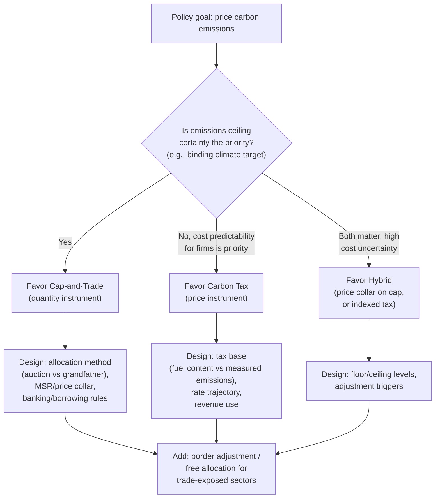

## Carbon Pricing Mechanisms


### Overview

Carbon pricing mechanisms are the family of policy instruments that place an explicit price on greenhouse gas emissions (predominantly $CO_2$, often expressed as $CO_2$-equivalent to capture other gases like methane on a common scale). This item synthesizes and compares the specific instruments — carbon taxes, cap-and-trade systems, and hybrid/complementary mechanisms — as a unified policy toolkit, building on the theory covered separately under Pigouvian taxation, tradable permits, and optimal environmental taxation.

### Taxonomy of Carbon Pricing Instruments

**Direct carbon taxes**

A per-unit tax levied on the carbon content of fuel or on measured emissions directly, set (in principle) at or near the marginal external damage of carbon (the social cost of carbon). Administratively simple where fuel carbon content is a reliable, verifiable proxy for combustion emissions.

**Cap-and-trade / Emissions Trading Systems (ETS)**

A quantity-based mechanism: the regulator fixes total allowable emissions and allocates/auctions tradable allowances, letting the market determine the price. Covered in depth as a standalone instrument; here it is treated as one node in the broader carbon-pricing toolkit alongside taxes and hybrids.

**Hybrid instruments**

Systems combining features of both:

- **Tax-and-cap hybrids**: a cap-and-trade system with a price floor (minimum auction reserve) and/or price ceiling (cost containment reserve), bounding price volatility while retaining quantity certainty within the band.
- **Carbon tax with emissions-linked rate adjustment**: a tax whose rate automatically rises or falls based on whether observed emissions are on track relative to a target trajectory, borrowing quantity-based feedback into a price instrument.

**Implicit/indirect carbon pricing**

Policies that price carbon indirectly rather than as an explicit standalone instrument:

- Removal of fossil fuel subsidies (raises the effective price of carbon-intensive energy toward its true cost)
- Fuel excise taxes not explicitly labeled as carbon taxes but functioning similarly
- Regulatory standards with an implicit shadow price (e.g., fuel economy standards), which the OECD and IMF include in broader "effective carbon price" accounting even though no explicit per-ton price is set

### Instrument Comparison Framework

| Dimension | Carbon Tax | Cap-and-Trade | Hybrid (Price Collar) |
| --- | --- | --- | --- |
| Certainty | Price certain, quantity uncertain | Quantity certain, price uncertain | Price bounded within a range; quantity bounded within implied range |
| Revenue | Direct, predictable | Depends on auction share (zero if fully grandfathered) | Depends on design |
| Administrative complexity | Lower (especially upstream fuel-based tax) | Higher (registry, monitoring, trading infrastructure, market oversight) | Highest (combines both sets of requirements) |
| Response to demand shocks | Emissions fall with tax fixed; no automatic price response | Price crashes in downturns (observed in early EU ETS) unless stabilized | Price floor prevents crash; ceiling prevents spikes |
| International linkage | Requires rate harmonization to link (harder) | Can link allowance markets directly (as with California-Quebec) | Depends on hybrid design |
| Best suited when (Weitzman logic) | Marginal damage curve relatively flat | Marginal damage curve relatively steep / thresholds matter | Damage curve moderately steep but cost uncertainty also high |

### The Social Cost of Carbon (SCC) as the Benchmark

Carbon pricing theory nominally targets the social cost of carbon — the present value of all future damages from emitting one additional ton of $CO_2$ today — as the efficient price level, following standard Pigouvian logic ($t^* = MEC$):

$$SCC = \sum_{t=0}^{T} \frac{D_t}{(1+r)^t}$$

where $D_t$ is the marginal damage in year $t$ attributable to the marginal ton, discounted at rate $r$.

**Why SCC estimates vary widely**

- **Discount rate sensitivity**: because carbon damages are realized over centuries, the choice of $r$ dramatically affects present-value estimates (the Stern Review's low discount rate versus Nordhaus's higher rate is the canonical illustration of this divide, producing SCC estimates that differ by an order of magnitude).
- **Damage function uncertainty**: catastrophic/tail-risk damages (tipping points, irreversible climate feedbacks) are difficult to quantify and are treated inconsistently across integrated assessment models (IAMs).
- **Equity weighting**: whether damages to low-income/future populations are weighted equally to damages avoided by (generally wealthier, present-day) emitters is a value judgment embedded in different models' results.

[Unverified: specific numerical SCC estimates change with each government/model update and are actively revised — treat any single cited dollar figure as time- and model-specific rather than a stable constant.]

### Real-World Landscape (Synthesized Overview)

**Coverage patterns**

As of recent tracking by bodies such as the World Bank's Carbon Pricing Dashboard, explicit carbon pricing instruments (taxes and ETSs combined) cover a substantial and growing, but still minority, share of global GHG emissions, with wide variation in price levels across jurisdictions — from a few dollars per ton in some developing-economy schemes to over $100/ton in the highest-priced European schemes. [Unverified: precise current coverage percentage and price levels change frequently; consult current World Bank/IMF trackers for up-to-date figures rather than treating any cited number here as current.]

**Common design pattern across systems**

Regardless of instrument choice, most implemented systems combine:

1. A **core pricing mechanism** (tax or cap)
2. **Revenue recycling** provisions (dividends, tax cuts, green investment)
3. **Competitiveness protections** for trade-exposed, emissions-intensive industries (free allocation, border adjustments, or exemptions)
4. **Complementary regulatory policy** (efficiency standards, renewable mandates) layered alongside the price instrument — which, per the "waterbed effect" discussed under tradable permits, can be redundant or counterproductive when layered on top of a binding cap, but can be genuinely additive when layered on top of a tax (since a tax does not fix the aggregate quantity the way a cap does).

### Political Economy Considerations

**Visibility and salience**

An explicit carbon tax is more transparent (and thus more politically salient/contestable) than an equivalent price emerging from a cap-and-trade system, which some argue makes taxes harder to enact but more durable once passed, while cap-and-trade's price opacity can ease initial passage but invite criticism once price volatility becomes visible to the public. [Inference: this is a commonly cited political-economy argument in the literature, not an empirically settled causal claim about legislative durability.]

**Border competitiveness and carbon leakage**

As discussed under optimal environmental taxation, any unilateral carbon price risks shifting production (and its emissions) to unpriced jurisdictions. This has driven growing interest in carbon border adjustment mechanisms (CBAMs), which impose an import charge (or export rebate) based on embedded carbon content, intended to equalize incentives between domestic and foreign producers without requiring global price harmonization.

### Diagram: Carbon Pricing Instrument Decision Tree





```
### Related Topics
- Tradable permits and cap-and-trade systems (instrument deep-dive)
- Optimal environmental taxation (theory of second-best rate-setting)
- Social cost of carbon estimation and integrated assessment models
- Carbon border adjustment mechanisms (CBAM)
- Fossil fuel subsidy reform
- Revenue recycling and the double dividend hypothesis
- International climate agreements and carbon market linkage
- Discounting and intergenerational equity in climate policy


```