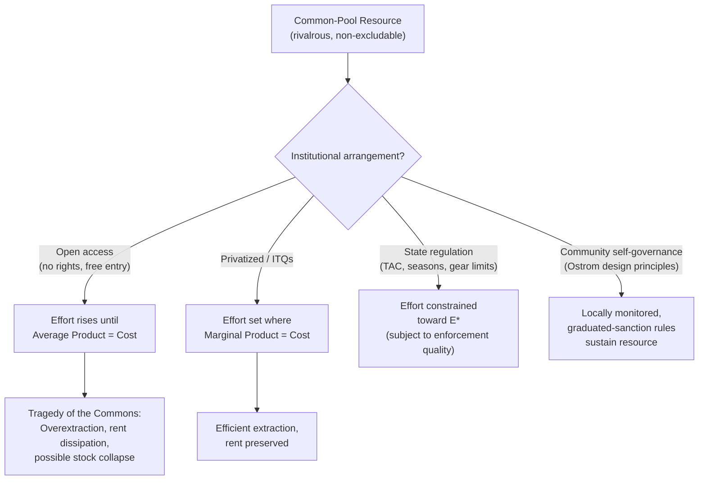

## Common-Pool Resources and the Tragedy of the Commons


### Overview

Common-pool resources (CPRs) are goods characterized by high subtractability/rivalry (one agent's use depletes what's available to others) but low excludability (it is costly or impossible to prevent access). This combination generates a distinct category of market failure — the "tragedy of the commons" — analytically related to but conceptually separate from standard externality problems, and central to natural resource public finance (fisheries, groundwater, grazing land, forests, and atmospheric sinks).

### The Goods Classification Framework

Economists classify goods along two dimensions: excludability and rivalry (subtractability).

|  | Excludable | Non-excludable |
| --- | --- | --- |
| **Rivalrous** | Private goods (food, clothing) | **Common-pool resources** (fisheries, aquifers, grazing land) |
| **Non-rivalrous** | Club goods (cable TV, toll roads under capacity) | Public goods (national defense, clean air quality) |

Common-pool resources sit in the "hard" quadrant: because they are rivalrous, one user's extraction genuinely reduces the stock available to others (like a private good); but because they are non-excludable, no one can be costlessly prevented from extracting (like a public good). This dual nature is precisely what generates the tragedy.

### Theoretical Foundation

**Garrett Hardin's formulation (1968)**

Hardin's essay "The Tragedy of the Commons" popularized the problem using the metaphor of a shared pasture: each herder, deciding whether to add one more animal, receives the full private benefit of that animal but bears only a fraction of the cost (pasture degradation), since that cost is spread across all herders. Rational individual optimization therefore leads every herder to keep adding animals, and the pasture is overgrazed — the aggregate outcome is worse for all than a coordinated, restrained outcome would have been.

**Formal open-access equilibrium**

Consider a resource with stock $S$, where extraction effort $E$ generates yield $Y(E, S)$ and each unit of effort costs $c$. Under **open access** (no property rights, free entry), individuals enter until private average product equals cost:

$$\frac{Y(E,S)}{E} = c$$

This differs sharply from the **socially optimal** level of effort, which maximizes total economic rent by equating *marginal* product to cost:

$$\frac{\partial Y(E,S)}{\partial E} = c$$

Because average product exceeds marginal product for typical (concave) yield functions, open-access equilibrium effort $E_{OA}$ exceeds the efficient level $E^*$ — the resource is systematically overexploited, and all economic rent (the surplus that would exist under efficient management) is dissipated through excessive entry. This is the classic **rent dissipation** result of bioeconomic/fisheries models (Gordon-Schaefer model).

**Relationship to standard externality theory**

The tragedy of the commons is a specific case of a negative externality: each user's extraction imposes a cost on other current and future users (reduced stock, lower catch-per-effort for everyone) that is not reflected in the individual's private decision. The wedge is:

$$SMC(E) = PMC(E) + \underbrace{\text{stock externality}}_{\text{cost to other/future users from reduced } S}$$

Unlike static pollution externalities, the commons problem is inherently **dynamic** — current extraction affects the future stock available, so the externality operates across time as well as across users, linking this topic to resource economics (optimal extraction paths, the Hotelling rule for exhaustible resources being a related but distinct framework for non-renewable resources).

### Solutions to the Commons Problem

**1. Privatization / assignment of property rights**

Converting the CPR into a private good by assigning exclusive property rights (e.g., individual transferable quotas in fisheries) internalizes the externality: the rights-holder now bears the full future cost of current overextraction, restoring incentive alignment with the social optimum. This is the standard Coasean-style solution when it is administratively feasible to define and enforce rights.

**2. Government regulation**

Where privatization is impractical (e.g., the resource is not easily divided into parcels, or equity concerns argue against exclusive private rights), direct regulation can substitute:

- **Input controls**: limits on effort (number of fishing vessels, permitted grazing days)
- **Output controls**: total allowable catch (TAC) limits, harvest quotas
- **Technology restrictions**: gear restrictions, closed seasons, minimum size limits

**3. Tradable quotas (a hybrid market-based approach)**

Individual Transferable Quotas (ITQs) apply the cap-and-trade logic to CPRs: a regulator sets an aggregate sustainable harvest level and allocates/auctions tradable shares, allowing quota to flow to the most efficient users while capping aggregate extraction — directly analogous to tradable emissions permits, with the "cap" here being a sustainable yield rather than an emissions ceiling.

**4. Ostrom's polycentric/community governance solutions**

Elinor Ostrom's empirical work (leading to her 2009 Nobel Memorial Prize in Economic Sciences) documented that neither pure privatization nor centralized state regulation is a universal necessity: many communities have historically self-organized sustainable CPR governance through locally crafted rules, monitoring, and graduated sanctions, without formal external property rights or top-down regulation. Ostrom's **design principles** for durable CPR institutions include (synthesized list, not exhaustive):

- Clearly defined boundaries (who is a legitimate resource user)
- Rules matching local conditions (congruence between rules and local ecology/needs)
- Collective-choice arrangements (users can participate in modifying rules)
- Monitoring (by the users themselves or accountable to them)
- Graduated sanctions for rule violations
- Accessible conflict-resolution mechanisms
- Recognition of the community's right to self-organize (by external authorities)
- Nested enterprises for resources that are part of larger systems

This body of work is significant in public economics because it demonstrates that the tragedy of the commons is not an inevitable outcome of CPR structure, but a *predicted outcome of open access specifically* — and open access is only one of several possible institutional arrangements.

### Diagram: Open Access vs. Efficient Extraction





```
### Worked Example: Gordon-Schaefer Fishery Model

Let the biological growth function be logistic: $G(S) = rS\left(1 - \frac{S}{K}\right)$, where $r$ is the intrinsic growth rate and $K$ is carrying capacity. Suppose yield is $Y(E,S) = qES$ (catchability coefficient $q$), and effort cost is $c$ per unit.

**Open-access steady state**: entry continues until total revenue equals total cost, i.e., $pY = cE$ where $p$ is price, giving:
$$S_{OA} = \frac{c}{pq}$$
independent of effort directly — the open-access equilibrium stock is determined purely by the cost-price-catchability ratio, and effort adjusts (via free entry) until the stock is driven down to this level. As $c$ falls or $p$ rises (e.g., improved technology or higher fish prices), $S_{OA}$ falls further, predicting *worse* depletion — the counterintuitive result that improving fishing technology or profitability, without accompanying rights-based reform, tends to worsen resource depletion rather than improve fleet welfare, since rents are dissipated by entry rather than captured.

**Maximum Sustainable Yield (MSY) benchmark**: $S_{MSY} = K/2$, the stock level that maximizes $G(S)$.

**Efficient (rent-maximizing) steady state**: generally $S^* > S_{MSY}$ once cost is properly accounted for (the "golden rule" bioeconomic optimum lies above pure MSY, because harvesting at MSY ignores that a larger standing stock reduces the cost per unit caught) — the strict ranking is $S_{OA} < S_{MSY} < S^*$ under standard parameter conditions [Inference: this ordering holds under the conventional Gordon-Schaefer assumptions and standard cost/price parameters; it is a standard textbook result, not a claim that holds for every real-world fishery's estimated parameters].

### Related Topics
- Tradable permits and cap-and-trade systems (ITQ mechanism parallel)
- Public goods theory and the free-rider problem (contrast with CPRs)
- Hotelling's rule and optimal extraction of exhaustible resources
- Elinor Ostrom's design principles for commons governance
- Fisheries economics and the Gordon-Schaefer model
- Property rights theory and the Coase Theorem
- Groundwater and aquifer management policy
- Intergenerational equity in renewable resource management


```