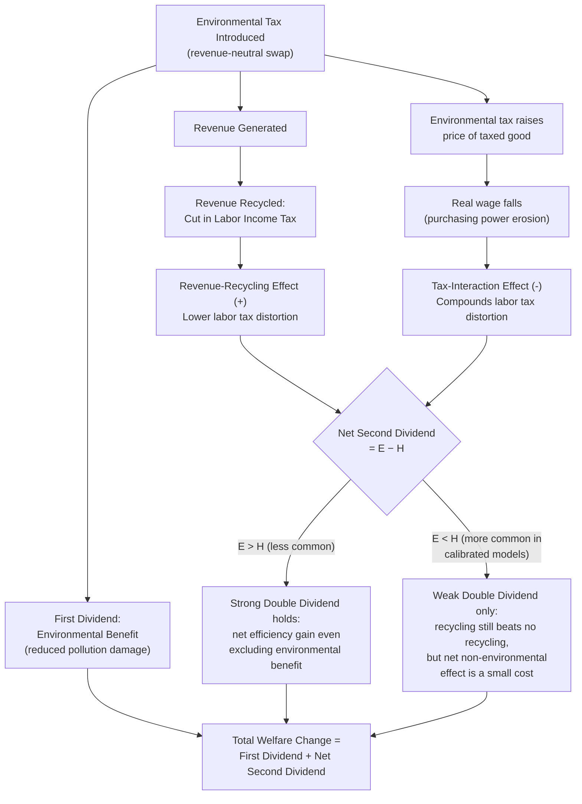

## Double Dividend Hypothesis

### Overview

The double dividend hypothesis proposes that revenue-neutral environmental tax reforms — using revenue from a new or increased environmental tax to reduce existing distortionary taxes (typically labor income taxes) — can deliver two distinct welfare gains simultaneously: an environmental benefit from reduced pollution (the "first dividend") and an efficiency benefit from a less distortionary overall tax system (the "second dividend"). This item treats the hypothesis itself in depth, building on and formalizing the discussion introduced under optimal environmental taxation.

### Origins and Motivation

The hypothesis emerged prominently in the environmental economics literature of the early-to-mid 1990s as a response to a political-economy problem: environmental taxes (like carbon taxes) are often unpopular in isolation because their costs are visible and concentrated while their benefits are diffuse. Framing an environmental tax as part of a revenue-neutral "tax swap" — explicitly recycling revenue into cuts to existing taxes — was intended to broaden political support by pairing the environmental gain with a tangible economic efficiency gain, rather than presenting the tax as a pure net cost.

### Formal Decomposition

**The two dividends defined**

- **First dividend**: the standard Pigouvian welfare gain from moving pollution closer to its efficient level (reduced environmental damage minus abatement cost).
- **Second dividend**: an *additional* efficiency gain in the non-environmental part of the economy, arising because environmental tax revenue displaces revenue that would otherwise have been raised via more distortionary means (e.g., a labor income tax that discourages work effort).

**Strong vs. weak form**

- **Weak form**: recycling environmental tax revenue into cuts to distortionary taxes is welfare-superior to an equal-yield policy that returns revenue lump-sum (e.g., a flat rebate check) or fails to recycle it (e.g., pure deficit reduction with no offsetting cut). This form is well-supported theoretically and largely uncontested: since distortionary taxes carry a marginal excess burden, using new revenue to reduce them is generically better than not doing so, all else equal.
- **Strong form**: an environmental tax swap generates a net efficiency gain (excluding the environmental benefit) relative to the pre-reform tax system — i.e., the tax system as a whole becomes more efficient even setting aside any environmental improvement. This form is *not* generally true and depends on specific structural features of the economy, as formalized below.

### The Tax Interaction Effect (Goulder, 1995 and related literature)

**Mechanism**

An environmental tax raises the price of the taxed good (e.g., energy). If that good is a significant component of the consumption basket, the tax reduces real (purchasing-power-adjusted) wages, since a given nominal wage now buys less. This has the same qualitative effect on labor supply as raising the labor income tax directly — it discourages work at the margin. Because the pre-existing labor tax already creates a distortion (a gap between the value of an hour worked and the value of an hour of leisure), any *additional* erosion of real wages from the environmental tax **compounds** this existing distortion rather than being a neutral, isolated cost.

**Decomposition of net welfare effect**

$$\Delta W = \underbrace{\text{Revenue-Recycling Effect}}_{(+)} - \underbrace{\text{Tax-Interaction Effect}}_{(-)} + \underbrace{\text{Environmental Benefit}}_{(+), \text{ first dividend, separate}}$$

- The **revenue-recycling effect** captures the efficiency gain from using the new revenue to lower the marginal rate of the pre-existing distortionary tax (a smaller labor tax wedge).
- The **tax-interaction effect** captures the efficiency loss from the environmental tax's indirect erosion of the labor tax base (via the real-wage channel described above).

**Key finding**: in most calibrated general equilibrium models, the tax-interaction effect is of the same order of magnitude as the revenue-recycling effect, and frequently **outweighs** it — meaning the strong double dividend often fails to hold, and the non-environmental part of the tax swap is a net efficiency *cost*, not a gain, even though it is still smaller than the cost of *not* recycling the revenue at all (which is what keeps the weak form true).

### Implication for Optimal Tax-Setting

Because of the tax-interaction effect, the second-best optimal environmental tax rate in an economy with pre-existing distortionary labor taxation is generally set **below** the simple first-best Pigouvian rate $t = MEC(Q^*)$:

$$t^{\text{second-best}} < t^{\text{first-best}} = MEC(Q^*)$$

This is because pushing the environmental tax up to fully internalize $MEC$ would, at the margin, impose a tax-interaction cost on the labor market that isn't compensated for by additional environmental benefit at that margin — the environmental tax is not evaluated in isolation but as one lever in an interconnected tax system. [Inference: this ranking is the standard result under the common assumption that the environmental good is a weak substitute/complement structure typical in these models; specific alternative preference structures in the literature can attenuate or, in some specifications, reverse this ranking, so it should be understood as the dominant textbook finding rather than an unconditional theorem.]

### Conditions That Favor a Strong Double Dividend

The theoretical literature has identified some circumstances under which the strong form is more likely to hold, or the tax-interaction effect is smaller:

- **Pre-existing tax system is especially inefficient** (very high marginal excess burden), so even modest recycling generates large gains
- **The environmental tax base and the labor tax base overlap less** (the taxed good is a smaller share of the typical consumption basket, weakening the real-wage transmission channel)
- **Revenue is recycled into cutting the *most* distortionary tax available**, rather than an average or arbitrary tax cut
- **Pre-existing environmentally-harmful subsidies are removed simultaneously** (removing a fossil fuel subsidy alongside imposing a carbon tax can generate large efficiency gains independent of the interaction effect, since subsidy removal is close to a pure efficiency gain)

### Diagram: Double Dividend Decomposition





```
### Worked Example

Suppose a carbon tax generates \$100 billion in annual revenue. Two policy designs are compared:

**Design A (lump-sum rebate)**: revenue returned as equal per-capita checks, with no change to existing tax rates.
**Design B (tax swap)**: revenue used to reduce the labor income tax rate, lowering the marginal tax wedge on labor.

Under the **weak double dividend** result, Design B is unambiguously more efficient than Design A for the non-environmental portion of the reform, since Design B reduces a pre-existing distortion (the labor tax wedge) while Design A does not touch it — a straightforward application of the standard result that distortionary taxes should be reduced when new lump-sum-equivalent revenue becomes available, all else equal.

However, whether Design B alone produces a *net efficiency gain* relative to the pre-reform baseline (the strong form) depends on comparing its revenue-recycling effect against the tax-interaction effect generated by the carbon tax's own price impact on energy-intensive consumption, which — per the modeling literature summarized above — is not guaranteed and in many calibrations modestly favors "no": the swap is efficiency-improving *relative to not recycling*, but the environmental tax portion of the reform, evaluated on its own non-environmental merits, is more often found to be a small net cost that the environmental benefit (first dividend) must be weighed against, rather than a free additional efficiency gain. [Inference: illustrative framing of the finding; actual net sign depends on model calibration, country-specific tax structure, and the good's weight in the consumption basket.]

### Related Topics
- Optimal environmental taxation (parent theoretical framework)
- Carbon pricing mechanisms (applied instrument context)
- Marginal cost of public funds and marginal excess burden
- Tax incidence and the labor supply distortion
- Revenue recycling design (lump-sum vs. distortionary tax cuts)
- Fossil fuel subsidy reform
- General equilibrium tax modeling (CGE approaches)


```