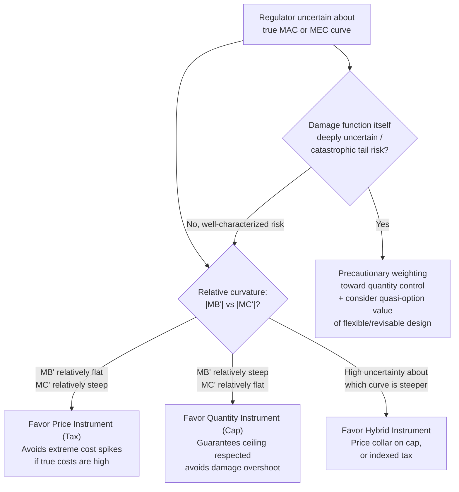

## Environmental Regulation under Uncertainty


### Overview

Environmental regulation under uncertainty studies how the choice and design of policy instruments should change when the regulator does not know, with certainty, key parameters such as firms' abatement costs, the true magnitude of environmental damages, or the shape of the relevant cost/benefit functions. This body of theory extends the deterministic Pigouvian framework (which assumes the regulator can observe $MEC$ and $MAC$ precisely) into a more realistic setting, and provides the formal foundation for instrument-choice discussions raised elsewhere in this chapter (tradable permits vs. taxes, optimal environmental tax design).

### The Core Problem: Instrument Choice under Cost Uncertainty

**Setup**

Suppose the regulator wants to induce an efficient level of abatement but does not know firms' true marginal abatement cost (MAC) curve with certainty — only its expected value, with some variance around it. Two canonical instruments are available:

- **Price instrument (tax)**: fix the tax rate $t$; firms abate until $MAC = t$; the resulting *quantity* of abatement is uncertain (depends on the realized MAC curve).
- **Quantity instrument (cap/permits)**: fix the total abatement/emissions quantity $\bar Q$; the resulting *price* (permit price/effective marginal cost) is uncertain.

Under certainty, both instruments can be calibrated to produce the identical efficient outcome. Under uncertainty, they generically produce **different** expected welfare outcomes, because an error in the regulator's assumed cost curve translates differently into welfare loss depending on which variable (price or quantity) is held fixed.

### Weitzman's "Prices vs. Quantities" (1974)

**The central result**

Weitzman formalized the comparison by examining the welfare loss from a given-sized error in the regulator's estimate of the marginal cost curve, under each instrument. The key determinant of which instrument performs better is the **relative slope (curvature)** of the marginal benefit (avoided damage) curve versus the marginal cost (abatement cost) curve around the efficient point.

**Intuition**

- If marginal abatement costs rise **steeply** as the true, unknown cost curve deviates from what the regulator assumed (i.e., firms' actual costs are very sensitive to the exact quantity target), then a **quantity instrument** (fixed cap) risks imposing very large, unanticipated costs on firms if their true costs turn out higher than expected — a fixed cap doesn't adjust. A **price instrument** is more forgiving here: firms simply abate less if costs are higher than expected, at the fixed tax rate, avoiding the extreme cost spike.
- If marginal damages rise **steeply** with quantity deviations (e.g., near an ecological threshold, where a small quantity overshoot causes disproportionate harm), then a **quantity instrument** is preferred, because it guarantees the emissions ceiling is respected regardless of cost realizations, whereas a price instrument leaves the *quantity* of emissions uncertain and could allow a damaging overshoot if costs turn out lower than expected (making abatement cheap and firms emit more at the fixed tax rate than predicted).

**Formal condition**

Denote the second derivatives (curvature) of marginal benefit and marginal cost functions as $MB'$ and $MC'$ (both typically negative for standard downward-sloping curves, so comparison is of magnitudes):

$$\text{Prefer price instrument (tax) if: } |MB'| < |MC'|$$


$$\text{Prefer quantity instrument (cap) if: } |MB'| > |MC'|$$

Equivalently: **relatively flat marginal damage, relatively steep marginal cost → favor taxes**; **relatively steep marginal damage, relatively flat marginal cost → favor quantities**.

**Applied implications**

- Most **local, diffuse, gradually-worsening pollutants** (many conventional air pollutants at typical ambient levels) tend to have relatively flat damage curves over the relevant range, favoring price instruments.
- Pollutants associated with **sharp ecological thresholds or irreversible tipping points** (certain toxic accumulation limits, some climate tipping-point arguments for greenhouse gases) favor quantity instruments, since exceeding the threshold carries disproportionate cost.
- [Inference: the specific classification of real-world pollutants into "flat" vs. "steep" damage categories is a matter of applied empirical judgment and is contested for many pollutants, including greenhouse gases — reasonable economists have argued both sides of the tax-vs-cap debate for carbon specifically, drawing on this same framework with different empirical assumptions about damage curvature.]

### Extensions to the Basic Weitzman Framework

**Correlated uncertainty**

If cost uncertainty is correlated with *benefit* uncertainty (e.g., a technology shock that both lowers abatement costs and reduces environmental benefits simultaneously, as can occur with macroeconomic shocks affecting both production and pollution jointly), the simple Weitzman ranking can be modified — this extension (associated with subsequent work building on Weitzman) shows that correlation between cost and benefit shocks can favor whichever instrument is more responsive to the shared underlying shock.

**Hybrid instruments as a response to uncertainty**

Because the choice between pure price and pure quantity instruments involves a real welfare trade-off under uncertainty, actual policy design frequently uses **hybrid instruments** to capture the benefits of both:

- **Price ceiling on a cap-and-trade system** (a "cost containment reserve" or "safety valve"): releases additional permits if the market price exceeds a threshold, capping the *cost* firms bear while preserving quantity control below that threshold — effectively converting the system into a tax above the ceiling price.
- **Price floor on a cap-and-trade system**: a minimum auction reserve price, preventing the price (and thus the incentive to abate) from collapsing during demand shocks.
- **Indexed/adjustable taxes**: a tax rate that adjusts based on observed emissions relative to a target trajectory, importing some quantity-responsiveness into a price instrument.

These hybrids are a direct practical response to the Weitzman insight: pure instruments are optimal only in the (rare) case where the regulator is confident about which curve is steeper; hybrids hedge against being wrong.

### Uncertainty about Damages (Beyond Cost Uncertainty)

**Deep uncertainty and irreversibility**

Beyond parameter uncertainty within a known model, some environmental problems (notably climate change) involve **deep uncertainty** — genuine unknown-unknowns about the shape of the damage function itself, including possible catastrophic, low-probability, high-impact outcomes (fat-tailed risk). This has motivated:

- **Precautionary approaches**: skewing policy toward quantity/cap-based caution when the downside risk of underestimating damages is severe and irreversible (an application of option-value reasoning under irreversibility, related to the broader real-options literature)
- **Weitzman's own later "Dismal Theorem" work on climate**: arguing that under sufficiently fat-tailed catastrophic risk and standard expected-utility assumptions, willingness to pay to avoid catastrophic outcomes can become very large or even unbounded, complicating standard cost-benefit calibration of optimal policy — this is a distinct and more provocative claim than the original 1974 prices-vs-quantities result, and remains debated in the literature regarding its practical policy implications. [Unverified: the Dismal Theorem's applicability and the appropriate policy response to it remains an active area of disagreement among economists, not a settled consensus result.]

**Learning and quasi-option value**

When uncertainty is expected to resolve over time (e.g., future scientific research will clarify damage estimates), there is a further consideration: policies that preserve flexibility to adjust once more information arrives have an additional "quasi-option value" relative to policies that lock in an irreversible commitment now. This favors, all else equal, regulatory designs that can be revised (e.g., periodic reauthorization, adjustable caps) over rigid long-term commitments, when the cost of a wrong initial guess is asymmetric or irreversible.

### Diagram: Instrument Choice under Uncertainty





```
### Worked Example

Let marginal abatement cost be $MAC(a) = 10a$ (steep) and marginal damage be $MD(a) = 2(A_{max} - a)$ where $A_{max}$ is uncontrolled emissions (relatively flat damage curve, since $MD$ changes slowly, slope magnitude 2, relative to $MAC$'s slope magnitude 10).

Applying Weitzman's criterion: $|MB'| = 2 < |MC'| = 10$, so a **price instrument (tax)** is preferred. Intuition confirmed: because damages barely change with moderate deviations in abatement quantity, but abatement costs are highly sensitive to hitting an exact quantity target, it is safer to fix the price (accepting some quantity variation) than to fix the quantity (risking a large, unanticipated cost spike on firms if the true cost curve is steeper than the regulator assumed when setting the cap).

Now suppose instead $MD(a) = 50(A_{max} - a)^2$ near the relevant range — damages accelerate sharply as abatement falls short. Here the ranking flips: a small shortfall in abatement (quantity overshoot in emissions) produces a large, disproportionate spike in damages, so a **quantity instrument (cap)** that guarantees the abatement floor is preferred, even though it exposes firms to potentially high and uncertain marginal costs.

### Related Topics
- Tradable permits and cap-and-trade systems (quantity instrument foundation)
- Optimal environmental taxation (price instrument foundation)
- Carbon pricing mechanisms (applied instrument comparison)
- Real options theory and irreversibility in environmental decision-making
- The precautionary principle in environmental policy
- Climate change economics and catastrophic risk (Dismal Theorem debate)
- Integrated assessment models and deep uncertainty


```