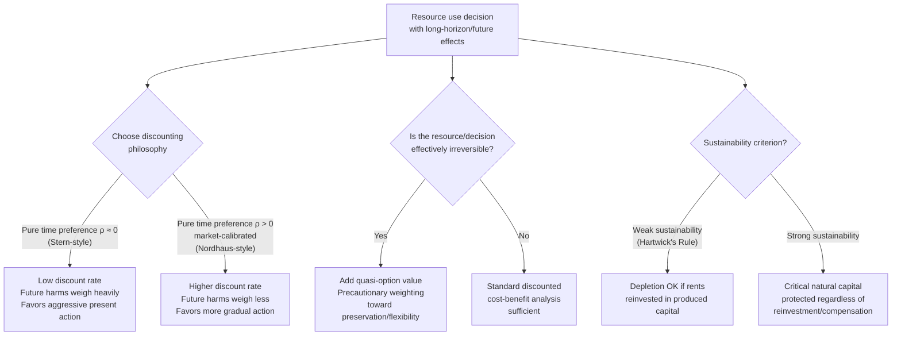

## Intergenerational Equity in Resource Use


### Overview

Intergenerational equity concerns how the benefits and costs of resource use and environmental policy should be distributed between present and future generations. It sits at the intersection of welfare economics, ethics, and natural resource public finance, and directly shapes practical policy parameters — most importantly the choice of discount rate — used throughout environmental cost-benefit analysis, exhaustible resource extraction, and climate policy.

### Theoretical Foundations

**Why intergenerational equity is a distinct problem**

Standard welfare economics evaluates policy using the preferences and resources of *currently living* agents, who can bargain, vote, and enter contracts. Future generations cannot participate in current markets or political processes: they cannot bid for resources, vote on policy, or negotiate compensation for harms imposed on them. This is a form of market failure distinct from standard externalities — sometimes termed a "missing markets" problem across time — because no price signal from the future can discipline present resource use, even in principle.

**Sustainability criteria**

Several formal criteria have been proposed for what constitutes fair treatment of future generations in resource allocation:

- **Hartwick's Rule**: for an economy exploiting an exhaustible resource, if the rents (profits) from resource extraction are fully reinvested in reproducible capital (rather than consumed), consumption can be maintained at a constant level indefinitely — providing a formal condition under which "weak sustainability" (substitutability between natural and produced capital) is achievable.
- **Weak vs. strong sustainability**: weak sustainability holds that what matters is maintaining the *total* capital stock (natural + produced + human capital combined), implying natural capital can in principle be substituted by produced capital (e.g., depleting a fishery is acceptable if the proceeds fund infrastructure or education of equivalent value). Strong sustainability holds that certain forms of natural capital (critical ecosystems, biodiversity, stable climate) are not substitutable by produced capital at all, or only within strict limits, because they provide unique life-support functions or possess irreversible/option value.
- **Rawlsian maximin applied intertemporally**: an alternative criterion drawing on Rawls's difference principle, evaluating policies by their effect on the worst-off generation, rather than an aggregate (utilitarian) welfare sum across generations — this criterion tends to weight badly against front-loaded resource depletion that leaves later generations worse off, regardless of aggregate gains to earlier generations.

### The Discount Rate Debate

**Why discounting is central to intergenerational equity**

Because environmental and resource costs/benefits are often realized over long, even multi-century, time horizons (climate damages, nuclear waste, biodiversity loss), the discount rate applied in present-value calculations has an outsized effect on policy conclusions — a higher discount rate systematically diminishes the calculated importance of harms to future generations, often decisively.

**Decomposition of the discount rate (Ramsey formula)**

The standard Ramsey discounting framework decomposes the social discount rate $r$ into:

$$r = \rho + \eta \cdot g$$

where $\rho$ is the **pure rate of time preference** (a preference for earlier over later utility, independent of consumption growth — sometimes argued to represent nothing more than impatience or the probability of civilizational extinction), $\eta$ is the elasticity of marginal utility of consumption (how much a one-unit change in consumption is valued more or less if you're poorer/richer), and $g$ is the expected growth rate of per-capita consumption.

**The Stern-Nordhaus discount rate divide**

This formula became the center of a well-known public dispute in climate economics:

- The **Stern Review** (2006) used a very low $\rho$ (near zero, reflecting an ethical position that pure time preference — discounting future people's welfare simply because they are born later — is not ethically defensible), producing a low overall discount rate and, correspondingly, much larger calculated present-value damages from climate change, justifying more aggressive near-term mitigation.
- **William Nordhaus**'s modeling used a higher $\rho$, closer to rates implied by observed market interest rates and revealed savings behavior, producing a substantially higher discount rate and correspondingly more modest near-term mitigation recommendations.

This divide illustrates that the discount rate debate is not purely a technical/empirical dispute but partly an **ethical disagreement**: whether $\rho > 0$ (discounting future people's welfare purely because of when they are born) is a legitimate ethical stance or an unjustified form of "pure time discrimination" against future generations is a normative question, not one resolvable by observing market data alone (though observed market rates are sometimes invoked as evidence of society's revealed preference regarding $\rho$, a move that is itself contested since market rates reflect the preferences and constraints of *currently living* agents, not a genuine intergenerational bargain).

### Property Rights and Resource Depletion across Generations

**The Hotelling framework's intergenerational dimension**

The Hotelling Rule for exhaustible resource extraction (efficient price of an exhaustible resource rises at the rate of interest) implicitly embeds an intergenerational allocation, since it determines *how much* of a finite resource stock is consumed now versus reserved for the future. The rate of interest used in this framework is precisely the discount rate whose ethical foundations are contested above — meaning the "efficient" extraction path under Hotelling is only as ethically justified as the discount rate feeding into it.

**Irreversibility and option value**

Some resource depletion decisions are effectively irreversible on any policy-relevant timescale (species extinction, certain ecosystem collapse, exhaustion of a unique geological formation). Because future generations cannot be compensated for the loss of an option they never had the chance to exercise, irreversible depletion decisions carry an additional **quasi-option value** — the value of preserving the ability to make a different (possibly better-informed) decision later — which standard discounted cost-benefit analysis can understate if it ignores the asymmetry between reversible and irreversible outcomes.

### Contrast: Utilitarian vs. Rights-Based Framings

| Framing | Core Idea | Implication for Resource Policy |
| --- | --- | --- |
| **Discounted utilitarianism** | Maximize the discounted sum of utility across all generations | Justifies some discounting of future welfare; policy conclusions highly sensitive to $\rho$ |
| **Rawlsian maximin (intertemporal)** | Maximize the welfare of the worst-off generation | Strongly disfavors depleting resources in ways that leave future generations categorically worse off |
| **Strong sustainability / rights-based** | Future generations have a claim to a certain minimum stock of critical natural capital, not fungible with compensation | Sets hard constraints on depletion of certain resources regardless of aggregate cost-benefit calculus |
| **Hartwick/weak sustainability** | Maintain aggregate capital (natural + produced), substitution permitted | Permits resource depletion if proceeds are reinvested productively |

### Diagram: Intergenerational Equity Decision Framework





```
### Worked Example: Hartwick's Rule Applied

Consider an economy extracting a non-renewable resource generating rent (price minus marginal extraction cost) of $R_t$ per period. Hartwick's Rule states that if the economy invests exactly $R_t$ each period into produced capital $K$ (rather than consuming it), per-capita consumption can be held constant indefinitely, even as the resource stock declines toward exhaustion:

$$\dot{K}_t = R_t \quad \Rightarrow \quad \dot{C}_t = 0$$

**Numerical illustration**: suppose a country extracts a mineral generating $10 billion in annual rent, declining over 50 years as the resource depletes. Under a strict Hartwick policy, the full \$10 billion (adjusted each year to the then-current rent) is invested in infrastructure, education, or other produced/human capital rather than spent on current consumption. If followed precisely, national consumption net of investment remains constant, offering one operational (though contested) benchmark for "fair" treatment of future generations in resource-rich economies — the underlying logic behind sovereign wealth funds in resource-exporting economies (e.g., Norway's Government Pension Fund model), which explicitly attempts to convert finite resource rents into a perpetual income stream for future generations rather than one-time current consumption. [Inference: Hartwick's Rule is a normative benchmark and stylized theoretical result; real-world sovereign wealth fund policies approximate rather than strictly implement it, and its adequacy as a full ethical standard for intergenerational fairness remains debated, particularly for resources with no substitute (strong sustainability critique).]

### Related Topics
- Hotelling's Rule and optimal extraction of exhaustible resources
- Common-pool resources and the tragedy of the commons
- Social cost of carbon and discounting in climate policy
- Sovereign wealth funds and resource rent management
- Rawlsian justice and the maximin criterion
- Real options theory and irreversibility
- Environmental regulation under uncertainty (related treatment of deep/catastrophic uncertainty)


```