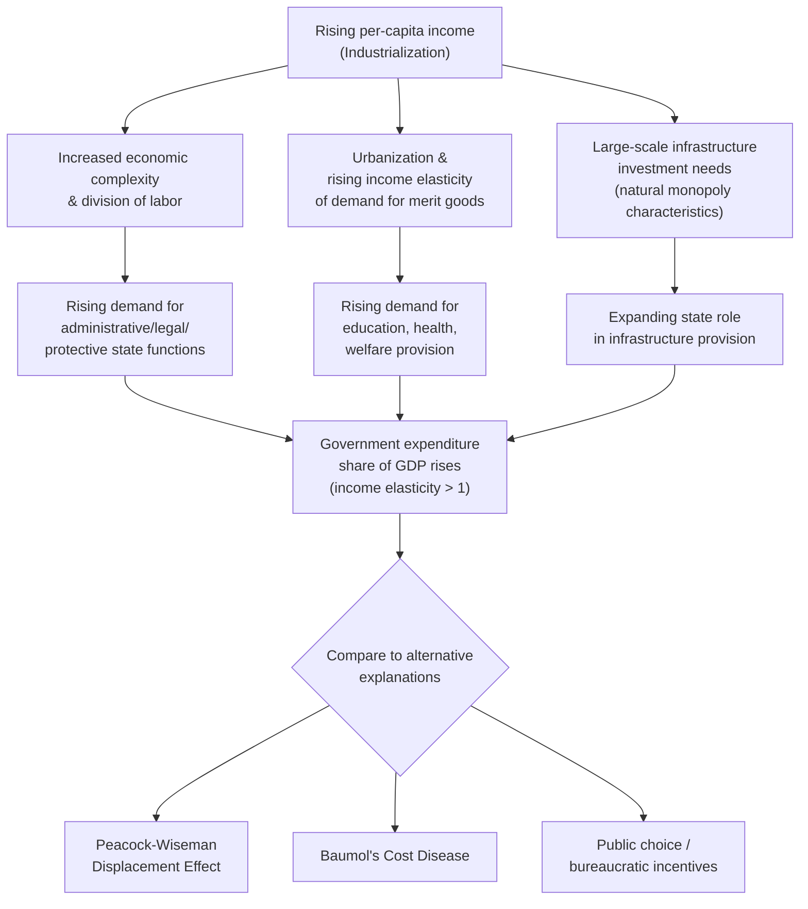

## Wagner's Law of Expanding State Activity

### Overview

Wagner's Law, formulated by German economist Adolph Wagner in the late 19th century, posits that as an economy industrializes and per-capita income rises, government expenditure as a share of national income tends to grow systematically over time. It is one of the foundational empirical/theoretical propositions in the "growth and size of government" literature, offering a demand-side and structural explanation for long-run public sector expansion, distinct from later public choice explanations for government growth.

### Historical Origin

Wagner developed the proposition based on observation of state expenditure patterns in industrializing European economies (particularly Germany) during the 19th century, formalizing it across several editions of his work on public finance (*Finanzwissenschaft*). It is generally regarded as an early empirical regularity rather than a strict theorem — Wagner offered it as a "law" in the sense of a robust historical tendency observed across industrializing nations, not a deductively derived economic theorem.

### Statement of the Law

The core proposition: as real national income per capita rises, the share of government expenditure in national income also rises — government spending exhibits an income elasticity greater than one, so it grows *faster* than the overall economy, not merely in proportion to it.

$$\frac{\%\Delta G}{\%\Delta Y} > 1$$

where $G$ is government expenditure and $Y$ is national income; equivalently, the income elasticity of demand for government services/expenditure, $\varepsilon_{G,Y}$, exceeds unity.

### Theoretical Mechanisms Proposed by Wagner

Wagner identified several distinct channels through which industrialization and rising income drive expanding state activity, typically grouped into three categories in the secondary literature:

**1. Administrative and protective functions**

As economies industrialize and become more complex, the division of labor deepens, market transactions multiply, and social/economic interdependence increases. This raises demand for the state's core functions of maintaining order, enforcing contracts, and regulating increasingly complex economic relationships — administrative and legal complexity scales with economic complexity, not just economic size.

**2. Cultural and welfare functions**

Wagner observed that industrializing societies experience growing demand for state involvement in education, public health, and welfare provision. As societies urbanize (population concentrating in cities where market failures like public health externalities and public goods provision problems become more acute), and as rising income raises the income elasticity of demand for "merit goods" like education, the state's role in cultural and welfare provision was expected to expand — this connects Wagner's law to the broader Engel's-law-style observation that different categories of goods have different income elasticities, with government-provided services argued to be relatively income-elastic (a form of "superior good" from a demand perspective, though publicly rather than privately provided).

**3. Provision of goods with natural monopoly or large-scale-investment characteristics**

Wagner also pointed to the state's expanding role in infrastructure requiring large-scale, capital-intensive investment (railways, canals, later utilities) — activities where private markets underprovide due to natural monopoly characteristics, large fixed costs, or long payback horizons that exceed what private capital markets of the era would readily finance, making state provision or state-directed investment a structural feature of industrializing economies.

### Contrast with Alternative Explanations for Government Growth

Wagner's Law is a **demand-side, structural** explanation rooted in economic development itself. It is useful to contrast it with other theories of government growth taught alongside it in this chapter:

| Theory | Core Mechanism | Type of Explanation |
| --- | --- | --- |
| **Wagner's Law** | Rising income → rising demand for state administrative, welfare, and infrastructure functions | Structural/demand-side, tied to economic development |
| **Peacock-Wiseman Displacement Effect** | Crises (wars, depressions) permanently ratchet up the tolerated tax/spending level, which does not fully revert afterward | Historical/political, crisis-driven ratchet |
| **Baumol's Cost Disease** | Government-provided services (often labor-intensive, low-productivity-growth sectors) become relatively more expensive over time relative to goods from productivity-growing sectors, raising their cost share even at constant real output | Supply-side/productivity-based |
| **Public choice theories (e.g., Niskanen's budget-maximizing bureaucrat)** | Bureaucrats, interest groups, and politicians have incentives to expand government beyond the efficient level | Political economy/incentive-based |
| **Median voter models of redistribution** | Rising income inequality (relative to the median voter) increases demand for redistributive government spending | Political economy/distributional |

Wagner's Law and these alternative explanations are not mutually exclusive — modern empirical public finance often treats them as complementary partial explanations for the well-documented long-run rise in government spending shares across industrialized economies, rather than competing theories where only one can be correct.

### Empirical Assessment

**General empirical support**

Cross-country and historical time-series studies have often found broad support for a positive association between income growth and government spending shares over the long run in many (though not universally all) industrialized economies during their industrialization phases, consistent with Wagner's original observation. [Unverified: the strength, universality, and precise causal direction of this empirical relationship is contested in the applied econometrics literature, and results are sensitive to time period, country sample, and how "government expenditure" and "national income" are measured; treat this as a broad historical regularity rather than a precisely estimated, universally stable elasticity.]

**Methodological challenges in testing Wagner's Law**

- **Causality direction**: Wagner's Law posits income growth *causes* government growth, but reverse causality (government spending, e.g. on infrastructure/education, driving income growth) or simultaneous determination is difficult to rule out empirically.
- **Functional form specification**: different studies have tested Wagner's Law using various functional forms (linear, log-linear, double-log) and different measures of "government activity" (total expenditure, specific categories, share of GDP vs. absolute levels), producing a fragmented empirical literature with results that are sensitive to specification choices.
- **Structural breaks**: some evidence suggests the relationship may weaken or change character once economies reach a mature, post-industrial stage — i.e., the law may describe a phase of development (industrialization) rather than a permanent, unconditional tendency that continues indefinitely at the same rate.

### Relevance to Modern Public Economics

Wagner's Law remains a standard reference point in discussions of long-run government size because it offers a baseline "organic growth" explanation against which more politically-contingent theories (displacement effects, bureaucratic incentives, interest-group capture) can be compared and separated out. In applied work, testing whether observed government growth exceeds what Wagner's Law alone would predict is sometimes used as an informal diagnostic for whether *additional* political-economy factors (beyond pure income-driven demand) are at work in a given country's spending trajectory.

### Diagram: Wagner's Law Mechanisms and Government Growth





```
### Worked Example

Suppose a country's national income grows from $Y_0 = 100$ to $Y_1 = 150$ (50% growth) over a development period, and government expenditure grows from $G_0 = 20$ to $G_1 = 36$ (80% growth) over the same period.

**Government spending share**: rises from $G_0/Y_0 = 20\%$ to $G_1/Y_1 = 24\%$.

**Implied income elasticity**:
$$\varepsilon_{G,Y} = \frac{\%\Delta G}{\%\Delta Y} = \frac{80\%}{50\%} = 1.6$$

Since $\varepsilon_{G,Y} = 1.6 > 1$, this pattern is consistent with Wagner's Law: government expenditure grew disproportionately faster than national income, and its share of the economy rose. A researcher testing Wagner's Law empirically would examine whether this pattern holds consistently across multiple periods and, ideally, across multiple countries at similar developmental stages, while also considering whether alternative explanations (a war during the period, a major bureaucratic expansion, a one-off welfare program) might better explain the specific 80% figure rather than pure income-driven demand growth as Wagner's Law would attribute it.

### Related Topics
- Peacock-Wiseman Displacement Effect
- Baumol's Cost Disease in public services
- Niskanen's budget-maximizing bureaucrat model
- Median voter theorem and redistributive spending
- Public choice theory
- Fiscal illusion and government growth
- Leviathan hypothesis (Brennan and Buchanan)


```