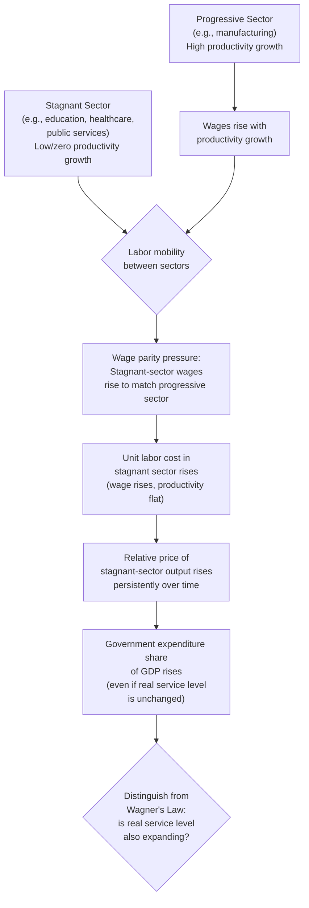

## Baumol's Cost Disease in Public Services

### Overview

Baumol's cost disease (also called the Baumol effect) describes a structural mechanism by which the relative cost of labor-intensive services with limited productivity growth — many of which are publicly provided, such as education, healthcare, and the performing arts — rises persistently over time relative to goods and services produced in sectors with rapid productivity growth (typically manufacturing). This provides a supply-side explanation for rising government expenditure shares, complementing (and analytically distinct from) demand-side explanations like Wagner's Law.

### Origin

The mechanism was formalized by William Baumol and William Bowen in their 1966 study of the performing arts (*Performing Arts: The Economic Dilemma*), observing that a string quartet performing a piece in 2024 requires essentially the same number of musician-hours as it did in 1824 — there is little scope for labor-productivity-enhancing technological change in the act of live performance itself — while wages in this sector must nonetheless rise roughly in line with wages in the rest of the economy to retain workers, since labor is mobile across sectors.

### Theoretical Mechanism

**Two-sector model**

Consider an economy with two sectors:

- **Progressive sector** (e.g., manufacturing): labor productivity grows over time at rate $g_P > 0$ due to technological change, capital deepening, and economies of scale.
- **Stagnant sector** (e.g., live performance, many personal/public services): labor productivity grows slowly or not at all, $g_S \approx 0$, because the service is inherently labor-intensive and resistant to productivity-enhancing substitution (a classroom taught by one teacher, a haircut, an in-person medical consultation cannot easily be "automated" without changing the fundamental nature of the service, though this resistance is not absolute and is form of a testable empirical claim rather than a logical necessity).

**Wage equalization across sectors**

Because labor is (at least partially) mobile between sectors, wages in the stagnant sector must rise roughly in step with wages in the progressive sector to retain workers, even though the stagnant sector's *output per worker* has not increased to justify this on productivity grounds alone:

$$w_S \approx w_P \quad \text{(wage parity, driven by labor mobility)}$$

**Resulting cost dynamics**

Since unit labor cost equals the wage divided by labor productivity, and wages rise with economy-wide productivity growth while stagnant-sector productivity does not:

$$\text{Unit Cost}_S = \frac{w_S}{\text{Productivity}_S} \quad \Rightarrow \quad \text{Unit Cost}_S \text{ rises persistently relative to Unit Cost}_P$$

The **relative price** of stagnant-sector output rises continuously over time, even absent any change in the *real* quantity or quality of the service being delivered — this is the "disease": a rising cost that is not attributable to inefficiency, waste, or declining quality, but to the sector's structural resistance to productivity growth combined with the need to compete for labor with more productive sectors.

### Application to the Public Sector

**Why public services are disproportionately affected**

A large share of core government-provided services fall into the labor-intensive, productivity-resistant category:

- **Education**: teacher-to-student ratios have historically been difficult to reduce without perceived quality loss, and the fundamental activity (an instructor engaging with students) has limited scope for the kind of productivity multiplication seen in, say, manufacturing automation.
- **Healthcare**: many core medical services (physician consultations, nursing care, surgery) remain fundamentally labor-intensive despite substantial technological advances in diagnostics and treatment, meaning cost growth persists even as care quality improves.
- **Public administration and personal social services**: similarly resistant to the kind of capital-labor substitution that drives productivity growth in goods-producing sectors.

**Implication for measured government spending growth**

Because these sectors constitute a large share of government budgets, cost disease implies that **even if the real quantity of public services provided remains constant**, nominal (and often real, inflation-adjusted) government expenditure will tend to rise over time relative to GDP, simply because the relative price of what government buys is rising faster than the relative price of what the private, productivity-growing sector produces. This is a critical analytical distinction: rising public spending shares attributable to cost disease reflect a *relative price effect*, not necessarily an expansion of the real scope, scale, or generosity of government activity.

### Distinguishing Cost Disease from Other Explanations of Government Growth

| Source of Government Growth | Mechanism | Real Service Level Implication |
| --- | --- | --- |
| **Baumol's Cost Disease** | Relative price of labor-intensive public services rises due to wage parity + productivity-growth asymmetry | Real (quality/quantity-adjusted) service level may be **unchanged**; only relative price rises |
| **Wagner's Law** | Rising income increases demand for government services (income elasticity > 1) | Real service level **rises** — actual expansion of scope/scale |
| **Peacock-Wiseman Displacement** | Crisis-driven ratchet in tolerated tax/spending burden | Real service level may rise due to a political/historical shock, not gradual economic structure |
| **Public choice / bureaucratic growth** | Budget-maximizing incentives of bureaucrats and interest groups | Real service level may rise beyond what efficient provision would require |

A key pedagogical point: **measuring "government growth" using nominal expenditure alone conflates these mechanisms.** A rising expenditure share driven purely by cost disease represents a very different phenomenon — and calls for a very different policy response — than one driven by expanding real service provision (Wagner's Law) or bureaucratic empire-building (public choice theories).

### Policy Implications and Responses

**Does cost disease imply government inefficiency?**

Not necessarily and not directly — cost disease is a *structural, economy-wide* phenomenon rooted in relative productivity growth rates and wage-parity dynamics across sectors, not primarily a claim about inefficiency, waste, or mismanagement specific to the public sector. Baumol's own framing emphasized that this is a "disease" in the sense of an unavoidable cost pressure, not a diagnosis of poor management — though this does not preclude *additional*, separate inefficiencies from coexisting in any given public sector's provision (a point sometimes elided in political debates that treat rising public service costs as automatically evidence of waste).

**Possible policy/adaptive responses**

- **Selective productivity-enhancing technology adoption**: even in traditionally labor-intensive sectors, targeted technological change (e.g., telemedicine, online/hybrid education, administrative automation) can partially offset cost disease pressure in specific subcomponents of service delivery, though this raises separate debates about whether such substitution preserves service quality.
- **Accepting rising relative cost as a structural feature**: budgeting and long-run fiscal planning that explicitly accounts for cost-disease-driven cost growth (distinguishing it from discretionary expansion) can produce more accurate long-run fiscal projections than models that implicitly assume constant relative prices.
- **Targeted efficiency reforms** distinct from productivity-growth expectations: since cost disease implies that *labor-productivity*-focused efficiency targets may be structurally unachievable in certain service categories, alternative efficiency levers (procurement reform, administrative overhead reduction, outcome-based budgeting) may be more realistic policy targets than expecting service-delivery labor productivity itself to grow at economy-wide rates.

### Diagram: Cost Disease Mechanism





```
### Worked Example

Suppose in Year 0, both sectors pay a wage of \$40,000/year. The progressive sector (manufacturing) experiences 3% annual labor productivity growth; the stagnant sector (a public service, e.g., primary education) experiences 0% productivity growth. Assume wages in both sectors rise together at the economy-wide average productivity-driven wage growth rate, approximated here as 3%/year (wage-parity assumption).

**After 20 years:**
- Progressive sector wage: $40{,}000 \times (1.03)^{20} \approx \$72{,}250$; since productivity also rose by the same factor, **unit labor cost per unit of output is roughly unchanged** — higher wages are matched by higher output per worker.
- Stagnant sector wage: also $\approx \$72{,}250$ (wage parity), but productivity (output per teacher, e.g., students effectively taught per teacher-hour) has **not** risen — so unit labor cost per unit of service has risen by the same factor, roughly **81%** ($1.03^{20} \approx 1.806$), even though the actual quantity/quality of education delivered per teacher-hour is assumed unchanged in this illustration.

This 81% real cost increase for the *same* level of service is the cost-disease effect in isolation — in a real economy it would be intermingled with (and often mistaken for) demand-driven expansion (more teachers hired, smaller class sizes — Wagner's Law) or political factors, which is precisely why disentangling the two mechanisms matters for accurate diagnosis of government spending growth. [Inference: this worked example uses simplified constant growth-rate assumptions for pedagogical clarity; real-world wage and productivity paths are far more volatile and sector-specific than this stylized illustration.]

### Related Topics
- Wagner's Law of expanding state activity
- Peacock-Wiseman Displacement Effect
- Public sector productivity measurement challenges
- Healthcare cost growth and public finance
- Education finance and teacher labor markets
- Total factor productivity and sectoral growth accounting
- Public choice theory and bureaucratic incentives


```