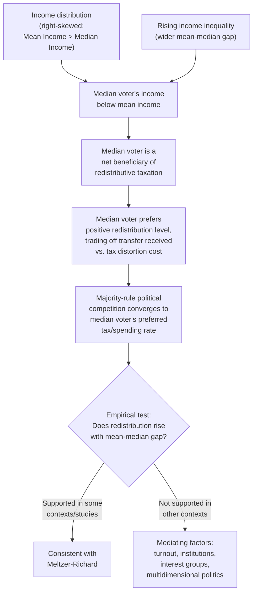

## Government Size and the Median Voter Framework


### Overview

The median voter framework applies the median voter theorem to explain the determination and growth of government size — specifically, the level of public spending and taxation/redistribution chosen through majority-rule political processes. It provides a political-economy, demand-driven account of government size that is distinct from Wagner's Law (income-driven demand) and Baumol's Cost Disease (supply-side relative price effects), instead locating the mechanism in the aggregation of heterogeneous voter preferences through majority voting.

### The Median Voter Theorem: Foundations

**Statement**

Under specific conditions — a single policy dimension, single-peaked voter preferences, and majority-rule voting between two candidates/platforms — the outcome of political competition converges to the policy preferred by the **median voter** (the voter whose preferred point splits the electorate exactly in half). Formalized by Duncan Black (1948) and popularized in application by Anthony Downs (1957), this is one of the foundational results of public choice theory.

**Conditions for the theorem to hold**

- **Single-peaked preferences**: each voter has one ideal policy point, and utility declines monotonically as the actual policy moves further from that point in either direction (ruling out voters who, say, prefer both very low and very high spending to moderate spending).
- **Single policy dimension**: voters are choosing along one ordered dimension (e.g., "more spending" vs. "less spending"), not multiple cross-cutting dimensions simultaneously (multidimensional voting can produce cycling and no stable equilibrium, per the Condorcet paradox / McKelvey chaos theorems — a significant caveat to real-world applicability).
- **Majority rule with two competing platforms**: candidates/parties are assumed to converge toward the median in order to win a majority, since any platform to one side of the median can be defeated by a platform closer to the median.

### Application to Government Spending: The Meltzer-Richard Model

**Core setup**

Meltzer and Richard (1981) formalized how the median voter framework predicts the size of redistributive government spending specifically, by modeling voters as choosing a tax rate/transfer level that maximizes their own utility, where the tax-and-transfer system is redistributive (financed by a tax on income, redistributed as a lump-sum or means-tested transfer).

**Key mechanism**

Because income distributions in most economies are right-skewed (mean income exceeds median income — a relatively small number of high earners pull the mean above the typical/median income level), the **median voter's income is below the mean income**. Since redistributive taxation transfers resources from higher earners toward the median/lower earners, the median voter — who receives more in transfers than they pay in taxes under a income-redistributing system, so long as their income is below the mean — has a self-interested preference for a **positive, non-trivial level of redistribution**, and the equilibrium tax/spending rate under majority rule is determined by the median voter's preferred trade-off between redistribution received and the efficiency costs (distortionary effects) of taxation.

**Formal implication: the mean-median income gap drives spending**

$$\text{Preferred redistribution by median voter} \; \uparrow \; \text{as} \; \frac{\text{Mean Income} - \text{Median Income}}{\text{Mean Income}} \; \uparrow$$

This yields the model's central testable prediction: **rising income inequality (specifically, a widening gap between mean and median income) should increase the median voter's preferred level of redistributive government spending**, because the median voter's relative gain from redistribution grows as their income falls further below the mean.

### Government Size beyond Pure Redistribution

**Extending to public goods provision**

The median voter framework can be applied more broadly to the level of *any* government-provided good financed by a common tax (not only pure income redistribution) — e.g., local public education spending, chosen by majority vote and financed by local property taxes, is a classic applied setting (Tiebout-adjacent) where median voter models are empirically tested using local/municipal government data, since local governments often more closely approximate the theorem's assumptions (single relevant dimension: local spending level) than national governments.

**Interaction with Wagner's Law and Baumol's Cost Disease**

The median voter framework is a *political mechanism* explaining how a given level of demand for government services gets translated into actual policy outcomes, whereas Wagner's Law explains why demand for government services might structurally rise with income, and Baumol's Cost Disease explains why the cost of delivering a given real level of service might rise over time. These are complementary rather than competing: a full account of observed government growth in a given country plausibly involves all three mechanisms operating simultaneously and interacting (e.g., rising income increases both aggregate demand for government services *and*, if it also increases income inequality, increases the median voter's preferred redistribution level through the Meltzer-Richard channel).

### Critiques and Limitations

**Empirical performance of Meltzer-Richard**

The prediction that rising inequality (mean-median gap) straightforwardly drives higher redistribution has received **mixed empirical support** — several well-known empirical puzzles challenge the simple version of the model:

- Some countries with high and rising inequality have not seen correspondingly large increases in redistributive spending (and the U.S. is often cited as a prominent example in this debate), suggesting other factors (political institutions, racial/ethnic heterogeneity affecting solidarity, the influence of organized interest groups, and turnout patterns that may not center on the "true" income median voter) mediate or override the pure Meltzer-Richard mechanism. [Unverified: the specific empirical strength and cross-country generalizability of this mismatch is actively debated in the political economy literature, and results are sensitive to country sample, time period, and how redistribution is measured.]

**Theoretical limitations of the median voter model itself**

- **Multidimensional politics**: real political choices span many simultaneous dimensions (spending composition, social issues, foreign policy), which can produce voting cycles or agenda-setter power rather than clean convergence to a single median — the strict median voter theorem applies cleanly only in the single-dimension case.
- **Turnout and voter participation are not universal or income-neutral**: if voter turnout is systematically correlated with income (frequently, though not universally, higher-income individuals have historically shown higher turnout rates in many democracies), the *effective* median voter among actual voters may have higher income than the median voter in the full population, weakening the predicted redistribution channel.
- **Candidates/parties may not fully converge**: in practice, parties often differentiate themselves (ideological commitment, primary election dynamics, activist/donor influence) rather than converging precisely to the median as the simplest Downsian model predicts, meaning realized policy can deviate from the pure median-voter prediction.
- **Agenda control and institutional veto points**: legislatures, committees, and bicameral/federal structures introduce agenda-setting power and veto points that can shift outcomes away from the simple majority-rule median, a point emphasized in later public choice extensions of the basic model (e.g., Romer-Rosenthal agenda-setter models).

### Diagram: Median Voter Determination of Redistribution





```
### Worked Example

Suppose an electorate has income distributed such that mean income $\bar{Y} = \$60{,}000$ and median income $Y_m = \$45{,}000$ (a right-skewed distribution, as is empirically typical). A proportional income tax at rate $\tau$ funds a uniform lump-sum transfer $T = \tau \bar{Y}$ to every voter (a simplified linear redistribution scheme).

**Net transfer to the median voter**:
$$\text{Net gain}_m = T - \tau Y_m = \tau \bar{Y} - \tau Y_m = \tau(\bar{Y} - Y_m) = \tau(\$60{,}000 - \$45{,}000) = \tau \times \$15{,}000$$

Since $\bar{Y} > Y_m$, the median voter has a **strictly positive net gain** from any $\tau > 0$, before accounting for the efficiency cost of taxation (distortionary effects on labor supply, captured in Meltzer-Richard by a standard deadweight-loss term that grows with $\tau$). The median voter's preferred $\tau^*$ balances this net transfer gain against the rising marginal deadweight loss as $\tau$ increases — the model's equilibrium tax rate is found where the marginal redistributive benefit to the median voter equals the marginal efficiency cost they bear.

If inequality subsequently rises such that $\bar{Y}$ increases to \$75,000 while $Y_m$ remains \$45,000 (a widening gap of \$30,000 rather than \$15,000), the model predicts the median voter's preferred $\tau^*$ should rise correspondingly, since the per-unit-$\tau$ net gain has doubled — this is the core comparative-static prediction of the Meltzer-Richard model that has been subject to the mixed empirical testing discussed above.

### Related Topics
- Wagner's Law of expanding state activity
- Baumol's Cost Disease in public services
- Meltzer-Richard model of redistribution
- Median voter theorem and Black's single-peakedness condition
- Public choice theory and voting cycles (Condorcet paradox)
- Tiebout model and local public goods
- Political economy of inequality and redistribution
- Romer-Rosenthal agenda-setter models


```