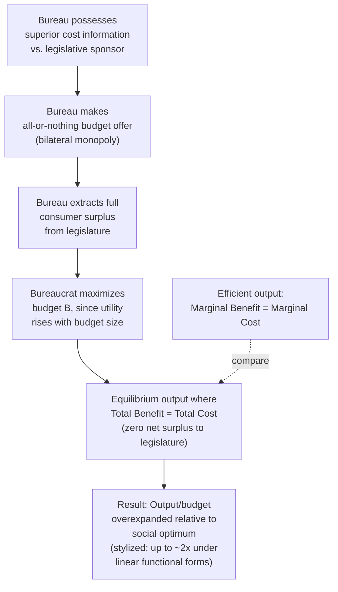

## Niskanen Model of Budget-Maximizing Bureaucracy

### Overview

The Niskanen model, developed by William Niskanen (1968, 1971), provides a public choice explanation for oversized and inefficient government bureaus by modeling bureaucrats as rational, self-interested budget-maximizers operating under an information asymmetry advantage over their political overseers. It is a foundational supply-side/institutional theory of government growth, distinct from the demand-side (Wagner's Law), price-structural (Baumol's Cost Disease), and political-aggregation (median voter) explanations covered elsewhere in this chapter.

### Theoretical Setup

**The bureaucrat's objective function**

Unlike the standard public-interest assumption that bureaucrats simply implement policy to maximize social welfare, Niskanen modeled the bureau chief as maximizing their **own** utility, which he argued is closely tied to the size of the bureau's budget — larger budgets are associated with greater salary, staff, perquisites, public reputation, power, and patronage opportunities available to the bureau's management, even if these do not correspond to greater social value delivered.

$$\text{Bureaucrat's objective: } \max_{B} \; U(B)$$

where $B$ is the bureau's total budget, and $U$ is increasing in $B$ (at least up to some point).

**The bilateral monopoly / information asymmetry structure**

The bureau is modeled as a monopoly supplier of a service to a sponsoring legislative/executive body (the only "buyer"), creating a **bilateral monopoly** bargaining relationship. Critically, Niskanen assumed the bureau possesses superior information about its own true production/cost function relative to its legislative overseer, who cannot easily verify the bureau's actual minimum cost of producing a given output level — this information asymmetry is the crucial device that allows budget-maximizing behavior to persist in equilibrium rather than being disciplined away by an informed principal.

**The all-or-nothing budget offer**

The bureau presents its budget request to the legislature as an **all-or-nothing offer**: rather than the legislature bargaining down to the efficient budget-output combination as an informed monopsonist buyer would, the bureau (exploiting its informational advantage about costs) proposes a budget that captures the *entire* consumer surplus the legislature would have obtained from the service — analogous to a perfectly price-discriminating monopolist extracting the full area under the (legislature's) demand curve, rather than a standard monopolist that would restrict quantity to maximize markup on a smaller output level.

### The Central Prediction: Budget and Output Overexpansion

**Formal result**

Given the bureau's ability to extract the full surplus and its inherent preference for a larger budget over a smaller one (all else equal), the Niskanen model predicts that bureau output expands **beyond** the level that would maximize net social benefit (where marginal benefit equals marginal cost) — specifically, Niskanen's core result is that output expands to the point where **total benefits equal total costs** (all surplus extracted, zero net surplus remaining for the legislature/public), rather than stopping where *marginal* benefit equals marginal cost (the efficient output level):

$$\text{Efficient output: } MB(Q^*) = MC(Q^*)$$


$$\text{Niskanen bureau output: } TB(Q_{Niskanen}) = TC(Q_{Niskanen}), \quad Q_{Niskanen} > Q^*$$

Because total benefit typically rises more slowly than proportionally as output increases beyond the efficient point (diminishing marginal benefit), while total cost continues rising, the point where total benefit equals total cost occurs at roughly **twice the efficient output level** under certain stylized (notably linear marginal cost and marginal benefit) functional form assumptions — a widely cited illustrative implication of the original model, though the precise "double the efficient output" result is sensitive to the specific functional forms assumed and should be treated as an illustrative special case rather than a general theorem holding for arbitrary cost/benefit curve shapes. [Inference: the "roughly double" result is the standard textbook illustration under linear-quadratic functional form assumptions in the original Niskanen framework, not a general prediction independent of functional form.]

### Diagram: Niskanen's Output Overexpansion Mechanism





```
### Sources of the Bureau's Bargaining Power

**Monopoly supply position**
In many public service contexts, a single agency is the sole provider of a given government function, eliminating the competitive discipline that would exist if multiple suppliers could bid to provide the service at lower cost — a structural feature distinct from, but reinforcing, the information asymmetry mechanism.

**Legislative oversight limitations**
Niskanen's model implicitly assumes legislative overseers face real constraints on their ability to monitor and verify bureau costs — limited staff time and expertise relative to the bureau's specialized knowledge of its own operations, dispersed and weak individual incentives for any single legislator to invest heavily in oversight (a collective action problem analogous to rational voter ignorance in electoral contexts), and the bureau's ability to control and shape the information it provides to its overseers.

**Absence of a residual claimant / profit motive**
Unlike a private firm, where owners/shareholders have a direct financial stake in cost minimization, a government bureau has no analogous residual claimant capturing cost savings — slack or "X-inefficiency" that would erode a private firm's profit instead translates into expanded discretionary budget/perquisites for a public bureau's management, altering the incentive structure fundamentally relative to a private monopolist (who at least has an incentive to minimize cost for any given output level, even while restricting output — the Niskanen bureau lacks even this cost-minimization incentive at the chosen output level).

### Critiques and Extensions

**Migué-Bélanger and discretionary budget models**
Subsequent scholars (Migué and Bélanger, 1974) proposed a modification: bureaucrats maximize **discretionary budget** (the surplus available for non-essential/perquisite spending after minimum necessary costs are covered) rather than *total* budget — this variant predicts somewhat different (generally less extreme) overexpansion than the pure Niskanen total-budget-maximization assumption, since it implies bureaus have some incentive to minimize the cost of producing the *mandated* portion of output even while maximizing discretionary slack.

**Empirical challenges to testing the model**
- **Measuring the "efficient" counterfactual output level** for a public good that, by definition, is not priced in a market is inherently difficult, making direct empirical tests of "how much overexpansion" challenging.
- **Multiple principals and competing oversight mechanisms**: real bureaucracies face oversight not only from a single sponsoring legislative committee but from multiple, sometimes competing, principals (executive branch, courts, media scrutiny, interest groups, competing legislative committees), which can discipline bureau behavior in ways the simple bilateral-monopoly model does not capture.
- **Bureaucratic motivation heterogeneity**: critics have argued that assuming *all* bureaucrats are purely budget/self-interest maximizers, rather than a mix of motivations including genuine public-service orientation, professional norms, and career concerns tied to *effective* (not merely large) program outcomes, may overstate the universality of the mechanism. [Unverified: the relative empirical importance of pure budget-maximizing behavior versus other bureaucratic motivations is contested, and likely varies substantially across agency types, political systems, and professional cultures — not a settled, uniformly applicable finding.]

**Contracting-out and competitive alternatives as policy responses**
The Niskanen framework has been influential in motivating policy proposals aimed at introducing competitive discipline into public service provision — competitive contracting/outsourcing, performance-based budgeting, voucher systems, and yardstick competition among jurisdictions — each intended to erode the bureau's monopoly position or information advantage that the model identifies as the root cause of overexpansion.

### Relation to Other Government-Growth Theories in This Chapter

| Theory | Level of Analysis | Predicted Mechanism |
|---|---|---|
| **Wagner's Law** | Aggregate economy-wide demand | Rising income raises demand for state functions |
| **Baumol's Cost Disease** | Sectoral relative prices | Labor-intensive service costs rise relative to goods |
| **Median voter framework** | Electorate-wide preference aggregation | Majority-rule voting determines redistribution/spending level |
| **Niskanen model** | Individual bureau/principal-agent relationship | Information asymmetry allows bureaucrats to extract surplus and overexpand budgets beyond the (voter- or legislature-) desired efficient level |

Niskanen's model is distinctive among these in operating at the level of the individual bureau's internal incentive structure rather than economy-wide or electorate-wide aggregates — it explains why *even if* the "correct" socially desired level of government spending were accurately determined by demand-side or political-aggregation mechanisms, the *actual* realized bureau output/budget could still diverge from that level due to a principal-agent problem within the public sector's own administrative machinery.

### Worked Example

Suppose a bureau's service has demand (marginal benefit) $MB(Q) = 100 - Q$ and marginal cost $MC(Q) = Q$ (linear, illustrative functional forms consistent with the standard textbook version of the model).

**Efficient output** (where $MB = MC$):
$$100 - Q^* = Q^* \Rightarrow Q^* = 50$$

**Total benefit and total cost functions** (integrating):
$$TB(Q) = 100Q - \frac{Q^2}{2}, \qquad TC(Q) = \frac{Q^2}{2}$$

**Niskanen output** (where $TB = TC$, all surplus extracted):
$$100Q - \frac{Q^2}{2} = \frac{Q^2}{2} \Rightarrow 100Q = Q^2 \Rightarrow Q_{Niskanen} = 100$$

Confirming the stylized "double the efficient output" result for this linear specification: $Q_{Niskanen} = 100 = 2 \times Q^* = 2 \times 50$. At $Q_{Niskanen} = 100$, total cost is $TC(100) = 5{,}000$, exactly equal to total benefit $TB(100) = 10{,}000 - 5{,}000 = 5{,}000$ — the legislature receives a service "worth" exactly what it pays, capturing zero net surplus, while the efficient output $Q^*=50$ would have generated a positive net social surplus of $TB(50) - TC(50) = 3{,}750 - 1{,}250 = 2{,}500$ that is instead fully dissipated into excess budget/output under the Niskanen equilibrium.

### Related Topics
- Wagner's Law of expanding state activity
- Baumol's Cost Disease in public services
- Government size and the median voter framework
- Principal-agent theory in public administration
- Migué-Bélanger discretionary budget model
- X-inefficiency and Leibenstein's theory of the firm
- Public sector contracting-out and yardstick competition
- Rational voter ignorance and oversight failure


```