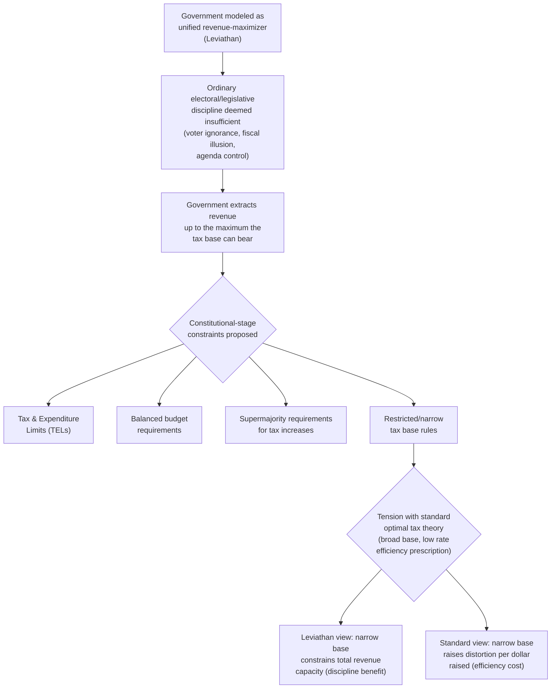

## Leviathan Hypothesis of Government Growth

### Overview

The Leviathan hypothesis, most closely associated with Geoffrey Brennan and James Buchanan's *The Power to Tax* (1980), models government not as a benevolent agent implementing the median voter's preferences (as in standard median voter models) but as a revenue-maximizing entity that will exploit its coercive taxing power to the fullest extent institutional constraints allow. It offers a constitutional political-economy perspective on government growth, emphasizing the *rules* that constrain government behavior as the central lever for controlling government size, distinct from the demand-side, price-structural, and single-bureau explanations covered elsewhere in this chapter.

### Theoretical Foundations

**Government as a monolithic revenue-maximizer**

Rather than modeling government as an aggregation of individual voter preferences (median voter theorem) or a collection of separately-analyzed bureaus (Niskanen model), Brennan and Buchanan proposed treating the government/state as if it were a single, unified actor whose objective is to maximize the revenue it extracts from the citizenry — analogous to Thomas Hobbes's "Leviathan," a sovereign power that, once granted authority, has its own expansionary logic independent of serving citizens' collective interest.

**Contrast with the "benevolent despot" and median voter traditions**

This is a deliberate departure from two other traditions in public finance: the "benevolent despot" model (government is assumed to simply implement the socially optimal policy, the implicit assumption underlying much of traditional Pigouvian/optimal-tax theory) and the median voter model (government outcomes reflect the preferences of the decisive/median voter through electoral competition). The Leviathan model instead assumes government, left unconstrained, will behave as a *self-interested monopolist* over the coercive power to tax, extracting the maximum revenue the tax base can bear — much as a profit-maximizing monopolist extracts the maximum the market will bear, but with the crucial difference that ordinary product-market competition (which disciplines private monopolies via potential entry or substitute goods) is largely absent for a government's coercive taxing authority within its jurisdiction.

### The Central Policy Implication: Constitutional Constraints

**Why ordinary political/electoral discipline is deemed insufficient**

Brennan and Buchanan argued that standard democratic mechanisms (elections, legislative oversight) are not reliably sufficient to prevent Leviathan-like revenue-maximizing behavior, for reasons overlapping with — but going beyond — the median voter model's own limitations (rational voter ignorance, agenda-setting power by government actors themselves, fiscal illusion techniques that obscure the true tax burden from voters, and the government's own role in shaping the information voters use to evaluate government performance).

**Constitutional rules as the primary constraint**

The central Leviathan-hypothesis policy prescription is therefore to impose **binding constitutional constraints** on government's taxing and spending power *before* the fact — i.e., rules adopted at a "constitutional" stage of decision-making (prior to and constraining ordinary day-to-day political/legislative decisions) — rather than relying on ordinary legislative or electoral processes to restrain government growth after the fact. Proposed and actually implemented mechanisms in this tradition include:

- **Constitutional or statutory tax and expenditure limits (TELs)**: caps on the rate of growth of government revenue/spending, often tied to a formula (e.g., limited to the rate of population growth plus inflation)
- **Balanced budget requirements**: constitutional or statutory mandates limiting deficit spending, intended to remove the "fiscal illusion" advantage government gains from financing current spending through debt rather than currently-visible taxation
- **Supermajority requirements for tax increases**: requiring more than a simple majority (e.g., two-thirds) of a legislature to raise tax rates, making it structurally harder for a revenue-maximizing government to expand its tax take
- **Restrictions on the tax base**: constitutional limits on *which* activities/tax bases government may tax, restricting the total revenue-raising toolkit available

### The Broad-Base, Low-Rate Paradox

**A distinctive and counterintuitive implication**

Standard optimal taxation theory (e.g., Ramsey taxation, the theory of efficient/optimal commodity taxation) generally favors **broad tax bases with low rates**, on efficiency grounds — broad bases minimize the distortionary "excess burden" of taxation for a given amount of revenue raised, since deadweight loss rises with the *square* of the tax rate (per standard excess-burden theory), so spreading a given revenue requirement across a wide base at low rates minimizes total distortion relative to concentrating high rates on a narrow base.

**The Leviathan-model reversal**

Brennan and Buchanan pointed out a striking implication of the Leviathan framework: if government is a revenue-maximizer rather than a benevolent optimizer, a broad tax base is *more dangerous*, not less — a broad-based tax gives a revenue-maximizing government access to a larger potential revenue pool at any given rate, making it easier for government to extract more total revenue. From this perspective, **narrow, earmarked, or constitutionally restricted tax bases** may better constrain a Leviathan government's total revenue-raising capacity than the efficiency-optimal broad base recommended by standard optimal tax theory — creating a genuine tension between the efficiency-focused prescriptions of standard public finance theory (favoring broad bases) and the constitutional political-economy prescription of the Leviathan model (favoring narrower, more constrained bases as a discipline device), a tension that is central to how this hypothesis is typically taught and debated. [Inference: this is a theoretical implication drawn directly from the Brennan-Buchanan framework's own logic; whether narrow-base constraints are, in practice, an effective or a net-beneficial constitutional design choice (given their efficiency costs under the standard model) remains a genuinely disputed normative and empirical policy question, not a settled prescription.]

### Diagram: Leviathan Model Logic and Constitutional Response





```
### Empirical Testing and Evidence

**Fiscal decentralization as an empirical test**
A significant strand of empirical work associated with the Leviathan hypothesis tests whether greater **fiscal decentralization** (more government functions and taxation occurring at competing sub-national/local levels, rather than concentrated in a single central government) restrains overall government size — the logic being that decentralization introduces *inter-jurisdictional competition* (citizens/capital can migrate between jurisdictions, disciplining any single jurisdiction's revenue-maximizing tendencies, similar in spirit to Tiebout competition), acting as a check on Leviathan behavior analogous to how competition disciplines a private monopolist.

**Mixed empirical findings**
Cross-country and cross-state empirical studies testing whether more decentralized government structures are associated with smaller aggregate government size have produced **mixed and contested results** — some studies find support for the predicted negative relationship between decentralization and government size, while others find no significant relationship or even a positive one, and results are sensitive to how "decentralization" and "government size" are measured, as well as to the specific sample of countries/time periods studied. [Unverified: the empirical decentralization-government-size relationship remains an actively contested area of applied public finance research without clear consensus, not a settled confirmed or refuted prediction.]

### Critiques of the Leviathan Framework

**Empirical/behavioral realism of the revenue-maximizing assumption**
Critics have questioned whether modeling government as a unified, monolithic revenue-maximizer is empirically realistic, given that real governments are composed of many competing branches, agencies, and elected officials with heterogeneous and often conflicting incentives (connecting back to, and in tension with, the Niskanen model's own more disaggregated principal-agent framing of bureaucratic behavior) — the Leviathan model's simplifying assumption of government unity is a modeling choice with genuine analytical payoff (tractability, clear constitutional-design implications) but is not a claim that has itself been directly empirically validated as a literal description of how governments behave internally.

**Normative tension over the efficiency of constraining fiscal capacity**
Even granting the Leviathan model's behavioral premise, imposing rigid constitutional fiscal constraints carries its own costs — such constraints can reduce government's ability to respond to genuine emergencies, provide efficient levels of public goods where genuinely warranted (a benevolent-despot-style justified expansion, which the model's own framing tends to downplay by assumption), or smooth spending across business cycles (counter-cyclical fiscal policy), meaning the normatively optimal degree of constitutional constraint is a genuinely disputed policy question turning on empirical judgments about the relative size of Leviathan-restraining benefits versus flexibility-reducing costs.

**Relationship to other government-growth theories**
| Theory | Core Assumption about Government | Primary Restraint Mechanism Proposed |
|---|---|---|
| **Median voter framework** | Government implements decisive/median voter preferences | Ordinary electoral competition |
| **Niskanen model** | Individual bureaus exploit information asymmetry vs. legislative principal | Competitive contracting, improved oversight |
| **Leviathan hypothesis** | Government (unified) maximizes revenue extraction | Constitutional constraints, fiscal decentralization/competition |
| **Wagner's Law / Baumol's Cost Disease** | Government growth reflects structural economic forces, not misaligned incentives | N/A — these are largely treated as not requiring a "restraint" per se |

### Worked Example

Consider a simplified Leviathan government choosing a tax rate $\tau$ on a tax base $B(\tau)$ that shrinks as the rate rises (standard downward-sloping tax-base response to rate, reflecting behavioral/avoidance responses), with total revenue:
$$R(\tau) = \tau \cdot B(\tau)$$

A **revenue-maximizing** Leviathan government sets $\tau$ at the peak of this revenue function (analogous to a Laffer-curve-maximizing rate):
$$\frac{dR}{d\tau} = B(\tau) + \tau \frac{dB}{d\tau} = 0$$

This is generically a **higher** tax rate than the rate a "benevolent despot" would choose if instead balancing revenue needs against the excess burden (deadweight loss) imposed on taxpayers — a benevolent optimizer internalizes the taxpayer's welfare loss from the tax and would generally stop well short of the pure revenue-maximizing point, whereas a Leviathan government, by assumption, does not weigh this cost at all (or weighs it only insofar as it affects the *tax base* available for future extraction, not as a genuine welfare cost in its own objective function).

**Illustrating the broad-base implication**: suppose government can tax either (a) a broad base $B_{broad}(\tau) = 1000 - 5\tau$ or (b) a narrow, constitutionally-restricted base $B_{narrow}(\tau) = 200 - 5\tau$ (same responsiveness/slope, smaller initial base). The revenue-maximizing rate is the same in both cases under this linear specification (found where $\frac{dR}{d\tau}=0$), but **maximum extractable revenue is far higher under the broad base** ($R_{broad}^{max}$ substantially exceeds $R_{narrow}^{max}$, proportional to the difference in base size) — illustrating concretely why the Leviathan framework treats a constitutionally narrowed tax base as a meaningful constraint on total government revenue capacity, independent of the tax *rate* chosen.

### Related Topics
- Wagner's Law of expanding state activity
- Niskanen model of budget-maximizing bureaucracy
- Government size and the median voter framework
- Tiebout model and inter-jurisdictional competition
- Fiscal decentralization and public finance
- Tax and expenditure limits (TELs)
- Ramsey taxation and optimal commodity tax theory
- Constitutional political economy (Buchanan's contractarian approach)


```