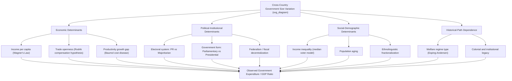

## Cross-Country Patterns in Government Size

### Definition and Scope

Cross-country patterns in government size refer to the systematic empirical regularities observed when comparing the scale of public sector activity—typically measured as government expenditure or revenue as a share of Gross Domestic Product (GDP)—across nations and over time. This area of Public Economics moves beyond single-country analysis (such as Wagner's Law applied to one nation's time series) to ask comparative questions: Why does government consume roughly 25% of GDP in Singapore but over 55% in France? Why do government shares tend to converge among OECD economies while diverging between developed and developing nations?

The primary measurement bases include:

- **General government total expenditure (% of GDP)**: The most common metric, encompassing central, state/regional, and local government spending, including social security funds.
- **General government revenue (% of GDP)**: Tax and non-tax receipts, used to assess the "size" from the resource-extraction side.
- **Public sector employment (% of total employment)**: A non-fiscal size measure capturing the government's role as an employer.
- **Government consumption vs. government expenditure**: Consumption (final consumption expenditure, i.e., wages and goods/services purchased by government) is narrower than total expenditure, which also includes transfers and interest payments.

### Key Points

- **The "Big Trade-off" pattern**: Cross-country data consistently show a positive correlation between GDP per capita and government size (Wagner's Law observed cross-sectionally), though this relationship has weakened and even reversed at the highest income levels since the 1980s in some samples.
- **Regional clustering**: Continental and Nordic European countries systematically report higher government expenditure shares (45-55% of GDP) than Anglo-Saxon economies (35-42%) and East Asian economies (20-35%), even after controlling for income level.
- **The "small government, high growth" outliers**: Economies like Singapore, Hong Kong, and (historically) South Korea maintained low government-to-GDP ratios while achieving rapid income convergence, challenging simple Wagner's Law extrapolations.
- **Transfer-driven divergence**: Cross-country variance in *total* government spending is driven overwhelmingly by variance in transfer payments and social insurance spending, not by variance in core public goods provision (defense, justice, basic administration), which is comparatively similar as a share of GDP across countries.
- **Federalism and decentralization effects**: Federal states (Germany, Canada, Switzerland, the US) often show different decomposition patterns—lower central government share but similar or higher combined general government share—due to intergovernmental fiscal architecture.
- **Convergence among rich democracies, divergence globally**: OECD government expenditure ratios have shown some convergence since the 1990s (partly due to Maastricht-style fiscal rules and EU accession conditionality), while the gap between OECD and low-income countries has remained wide or widened.

### Theoretical Frameworks Explaining Cross-Country Variation

**1. Wagner's Law (Income Elasticity Hypothesis)**

Adolph Wagner's (1883) proposition holds that as real income per capita rises, the demand for government activity rises more than proportionally, implying an income elasticity of government spending greater than one:

$$\frac{\partial (G/Y)}{\partial Y} > 0$$

where $G$ is government expenditure and $Y$ is national income. Cross-sectionally, this predicts richer countries should have systematically larger governments. Empirical support is mixed: it holds reasonably well across the income distribution from low- to middle-income countries, but the relationship flattens or reverses among the richest economies (e.g., the US, Switzerland, Singapore, Ireland often report lower ratios than poorer EU members like Greece or France).

**2. Baumol's Cost Disease**

William Baumol's (1967) model explains why government size *tends to rise mechanically* over time and why labor-intensive-service economies show larger government shares. Government-provided services (education, healthcare, public administration) are typically labor-intensive with slow productivity growth relative to manufacturing. If wages rise economy-wide with productivity in the "progressive" sector but the "stagnant" (government) sector cannot substitute capital for labor, the *relative cost* of government services rises continuously:

$$\frac{P_G}{P_M} = \left(\frac{w}{w}\right) \cdot \frac{A_M}{A_G}$$

where $P_G$ and $P_M$ are prices in the government and manufacturing sectors, and $A_M > A_G$ reflects the productivity growth gap. Cross-country, economies with more labor-intensive public service delivery models (e.g., extensive public healthcare workforces) show faster-rising expenditure ratios over time, holding real service levels constant.

**3. Median Voter Model and Preference Heterogeneity**

The Meltzer-Richard (1981) model links government size to the distribution of income relative to the decisive (median) voter. Under majority voting with redistributive taxation:

$$\tau^* = f\left(\frac{y_{mean}}{y_{median}}\right)$$

Higher income inequality (a wider mean-median income gap) predicts higher demand for redistribution and thus larger government, since the median voter's tax burden relative to benefit received falls as inequality rises. This is cited to help explain why more unequal societies (all else equal) might be expected to have larger governments—though the cross-country empirical relationship between inequality and government size is famously **non-monotonic and contested** [Inference: the direction of causality between inequality and welfare-state size is actively debated in the literature, with reverse-causality concerns—large welfare states reduce measured inequality—complicating interpretation].

**4. Institutional and Political Economy Explanations**

- **Electoral systems**: Proportional representation (PR) systems are empirically associated with larger governments and more universalistic welfare states than majoritarian/first-past-the-post systems (Persson & Tabellini's research program), because PR tends to produce coalition governments favoring broad-based spending programs, while majoritarian systems favor targeted spending to swing districts.
- **Government form**: Presidential systems tend to show smaller government spending shares than parliamentary systems, attributed to greater separation-of-powers checks limiting spending coalitions.
- **Ethnolinguistic fractionalization**: More ethnically/linguistically fragmented societies tend to have smaller public goods provision and government size, consistent with reduced trust and cooperation for financing shared public goods (Alesina et al.'s work on this is widely cited, though it is an empirical regularity with debated causal mechanisms).
- **Trade openness (Rodrik's compensation hypothesis)**: Dani Rodrik's (1998) finding that trade openness is positively correlated with government size cross-nationally—more open economies exhibit larger public sectors, interpreted as government spending serving as social insurance against external (terms-of-trade, demand) risk exposure.

**5. Historical and Path-Dependent Explanations**

Esping-Andersen's (1990) "Three Worlds of Welfare Capitalism" typology categorizes cross-country variation into regime types rather than a single continuous scale:

- **Liberal regimes** (US, UK, Canada, Australia): Means-tested, modest transfers; market-dominant. Lower government spending ratios.
- **Conservative/corporatist regimes** (Germany, France, Austria, Italy): Status-preserving social insurance, employment-linked benefits. Mid-to-high spending ratios.
- **Social democratic regimes** (Sweden, Denmark, Norway, Finland): Universalistic, high-quality, high-tax, high-spend. Highest spending ratios.

This typology captures qualitative institutional differences that a single expenditure-to-GDP ratio obscures, since two countries with identical spending ratios can allocate resources through very different institutional mechanisms.

### Empirical Measurement Issues

Comparative government-size statistics are subject to several measurement caveats that affect interpretation:

- **Gross vs. net spending**: Countries that tax transfer payments (e.g., Sweden taxes pensions as income) report higher *gross* spending than countries providing untaxed benefits of equivalent net value, inflating apparent government size in high-tax-and-transfer countries relative to otherwise-equivalent systems using tax expenditures (e.g., the US's extensive use of tax credits and employer-based health insurance subsidies delivered through the tax code rather than direct spending).
- **Tax expenditures and "hidden" welfare states**: Countries that deliver social benefits via tax deductions/credits rather than direct cash transfers (fiscal welfare) appear smaller in headline statistics while performing functionally similar redistribution. This is central to the "hidden welfare state" literature (Howard, 1997, on the US case).
- **State-owned enterprises (SOEs)**: Government expenditure statistics generally exclude SOE activity unless subsidized or consolidated into general government accounts, understating the state's economic footprint in countries with large SOE sectors (e.g., China, historically France, several Gulf states).
- **Purchasing power vs. nominal GDP shares**: Government size ratios are typically expressed relative to nominal GDP; using PPP-adjusted comparisons can shift rankings, particularly for countries with large non-traded service sectors.
- **National accounts classification differences**: The IMF's Government Finance Statistics (GFS) framework and the OECD's System of National Accounts (SNA) framework mostly align but have classification nuances (e.g., treatment of public pension funds, student loan accounting) that produce non-trivial reporting differences [Unverified: exact magnitude of classification-driven divergence varies by country-year and is not something with a single universal correction factor].

### Empirical Patterns by Region (Illustrative)

| Region/Country Group | Typical Govt. Expenditure (% GDP) | Dominant Explanatory Factors |
| --- | --- | --- |
| Nordic (Sweden, Denmark, Finland) | ~48–55% | Social democratic regime, high unionization, PR electoral systems, high trust/homogeneity |
| Continental Europe (France, Germany, Italy) | ~45–57% | Corporatist insurance model, aging demographics, PR/coalition politics |
| Anglo-Saxon (US, UK, Australia, Canada) | ~35–43% | Liberal regime, majoritarian politics, market-oriented service delivery |
| East Asian (Singapore, South Korea, Hong Kong) | ~18–32% | Developmental state model, high private savings substituting for public insurance, historically younger demographics |
| Latin America (Brazil, Argentina) | ~35–45% | Middle-income welfare expansion, high informality limiting tax base, macro volatility |
| Sub-Saharan Africa (average) | ~20–28% | Low tax capacity, informal economy, donor-dependent public finance in many cases |

*Figures are illustrative central tendencies from recent IMF/OECD/World Bank data compilations and vary meaningfully by year and data source; treat as approximate orderings rather than precise point estimates.* [Unverified: precise percentages fluctuate year to year with business-cycle and crisis-response effects (e.g., COVID-19 spending spikes), so exact figures should be checked against current IMF Fiscal Monitor or OECD.Stat data for any time-sensitive application.]

### Diagram: Causal Framework for Cross-Country Government Size Variation (svg_diagram)

### Example

Consider comparing France (~57% government expenditure/GDP) and Singapore (~18-20% government expenditure/GDP) as of recent data. Both are high-income economies, so pure Wagner's Law income effects cannot explain the gap. The divergence is better explained by:

1. **Welfare regime type**: France operates a corporatist social insurance model with extensive pay-as-you-go pensions and universal healthcare financed through general government budgets; Singapore relies on the Central Provident Fund (CPF), a mandatory individual savings scheme that is classified as private/quasi-private saving rather than government expenditure, even though it serves a similar social-insurance function.
2. **Electoral/political structure**: France's semi-presidential system with strong PR elements in various institutions has historically supported broad, universalistic spending coalitions; Singapore's dominant-party parliamentary system has pursued a low-tax, high-forced-savings development strategy.
3. **Demographic structure**: France has a more advanced population aging profile, mechanically raising pension and healthcare expenditure shares.

This example illustrates why a single "government size" ranking can be misleading without disaggregating *how* social protection is financed and delivered (direct government provision vs. mandated private mechanisms).

### Policy and Analytical Implications

- **Optimal size debates**: Cross-country data are frequently invoked (contentiously) in debates about whether an "optimal" government size exists relative to growth (the "Armey curve" or BARS curve hypothesis, positing an inverted-U relationship between government size and growth rates). Empirical support for a specific optimal threshold is weak and sensitive to specification. [Speculation: some studies place an inflection point around 25-30% of GDP for cross-country growth-maximizing government size, but this finding is not robust across time periods, country samples, or econometric specifications, and should be treated with caution rather than as an established parameter.]
- **Convergence pressures**: EU fiscal rules (Stability and Growth Pact deficit/debt ceilings) and global capital mobility have been argued to exert downward or convergence pressure on government size among integrated economies, though empirical evidence of a genuine "race to the bottom" in spending (as opposed to tax competition specifically) is limited.
- **Fiscal capacity as precondition**: For developing economies, the binding constraint on government size is frequently *tax administration capacity* and *informality* rather than policy preference—government size differences between rich and poor countries partly reflect what states can feasibly collect, not solely what electorates demand.

**Related Topics:**

- Wagner's Law: Formal Derivation and Time-Series Tests
- Baumol's Cost Disease in the Public Sector
- The Meltzer-Richard Model of Redistribution
- Esping-Andersen's Welfare Regime Typology
- Fiscal Federalism and Expenditure Assignment
- Tax Capacity and the Informal Economy in Developing Countries
- The Armey Curve and Government Size–Growth Relationship
- Political Institutions and Public Spending (Persson & Tabellini)