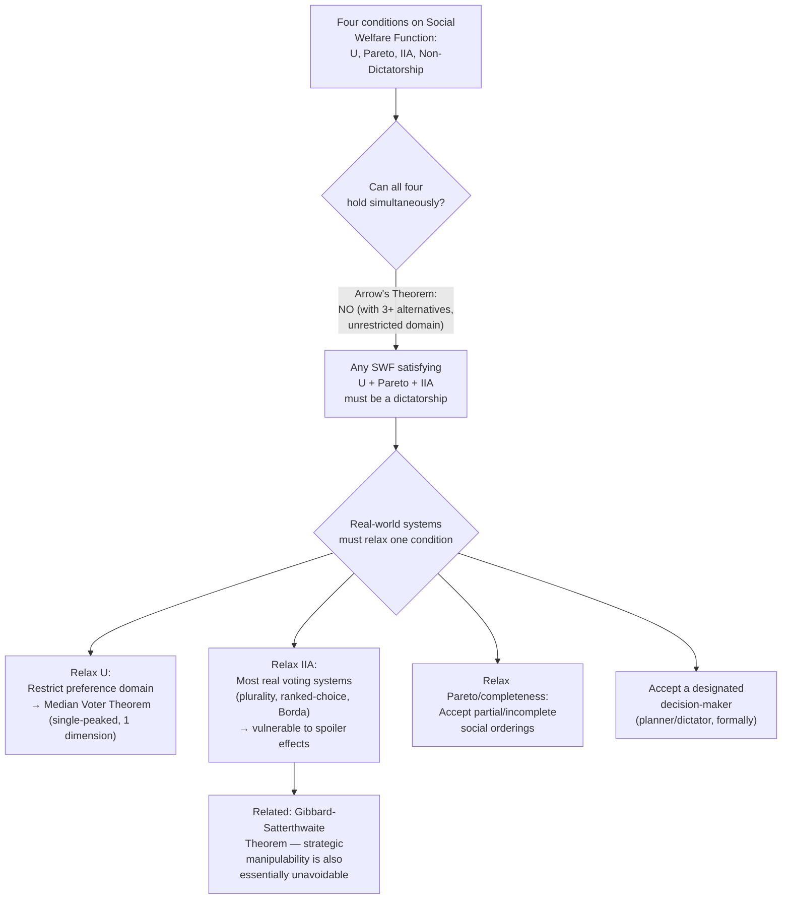

## Arrow's Impossibility Theorem


### Overview

Arrow's Impossibility Theorem, proven by Kenneth Arrow (1951, in *Social Choice and Individual Values*), is one of the most consequential results in social choice theory and public economics: it establishes that **no** social welfare function — no rule for aggregating individual preferences into a collective/social ranking — can simultaneously satisfy a small set of seemingly mild and reasonable fairness/rationality conditions, except in the degenerate case of dictatorship. It sits at the theoretical foundation of public choice theory, explaining at a deep level why democratic preference aggregation is inherently fraught and providing the formal backdrop against which results like the median voter theorem (which succeeds only by restricting the domain of admissible preferences) should be understood.

### Formal Setup

**The social choice problem**

Consider a society of $n \geq 2$ individuals, each with a complete and transitive preference ordering over a set of at least three social alternatives $\{A, B, C, \ldots\}$. A **social welfare function (SWF)** is a rule that takes any profile of individual preference orderings (one ordering per individual) as input and produces a single social preference ordering over the alternatives as output.

**The desired conditions (Arrow's axioms)**

Arrow specified a set of conditions that any "reasonable" democratic aggregation rule might plausibly be expected to satisfy:

1. **Unrestricted domain (U)**: the SWF must produce a valid social ordering for *any* possible profile of individual preferences (no preferences are excluded from consideration a priori).
2. **Pareto efficiency / weak Pareto principle (P)**: if every individual prefers alternative $A$ to $B$, the social ordering must also rank $A$ above $B$.
3. **Independence of irrelevant alternatives (IIA)**: the social ranking between any two alternatives $A$ and $B$ should depend only on individuals' relative rankings of $A$ versus $B$, not on how they rank some third, "irrelevant" alternative $C$.
4. **Non-dictatorship (D)**: there is no single individual whose preferences alone always determine the social ordering regardless of all other individuals' preferences.

### The Theorem

**Statement**

Arrow proved that when there are at least three distinct social alternatives and an unrestricted domain of admissible individual preferences, **no social welfare function can simultaneously satisfy Unrestricted Domain, Pareto Efficiency, Independence of Irrelevant Alternatives, and Non-Dictatorship.** Any SWF satisfying the first three conditions must be a dictatorship (violating the fourth); equivalently, any non-dictatorial SWF must violate at least one of Unrestricted Domain, Pareto Efficiency, or IIA.

**Why this is startling**

Each individual condition, in isolation, appears to be an extremely modest and uncontroversial requirement for a fair, rational social decision procedure — Arrow's result shows that this modest-seeming set of requirements is, in combination, **logically inconsistent** with any non-dictatorial rule. This is a pure mathematical/logical impossibility result, not an empirical claim about any particular voting system's practical performance — it applies to *any* conceivable rule for aggregating complete, transitive individual preference orderings into a social ordering, not merely to commonly used voting systems like plurality or ranked-choice voting.

### Proof Intuition (Non-Technical Sketch)

**The role of IIA in generating cycles/dictatorship**

A key intuition (though the full formal proof is intricate) is that the combination of Pareto efficiency and IIA, applied across a sufficiently rich set of preference profiles, forces the social ranking between any pair of alternatives to be determined by a **single, fixed "decisive" individual or coalition** that ends up controlling the outcome for that pairwise comparison — and through a chain of argument across multiple pairs of alternatives, this decisive power can be shown to concentrate onto a single individual across *all* pairs simultaneously, which is precisely the definition of a dictator. Various proof strategies exist in the literature (e.g., using "decisive coalition" arguments, or via the "field expansion" and "pivotal voter" techniques), but all establish the same underlying logical necessity.

### Relationship to the Condorcet Paradox

**Arrow's theorem as a generalization**

The Condorcet paradox — the observation that majority-rule pairwise voting can produce cyclical (non-transitive) social preferences even when every individual's own preferences are transitive (A beats B, B beats C, C beats A in pairwise majority votes, so no alternative is a stable "winner") — is a specific illustration of the underlying tension Arrow's theorem generalizes and formalizes. Simple majority rule is one candidate SWF; Arrow's theorem shows that the Condorcet paradox is not a quirky flaw specific to majority rule but reflects a *deeper, unavoidable* impossibility that afflicts essentially every conceivable non-dictatorial aggregation rule, not majority rule alone.

### How Real Voting Systems "Escape" the Theorem

Since actual societies do make collective decisions despite the theorem, it is important to understand precisely which of Arrow's conditions real-world institutions typically relax or violate — the theorem does not imply collective decision-making is literally impossible, only that any working system must give up at least one of the four axioms:

| Escape Route | Mechanism | Example |
| --- | --- | --- |
| **Restrict the domain (relax U)** | Limit admissible preferences to a subset (e.g., single-peaked preferences over one dimension) | Median voter theorem — a stable, non-dictatorial, Pareto-consistent outcome (the median) exists once preferences are restricted to be single-peaked over a single dimension |
| **Relax IIA** | Allow the social ranking of $A$ vs. $B$ to depend on how alternatives are ranked relative to others (e.g., cardinal information, not just ordinal rankings) | Most familiar voting systems (plurality, ranked-choice/instant-runoff, Borda count) violate IIA — adding or removing a losing candidate can change which of two other candidates wins, a widely-documented practical phenomenon (e.g., "spoiler" effects in plurality elections) |
| **Relax Pareto or allow intransitive/incomplete social orderings** | Accept a rule that occasionally fails to rank all alternatives, or doesn't guarantee unanimity always prevails | Some mechanisms explicitly trade off strict Pareto consistency for other desired properties |
| **Accept dictatorship (or a restricted/benevolent-planner variant)** | A designated single decision-maker (a planner, judge, or elected executive within their sphere of authority) simply is the decision rule for a given domain | Not a "solution" in a normative-democratic sense, but formally satisfies U, P, and IIA — illustrating why dictatorship "must" appear as the residual admissible category once the other three are jointly imposed |

### Related and Subsequent Results

**Gibbard-Satterthwaite theorem**

A closely related impossibility result (Gibbard 1973, Satterthwaite 1975) shows that essentially **any** non-dictatorial voting rule for selecting a single winner among three or more alternatives is vulnerable to **strategic manipulation** — some voter, in some circumstance, has an incentive to misrepresent their true preferences to obtain a more favorable outcome. This is often presented alongside Arrow's theorem as a companion result establishing that the difficulties of collective choice extend beyond preference aggregation itself to strategic voting behavior under virtually any realistic voting mechanism.

**Sen's Liberal Paradox**

Amartya Sen (1970) extended the impossibility framework by showing a further tension between a minimal notion of individual liberty (each individual has decisive power over at least one purely "personal" choice) and the Pareto principle — another important variant demonstrating how seemingly modest, individually reasonable conditions on a social choice procedure can jointly be inconsistent.

**Practical relevance despite the impossibility**

Arrow's theorem does not imply that all voting/aggregation rules are equally flawed or equally unusable in practice — considerable subsequent work in social choice theory (Amartya Sen, and later voting-theory scholarship) has characterized the specific trade-offs, vulnerabilities, and relative practical performance of different real-world voting rules (Borda count, approval voting, ranked-choice/instant-runoff, Condorcet methods) given that all must violate at least one Arrow condition — the theorem reframes voting-system design as a problem of *choosing which desirable property to sacrifice*, rather than a search for a flawless rule. [Inference: which specific trade-off is "best" for a given application remains a genuinely contested normative and practical question in voting-system design, not one the theorem itself resolves.]

### Diagram: Arrow's Theorem Structure





```
### Worked Example: Illustrating IIA Violation

Consider three voters ranking three alternatives (A, B, C) using the Borda count (a common non-dictatorial ranking method assigning points: 2 for first choice, 1 for second, 0 for third, summed across voters), to illustrate concretely how a familiar rule violates IIA.

**Initial preferences:**
- Voter 1: A > B > C
- Voter 2: A > B > C
- Voter 3: B > C > A

**Borda scores**: A = 2+2+0 = 4; B = 1+1+2 = 4; C = 0+0+1 = 1. **Result: A and B tie for first**, with C last.

Now suppose alternative C is removed entirely from consideration (perhaps a candidate withdraws), leaving only A and B, with each voter's relative ranking of A vs. B **unchanged**:
- Voter 1: A > B
- Voter 2: A > B
- Voter 3: B > A

**Recomputed Borda scores** (now only 2 alternatives, 1 point for first, 0 for second): A = 1+1+0 = 2; B = 0+0+1 = 1. **Result: A wins outright.**

Removing the "irrelevant" alternative C — despite no voter changing their relative ranking of A versus B — changed the social outcome from a tie to a clear win for A. This is a direct, concrete violation of Independence of Irrelevant Alternatives, illustrating precisely the kind of failure Arrow's theorem proves is unavoidable (in some form) for any non-dictatorial rule once three or more alternatives and an unrestricted preference domain are in play.

### Related Topics
- Median voter theorem
- Condorcet paradox and voting cycles
- Gibbard-Satterthwaite theorem and strategic voting
- Sen's Liberal Paradox
- Social welfare functions and welfare economics
- Borda count and alternative voting systems
- McKelvey's chaos theorem
- Structure-induced equilibrium (Shepsle)


```