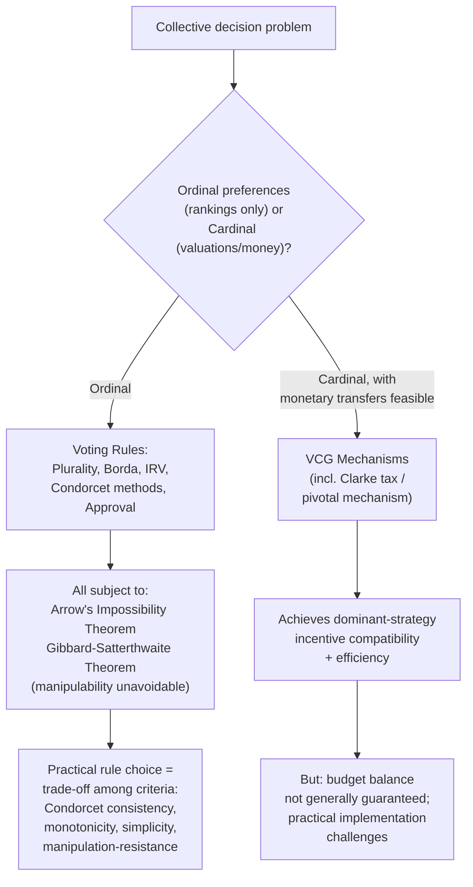

## Voting Rules and Mechanism Design


### Overview

This item surveys the range of concrete voting rules used to aggregate preferences into collective decisions, and situates them within mechanism design — the broader theory of designing rules (mechanisms) so that self-interested agents, acting strategically in their own interest, produce socially desirable outcomes. It builds directly on Arrow's Impossibility Theorem and the Gibbard-Satterthwaite theorem, applying their implications to the practical comparison and design of real voting institutions.

### Catalog of Voting Rules

**Plurality (first-past-the-post)**

Each voter casts one vote for a single preferred alternative; the alternative with the most votes wins, regardless of whether it secures a majority. Simple and widely used, but notoriously vulnerable to the **spoiler effect** (a similar third candidate splitting votes from a leading candidate, allowing a less broadly preferred alternative to win) and can select a Condorcet loser (an alternative that would lose in pairwise comparison to every other alternative) under certain preference distributions.

**Majority runoff (two-round system)**

If no candidate secures an outright majority in the first round, a second round runoff is held between the top two finishers. Reduces (but does not eliminate) some spoiler-effect vulnerability relative to simple plurality, at the administrative cost of requiring a second voting round.

**Ranked-choice voting / Instant-runoff voting (RCV/IRV)**

Voters rank alternatives in order of preference; if no candidate has a majority of first-preference votes, the last-place candidate is eliminated and their votes redistributed to those voters' next-preferred remaining candidate, iterating until one candidate has a majority. Reduces simple vote-splitting relative to plurality, but can still exhibit non-monotonicity (a candidate can, in some preference configurations, be made *worse off* by receiving *more* first-preference support) and remains vulnerable to some forms of strategic voting, consistent with the Gibbard-Satterthwaite theorem's general finding.

**Borda count**

Voters rank all alternatives; points are assigned based on rank position (e.g., $n-1$ points for first place, $n-2$ for second, down to 0 for last) and summed across voters, with the highest total winning. Uses more information from voters' full rankings than plurality, but is a canonical illustration of IIA violation (as demonstrated in the previous item's worked example) and is particularly susceptible to strategic manipulation via "burying" (ranking a strong rival artificially low).

**Approval voting**

Voters may vote for ("approve") as many alternatives as they wish, with no ranking; the alternative receiving the most approvals wins. Simple to administer and to strategize about (approve any alternative preferred to the expected winner), and has attracted theoretical interest for tending to select broadly acceptable "consensus" candidates rather than narrowly-preferred plurality winners, though it does not escape the general Gibbard-Satterthwaite manipulability result either.

**Condorcet methods**

A family of methods (e.g., Copeland's method, the Schulze method, ranked pairs) explicitly designed to select the **Condorcet winner** — the alternative that would defeat every other alternative in pairwise majority comparison — whenever one exists. These methods differ primarily in their tie-breaking/resolution procedure for the (guaranteed-possible, per the Condorcet paradox) case where no Condorcet winner exists due to a majority-rule cycle.

### Criteria for Comparing Voting Rules

Formal social choice theory evaluates voting rules against a battery of desirable properties, no single rule satisfying all of them simultaneously (a direct practical manifestation of Arrow's theorem):

| Criterion | Definition | Plurality | Borda | IRV | Condorcet Methods | Approval |
| --- | --- | --- | --- | --- | --- | --- |
| **Condorcet consistency** | Selects the Condorcet winner when one exists | Generally No | Generally No | Generally No | Yes (by construction) | Generally No |
| **Majority criterion** | Selects a candidate with a first-preference majority, if one exists | Yes | Not guaranteed | Yes | Yes (majority implies Condorcet winner) | Not directly applicable (no ranking) |
| **Monotonicity** | More support for a candidate never hurts that candidate | Yes | Yes | **No** (documented failure mode) | Varies by specific method | Yes |
| **Independence of Irrelevant Alternatives (IIA)** | Adding/removing a losing alternative doesn't change the relative ranking of others | No | No | No | No (per Arrow, no rule fully satisfies this with 3+ alternatives) | No |
| **Resistance to strategic manipulation** | Voters cannot benefit from insincere voting | No (per Gibbard-Satterthwaite, no non-dictatorial rule with 3+ alternatives is fully strategy-proof) | No | No | No | No |

### Mechanism Design: The Broader Framework

**From voting rules to general mechanism design**

Mechanism design generalizes beyond pure voting rules to the broader engineering question: given that agents hold private information about their own preferences (or costs, valuations, etc.) and will act strategically to advance their own interests, how should a rule (a "mechanism") be designed to produce a desired social outcome, accounting for the fact that participants may misrepresent their private information if doing so benefits them? Voting rules are a specific class of mechanisms (for aggregating ordinal preference information); the theory more broadly also covers auction design, public goods provision mechanisms, and matching markets.

**Strategy-proofness and dominant-strategy incentive compatibility**

A mechanism is **strategy-proof** (dominant-strategy incentive-compatible) if truthful reporting of one's private preferences is a dominant strategy for every participant — no agent can ever benefit from misrepresenting their true preferences, regardless of what others do. The Gibbard-Satterthwaite theorem establishes that, for the specific problem of selecting a single winner from three or more alternatives via a voting rule, **no non-dictatorial rule can be fully strategy-proof** — some version of the trade-off between fairness/non-dictatorship and manipulability is unavoidable in this domain.

**The Vickrey-Clarke-Groves (VCG) mechanism as a contrasting success case**

A notable *positive* result in mechanism design — often taught in contrast to the negative voting-theory results above — is the **VCG mechanism**, applicable to a different but related class of problems (particularly public goods provision and auction settings where preferences can be expressed cardinally, i.e., with intensity/monetary valuations, not merely ordinal rankings). VCG mechanisms achieve dominant-strategy incentive compatibility (truthful revelation of valuations is a dominant strategy) and efficiency (the socially efficient outcome is selected) simultaneously — illustrating that the Gibbard-Satterthwaite/Arrow impossibility results are specific to the **ordinal preference aggregation** setting, and that allowing **cardinal/monetary** preference information (as VCG mechanisms do, via transfers/payments) can escape some of the sharpest impossibility results, at the cost of requiring a mechanism that involves monetary transfers, which may not be feasible or desirable in pure voting/political contexts.

**Application: the Clarke tax / pivotal mechanism for public goods**

A specific and well-known VCG application (the "Clarke tax," or pivotal mechanism) addresses the classic public-goods free-rider problem discussed elsewhere in public economics: it induces individuals to truthfully reveal their valuation for a public good by charging each individual a tax equal to the net cost their participation imposes on the rest of the group (the amount by which their reported preference changed the outcome relative to what it would have been without them), aligning individual incentives with truthful revelation — though real-world implementation faces significant practical obstacles (budget balance is not generally achieved — the mechanism can run a deficit or surplus rather than exactly breaking even — and the mechanism can be complex to explain and administer), which is why it remains primarily a theoretical benchmark rather than a widely deployed real-world public goods financing mechanism. [Inference: the gap between the Clarke tax's theoretical elegance and its practical adoption is a standard point made in the mechanism design literature, reflecting real implementation obstacles rather than a flaw in the underlying theory itself.]

### Diagram: Voting Rules and Mechanism Design Landscape





```
### Worked Example: Strategic Voting under Plurality

Consider three voters with true preferences over candidates X, Y, Z:
- Voter 1: X > Y > Z
- Voter 2: X > Y > Z
- Voter 3: Y > Z > X

Under **sincere plurality voting** (each voter votes for their top choice): X gets 2 votes (Voters 1, 2), Y gets 1 vote (Voter 3). **X wins.**

Now suppose a fourth voter type is introduced — the electorate expands to include two voters with preference Z > Y > X, alongside the original three:
- Voter 1: X > Y > Z
- Voter 2: X > Y > Z
- Voter 3: Y > Z > X
- Voter 4: Z > Y > X
- Voter 5: Z > Y > X

**Sincere plurality**: X = 2, Y = 1, Z = 2 — a tie between X and Z, with Y (which a majority of voters — 3 of 5 — actually prefer to X, and a majority also prefer to Z) receiving the fewest votes despite arguably being the Condorcet winner in this configuration (check: Y vs X — Voters 3,4,5 prefer Y, 3-2 majority; Y vs Z — Voters 1,2,3 prefer Y, 3-2 majority). This illustrates concretely how plurality voting can fail to select the Condorcet winner, motivating the design of alternative rules (Condorcet methods, by construction, would select Y here) — and simultaneously illustrates the strategic-voting incentive: Voter 3, recognizing that sincerely voting for Y risks a tie/loss to X or Z, achieves no additional benefit from strategic behavior in this specific case since Y is already receiving votes, but in modified vote distributions, voters recognizing their sincere top choice is unlikely to win often have an incentive to instead vote for their preferred *viable* candidate — the core strategic-voting phenomenon (sometimes summarized as "don't waste your vote") that plurality systems are particularly prone to, consistent with the general Gibbard-Satterthwaite prediction that no such rule is fully strategy-proof.

### Related Topics
- Arrow's Impossibility Theorem
- Median voter theorem
- Condorcet paradox and voting cycles
- Gibbard-Satterthwaite theorem
- Vickrey-Clarke-Groves (VCG) mechanisms
- Public goods and the free-rider problem
- Auction theory and mechanism design
- Sen's Liberal Paradox


```