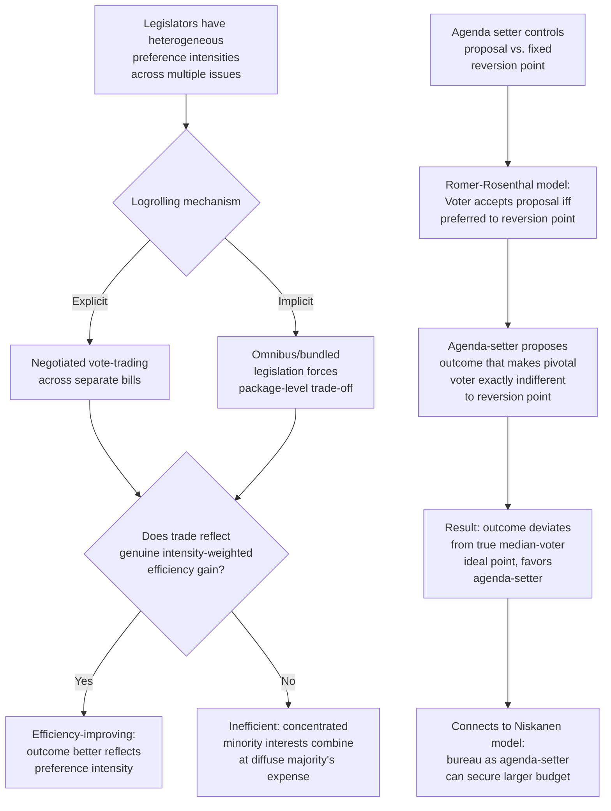

## Logrolling and Agenda Setting


### Overview

Logrolling and agenda setting are two closely related mechanisms through which legislative and committee outcomes can diverge from what simple majority-rule preference aggregation alone would predict. Logrolling refers to vote-trading among legislators with differing preference intensities across issues; agenda setting refers to the strategic power held by whoever controls the sequence and structure of votes. Both are central to explaining real legislative behavior in ways the baseline median voter theorem and Arrow/Gibbard-Satterthwaite frameworks do not directly capture, since both introduce considerations — intensity of preference and control over procedure — that lie outside simple ordinal preference aggregation.

### Logrolling

**Definition and basic mechanism**

Logrolling is the practice of vote-trading: a legislator agrees to support another legislator's preferred proposal in exchange for reciprocal support on a proposal the first legislator cares more intensely about. It arises naturally when legislators have **heterogeneous preference intensities** across issues — a legislator may be only mildly opposed to Issue A but very strongly in favor of Issue B, creating gains from trade with another legislator who has the reverse intensity pattern.

**Why logrolling can improve efficiency**

Because logrolling allows legislators to effectively "trade" influence across issues in proportion to how strongly they care about each, it can move outcomes closer to an efficient allocation that reflects the *intensity*, not merely the ordinal direction, of preferences — a legislator who cares intensely about Issue B but is indifferent on Issue A benefits more from securing a win on B (via trading away support on A) than from a simple up-or-down vote on each issue in isolation, which would treat all "yes" and "no" votes as equally weighted regardless of intensity. This connects to a long-standing critique of simple majority voting: unweighted majority rule can produce outcomes that are Pareto-inferior to what a system incorporating preference intensity would produce, since it ignores how strongly each voter feels.

**Formal illustration: the logic of vote trading**

Consider two bills, A and B, each of which a simple majority of legislators mildly opposes on its own — under separate up-or-down votes, both bills fail. But suppose a minority who intensely favor bill A and a different minority who intensely favor bill B agree to trade votes (the A-supporters vote for B, and the B-supporters vote for A) — both bills can now pass, even though each was individually opposed by a majority voting sincerely. Whether this outcome is efficiency-improving or efficiency-reducing depends critically on whether the intensity of the trading minorities' preferences for passage genuinely outweighs the (diffuse, possibly weaker but majority-held) opposition — logrolling can produce genuinely efficient outcomes that better reflect preference intensity, **or** it can produce inefficient outcomes where two small, intense minorities combine to pass mutually beneficial-to-them-but-net-costly-to-society legislation at the expense of a broader, less organized majority (a connection to the concentrated-benefits/diffuse-costs dynamic central to interest-group and rent-seeking theory).

**Implicit vs. explicit logrolling**

- **Explicit logrolling**: an overt, negotiated exchange of votes on separate, distinct bills.
- **Implicit logrolling**: achieved through **omnibus bills** or bundled legislation — combining multiple distinct policy provisions into a single up-or-down vote, so that a legislator who strongly favors one component but opposes another must vote on the *package* as a whole, effectively forcing the same kind of intensity-weighted trade-off as explicit vote-trading, but embedded within the bill's design rather than negotiated openly between legislators.

### Agenda Setting

**The agenda setter's structural power**

As established by the instability results under multidimensional voting (McKelvey's chaos theorem, covered under the median voter theorem and Arrow's theorem items), majority-rule outcomes in multidimensional or cyclical preference environments are highly sensitive to the specific **sequence** in which pairwise alternatives are voted upon. Whoever controls this sequence — the agenda setter — can exploit this sensitivity to systematically steer outcomes toward their own preferred result, even without any formal veto power or extra voting weight.

**The Romer-Rosenthal agenda-setter model**

Formalized by Thomas Romer and Howard Rosenthal (1978), this model captures a specific, empirically important agenda-setting structure: a single agenda-setter (e.g., a school board, bureau, or committee chair) proposes a single specific alternative, which is then voted up-or-down against a fixed **reversion point** (a status-quo outcome that automatically takes effect if the proposal is rejected) — critically, voters/legislators are **not** free to counter-propose or select their own ideal point; they can only accept the agenda-setter's specific offer or fall back to the reversion point.

**Key result: agenda-setter can secure outcomes above the median voter's ideal point**

Because voters can only compare the agenda-setter's proposal to the (possibly unattractive) reversion point — not to their own true ideal point — the agenda-setter can propose an alternative that is **worse for the median voter than their true ideal point, but still better than the reversion point**, and rational voters will approve it rather than fall back to the even-less-preferred status quo. The agenda-setter's optimal strategy is to propose the alternative that makes the median voter (or whichever voter is pivotal) exactly indifferent between the proposal and the reversion point — extracting the maximum surplus the agenda-setter can secure without triggering rejection.

$$U_{median}(\text{Proposal}^*) = U_{median}(\text{Reversion Point})$$

This equation defines the agenda-setter's optimal proposal: the point along the agenda-setter's preferred direction from the reversion point at which the pivotal voter is just barely willing to accept rather than reject.

**Connection to bureaucratic budget models**

This model directly extends and interacts with the Niskanen budget-maximizing bureaucracy framework covered elsewhere in this course: a budget-maximizing bureau or school board that also controls the specific agenda (the particular budget proposal put to referendum, against a fixed statutory reversion-point budget, often set deliberately low or unattractive by law) can secure a budget systematically larger than what the true median-voter-preferred budget level would be under free, unconstrained choice — illustrating how formal agenda-control power compounds with, rather than substitutes for, the information-asymmetry-based bureaucratic overexpansion mechanism in Niskanen's original model.

### Interaction between Logrolling and Agenda Control

**Agenda control over logrolling opportunities**

An agenda setter with power over the sequence and structure of votes (e.g., whether to allow separate votes on bill components or force a single omnibus vote) can significantly shape *whether* and *how* logrolling opportunities arise — bundling provisions into a single vote (implicit logrolling) is itself a form of agenda control, and a strategic agenda-setter can choose whether to bundle or separate provisions specifically to engineer a particular coalition and outcome.

**Committee gatekeeping power**

In many legislatures, committees hold **gatekeeping power** — the ability to block a bill from reaching the floor for a vote at all, effectively acting as an agenda-setting veto point prior to any floor vote occurring. This committee-level agenda control is a key mechanism through which Shepsle's "structure-induced equilibrium" concept (introduced under the median voter theorem item) operates in practice: committee jurisdictions and gatekeeping authority impose institutional structure that can produce stable, predictable legislative outcomes even in a genuinely multidimensional policy space that would otherwise be subject to McKelvey-style cycling.

### Diagram: Logrolling and Agenda-Setting Mechanisms





```
### Worked Example: Romer-Rosenthal Agenda Setting

Suppose a school board (the agenda-setter) proposes an annual budget $B$, to be voted on by the median voter/taxpayer, against a statutory reversion point of $B_{reversion} = \$2{,}000$ per pupil (a low, unattractive fallback level set by state law if the referendum fails). Suppose the median voter's utility over the budget is quadratic in distance from their true ideal point $B_m^* = \$6{,}000$:

$$U_{median}(B) = -(B - 6{,}000)^2$$

**Reversion point utility**: $U_{median}(2{,}000) = -(2{,}000 - 6{,}000)^2 = -16{,}000{,}000$

**Agenda-setter's optimal proposal**: the school board (which prefers a higher budget than the median voter, say its own ideal point is $B_{board}^* = \$12{,}000$) will propose the *highest* budget $B^*$ at which the median voter is still just indifferent between accepting and falling back to the reversion point:
$$-(B^* - 6{,}000)^2 = -16{,}000{,}000 \Rightarrow (B^* - 6{,}000)^2 = 16{,}000{,}000 \Rightarrow B^* - 6{,}000 = \pm 4{,}000$$

Since the school board prefers the higher value, it proposes $B^* = \$10{,}000$ (rather than the lower root, \$2,000, which is the reversion point itself). The median voter is exactly indifferent between \$10,000 and the \$2,000 reversion point, and — given the board's proposal is (marginally) preferred — rationally votes to approve it, despite $10{,}000 substantially exceeding their own true ideal budget of \$6,000. This illustrates concretely how agenda-control power allows the proposer to secure an outcome well above the median voter's genuine preference, purely through control of the proposal structure and the (statutorily fixed, unattractive) reversion point — without any need for the board to misrepresent information or violate any voter's formal voting rights.

### Related Topics
- Median voter theorem
- Niskanen model of budget-maximizing bureaucracy
- McKelvey's chaos theorem
- Structure-induced equilibrium (Shepsle)
- Rent-seeking and concentrated benefits/diffuse costs
- Arrow's Impossibility Theorem
- Interest group theory and collective action (Olson)
- Legislative committee structure and gatekeeping


```