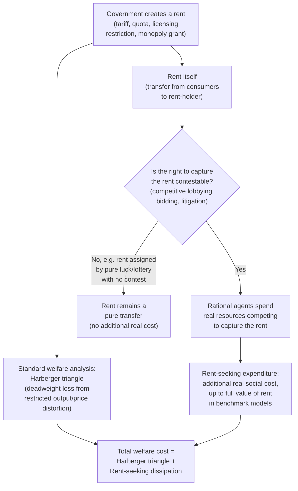

## Rent-Seeking and Directly Unproductive Activities


### Overview

Rent-seeking refers to the expenditure of real resources to capture, create, or preserve an economic rent (a return above what would be earned in a competitive market) through non-productive means — typically by influencing government policy — rather than through the production of genuine goods or services. Directly Unproductive Profit-seeking (DUP) activities, a closely related and broader concept introduced by Jagdish Bhagwati, generalize this idea to any profit-generating activity that yields pecuniary returns to the individual without directly producing goods or services that themselves enter a utility or production function. Both concepts are central to public choice's account of the real resource costs of political intervention in the economy, extending the efficiency analysis of government beyond the standard deadweight-loss triangle of a single distorted market.

### Theoretical Foundation

**Origins: Tullock's reformulation of monopoly welfare loss**

Gordon Tullock's foundational 1967 paper identified a cost of monopoly (and of tariffs, and of theft) that standard welfare analysis of the era largely overlooked: the conventional "Harberger triangle" measures only the static deadweight loss from monopoly pricing (the wedge between marginal cost and price restricting output below the competitive level), but Tullock observed that the **monopoly rent itself** (the "rectangle" of above-normal profit a monopolist captures) is not simply a costless transfer from consumers to the monopolist — because the *opportunity* to capture that rent (e.g., by lobbying for a government-granted monopoly license, tariff protection, or exclusive franchise) will attract competitive expenditure of real resources by multiple rival claimants seeking to be the one who captures it.

**The core insight: rent-seeking competition dissipates the rent itself**

If a valuable government-created rent (e.g., an import quota license worth $1 million annually) is available to be won through some contest-like process (lobbying, bribery, litigation, political campaign contributions), rational competing claimants will individually be willing to spend up to the expected value of the prize on rent-seeking activity to improve their odds of winning it. In a symmetric competitive rent-seeking equilibrium, the **aggregate resources spent competing for the rent can approach or even exceed the value of the rent itself**, transforming what conventional analysis treated as a pure (efficiency-neutral) transfer into an **additional, real social cost** on top of the standard deadweight-loss triangle from the underlying market distortion.

**Formal illustration (contest/lottery model)**

In the simplest symmetric rent-seeking contest model, if $n$ identical risk-neutral agents compete for a prize (rent) of value $V$, and each agent's probability of winning is proportional to their own expenditure $e_i$ relative to the sum of all expenditures:

$$p_i = \frac{e_i}{\sum_{j=1}^n e_j}$$

each agent chooses $e_i$ to maximize expected payoff $p_i V - e_i$. In the symmetric Nash equilibrium with $n$ identical contestants, individual and aggregate expenditure can be derived as a function of $n$ and $V$; the canonical result of the simplest baseline case (two symmetric risk-neutral contestants under this specific contest-success function) is that **aggregate rent-seeking expenditure equals the full value of the prize** ($\sum e_i = V$), meaning the entire rent is dissipated in the competition to capture it — a widely cited benchmark result, though the precise magnitude of dissipation is sensitive to the number of contestants, risk attitudes, and the specific functional form of the contest-success function assumed, and full 100% dissipation is a special-case result rather than a universal prediction across all rent-seeking contest specifications. [Inference: the "full dissipation" result is the standard illustrative benchmark from the simplest symmetric contest model; richer models with risk aversion, asymmetric contestants, or different contest technologies generally predict partial (not full) dissipation.]

### Directly Unproductive Profit-Seeking (DUP) Activities: Bhagwati's Generalization

**Broader scope than pure rent-seeking**

Bhagwati's DUP framework (1982) generalizes Tullock's rent-seeking insight beyond activities aimed purely at capturing government-created rents, to encompass **any** profit-seeking activity that generates pecuniary income for the individual/firm engaging in it without directly contributing to the production of goods and services that enter the economy's genuine output — this includes not only lobbying for favorable policy, but also **revenue-seeking** (seeking tariffs or quotas specifically to capture the resulting economic rent), tariff evasion/smuggling in response to trade restrictions, and other resource-consuming responses to policy-created distortions or opportunities.

**Distinguishing DUP activities from ordinary rent-seeking**

Rent-seeking, in its classic Tullock formulation, is typically specifically about competing to *capture* an already-created rent (e.g., competing for a fixed number of import licenses). DUP activities more broadly include cases where the profit-seeking activity's *purpose* is to bring the policy distortion (and its associated rent) into existence in the first place (e.g., lobbying for the tariff to be imposed at all, not merely competing for the license once it exists) — Bhagwati's framework treats both the rent-*creation* and rent-*capture* stages as potentially resource-consuming, unproductive activities.

### Examples across Public Economics Contexts

**Tariff/quota rent-seeking**

The canonical Tullock example: firms compete (via lobbying expenditure, political contributions, or direct bribery of licensing officials) for the right to import under a restrictive quota, dissipating some or all of the quota rent (the gap between the domestic protected price and the world price, multiplied by quota quantity) in the competitive process of securing the license.

**Tax and subsidy lobbying**

Firms and industries expend real resources (lobbyists, legal/accounting specialists, campaign contributions, public relations campaigns) seeking favorable tax treatment, targeted subsidies, or regulatory exemptions — resources that, in a counterfactual world without the possibility of capturing such targeted government favor, could instead have been devoted to genuinely productive activity (R&D, capital investment, production).

**Regulatory capture and licensing restrictions**

Incumbent firms in a regulated industry may expend resources not on improving their product or lowering costs, but on securing regulatory barriers to entry (occupational licensing requirements, zoning restrictions, certificate-of-need laws) that protect their existing rents from potential new competitors — a documented pattern in the regulatory-capture literature (associated with George Stigler's economic theory of regulation), overlapping substantially with the rent-seeking framework.

**Litigation and patent trolling**

Some legal/intellectual-property-related activity — strategic litigation pursued primarily to extract settlement value rather than to resolve a genuine underlying dispute, or "patent trolling" (acquiring patents solely to extract licensing fees or settlements through litigation threats rather than to produce anything) — has been analyzed within the DUP/rent-seeking framework as a modern application of the same underlying logic.

### Welfare Cost Comparison: Standard Monopoly vs. Rent-Seeking-Augmented Analysis





```
### Policy Implications

**Underestimation of the true cost of protectionism/regulation**
The rent-seeking/DUP framework implies that conventional trade-policy or regulatory cost-benefit analyses, which typically measure only the standard deadweight-loss triangle, can substantially **understate** the true social cost of tariffs, quotas, and rent-generating regulations, since they omit the potentially large additional cost of resources consumed in competing for the created rents — a point with direct implications for the political economy of trade protection and regulatory design.

**Design implications: reducing rent-seeking incentives**
Given that rent-seeking costs arise specifically from the *contestability* of a valuable government-created rent, several design responses are commonly discussed in the literature:
- **Auctioning rather than lobbying-based allocation**: if a scarce right (e.g., an import quota, a broadcast spectrum license) must be created, allocating it via competitive auction (with the revenue captured by the public treasury) rather than through an administrative/political process subject to lobbying can convert what would be wastefully dissipated rent-seeking expenditure into public revenue instead — the auction still involves competitive bidding, but the resources "spent" (the winning bid) accrue to the public rather than being consumed unproductively in the contest itself.
- **Minimizing discretionary, rent-creating interventions in the first place**: since the root cause is the *existence* of a valuable, contestable rent, the most direct policy response is simply avoiding the creation of unnecessary rents (e.g., preferring broad-based, non-discretionary tax/regulatory rules over case-by-case discretionary favors, which are the primary target of lobbying activity).
- **Transparency and procedural reforms**: reducing the returns to covert influence-seeking (disclosure requirements for lobbying and campaign contributions) is sometimes proposed as a partial mitigant, though its effectiveness in genuinely reducing rather than merely redirecting rent-seeking activity is empirically debated. [Unverified: the empirical effectiveness of specific transparency/disclosure reforms in reducing net rent-seeking costs, as opposed to shifting its form, is contested in the literature.]

### Worked Example

Suppose the government is considering imposing an import quota that would create an annual rent of \$50 million (the gap between the protected domestic price and world price, times quota quantity) for whoever holds the import license.

**Standard welfare analysis (ignoring rent-seeking)**: suppose the Harberger deadweight-loss triangle from the quota's output restriction is separately estimated at \$8 million annually — under conventional analysis, this \$8 million figure alone would be reported as "the" efficiency cost of the quota, with the \$50 million rent treated as a pure (efficiency-neutral) transfer from consumers to whoever ends up holding the license.

**Augmented rent-seeking analysis**: if the license is allocated through a politically contestable process (e.g., firms lobbying regulators, each spending resources proportional to their perceived odds of winning), and if the simplest symmetric contest model's full-dissipation benchmark applies even approximately, competing firms could collectively spend **up to an additional \$50 million** (resources with no genuine productive use — lobbyist fees, political contributions, wasted managerial time on securing the license — rather than resources building the good/service purchasers actually value) pursuing the license.

**Total estimated social cost**: $8\text{M (Harberger triangle)} + \text{up to } 50\text{M (rent dissipation)} = \text{up to } 58\text{M}$, a figure potentially **more than seven times larger** than the conventional deadweight-loss-only estimate — illustrating concretely why the rent-seeking/DUP framework is considered a first-order consideration, not a minor refinement, in evaluating the true welfare cost of policies that create valuable, contestable rents. [Inference: this worked example uses illustrative figures and the simplest full-dissipation benchmark for pedagogical clarity; actual rent dissipation in any real case depends on the specific competitive structure of the lobbying/contest process, which is rarely fully characterized empirically with precision.]

### Related Topics
- Logrolling and agenda setting
- Niskanen model of budget-maximizing bureaucracy
- Leviathan hypothesis of government growth
- Stigler's economic theory of regulation and regulatory capture
- Tariffs, quotas, and the economics of protectionism
- Olson's theory of collective action and interest groups
- Public choice theory foundations
- Harberger triangle and standard deadweight loss analysis


```