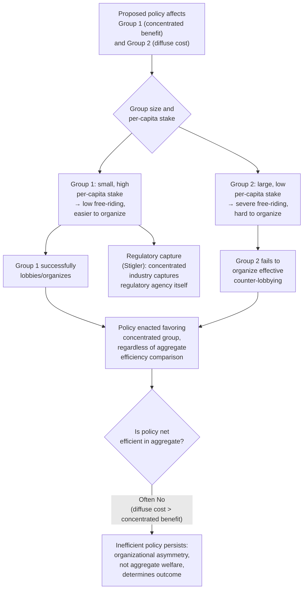

## Interest Groups and Lobbying


### Overview

This item examines the economic theory of interest group formation and lobbying behavior — why some groups organize effectively to influence policy while others, sometimes larger and with more at stake in aggregate, fail to do so, and what this implies for the pattern of policy outcomes actually observed. It builds directly on Mancur Olson's theory of collective action and connects closely to the rent-seeking framework, providing the organizational/collective-action microfoundations for *why* certain rents get created and contested in the first place.

### Olson's Logic of Collective Action

**The core puzzle**

Mancur Olson's *The Logic of Collective Action* (1965) posed a foundational puzzle: if a policy would benefit a large group of people (e.g., all consumers, or all taxpayers), standard intuition might suggest that group should be relatively powerful in the political process, since it represents many people and potentially large aggregate stakes. Olson showed this intuition is frequently backwards — **large, diffuse groups face a severe collective action problem that smaller, concentrated groups do not**, and this asymmetry, not aggregate stakes, largely determines which groups succeed at organizing effective political influence.

**The free-rider problem in group formation**

Lobbying for a favorable policy is itself a kind of **public good** for the members of the affected group: if the lobbying effort succeeds in securing the policy (e.g., a tariff protecting an industry), the benefit accrues to *all* firms in that industry, whether or not any individual firm contributed to the lobbying effort. This creates the same free-rider incentive structure as any public good: each individual firm has an incentive to let others bear the cost of lobbying while it enjoys the resulting benefit, potentially leading to **under-provision of lobbying effort relative to the group's collective interest** — precisely the standard public-goods under-provision result applied to political organization itself.

**Group size and the severity of free-riding**

Olson's key comparative-static insight is that the free-rider problem becomes **more severe as group size increases**: in a very small group (a handful of large firms in a concentrated industry), each member's individual contribution to lobbying has a non-trivial, perceptible effect on the probability of success, and each member captures a large enough share of the resulting benefit to justify contributing — sustaining cooperation is comparatively feasible. In a very large, diffuse group (millions of individual consumers, each affected only slightly by a given tariff), any single individual's contribution has a negligible effect on the outcome, and each individual's own share of the total benefit is tiny, making free-riding the individually rational choice for nearly everyone — collective action becomes correspondingly difficult to sustain absent some additional mechanism.

**Selective incentives as a partial solution**

Olson identified **selective incentives** — benefits available only to actual contributing members, not to free-riders — as a key mechanism by which large groups can sometimes overcome the collective action problem: professional associations, unions, and trade groups frequently bundle genuinely valued private-good benefits (member services, professional certification, group insurance, publications, and social/networking benefits) with membership, using these divisible, excludable benefits to fund the group's lobbying activity (a public good) as a byproduct of a membership decision that is individually rational for reasons independent of the political benefit alone.

### Concentrated Benefits, Diffuse Costs

**The characteristic pattern of inefficient policy**

Combining Olson's collective-action logic with the rent-seeking framework generates a well-known and empirically influential prediction about the *pattern* of policy outcomes: policies that confer **large, concentrated benefits on a small, easily-organized group** while imposing **small, diffuse costs on a large, poorly-organized group** (each individual member of which bears only a small enough cost that lobbying against the policy is not individually worthwhile) are systematically more likely to be enacted than their aggregate efficiency would justify — even when the total cost to the diffuse group exceeds the total benefit to the concentrated group (i.e., even when the policy is net inefficient in aggregate).

**Why this asymmetry produces inefficient policy**

$$\text{Policy likely to pass if: } \underbrace{\text{Concentrated group's organizational advantage}}_{\text{low free-riding, high per-capita stake}} > \underbrace{\text{Diffuse group's organizational advantage}}_{\text{high free-riding, low per-capita stake}}$$

This comparison of *organizational capacity to influence policy* — not a comparison of aggregate social welfare — determines political outcomes under this framework, which is precisely why concentrated-benefit/diffuse-cost policies (tariffs protecting a specific industry at the expense of dispersed consumers, occupational licensing protecting incumbent professionals at the expense of dispersed consumers and would-be new entrants, narrow tax preferences for specific industries funded by the general taxpayer) are a recurring, empirically documented feature of real-world policy landscapes across many political systems, even though each individual such policy may be difficult to justify on pure aggregate-efficiency grounds.

### Lobbying as Investment: The Economics of Political Influence

**Lobbying expenditure as a form of rent-seeking investment**

Building directly on the rent-seeking framework, lobbying expenditure can be modeled as a costly investment made by an interest group to increase its probability of securing a favorable policy outcome (or of preventing an unfavorable one) — connecting the group-formation question (which groups successfully organize, per Olson) to the resource-dissipation question (how much real resource is then spent competing for the resulting rent, per Tullock).

**Informational lobbying vs. pure influence-buying**

The economic literature distinguishes (not always cleanly, in practice) between two conceptually different functions lobbying can serve:

- **Informational lobbying**: interest groups possess and credibly convey genuinely useful technical/factual information to time- and expertise-constrained legislators (about an industry's likely response to a proposed regulation, for instance), potentially improving the *quality* of policy decisions even while advancing the lobbying group's own interest — under this view, lobbying is not purely wasteful DUP activity but can have some genuine informational/productive value.
- **Pure influence-buying / quid pro quo**: lobbying expenditure (campaign contributions, provision of post-office-career employment prospects, direct persuasion unrelated to genuine information transfer) functions primarily to shift policymaker incentives or behavior in the lobbying group's favor, independent of any genuine informational contribution — this is the form of lobbying most directly captured by the pure rent-seeking/DUP framework as a real resource cost with no offsetting social benefit.

Real-world lobbying activity plausibly contains elements of both, and distinguishing empirically between the two functions in any specific case is a genuinely difficult and contested exercise, not one with a clean, settled empirical resolution. [Unverified: the relative empirical prevalence and magnitude of informational versus pure influence-buying lobbying is actively debated in the political economy literature and likely varies substantially by policy domain and institutional context.]

### Regulatory Capture: Stigler's Economic Theory of Regulation

**The capture hypothesis**

George Stigler's influential 1971 paper proposed a reformulation of the theory of regulation: rather than assuming (as the traditional "public interest" theory of regulation did) that regulatory agencies are established and operate to correct market failures for the benefit of the public, Stigler argued that regulation is frequently **acquired by the regulated industry and designed and operated primarily for its benefit** — a direct application of the concentrated-benefits/diffuse-costs and Olsonian organizational-advantage logic to the specific case of regulatory agencies, which regulated industries (a small, well-organized, high-stakes group) have strong incentive and capacity to influence, relative to the diffuse public interest the agency ostensibly serves.

**Mechanisms of capture**

- **Direct lobbying influence** over the legislative mandate establishing or renewing an agency's authority
- **Revolving door dynamics**: regulators who anticipate future employment in the regulated industry may have incentive to regulate favorably toward that industry during their tenure, and industry representatives who move into regulatory positions bring pre-existing industry perspectives/relationships with them
- **Informational asymmetry favoring the regulated industry**: the regulated industry typically possesses far greater technical expertise and information about its own operations than the regulating agency, creating dependence on industry-supplied information that can be exploited (paralleling the information-asymmetry mechanism in the Niskanen bureaucracy model, but applied to industry-regulator rather than bureau-legislature relationships)

### Diagram: Interest Group Formation and Policy Outcome Pattern





```
### Worked Example: Tariff Protection under Olson's Framework

Consider a proposed tariff on imported widgets. The domestic widget industry consists of 20 large firms, each of which would gain \$2 million annually from the tariff (total industry benefit: \$40 million). The tariff would raise consumer prices, imposing a cost of \$8 per year on each of 10 million consumers (total consumer cost: \$80 million).

**Aggregate efficiency comparison**: total cost (\$80 million) exceeds total benefit (\$40 million) — the tariff is **net inefficient** by \$40 million under standard aggregate welfare analysis, and a naive "aggregate interest" theory of politics would predict this tariff should fail to pass.

**Olsonian organizational analysis**:
- **Producer side**: 20 firms, \$2 million each at stake — each firm has strong individual incentive to lobby (its own \$2 million stake is large relative to any plausible cost of lobbying effort), and coordination among only 20 firms (potentially through an existing trade association providing selective incentives) is organizationally feasible.
- **Consumer side**: 10 million consumers, \$8 each at stake — no individual consumer has meaningful incentive to spend any real effort opposing a policy that costs them only \$8/year, and organizing 10 million dispersed individuals to collectively oppose the tariff faces a severe free-rider problem, since any single consumer's opposition effort has a negligible effect on the outcome while its cost (however small) is borne entirely by that individual.

**Predicted outcome**: despite being net inefficient in aggregate, Olson's framework predicts the tariff is **likely to pass**, because the producer group's organizational advantage (concentrated, high per-capita stakes, small group size, feasible coordination) systematically outweighs the consumer group's organizational disadvantage (diffuse, low per-capita stakes, severe free-riding) — illustrating concretely why the concentrated-benefits/diffuse-costs pattern, not aggregate cost-benefit comparison, is the framework's central predictive claim about real-world policy outcomes in this domain.

### Related Topics
- Rent-seeking and Directly Unproductive Activities
- Logrolling and agenda setting
- Stigler's economic theory of regulation
- Public goods and the free-rider problem
- Median voter theorem
- Leviathan hypothesis of government growth
- Tariffs, quotas, and the economics of protectionism
- Niskanen model of budget-maximizing bureaucracy


```