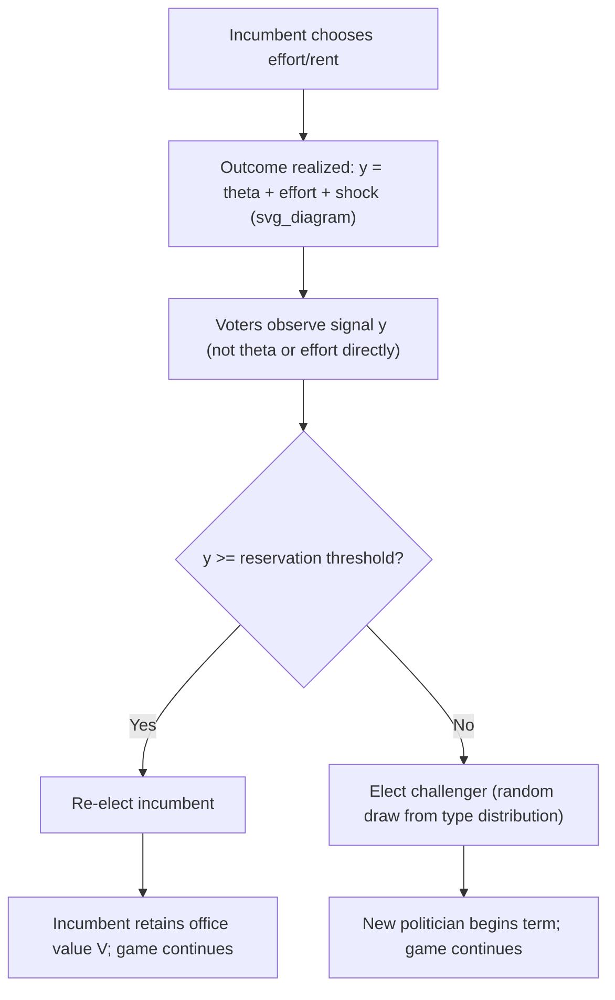

## Political Agency and Electoral Accountability

### Overview

Political agency theory studies the relationship between voters (principals) and elected officials (agents) under conditions of incomplete information and imperfect commitment. It applies the standard principal-agent framework from contract theory to democratic politics, asking how elections can be designed or understood as mechanisms that discipline politicians who might otherwise pursue their own interests — rents, ideology, or shirking — rather than the interests of the citizens they represent.

The core tension arises because voters cannot write enforceable contracts with politicians the way shareholders can with managers. The only instrument available is the vote, exercised periodically, under uncertainty about politician type and effort. This generates two central problems: **adverse selection** (choosing good types ex ante) and **moral hazard** (inducing good behavior ex post). Electoral accountability is the study of how repeated elections mitigate both.

---

### Foundational Framework

#### The Agency Problem in Politics

A politician, once elected, controls policy instruments and has informational or positional advantages over voters. Voters cannot perfectly observe:

- The politician's underlying competence or "type"
- Whether policy outcomes reflect politician effort/ability or exogenous shocks
- Whether rents are being extracted from the public budget

This mirrors the classic principal-agent setup but with distinguishing features:

- The principal (electorate) is a **collective actor** with an aggregation problem (see Public Choice foundations, e.g., Arrow's theorem, median voter theorem)
- The only enforcement device is **re-election or removal**, a blunt, infrequent instrument
- Politicians may differ in exogenous **type** (competent/benevolent vs. corrupt/incompetent) in addition to endogenous **effort**

#### Two Canonical Models

**1. Moral Hazard (Barro-Ferejohn model)**

Politicians choose effort/rent extraction; voters use a retrospective re-election rule to discipline behavior. There is no type uncertainty — the focus is purely on incentivizing effort.

**2. Adverse Selection (Career Concerns / Selection models)**

Politicians differ in fixed, unobserved competence; voters use electoral outcomes to *learn* about type and select good politicians for retention. Effort can also be induced as an artifact of politicians signaling competence (Holmström-style career concerns applied to politics).

Most modern treatments (Besley, 2006; Persson & Tabellini, 2000) combine both: elections perform **selection** (screening) and **sanctioning** (discipline) simultaneously, and these two functions can sometimes conflict.

---

### The Barro-Ferejohn Retrospective Voting Model

#### Setup

- Infinite horizon, discrete periods $t = 1, 2, \ldots$
- An incumbent politician controls a budget/resource $R$ each period
- The politician can allocate $R$ to a public good (benefiting voters) or divert it as **rent** $r$
- Voter utility depends on the public good provision; rent extraction is a pure transfer away from voters
- Voters observe realized utility (or a noisy signal of it) but not the underlying decision directly
- After observing the outcome, voters decide whether to **re-elect** the incumbent or replace with a challenger drawn from the same distribution

#### The Voter's Optimal Strategy: Retrospective Cutoff Rule

Voters commit (implicitly, as an equilibrium strategy) to a threshold rule:

$$\text{Re-elect if } u_t \geq \bar{u}, \quad \text{otherwise remove}$$

where $\bar{u}$ is a reservation utility level. This is a **trigger strategy**: the politician is rewarded with continued tenure only if performance clears the bar.

#### Politician's Incentive Compatibility Constraint

The incumbent compares the payoff from extracting maximal rents today (and losing office) versus extracting less to secure re-election and future rents:

$$r^* + \beta \cdot 0 \quad \text{vs.} \quad r(\bar{u}) + \beta \cdot V^{IC}$$

where $\beta$ is the discount factor and $V^{IC}$ is the expected discounted value of holding office in all future periods under the equilibrium rule. The incumbent restrains rent extraction only if:

$$\beta \cdot V^{IC} \geq r^* - r(\bar{u})$$

**Key Result:** Electoral discipline is stronger when:

- The discount factor $\beta$ is high (politicians value the future — related to term limits, age, career horizon)
- The value of holding office $V^{IC}$ is high (salary, perks, power)
- Voters can set an informative, credible threshold $\bar{u}$

#### The Voter's Commitment Problem

A critical subtlety: voters would like to commit to the threshold rule $\bar{u}$, but *ex post*, once the incumbent has already chosen rent extraction, the voters' decision to re-elect or not is a separate, forward-looking choice — they compare the incumbent to a random challenger. This creates a **rational expectations equilibrium** in which the threshold itself must be consistent with voters' incentives to actually apply it. Because voters are homogeneous and atomized, no single voter can affect the outcome, generating an implicit coordination device via a shared **focal rule**.

**Result — Full Rent Extraction in Some Equilibria:** If $\beta V^{IC}$ is too low, or if the office has no value net of rents, elections cannot discipline any positive rent extraction — the incumbent extracts the maximum, and voters may randomize their re-election decision (mixed strategy) making challengers and incumbents equally likely to be re-elected in expectation. This illustrates that electoral accountability has a *ceiling* determined by the rents available from office.

---

### Career Concerns and Selection Models (Adverse Selection)

#### The Selection Function of Elections

Building on Holmström's (1999) career concerns model, politicians are of unobserved **type** $\theta \in \{\text{good}, \text{bad}\}$ (or a continuous ability distribution). Observed performance is a noisy signal:

$$y_t = \theta + e_t + \varepsilon_t$$

where $e_t$ is effort and $\varepsilon_t$ is noise (e.g., macroeconomic shocks, luck). Voters use Bayesian updating on $y_t$ to form posterior beliefs about $\theta$, then re-elect based on the posterior.

#### Key Insight: Effort and Selection Can Conflict

Politicians may exert effort not to genuinely improve welfare, but to **pool with good types** or **signal competence**, sometimes distorting policy choices:

- **Political budget cycles**: incumbents increase visible spending before elections to signal competence (Rogoff, 1990)
- **Pandering**: politicians choose popular but suboptimal policies to appear aligned with voter preferences rather than revealing unpopular private information (Canes-Wrone, Herron & Shotts, 2001)
- **Short-termism**: incumbents may favor policies with quick, observable payoffs over long-run efficient investments

#### The Selection-Sanctioning Tension (Fearon, 1999; Ashworth, 2012)

Fearon's contribution frames elections as serving two distinct, sometimes conflicting purposes:

| Function | Mechanism | Focus |
| --- | --- | --- |
| **Sanctioning** | Retrospective punishment/reward | Incentivizes effort from a *given* politician (moral hazard) |
| **Selection** | Prospective inference about type | Chooses *better* politicians for future office (adverse selection) |

**[Inference]** A threshold rule optimized purely for sanctioning (maximize effort incentives) is not generally the same rule that optimizes for selection (maximize probability of retaining good types), because a high-powered incentive scheme can induce even bad types to mimic good behavior temporarily, weakening the informativeness of the signal used for selection.

---

### Formal Retrospective Voting Model (Diagram)

---

### Extensions and Refinements

#### 1. Term Limits

Term limits remove the re-election incentive in a politician's final (lame-duck) term, predicting a **discontinuous drop in effort/increase in rent extraction** in last terms — a direct testable implication of the agency model.

- **[Unverified]** Empirical evidence is mixed and context-dependent: some studies (e.g., on U.S. governors) find lame-duck effects on specific policy margins, while others find weak or no effects, suggesting reputation, ideology, or career concerns beyond the current office (e.g., seeking future appointments) can substitute for direct re-election incentives (List & Sturm, 2006).

#### 2. Yardstick Competition

Voters cannot perfectly separate exogenous shocks from politician quality within their own jurisdiction, but they can compare their incumbent's performance to that of **similar jurisdictions** (Besley & Case, 1995). This generates:

$$\text{Re-elect if } y_{it} - y_{-i,t} \geq \bar{u}$$

where $y_{-i,t}$ is the performance of neighboring jurisdictions' incumbents, used to filter out common shocks. This is a direct application of relative performance evaluation (Holmström, 1982) to political markets, and generates empirically testable **yardstick competition** in tax-setting and policy choice across neighboring states/municipalities.

#### 3. Media, Information, and Accountability

Since accountability depends on voters' ability to observe performance, informational intermediaries matter:

- Greater media penetration/free press is associated with improved public service delivery and reduced corruption (Besley & Burgess, 2002; Reinikka & Svensson, 2005 on Uganda newspaper campaign)
- Transparency reforms (audits, freedom-of-information laws, participatory budgeting) function as accountability-enhancing technologies by reducing the noise $\varepsilon_t$ in the signal voters observe

#### 4. Multi-Task Agency and Policy Distortion

When politicians control multiple policy dimensions but voters can only observe/verify some of them (e.g., visible infrastructure spending vs. difficult-to-observe long-run reforms), a **multi-tasking problem** (Holmström & Milgrom, 1991) arises: politicians overinvest in observable/measurable outputs and underinvest in unobservable ones, even if the latter is more socially valuable.

#### 5. Political Budget Cycles

**Key Points:**

- Rogoff (1990) shows that incumbents can strategically shift the *composition* of spending toward visible, election-timed expenditures even without expanding the deficit, to signal competence
- Empirically documented in many democracies, particularly with weaker fiscal transparency institutions and in younger democracies with less-informed electorates (Shi & Svensson, 2006)
- **[Inference]** The magnitude of budget cycles is generally found to be smaller in advanced democracies with strong fiscal institutions and independent media, consistent with the theoretical prediction that better information reduces the returns to signaling through spending manipulation.

---

### Comparative Statics Summary

| Parameter | Effect on Accountability |
| --- | --- |
| Discount factor $\beta$ (politician patience) | Higher $\beta \Rightarrow$ stronger discipline |
| Value of holding office $V$ | Higher $V \Rightarrow$ stronger discipline, but also higher rents extractable in equilibrium |
| Noise in performance signal $\varepsilon$ | Higher noise $\Rightarrow$ weaker selection and sanctioning |
| Availability of comparators (yardstick) | More comparators $\Rightarrow$ better shock-filtering, stronger accountability |
| Term limits | Removes sanctioning motive in final term; may not affect selection motive |
| Media/transparency | Reduces informational noise, improves both selection and sanctioning |

---

### Worked Example

Consider a mayor controlling a budget $R = 100$. The mayor can divert $r \in [0, 100]$ as rent, delivering public services worth $100 - r$ to voters. The value of holding office for one more term is $V = 40$ (in present value terms), and $\beta = 0.9$.

Voter reservation utility (challenger's expected quality) implies a threshold service level of $\bar{u} = 70$, i.e., the mayor must keep $r \leq 30$ to be re-elected.

- If the mayor restrains rent extraction to $r = 30$: payoff $= 30 + \beta V = 30 + 36 = 66$
- If the mayor extracts maximally ($r = 100$, loses re-election): payoff $= 100 + 0 = 100$

Here $100 > 66$, so the mayor **extracts the maximum** and loses office — the electoral mechanism fails to discipline behavior because the office's continuation value is too low relative to available rents. This illustrates the Barro-Ferejohn ceiling: for accountability to bind, we need $\beta V \geq r^{max} - r(\bar u)$, i.e., $36 \geq 70$, which fails.

**If instead** $V = 150$ (higher-value office, e.g., due to higher salary or prestige), then $\beta V = 135 > 70$, and the mayor optimally restrains extraction to secure re-election — accountability succeeds.

---

### Empirical Applications and Measurement

- **Audit studies**: Brazil's anti-corruption municipal audit program (Ferraz & Finan, 2008) found random public disclosure of corruption audit results significantly reduced re-election probability of corrupt incumbents, directly testing the sanctioning channel
- **Close elections / regression discontinuity designs**: widely used to study effects of politician type/party/gender on policy outcomes by comparing narrowly-won elections
- **Panel data on repeated elections**: used to estimate retrospective voting patterns (economic voting literature — voters punishing incumbents for poor macroeconomic performance, sometimes even when performance is due to exogenous factors like weather — see Achen & Bartels' "blind retrospection" critique)

**[Inference]** The "blind retrospection" findings (voters punishing incumbents for events outside their control, e.g., droughts, shark attacks) are often interpreted as evidence *against* the rational Bayesian selection model and in favor of a more heuristic-driven or bounded-rationality account of voter behavior, though this remains an active area of debate in the literature.

---

### Relation to Broader Public Choice Theory

Political agency theory complements but is distinct from:

- **Median voter theorem**: assumes policy converges to voter preferences via competition; agency models allow for *divergence* due to informational frictions even under electoral competition
- **Probabilistic voting models**: focus on platform divergence under uncertainty about voter response; agency models focus on *post-election* behavior given office-holding
- **Rent-seeking theory** (Tullock, Krueger): agency models provide the micro-foundation for *why* rents can persist in equilibrium despite electoral competition

---

### Next Steps

- Median Voter Theorem and Downsian Spatial Competition
- Probabilistic Voting Models
- Rent-Seeking and Directly Unproductive Profit-Seeking (DUP) Activities
- Political Budget Cycles and Fiscal Manipulation
- Yardstick Competition and Fiscal Federalism
- Bureaucracy and the Principal-Agent Problem in Public Administration
- Voter Information, Media Capture, and Political Accountability
- Term Limits and Political Career Concerns
- Regression Discontinuity Designs in Political Economy Research