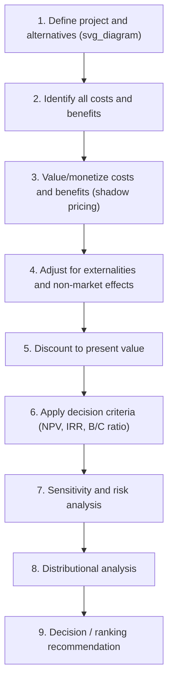

## Principles and Steps of Project Evaluation

### Overview

Cost-benefit analysis (CBA) is the applied welfare-economics methodology used to evaluate public investment projects and policies by systematically identifying, quantifying, and comparing their social costs and benefits over time. The objective is to determine whether a project increases aggregate social welfare, and to rank competing projects when public resources (the budget) are constrained. Project evaluation formalizes this into a sequential, replicable procedure grounded in welfare economics, particularly the Kaldor-Hicks compensation principle, since actual Pareto improvements are rare in real-world public projects (there are almost always losers).

---

### Theoretical Foundations

#### Welfare Economic Basis

CBA rests on the **potential Pareto improvement** (Kaldor-Hicks) criterion: a project is desirable if gainers could hypothetically compensate losers and still remain better off, even if compensation is not actually paid.

$$\sum_i \Delta CS_i + \sum_j \Delta PS_j - \text{Government Net Cost} \geq 0$$

where $\Delta CS_i$ is the change in consumer surplus for group $i$, and $\Delta PS_j$ is the change in producer surplus for group $j$.

**Key Points:**

- CBA aggregates gains and losses across heterogeneous individuals using a **numeraire** (typically money), implicitly assuming a constant marginal utility of income, or explicitly applying **distributional weights** to correct for this
- This is distinct from cost-effectiveness analysis (CEA), which compares costs per unit of a *non-monetized* outcome (e.g., cost per life saved), used when benefits cannot be credibly monetized

#### Shadow Pricing Rationale

Market prices frequently fail to reflect true social opportunity costs due to:

- Taxes and subsidies (wedge between producer and consumer prices)
- Externalities (unpriced spillovers)
- Monopoly power (price above marginal cost)
- Trade restrictions and quotas
- Non-traded goods (no market price at all)

CBA therefore uses **shadow prices** (accounting/social prices) rather than raw market prices whenever significant distortions exist.

---

### The Sequential Steps of Project Evaluation

#### Step 1: Define the Project and the Counterfactual

- Establish the **"with-project" vs. "without-project"** comparison (not "before vs. after," which conflates project effects with other changes over time)
- Define the project's scope, time horizon, and relevant alternatives (including a "do-nothing" or status-quo baseline)
- Identify the appropriate **decision-making perspective**: private (financial) analysis vs. social (economic) analysis

#### Step 2: Identify Costs and Benefits

Categorize systematically to avoid omissions or double-counting:

| Category | Examples |
| --- | --- |
| **Direct costs** | Capital expenditure, land, labor, materials, O&M costs |
| **Direct benefits** | Increased output, time savings, service value |
| **Indirect (secondary) effects** | Effects on related markets (e.g., a new road raising land values) |
| **Externalities** | Pollution, congestion, noise, knowledge spillovers |
| **Intangibles** | Aesthetic value, existence value of natural resources, option value |
| **Transfers** | Taxes, subsidies — *excluded* from social CBA (they are redistributions, not net resource changes), though relevant for financial/distributional analysis |

**Key Points:**

- A rigorous distinction must be maintained between **real (resource) effects**, which belong in social CBA, and **pecuniary (transfer) effects**, which merely redistribute existing surplus among agents and net out at the social level
- Double-counting is a common practical error — e.g., counting both increased land values *and* the underlying time savings that caused them, when the land value increase is simply the capitalized value of the time savings

#### Step 3: Valuation and Shadow Pricing

**For traded goods:** Use the **border price** (world price) converted at the shadow exchange rate, since domestic prices may be distorted by tariffs/quotas (Little-Mirrlees / UNIDO approach — see the dedicated Shadow Pricing chapter item for the full methodology).

**For non-traded goods:** Estimate shadow prices from marginal social cost of supply and marginal social benefit of demand, or use conversion factors.

**For labor:** Use the **shadow wage rate**, reflecting the opportunity cost of labor (which may be below the market wage in the presence of unemployment or underemployment, especially in dual-economy/Harris-Todaro-type settings).

**For non-market goods** (environmental quality, health, time, life):

- **Revealed preference methods**: hedonic pricing, travel cost method, averting behavior
- **Stated preference methods**: contingent valuation, choice experiments
- **Value of Statistical Life (VSL)**: used to monetize mortality risk reductions, derived from wage-risk premia or stated preference studies
- **[Inference]** VSL estimates vary substantially by country income level and methodology, and their application to poorer countries via direct income-elasticity extrapolation remains methodologically contested in the literature

#### Step 4: Externalities and Non-Market Effects

- Apply Pigouvian-style shadow pricing to environmental externalities using estimated marginal damage costs (or carbon price proxies for GHG emissions)
- Include **option value** (value of preserving future choice under uncertainty) and **existence/non-use value** for irreversible environmental impacts, typically from stated-preference (contingent valuation) studies

#### Step 5: Discounting to Present Value

All costs and benefits occurring at different points in time must be converted to a common present value using a **social discount rate (SDR)**:

$$PV = \sum_{t=0}^{T} \frac{B_t - C_t}{(1+r)^t}$$

Two principal theoretical approaches to determining $r$:

1. **Social Time Preference Rate (STPR)**: $r = \rho + \eta g$ (Ramsey formula), where $\rho$ is pure time preference, $\eta$ is the elasticity of marginal utility of consumption, and $g$ is the growth rate of per-capita consumption
2. **Social Opportunity Cost of Capital (SOC)**: based on the pre-tax return to displaced private investment

(Full treatment under the dedicated "Social Discount Rate" syllabus item.)

#### Step 6: Apply Decision Criteria

**Net Present Value (NPV):**

$$NPV = \sum_{t=0}^{T} \frac{B_t - C_t}{(1+r)^t}$$

Decision rule: accept if $NPV > 0$; among mutually exclusive alternatives, choose the highest NPV.

**Internal Rate of Return (IRR):** the discount rate at which $NPV = 0$. Accept if $IRR > r$ (the social discount rate/hurdle rate).

**Benefit-Cost Ratio (BCR):**

$$BCR = \frac{\sum_t B_t / (1+r)^t}{\sum_t C_t / (1+r)^t}$$

Accept if $BCR > 1$.

**[Inference]** NPV is generally regarded as the theoretically preferred criterion for ranking mutually exclusive projects because IRR can yield multiple or undefined roots with non-conventional cash flow patterns, and BCR rankings can be sensitive to how costs are classified (netted against benefits vs. treated as a cost), potentially producing inconsistent rankings across the three methods for a given project set.

**Handling Budget Constraints:** When capital is rationed, projects should be ranked by BCR or by **NPV per dollar of constrained resource**, not by absolute NPV, to maximize total welfare from a fixed budget.

#### Step 7: Sensitivity and Risk Analysis

- **Sensitivity analysis**: vary key uncertain parameters (discount rate, demand forecasts, cost overruns) one at a time or via scenario analysis to identify "switching values" — the parameter value at which the decision would flip
- **Monte Carlo simulation**: assign probability distributions to uncertain variables and simulate the distribution of NPV outcomes
- **Expected value with risk premium**: adjust the discount rate or apply a certainty-equivalent adjustment to expected benefits/costs
- **Optimism bias correction**: many public investment appraisal frameworks (e.g., UK Green Book) mandate explicit uplift adjustments for costs and downward adjustments for benefits, based on historical evidence that project appraisals systematically overstate benefits and understate costs

#### Step 8: Distributional Analysis

Since standard CBA aggregates gains/losses using a common numeraire, it is often supplemented with:

- **Distributional weighting**: applying weights $w_i = (Y_{ref}/Y_i)^\eta$ to reflect diminishing marginal utility of income across income groups
- **Stakeholder/incidence analysis**: identifying which groups bear costs and which receive benefits (e.g., a resettlement-and-relocation displacement matrix for infrastructure projects)
- Reporting distributional effects *alongside* (not merged into) the efficiency NPV figure, consistent with the Musgrave "allocation vs. distribution branch" separation, preserving transparency for policymakers

#### Step 9: Decision and Reporting

- Present a clear recommendation supported by the NPV/IRR/BCR results, sensitivity ranges, and distributional findings
- Document all assumptions, shadow prices used, and data sources for **replicability and auditability**

---

### Worked Example

**Project:** Rural irrigation scheme. Capital cost $5 million in year 0; annual net agricultural benefit $800,000 for years 1–10; social discount rate 8%.

$$NPV = -5{,}000{,}000 + \sum_{t=1}^{10} \frac{800{,}000}{(1.08)^t}$$

The annuity factor for 10 years at 8% is approximately 6.71:

$$NPV \approx -5{,}000{,}000 + (800{,}000 \times 6.71) \approx -5{,}000{,}000 + 5{,}368{,}000 = 368{,}000$$

Since $NPV > 0$, the project is accepted under the efficiency criterion. A sensitivity check at $r = 10\%$ (annuity factor $\approx 6.14$) gives $NPV \approx -5{,}000{,}000 + 4{,}912{,}000 = -88{,}000$, revealing the **switching value** lies just below 10% — signaling the result is moderately sensitive to the discount rate assumption and warranting closer scrutiny of benefit forecasts.

---

### Common Pitfalls in Practice

**Key Points:**

- **Double-counting** benefits across primary and secondary markets
- **Omitting the counterfactual** by comparing "before vs. after" rather than "with vs. without"
- **Ignoring opportunity cost of land/resources already owned by government** (sunk-cost fallacy — sunk costs should be excluded from forward-looking evaluation)
- **Optimism bias** in demand and cost forecasts (systematically documented in large infrastructure project appraisals, e.g., Flyvbjerg's studies of megaproject cost overruns)
- **Using financial (market-price) analysis where social (shadow-price) analysis is required**, or vice versa, depending on the evaluating agency's objective

---

### Institutional Frameworks and Applications

Major applied manuals following this general step sequence include:

- **UNIDO Guidelines for Project Evaluation** (Little-Mirrlees tradition, shadow pricing emphasis)
- **World Bank / Asian Development Bank project appraisal frameworks**
- **UK HM Treasury Green Book** (explicit optimism bias corrections, distributional weighting guidance)
- **US OMB Circular A-94** (discount rate guidance for federal program evaluation)

---

### Next Steps

- Social Discount Rate: Theory and Determination (STPR vs. SOC)
- Shadow Pricing and the Little-Mirrlees/UNIDO Method
- Valuing Non-Market Goods: Contingent Valuation and Hedonic Pricing
- Value of Statistical Life and Health Benefit Valuation
- Risk, Uncertainty, and Real Options in Public Investment
- Distributional Weights and Equity-Efficiency Trade-offs in CBA
- Cost-Effectiveness Analysis vs. Cost-Benefit Analysis
- Environmental Cost-Benefit Analysis and Externality Valuation
- Megaproject Cost Overruns and Optimism Bias (Flyvbjerg)