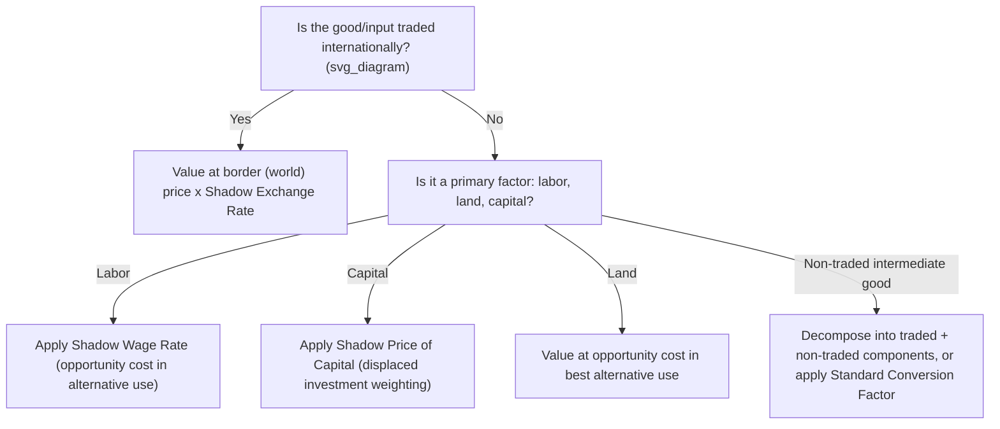

## Shadow Prices and Social Opportunity Cost

### Overview

Shadow prices are the estimated social opportunity costs of goods, services, and factors of production, used in cost-benefit analysis (CBA) in place of observed market prices whenever market prices fail to reflect true social value. Market prices diverge from social value due to taxes, subsidies, externalities, monopoly power, trade restrictions, unemployment, and the absence of markets altogether for many non-traded goods. Shadow pricing is the technical apparatus that converts financial (market-price) project appraisal into economic (social-price) project appraisal.

---

### Rationale: Why Market Prices Fail

**Key Points:**

- Market price $P_m$ reflects the **private** marginal cost/benefit to the transacting parties
- Social opportunity cost $P_s$ reflects the **true resource cost to society** of using or producing one more unit of the good
- The wedge $P_m - P_s$ arises from:
  - **Taxes/subsidies**: a sales tax raises the consumer price above the producer price (marginal social cost)
  - **Externalities**: negative externalities mean $P_s > P_m$ (private price understates social cost); positive externalities mean $P_s < P_m$
  - **Monopoly/market power**: price exceeds marginal cost, so market price overstates the resource cost of production
  - **Trade distortions**: tariffs and quotas drive a wedge between domestic and world (border) prices
  - **Factor market rigidities**: minimum wages, labor market segmentation, or unemployment mean the market wage overstates the opportunity cost of labor
  - **Missing markets**: many environmental and non-traded goods have no market price at all

A shadow price is therefore defined as:

$$P_s = \text{Marginal Social Value (or Cost)} \neq P_m \text{ (observed market price)}$$

---

### General Equilibrium Definition

Formally, in the tradition of Drèze and Stern (1987), the shadow price of good $k$ is the value of the Lagrange multiplier associated with the resource constraint for good $k$ in a social welfare maximization problem:

$$v_k = \frac{\partial W^*}{\partial R_k}$$

where $W^*$ is the maximized value of the social welfare function and $R_k$ is the availability of resource $k$. This is the marginal social value of relaxing the constraint on resource $k$ by one unit — conceptually identical to a shadow price (dual value) in a linear/nonlinear programming problem.

**[Inference]** This general-equilibrium definition, while theoretically rigorous, is rarely operationalized directly in applied project appraisal due to its data and computational demands; applied practice instead relies on the more tractable partial-equilibrium approximations developed in the Little-Mirrlees/UNIDO and Harberger traditions described below.

---

### Major Applied Methodologies

#### 1. The Little-Mirrlees / UNIDO Approach (Border Price Method)

Developed for evaluating projects in economies with significant trade distortions (tariffs, quotas, overvalued exchange rates).

**Core principle:** Value all tradable inputs and outputs at their **world (border) prices**, converted to domestic currency using a **shadow exchange rate (SER)**, rather than at domestic market prices distorted by trade policy.

$$\text{Shadow Price (tradable good)} = \text{Border Price} \times \text{SER}$$

For non-traded goods, decompose them into their tradable and non-tradable input components and value each accordingly, or apply a **Standard Conversion Factor (SCF)**:

$$SCF = \frac{\text{Free Trade Value of Imports and Exports}}{\text{Domestic Market Value of Imports and Exports (incl. tariffs)}}$$

The SCF converts domestic-price-valued non-traded goods into border-price-equivalent (numeraire) terms:

$$\text{Shadow Price (non-traded good)} = \text{Domestic Market Price} \times SCF$$

**Numeraire:** Little-Mirrlees uses **uncommitted social income measured in border prices (foreign exchange)** as the numeraire, rather than domestic market prices, reflecting the premium placed on foreign exchange in foreign-exchange-constrained economies.

#### 2. The Harberger (UNIDO-alternative) / Domestic Price Numeraire Approach

An alternative tradition (associated with Arnold Harberger and Squire-van der Tak) uses **domestic market prices** as the numeraire and converts foreign exchange values into domestic price equivalents via the shadow exchange rate, rather than the reverse. Both approaches are formally equivalent under consistent assumptions and should yield the same project ranking; they differ in computational convenience depending on the structure of the economy being analyzed.

---

### Shadow Pricing Key Inputs

#### Shadow Exchange Rate (SER)

When the official exchange rate (OER) is distorted by trade taxes, capital controls, or multiple exchange rate regimes, the SER corrects for this:

$$SER = OER \times \frac{1 + \text{average tariff/tax rate on trade}}{1}$$

More generally:

$$SER = OER \times \frac{\text{Value of trade at world prices}}{\text{Value of trade at domestic prices net of taxes}}$$

A **Shadow Exchange Rate Factor (SERF)** is often reported as $SER/OER$; a SERF $> 1$ indicates the domestic currency is overvalued at the official rate relative to its social opportunity cost.

#### Shadow Wage Rate (SWR)

The shadow wage reflects the true opportunity cost of employing labor on a project, which may diverge substantially from the market wage:

$$SWR = MPL_{\text{forgone}} + \text{Disutility of effort adjustment} - \text{Value of leisure/informal output forgone}$$

Key considerations:

- In economies with **surplus labor / disguised unemployment** (Lewis, 1954; Harris-Todaro, 1970 dual-economy models), the opportunity cost of drawing a worker from the rural/informal sector may be **below** the market/formal-sector wage — sometimes approximated near zero in extreme surplus-labor models, though this is now considered an overstatement in most empirical contexts
- In economies with open unemployment, the shadow wage equals a weighted average of the wage forgone in the next-best alternative use of time and the value of leisure/job search, adjusted for the probability of finding alternative employment
- A commonly used **Conversion Factor for Labor (CFL)** expresses the shadow wage as a fraction of the market wage: $SWR = CFL \times \text{Market Wage}$, with $CFL < 1$ typically applied in labor-surplus developing economies

#### Shadow Price of Capital (SPC)

Because public projects displace private investment (which would have been reinvested/compounded at a higher rate) as well as private consumption, the social opportunity cost of capital used in a project may exceed a straightforward market interest rate. The **Squire-van der Tak** framework computes the SPC as a weighted-average recognizing that displaced resources come partly from investment (valued at its full future consumption-stream value, discounted) and partly from consumption (valued at 1, by definition, if consumption is the numeraire).

$$SPC = \frac{q \cdot r}{q \cdot r + (1-q) \cdot i}$$

**[Inference]**-style formulas of this kind vary by source; the general principle — that capital displaced from higher-return uses should be shadow-priced above its nominal cost — is well established, but the precise functional form depends on assumptions about the marginal propensity to consume/reinvest and the treatment of the social discount rate, so numerical results are source-specific and should be adapted to the case at hand.

#### Shadow Price of Land

Valued at its opportunity cost in its best alternative use (e.g., forgone agricultural output value), not necessarily its market transaction price, which may be distorted by land market imperfections, speculation, or lack of formal title.

---

### Illustrative Diagram: Shadow Pricing Decision Logic

---

### Worked Example: Shadow Pricing a Non-Traded Input

A project uses locally produced cement (non-traded) costing $100 per ton at domestic market prices, which include a 10% sales tax and reflect an estimated 15% monopoly markup embedded in the concentrated domestic cement industry.

**Step 1 — Remove the tax (pure transfer, not a resource cost):**

$$\$100 / 1.10 = \$90.91 \text{ (producer price)}$$

**Step 2 — Remove the monopoly markup to approximate marginal social cost:**

$$\$90.91 / 1.15 \approx \$79.05$$

The shadow price of cement used in the CBA is approximately **$79.05/ton**, reflecting the actual resource cost of production rather than the tax- and markup-inflated market price. The $20.95 difference between market and shadow price is a transfer (to government via tax, and to the monopolist via markup rents) and should be excluded from the social cost calculation, though it may be relevant for the separate financial/distributional analysis.

---

### Special Cases and Extensions

- **Environmental resources**: shadow-priced using marginal damage cost estimates, contingent valuation, or carbon price proxies (see the Environmental CBA / Non-Market Valuation items)
- **Foreign aid/grants received in kind**: valued at their border price equivalent, not their nominal donor-stated value, to maintain numeraire consistency
- **Public utility outputs (e.g., electricity, water) priced below marginal cost**: shadow-priced at long-run marginal cost of supply rather than the regulated tariff
- **Shadow pricing under general equilibrium feedback**: large projects that materially shift relative prices in the economy (e.g., a major dam affecting regional water and power markets) may require computable general equilibrium (CGE) modeling rather than partial-equilibrium shadow price tables, since fixed conversion factors assume the project is small relative to the economy

---

### Practical Application Notes

**Key Points:**

- Multilateral development banks (World Bank, ADB) historically published country- and sector-specific **standard conversion factors** and shadow wage rate tables to standardize appraisal across projects
- **[Unverified]** The extent to which contemporary institutional practice still relies on the classical Little-Mirrlees/UNIDO SCF tables versus updated CGE-based or hybrid approaches varies by institution and country context, and should be checked against current guidance from the specific appraising agency
- Shadow pricing must be internally consistent with the **choice of numeraire** (border prices vs. domestic prices) selected for the overall CBA — mixing numeraires across cost/benefit categories produces inconsistent and non-comparable NPV results

---

### Next Steps

- Little-Mirrlees and UNIDO Project Appraisal Methodologies (full treatment)
- Social Discount Rate: STPR vs. SOC Approaches
- Shadow Wage Rate in Dual-Economy (Harris-Todaro) Models
- Standard Conversion Factor and Consumption Conversion Factor Estimation
- Non-Market Valuation: Contingent Valuation, Hedonic Pricing, Travel Cost Method
- Computable General Equilibrium (CGE) Modeling for Large Project Appraisal
- Distributional Weighting in Shadow Price Applications
- Principles and Steps of Project Evaluation (cross-reference)