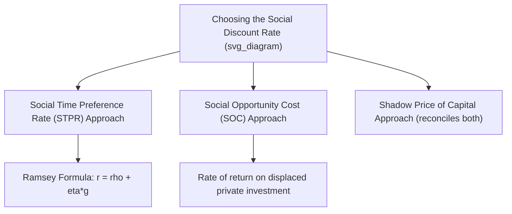

## Choosing a Social Discount Rate

### Overview

The social discount rate (SDR) converts future costs and benefits into present values for cost-benefit analysis, reflecting society's collective valuation of present versus future consumption. Choosing the SDR is one of the most consequential and contested decisions in project evaluation, since even small changes in the discount rate can reverse project rankings for long-lived investments (infrastructure, environmental protection, climate mitigation), where costs are often front-loaded and benefits materialize decades into the future.

---

### Why the Social Discount Rate Differs from Private Discount Rates

**Key Points:**

- Private investors discount future cash flows using rates reflecting their own opportunity cost of capital and risk preferences
- Society, as a collective and (in principle) infinitely-lived entity, may have different time preferences than any individual private agent — governments act as trustees for both current and future generations
- Market interest rates may not reflect the true social rate due to taxes (wedge between borrower and lender rates), externalities, capital market imperfections, and the absence of markets for unborn generations to express preferences
- This divergence between the observable market rate and the theoretically appropriate social rate is the central justification for a distinct, policy-determined SDR

---

### Two Principal Theoretical Approaches

#### 1. Social Time Preference Rate (STPR) — The Ramsey Approach

Derived from the **Ramsey (1928) optimal growth framework**, the STPR is built up from underlying normative and empirical parameters:

$$r = \rho + \eta g$$

where:

- $\rho$ = **pure rate of time preference** (society's impatience, independent of income growth) — reflects both myopia and the probability of catastrophic events ending the project's relevance (sometimes decomposed as $\rho = L + \delta$, where $L$ is a "catastrophe risk" term and $\delta$ is pure impatience)
- $\eta$ = **elasticity of marginal utility of consumption** — measures how fast marginal utility declines as consumption rises (higher $\eta$ = stronger aversion to inequality across time/consumption levels)
- $g$ = **expected growth rate of per-capita consumption**

**Interpretation:** The $\eta g$ term captures the fact that if future generations are expected to be richer, an extra dollar of benefit delivered to them is worth less (in utility terms) than a dollar delivered to the current, relatively poorer generation — this is the **diminishing marginal utility** channel, distinct from pure impatience.

**Key normative debate:** The choice of $\rho$ is fundamentally an **ethical/normative** parameter, not simply an empirical one.

- **Ramsey (1928)** and later **Cline (1992)**, **Stern (2006)** argue $\rho$ should be very low (near zero), on the grounds that discounting future generations' welfare purely because they are temporally distant is ethically indefensible ("pure time preference is a form of discrimination against future generations")
- **Nordhaus (2007)** and others argue for $\rho$ calibrated to be consistent with observed market interest rates and savings behavior, producing a materially higher SDR

This debate was central to the **Stern Review vs. Nordhaus critique** on climate change discounting, where a low $\rho$ (~0.1%) versus a higher, market-consistent $\rho$ (~1.5%) produced dramatically different present values for climate damages and correspondingly different policy prescriptions regarding the urgency and scale of mitigation spending.

#### 2. Social Opportunity Cost (SOC) Approach

Argues that the discount rate should reflect the **rate of return foregone** on the best alternative use of the resources — typically the pre-tax marginal rate of return on private investment displaced by the public project (since public funds, whether from taxation or borrowing, are assumed to crowd out private investment at the margin).

**Rationale:** If a public project returns less than what the displaced private investment would have generated, society is worse off even if the public project has a positive NPV using a lower discount rate.

**Critique:** In practice, public spending displaces a **mix** of private investment and private consumption, not purely investment, so using the full pre-tax return on private capital as the SDR may overstate the true opportunity cost if some of the displaced resources would otherwise have been consumed rather than invested.

#### 3. Reconciliation: The Shadow Price of Capital (Weighted Average) Approach

Squire-van der Tak and others resolve the STPR/SOC tension by treating displaced investment as a **shadow-priced input** rather than by picking a single discount rate: all costs and benefits are converted into **consumption-equivalent units** using a shadow price of capital, and the resulting consumption stream is then discounted at the STPR. This is formally in the same family as the Little-Mirrlees shadow pricing approach applied specifically to capital as discussed in the Shadow Prices item.

---

### Declining Discount Rate Schedules

**[Inference]** A growing body of theoretical work (Weitzman, 2001; Gollier, 2002) demonstrates that under uncertainty about future discount rates or growth rates, the *certainty-equivalent* discount rate that should be applied to very long-dated cash flows should decline over time, even if each possible future discount rate is itself constant — because low-discount-rate scenarios dominate the present value calculation at very long horizons. This has been adopted in several national guidance documents.

**Example schedule (illustrative, following approaches used in UK HM Treasury Green Book-style guidance):**

| Time period | Discount rate |
| --- | --- |
| Years 0–30 | 3.5% |
| Years 31–75 | 3.0% |
| Years 76–125 | 2.5% |
| Years 125–200 | 2.0% |
| Years 200–300 | 1.5% |
| Years 300+ | 1.0% |

**[Unverified]** Exact rate schedules and threshold years vary by jurisdiction and are periodically revised; practitioners should consult the current version of the relevant national guidance document (e.g., UK Green Book, US OMB Circular A-94) rather than relying on a fixed historical table, as these rates are subject to periodic official review.

---

### Sector- and Risk-Specific Considerations

#### Risk-Adjusted Discount Rates vs. Certainty-Equivalent Approach

Two methods exist for incorporating project-specific risk:

1. **Risk-adjusted discount rate**: add a risk premium to the base SDR for riskier projects — but this is a blunt instrument, since it compounds the risk adjustment over time, disproportionately penalizing distant cash flows even if risk does not grow at a constant rate
2. **Certainty-equivalent method** (theoretically preferred): adjust the *expected value* of benefits/costs downward (or upward) to reflect risk aversion, then discount at the risk-free SDR — separating the risk adjustment from the time adjustment

#### Systematic vs. Idiosyncratic Risk

Following portfolio theory logic (analogous to CAPM), only **systematic risk** — risk correlated with aggregate consumption/economic conditions — warrants a risk premium in the discount rate; idiosyncratic project-specific risk (e.g., localized construction cost overruns) can typically be diversified away at the level of the government's overall portfolio of public projects and should be handled via sensitivity/Monte Carlo analysis rather than a higher discount rate.

---

### Intergenerational Equity and Climate Applications

Long-horizon projects (nuclear waste storage, climate mitigation, biodiversity conservation) place enormous weight on the choice of $\rho$ and $\eta$, since compounding effects are extreme:

$$PV(\$1 \text{ in year } 100) = \frac{1}{(1+r)^{100}}$$

| $r$ | PV of $1 received in 100 years |
| --- | --- |
| 1% | $0.37 |
| 3% | $0.052 |
| 5% | $0.0076 |
| 7% | $0.0012 |

This table illustrates why the choice between, say, a 1% and 5% rate is not a technical footnote but can determine whether large-scale climate mitigation spending today appears justified at all under standard CBA — a core point of contention in the Stern-Nordhaus debate and the broader literature on discounting and intergenerational justice.

---

### Worked Example

A government evaluates a flood-defense project costing $50 million today, preventing expected annual damages of $3 million starting in year 1, in perpetuity (simplifying assumption).

**At $r = 3\%$:**

$$PV(\text{benefits}) = \frac{3{,}000{,}000}{0.03} = \$100{,}000{,}000 \quad \Rightarrow \quad NPV = 100{,}000{,}000 - 50{,}000{,}000 = \$50{,}000{,}000$$

**At $r = 7\%$:**

$$PV(\text{benefits}) = \frac{3{,}000{,}000}{0.07} \approx \$42{,}857{,}000 \quad \Rightarrow \quad NPV \approx 42{,}857{,}000 - 50{,}000{,}000 = -\$7{,}143{,}000$$

The project switches from strongly justified to rejected purely as a function of the discount rate assumption, with a switching value near $r \approx 6\%$ (where $3{,}000{,}000/r = 50{,}000{,}000$). This demonstrates why sensitivity analysis on the discount rate is considered mandatory practice in project appraisal, not optional.

---

### International Practice Comparison

**Key Points:**

- **[Unverified]** Specific rates used by national governments and multilateral institutions (e.g., World Bank, US OMB, UK Treasury, EU) change periodically through formal review processes; practitioners should verify current official rates directly from the issuing institution rather than relying on commonly cited historical figures (e.g., older US guidance figures around 7% pre-tax SOC and 3% STPR-based rates, and older UK figures around 3.5%), as several jurisdictions have revised rates downward in recent years reflecting lower observed real interest rates and growth rates globally
- Many multilateral development banks now apply **country-specific or project-specific discount rates** reflecting local capital scarcity and growth prospects rather than a single global rate

---

### Common Pitfalls

- **Conflating financial (nominal, private) discount rates with social discount rates** — the SDR is a public-economics/normative construct, not simply a market borrowing rate
- **Double-discounting for risk** — applying both a risk-adjusted discount rate *and* deflating expected benefits for risk, over-penalizing risky long-run projects
- **Ignoring the ethical content of $\rho$** — treating the pure time preference rate as a purely technical/empirical parameter obscures that it embeds a value judgment about the moral weight of future generations' welfare
- **Applying a single constant rate to century-plus horizons** without considering declining discount rate schedules where theoretically and institutionally appropriate

---

### Next Steps

- The Ramsey Growth Model and Optimal Savings
- The Stern Review vs. Nordhaus Debate on Climate Discounting
- Declining Discount Rates and Weitzman's Gamma Discounting
- Shadow Price of Capital and the Squire-van der Tak Framework
- Risk, Uncertainty, and Real Options in Public Investment (cross-reference)
- Intergenerational Equity in Public Economics
- Principles and Steps of Project Evaluation (cross-reference)
- Shadow Prices and Social Opportunity Cost (cross-reference)