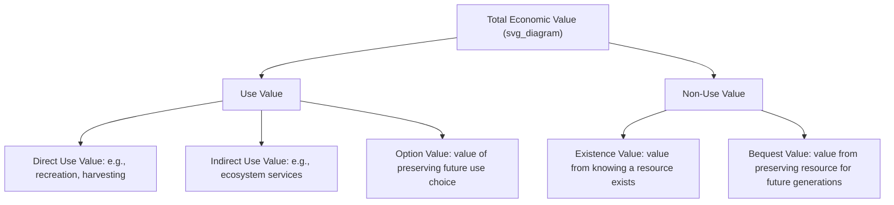

## Valuing Non-Market Goods

### Overview

Many goods relevant to public project evaluation — clean air, biodiversity, recreational amenities, health and safety, time, aesthetic and cultural value — have no observable market price because they are not directly bought and sold. Valuing non-market goods is the branch of applied welfare economics that develops techniques to monetize these goods so they can be incorporated into cost-benefit analysis on a common footing with marketed goods. The theoretical foundation is that individuals hold well-defined (if unobserved) preferences over these goods, expressible in principle as a willingness to pay (WTP) or willingness to accept (WTA) compensation.

---

### Theoretical Foundation: WTP and WTA

The welfare-theoretic basis for non-market valuation is the **compensating variation (CV)** and **equivalent variation (EV)** measures derived from expenditure functions:

$$CV = e(p^0, u^1) - e(p^0, u^0)$$

where $e(\cdot)$ is the expenditure function, $p^0$ is the reference price vector, and $u^0, u^1$ are utility levels before and after the change.

- **Willingness to Pay (WTP)**: the maximum amount an individual would pay to obtain a gain (or avoid a loss)
- **Willingness to Accept (WTA)**: the minimum compensation an individual would accept to forgo a gain (or tolerate a loss)

**Key Points:**

- Standard consumer theory predicts WTP ≈ WTA for goods with close substitutes and small income effects, but empirical studies consistently find **WTA > WTP**, often by a substantial margin, for non-market and unique environmental goods
- This WTP-WTA divergence is commonly attributed to **loss aversion** (prospect theory, Kahneman & Tversky) and the absence of close substitutes for unique environmental assets, rather than being fully explained by standard income effects
- The choice of WTP vs. WTA as the appropriate welfare measure depends on the **initial property rights allocation** — WTP is appropriate when individuals do not have an existing entitlement to the good (e.g., paying for a new park), while WTA is appropriate when they do (e.g., compensation for losing access to an existing park)

---

### Taxonomy of Total Economic Value

**Key Points:**

- **Use values** arise from actual or potential interaction with the resource and are generally the most amenable to revealed-preference methods
- **Non-use values** (existence and bequest value) can *only* be captured through stated-preference methods, since by definition they do not generate observable market behavior
- For irreversible environmental changes (species extinction, unique habitat loss), non-use values can constitute a very large share of total economic value, making stated-preference methods indispensable despite their methodological challenges

---

### Revealed Preference Methods

These methods infer values from observed behavior in *related* markets where the non-market good is an implicit input.

#### 1. Hedonic Pricing Method

Decomposes the price of a marketed good (typically housing) into implicit prices for its constituent attributes, including environmental quality.

$$P_{house} = f(\text{structural attributes}, \text{neighborhood attributes}, \text{environmental quality})$$

The implicit price of an environmental attribute (e.g., air quality, proximity to noise/pollution sources, school quality) is estimated as:

$$\frac{\partial P_{house}}{\partial Q_{env}}$$

**Applications:** valuing air quality, noise pollution (airport/highway proximity), proximity to hazardous waste sites, urban green space, flood risk.

**Limitations:**

- Requires a well-functioning, transparent housing market with sufficient variation in the environmental attribute
- Vulnerable to omitted variable bias if unobserved neighborhood characteristics are correlated with the environmental variable of interest
- Captures only **use value** as capitalized into location decisions, not non-use value

#### 2. Travel Cost Method (TCM)

Uses the cost individuals incur traveling to a recreational site (transportation, time, entry fees) as a proxy for the implicit "price" of the recreational experience, since the site itself has no market price.

$$\text{Visits}_i = f(\text{Travel Cost}_i, \text{Substitute Sites}, \text{Income}, \text{Socioeconomic factors})$$

A demand curve for visits is estimated as a function of travel cost, then consumer surplus is derived by integrating under this demand curve, yielding an estimate of the recreational value of the site.

**Variants:**

- **Zonal TCM**: aggregates visitors by origin zone, using zone-average travel cost and visit rate
- **Individual TCM**: uses individual-level trip and cost data, generally preferred for its statistical efficiency
- **Random utility (site choice) models**: model the discrete choice among substitute recreational sites, allowing estimation of the value of site quality attributes, not just aggregate site value

**Limitations:** valuing the opportunity cost of travel time is methodologically contested (often approximated as a fraction of the wage rate); does not capture non-use value; multi-purpose trips complicate cost attribution.

#### 3. Averting/Defensive Behavior Method

Infers value from expenditures individuals make to avoid or mitigate an environmental harm (e.g., bottled water purchases in response to water contamination, air filters in response to pollution). The defensive expenditure provides a **lower-bound** estimate of the damage avoided, since it reflects only the minimum the individual was willing to pay to achieve partial mitigation.

---

### Stated Preference Methods

These methods directly elicit values through structured surveys presenting hypothetical (or, increasingly, incentive-compatible) scenarios, and are the *only* methods capable of capturing non-use value.

#### 1. Contingent Valuation Method (CVM)

Directly asks respondents their WTP for a specified change in provision of a non-market good, typically via:

- **Open-ended** elicitation (rarely used now due to strategic bias and high non-response/protest rates)
- **Dichotomous choice / referendum format** (respondent answers yes/no to a specific bid amount, varied across the sample) — considered more incentive-compatible and closer to real market/voting decisions
- **Payment card** format (respondent selects from a range of bid amounts)

**The NOAA Panel Guidelines (Arrow et al., 1993):** established following the *Exxon Valdez* oil spill litigation, set methodological standards for credible CVM studies, including:

- Use of dichotomous choice (referendum) elicitation
- Conservative design choices (biasing estimates downward when in doubt)
- Clear description of the good, the payment vehicle, and the budget constraint reminder
- Inclusion of a "no answer"/"don't know" option and scope tests

**Known Biases and Challenges:**

- **Hypothetical bias**: stated WTP in hypothetical surveys often exceeds actual WTP revealed in real payment situations
- **Strategic bias**: respondents may misstate preferences if they believe doing so affects the outcome or their payment obligation
- **Embedding/scope insensitivity**: WTP estimates sometimes fail to scale appropriately with the scope of the good being valued (e.g., similar WTP stated for saving 2,000 vs. 200,000 birds), a finding central to the NOAA panel's skepticism about unadjusted CVM and to subsequent scope-test requirements
- **Starting point bias**: in bidding-game formats, the initial bid offered can anchor final stated WTP
- **Warm glow effects**: stated WTP may partly reflect a general desire to contribute to a good cause rather than the specific value of the good in question

#### 2. Choice Experiments (Discrete Choice Experiments / Conjoint Analysis)

Presents respondents with repeated choices among alternatives (including a status-quo option) that vary across multiple attributes, including a monetary cost attribute, allowing estimation of implicit prices for each attribute via random utility/discrete choice econometric models (conditional/mixed logit).

$$U_{ij} = \beta_1 X_{1j} + \beta_2 X_{2j} + \ldots + \beta_{cost} \cdot Cost_j + \varepsilon_{ij}$$

The implicit marginal WTP for attribute $k$ is:

$$WTP_k = -\frac{\beta_k}{\beta_{cost}}$$

**Advantages over single-good CVM:** allows valuation of multiple attributes simultaneously, reduces some forms of scope insensitivity, and mirrors real-world trade-off decision-making more closely.

---

### Value of Statistical Life (VSL) and Health Valuation

**VSL** is the aggregate value society places on a statistically-expected life saved, derived from the sum of individual WTP for small reductions in mortality risk, *not* the value of any specific identified individual's life.

$$VSL = \frac{WTP \text{ for a marginal risk reduction}}{\Delta \text{Risk}}$$

**Example:** if individuals are willing to pay $700 for a policy reducing their annual mortality risk by 1 in 10,000, then:

$$VSL = \frac{\$700}{1/10{,}000} = \$7{,}000{,}000$$

**Primary estimation approaches:**

- **Hedonic wage studies**: estimate the wage premium workers require to accept jobs with higher occupational fatality risk
- **Stated preference health-risk surveys**: direct elicitation of WTP for risk reductions

**[Inference]** VSL estimates vary substantially across countries and are frequently extrapolated across income levels using an income elasticity adjustment (commonly assumed in the range of 1.0–1.5 in applied practice), though the appropriateness of any single elasticity for cross-country extrapolation, particularly from high-income to low-income country contexts, remains a genuinely disputed methodological issue in the literature rather than a settled parameter.

**Quality-Adjusted Life Years (QALYs) / Disability-Adjusted Life Years (DALYs):** used in health economics CBA/CEA as an alternative or complementary metric to VSL, particularly in health sector project evaluation, combining length and quality of life into a single index; cost-per-QALY or cost-per-DALY-averted is then used as a cost-effectiveness threshold rather than fully monetizing the health outcome.

---

### Benefit Transfer

Given the high cost of primary valuation studies, practitioners frequently use **benefit transfer**: applying value estimates from existing studies conducted at a different site/population ("study site") to the project under evaluation ("policy site"), often with adjustments for income differences, site characteristics, and population characteristics.

**Key Points:**

- **Unit value transfer**: directly applies (income-adjusted) per-unit values from the study site
- **Function transfer**: transfers an entire estimated valuation function (e.g., a hedonic or CVM WTP function) and reapplies it using policy-site covariates
- **[Inference]** Benefit transfer introduces additional error beyond the original study's estimation error, and its reliability depends heavily on the similarity between study site and policy site contexts; meta-analyses combining many primary studies are generally considered to provide more robust transfer functions than reliance on a single study

---

### Worked Example: Choice Experiment for Wetland Restoration

A choice experiment estimates the following utility function for a wetland restoration policy, with attributes for hectares restored, species protected, and household cost:

$$U = 0.02 \times \text{Hectares} + 0.5 \times \text{Species Protected} - 0.004 \times \text{Cost}$$

**Marginal WTP for one additional protected species:**

$$WTP_{species} = \frac{0.5}{0.004} = \$125 \text{ per household}$$

**Marginal WTP for one additional hectare restored:**

$$WTP_{hectare} = \frac{0.02}{0.004} = \$5 \text{ per household}$$

If the policy region contains 50,000 households, the aggregate WTP for protecting 3 additional species is:

$$50{,}000 \times 3 \times \$125 = \$18{,}750{,}000$$

This aggregate WTP figure would then enter the benefits side of the project's CBA alongside any use-value estimates from revealed-preference methods, taking care to avoid double-counting overlapping value categories.

---

### Choosing Among Methods

| Method | Captures Non-Use Value? | Data Requirements | Main Weakness |
| --- | --- | --- | --- |
| Hedonic pricing | No | Housing/labor market microdata | Omitted variable bias |
| Travel cost | No | Site visitation survey data | Travel time valuation, multi-purpose trips |
| Averting behavior | No | Defensive expenditure data | Lower-bound estimate only |
| Contingent valuation | Yes | Custom survey | Hypothetical/strategic bias |
| Choice experiments | Yes | Custom survey | Complexity, cognitive burden on respondents |

---

### Next Steps

- Principles and Steps of Project Evaluation (cross-reference)
- Shadow Prices and Social Opportunity Cost (cross-reference)
- Environmental Cost-Benefit Analysis and Externality Valuation
- Value of Statistical Life: Cross-Country Estimation and Income Elasticity
- Cost-Effectiveness Analysis and QALYs/DALYs in Health Policy
- Behavioral Economics and Biases in Stated Preference Surveys
- Meta-Analysis and Benefit Transfer Methodology
- Discrete Choice Modeling and Random Utility Theory