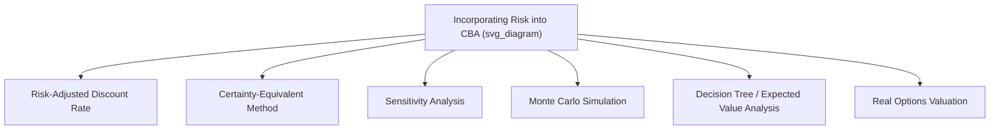

## Risk, Uncertainty, and Option Value

### Overview

Public investment projects unfold over long time horizons under conditions where future costs, benefits, and even the underlying decision environment are imperfectly known. Cost-benefit analysis must distinguish between **risk** (outcomes with known or estimable probability distributions) and **uncertainty** (outcomes whose probability distributions are themselves unknown or ambiguous, following the Knightian distinction), and must incorporate the **option value** that arises when decisions are irreversible and information will improve over time. Treating risk and uncertainty rigorously — rather than through ad hoc discount rate adjustments — is essential for sound project appraisal, particularly for large, irreversible, long-lived public investments.

---

### The Knightian Distinction: Risk vs. Uncertainty

**Key Points:**

- **Risk**: the decision-maker can assign meaningful probabilities to possible outcomes (e.g., a known distribution of rainfall affecting hydropower output)
- **Uncertainty (Knightian)**: probabilities cannot be reliably assigned, either because the event is unprecedented or because the underlying data-generating process itself is unknown (e.g., long-run climate tipping points, novel technology adoption trajectories)
- **[Inference]** In practice, most applied CBA treats uncertainty as if it were risk, using subjective or expert-elicited probability distributions, because fully "uncertain" (undistributed) parameters cannot be formally incorporated into expected-value calculations without some probabilistic structure — this pragmatic approximation is widely used but represents a simplification of the underlying Knightian distinction, not a resolution of it

---

### Approaches to Incorporating Risk

#### 1. Risk-Adjusted Discount Rate (RADR)

Adds a risk premium to the risk-free social discount rate for riskier projects:

$$NPV = \sum_{t=0}^{T} \frac{E[B_t] - E[C_t]}{(1 + r + \pi)^t}$$

where $\pi$ is the risk premium.

**[Inference]** This method is widely used in practice for its simplicity but is theoretically problematic because it compounds the risk adjustment geometrically over time, which implicitly assumes that risk grows at a constant proportional rate the further into the future a cash flow occurs — an assumption rarely justified by the underlying nature of the risk, and one that can severely understate the present value of distant, low-risk cash flows or overstate near-term risk.

#### 2. Certainty-Equivalent Method (Theoretically Preferred)

Separates the risk adjustment from the time adjustment: expected benefits/costs are first converted into their **certainty-equivalent** value (the certain amount that yields the same utility as the risky expected value), and this certainty-equivalent stream is then discounted at the risk-free social discount rate.

$$CE_t = E[B_t] - \text{Risk Premium}_t, \qquad NPV = \sum_{t=0}^{T} \frac{CE_t - E[C_t]}{(1+r)^t}$$

The certainty-equivalent adjustment can be derived from the coefficient of relative risk aversion and the variance of the outcome, analogous to standard asset-pricing risk-adjustment techniques.

#### 3. Systematic vs. Idiosyncratic Risk (Portfolio Logic)

Following the logic of the Capital Asset Pricing Model (CAPM) applied to public investment:

- **Systematic risk**: risk correlated with aggregate economic/consumption fluctuations (e.g., toll road revenue falling in a recession) — this component **should** command a risk premium, since it cannot be diversified away at the level of the government's overall portfolio of activities
- **Idiosyncratic risk**: project-specific risk uncorrelated with the broader economy (e.g., localized geological surprises during construction) — this component **should not** raise the discount rate, since a government undertaking many independent projects can pool and diversify this risk across its portfolio; it should instead be addressed through sensitivity/Monte Carlo analysis and contingency budgeting

**Key Points:** A common practical error is applying a blanket risk premium to *all* project risk regardless of whether it is systematic or diversifiable, which systematically biases appraisal against idiosyncratic-risk-heavy but socially valuable projects (e.g., unique environmental interventions) relative to what portfolio theory would prescribe.

#### 4. Sensitivity Analysis

Varies key uncertain parameters (one at a time, "switching value" analysis) to determine how robust the NPV/decision is to specific assumptions, without requiring a formal probability distribution.

#### 5. Monte Carlo Simulation

Assigns probability distributions to multiple uncertain input variables simultaneously and simulates the resulting distribution of project NPV outcomes, allowing computation of:

- Expected NPV
- Probability of a negative NPV
- Value-at-risk-style percentile outcomes

$$NPV_{sim} = \sum_{t=0}^{T} \frac{B_t(\theta) - C_t(\theta)}{(1+r)^t}, \quad \theta \sim \text{joint distribution of uncertain parameters}$$

repeated across thousands of draws to build an empirical NPV distribution.

#### 6. Decision Tree Analysis

Explicitly models sequential decision points and the probabilistic branching of future states of the world, computing expected NPV by working backward from terminal nodes ("rollback"), and is particularly useful when the project itself involves discrete future decision points (e.g., whether to expand a facility conditional on observed early demand).

---

### Option Value and Irreversibility

#### The Core Insight (Arrow-Fisher-Henry / Weisbrod)

When a decision is **irreversible** and **future information will arrive** that could change the optimal choice, standard expected-NPV analysis that ignores this sequential structure systematically **overstates the attractiveness of committing early** to an irreversible action (e.g., permanently developing a wilderness area, decommissioning a preservable asset).

**Arrow-Fisher-Henry (1974) / Weisbrod (1964) Option Value:** the additional value of preserving flexibility — i.e., retaining the ability to make a different decision later once uncertainty resolves — beyond the expected value computed under a simple "decide now" framework.

$$\text{Quasi-Option Value} = E[NPV|\text{delay, then decide optimally with new information}] - E[NPV|\text{decide now, commit irreversibly}]$$

**Key Points:**

- Quasi-option value is always **non-negative** when the decision is irreversible and future information is genuinely informative, because the decision-maker who delays can always replicate the "decide now" outcome (by making the same choice later) but additionally retains the ability to choose differently if new information warrants it
- This provides a formal rationale for a **precautionary approach** in environmental and natural resource CBA — not as an ad hoc "safety margin," but as a rigorously derived value that standard expected-NPV calculations omit if they ignore the sequential, adaptive nature of the actual decision problem

#### Real Options Valuation (Financial Options Analogy)

Extends option-pricing techniques from financial economics (Black-Scholes, binomial lattice models) to public/private investment decisions, treating the ability to delay, expand, contract, abandon, or switch use of a project as analogous to financial options.

**Key option types in project appraisal:**

- **Option to delay**: waiting for more information before committing capital
- **Option to expand**: building initial capacity with the ability to scale up if demand exceeds expectations
- **Option to abandon**: ability to exit and recover salvage value if the project underperforms
- **Option to switch use**: flexibility to redeploy an asset to an alternative use

$$\text{Expanded NPV} = \text{Static NPV} + \text{Option Value}$$

**[Inference]** Real options valuation is more commonly and rigorously applied in private-sector capital budgeting (e.g., natural resource extraction, R&D staging) than in routine public-sector CBA, where practitioners more often use the simpler quasi-option-value/precautionary framing or scenario-based decision trees rather than full option-pricing models, though the theoretical link between the two frameworks is well established in the academic literature.

---

### Worked Example: Wilderness Development Decision

A government considers permanently converting a wilderness area to agricultural use (irreversible), versus preserving it and revisiting the decision in 10 years once the value of an emerging eco-tourism industry becomes clearer.

**Static (naive) expected-value comparison, ignoring flexibility:**

- Expected PV of agricultural development: $80 million
- Expected PV of preservation (current best estimate of eco-tourism value): $60 million
- Naive decision: **develop now** (higher expected value)

**Incorporating quasi-option value:**

- There is a 40% probability that in 10 years, new information reveals eco-tourism value is actually $150 million (high-value state), and a 60% probability it remains at $60 million (low-value state)
- If the government **delays**, it can develop in the low-value state (locking in agricultural value, discounted) or preserve in the high-value state
- This flexibility means the delay strategy's expected value, properly computed via backward induction, exceeds the naive $80 million once the value of avoiding an irreversible mistake in the high-value state is included

**Conclusion:** Even though "develop now" appears to dominate under the naive static comparison, incorporating irreversibility and the prospect of improved future information can reverse the ranking in favor of delay/preservation — this is precisely the quasi-option value effect, and is the formal economic argument frequently underlying precautionary environmental policy.

---

### Practical Guidance for Applied CBA

**Key Points:**

- Always separate **systematic risk** (discount rate premium justified) from **idiosyncratic/diversifiable risk** (handle via sensitivity analysis, not discount rate)
- Use **certainty-equivalent adjustments** rather than risk-adjusted discount rates where feasible, to avoid the compounding-bias problem
- For projects involving **irreversible actions** under resolving uncertainty (environmental conversion, unique heritage asset decisions, large sunk-cost infrastructure), explicitly consider **quasi-option value** rather than relying solely on static expected-NPV comparison
- Report **NPV distributions and probability of loss** (from Monte Carlo analysis) alongside the point-estimate NPV, to give decision-makers a fuller picture of downside risk exposure, not merely a single expected value
- **[Unverified]** The degree to which official government appraisal guidance formally mandates quantitative real-options or quasi-option-value analysis (versus qualitative precautionary principle language) varies considerably by jurisdiction and sector, and should be checked against the specific appraising agency's current guidance documents

---

### Next Steps

- Principles and Steps of Project Evaluation (cross-reference)
- Choosing a Social Discount Rate (cross-reference)
- Real Options Theory and Black-Scholes Applications to Public Investment
- The Precautionary Principle in Environmental Policy
- Monte Carlo Simulation Methods in Applied Project Appraisal
- Irreversibility and Natural Resource Economics
- Valuing Non-Market Goods (cross-reference)
- Behavioral Economics: Loss Aversion and Risk Perception in Public Decision-Making