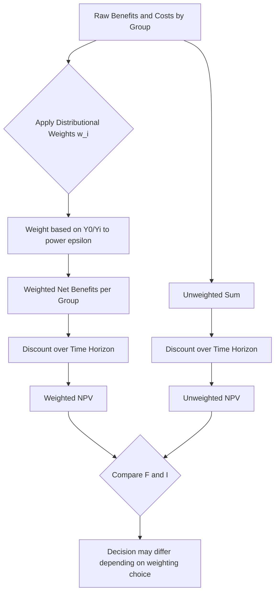

## Distributional Weighting in Cost-Benefit Analysis

### Conceptual Foundation

Standard cost-benefit analysis (CBA) sums net benefits across individuals using unweighted monetary values, implicitly treating a dollar of benefit or cost as equally significant regardless of who receives it. This is the **Kaldor-Hicks compensation principle**: a project is desirable if winners could hypothetically compensate losers and still be better off, even if compensation never actually occurs.

Distributional weighting relaxes this assumption by applying different weights to costs and benefits accruing to individuals or groups depending on their income level, wealth, or other markers of social priority. The underlying rationale rests on the **diminishing marginal utility of income**: a dollar transferred to a low-income household is generally believed to generate more welfare (utility) than the same dollar accruing to a high-income household.

**Key Points**

- Unweighted CBA answers "does the project increase aggregate net wealth?"
- Weighted CBA answers "does the project increase aggregate social welfare, given differing marginal utilities across recipients?"
- The technique attempts to formally reintroduce equity considerations into what is otherwise an efficiency-only framework

### Theoretical Basis: Social Welfare Functions

Distributional weights are derived by specifying a **social welfare function (SWF)** that aggregates individual utilities:

$$W = \sum_{i=1}^{n} f(U_i)$$

where $U_i$ is the utility of individual $i$, and $f(\cdot)$ is a concave transformation reflecting society's aversion to inequality (a utilitarian SWF sets $f$ as identity; a Rawlsian SWF places all weight on the worst-off individual).

To translate this into a practical weighting rule, analysts typically assume a **constant relative inequality aversion (CRIA)** utility function:

$$U_i = \frac{Y_i^{1-\varepsilon}}{1-\varepsilon}, \quad \varepsilon \neq 1$$

where $Y_i$ is individual $i$'s income and $\varepsilon$ is the **elasticity of marginal utility of income** (the inequality-aversion parameter). Differentiating gives marginal utility:

$$MU_i = Y_i^{-\varepsilon}$$

The **distributional weight** for individual or group $i$ relative to a reference income level $Y_0$ (often the mean or median income) is then:

$$w_i = \left(\frac{Y_0}{Y_i}\right)^{\varepsilon}$$

**Key Points**

- If $\varepsilon = 0$: no inequality aversion, weights collapse to 1 for everyone (standard unweighted CBA)
- If $\varepsilon = 1$: weights are inversely proportional to income ($w_i = Y_0/Y_i$)
- Higher $\varepsilon$ implies steeper weighting — benefits to the poor are valued disproportionately more
- Empirical estimates of $\varepsilon$ in public economics literature commonly range from 1 to 2, though this varies substantially by country and study [Unverified] — the parameter is fundamentally a value judgment as much as an empirical estimate

### The Weighted Net Present Value Formula

The standard **Net Present Value (NPV)** criterion is modified to incorporate weights:

$$NPV_{weighted} = \sum_{t=0}^{T} \frac{\sum_{i} w_i (B_{i,t} - C_{i,t})}{(1+r)^t}$$

Compare this to the unweighted version:

$$NPV_{unweighted} = \sum_{t=0}^{T} \frac{\sum_{i} (B_{i,t} - C_{i,t})}{(1+r)^t}$$

The only structural difference is the insertion of $w_i$ inside the summation over individuals/groups $i$ at each time period $t$. A project can flip from negative to positive NPV (or vice versa) purely due to reweighting, even with identical raw benefit and cost streams.

### Worked Example

Consider a flood-defense project costing $10 million, generating $12 million in benefits split between two groups:

| Group | Income Level | Raw Benefit | Raw Cost Share |
| --- | --- | --- | --- |
| Low-income residents | $Y_L = 15{,}000$ | $8,000,000 | $2,000,000 |
| High-income residents | $Y_H = 60{,}000$ | $4,000,000 | $8,000,000 |

Assume reference income $Y_0 = 30{,}000$ (population mean) and $\varepsilon = 1$.

Weights:

$$w_L = \frac{30{,}000}{15{,}000} = 2.0 \qquad w_H = \frac{30{,}000}{60{,}000} = 0.5$$

**Unweighted NPV** (single period, ignore discounting):

$$NPV = (8{,}000{,}000 - 2{,}000{,}000) + (4{,}000{,}000 - 8{,}000{,}000) = 6{,}000{,}000 - 4{,}000{,}000 = 2{,}000{,}000$$

**Weighted NPV**:

$$NPV_{weighted} = 2.0 \times (8{,}000{,}000 - 2{,}000{,}000) + 0.5 \times (4{,}000{,}000 - 8{,}000{,}000)$$

$$= 2.0 \times 6{,}000{,}000 + 0.5 \times (-4{,}000{,}000) = 12{,}000{,}000 - 2{,}000{,}000 = 10{,}000{,}000$$

**Output**

The weighted NPV ($10M) is substantially higher than the unweighted NPV ($2M) because the net gain accrues disproportionately to the low-income group, whose benefits are weighted up, while the net cost falls on the high-income group, whose costs are weighted down.

### Sources of Distributional Weights

**Key Points**

- **Income-based weights**: derived directly from the CRIA formula above; most common in applied guidance
- **Political/revealed weights**: back solved from a government's past decisions, assuming past choices reveal implicit social values (Weisbrod's approach, 1968)
- **Regional/spatial weights**: applied when a country wants to favor lagging regions (common in EU cohesion policy and regional development banks)
- **Categorical weights**: applied to specific vulnerable populations (children, disabled persons, displaced persons) independent of income per se

### Institutional Practice

Application varies considerably across jurisdictions and institutions:

- The **UK Green Book** (HM Treasury) has historically recommended reporting distributional impacts and, since a 2020 supplementary update, permits an explicit distributional weighting approach using an elasticity around $\varepsilon = 1.3$, alongside standard unweighted appraisal [Unverified — consult current Green Book guidance for the applicable coefficient, as parameters are periodically revised].
- Multilateral development banks (World Bank, Asian Development Bank) have historically used "poverty weighting" in project appraisal in some periods but scaled this back over time, often reporting distributional impacts qualitatively rather than through formal weights [Unverified — institutional practice shifts across decades and should be verified against current operational guidelines].
- The **US Office of Management and Budget (Circular A-4)** generally directs agencies to report distributional effects separately rather than building weights into the primary NPV calculation, reflecting a preference for transparency over aggregation.

**Next Steps**

- Web search was not required here since this is foundational, well-established public economics theory rather than an emerging technology or tool; however, current institutional weighting coefficients (Green Book, MDBs) should be verified against latest published guidance since these are administratively updated periodically.

### Diagrammatic Summary

### Methodological Critiques

**Key Points**

- **Value-judgment sensitivity**: the choice of $\varepsilon$ is not empirically neutral; different reasonable values produce materially different project rankings — this is widely acknowledged as a normative rather than purely technical choice
- **Double-counting risk**: if a tax-and-transfer system already redistributes income efficiently, using project-level weighting as a redistribution tool can be a second-best distortion; the "weights versus taxes" debate (associated with economists such as Harberger) argues that using the tax system for redistribution and unweighted CBA for efficiency is generally preferable in a first-best world [Unverified — this is a contested methodological position, not a settled consensus]
- **Data requirements**: accurately attributing benefits and costs to income groups (rather than aggregate totals) requires granular incidence data that is often unavailable or costly to produce
- **Political manipulability**: because weights can reverse project rankings, they are vulnerable to being chosen post hoc to justify predetermined conclusions rather than derived independently

### Illustrative Weight Schedule (SVG)

<svg xmlns="http://www.w3.org/2000/svg" viewBox="0 0 640 380" font-family="Arial, sans-serif">
<text x="320" y="25" text-anchor="middle" font-size="16" font-weight="bold" fill="#1a1a1a">Distributional Weight vs. Income Ratio (svg_diagram)</text>
<line x1="70" y1="320" x2="600" y2="320" stroke="#333" stroke-width="2" />
<line x1="70" y1="320" x2="70" y2="50" stroke="#333" stroke-width="2" />

<text x="335" y="355" text-anchor="middle" font-size="13" fill="#333">Individual Income Yi / Reference Income Y0</text>

<text x="25" y="185" text-anchor="middle" font-size="13" fill="#333" transform="rotate(-90 25 185)">Weight (wi)</text>

<text x="70" y="335" text-anchor="middle" font-size="11" fill="#555">0.25</text>

<text x="200" y="335" text-anchor="middle" font-size="11" fill="#555">0.5</text>

<text x="335" y="335" text-anchor="middle" font-size="11" fill="#555">1.0</text>

<text x="470" y="335" text-anchor="middle" font-size="11" fill="#555">2.0</text>

<text x="600" y="335" text-anchor="middle" font-size="11" fill="#555">4.0</text>

<text x="55" y="320" text-anchor="end" font-size="11" fill="#555">0</text>

<text x="55" y="240" text-anchor="end" font-size="11" fill="#555">1</text>

<text x="55" y="160" text-anchor="end" font-size="11" fill="#555">2</text>

<text x="55" y="80" text-anchor="end" font-size="11" fill="#555">4</text>

<path d="M 70 320 L 200 320 L 335 320 L 470 320 L 600 320" fill="none" stroke="#999" stroke-width="2" stroke-dasharray="6,4" />
<text x="605" y="323" font-size="11" fill="#999">ε = 0</text>
<path d="M 100 300 Q 200 250 335 240 Q 470 200 600 160" fill="none" stroke="#2563eb" stroke-width="2.5" />
<text x="605" y="163" font-size="11" fill="#2563eb">ε = 1</text>
<path d="M 100 280 Q 200 180 335 160 Q 470 100 600 60" fill="none" stroke="#dc2626" stroke-width="2.5" />
<text x="605" y="63" font-size="11" fill="#dc2626">ε = 2</text>
<circle cx="335" cy="320" r="4" fill="#333" />
<circle cx="335" cy="240" r="4" fill="#2563eb" />
<circle cx="335" cy="160" r="4" fill="#dc2626" />
<text x="345" y="235" font-size="10" fill="#333">weight = 1 at Yi = Y0</text>
</svg>

### Policy Design Implications

**Key Points**

- Analysts should typically present **both weighted and unweighted NPVs** alongside a disaggregated distributional impact table, rather than replacing standard CBA outright — this preserves transparency about how much the ranking depends on value judgments
- **Sensitivity analysis** over a plausible range of $\varepsilon$ (e.g., 0, 1, 1.3, 2) is standard practice to show how robust the project ranking is to the equity weighting assumption
- Distributional weighting is most defensible when: (a) the tax-transfer system cannot easily reach the affected population (e.g., informal sector workers, non-residents, future generations), or (b) the project itself is the primary policy lever available for redistribution in that context

**Related Topics**

- Social discount rate and intergenerational equity weighting
- Compensating and equivalent variation in welfare measurement
- Kaldor-Hicks efficiency and the potential Pareto improvement criterion
- Shadow pricing and the marginal cost of public funds
- Equity-efficiency trade-offs in public project selection
- Willingness-to-pay measures and income-elasticity bias in stated preference valuation
- Regional and spatial cost-benefit weighting in infrastructure appraisal
- Rawlsian versus utilitarian social welfare functions in public finance