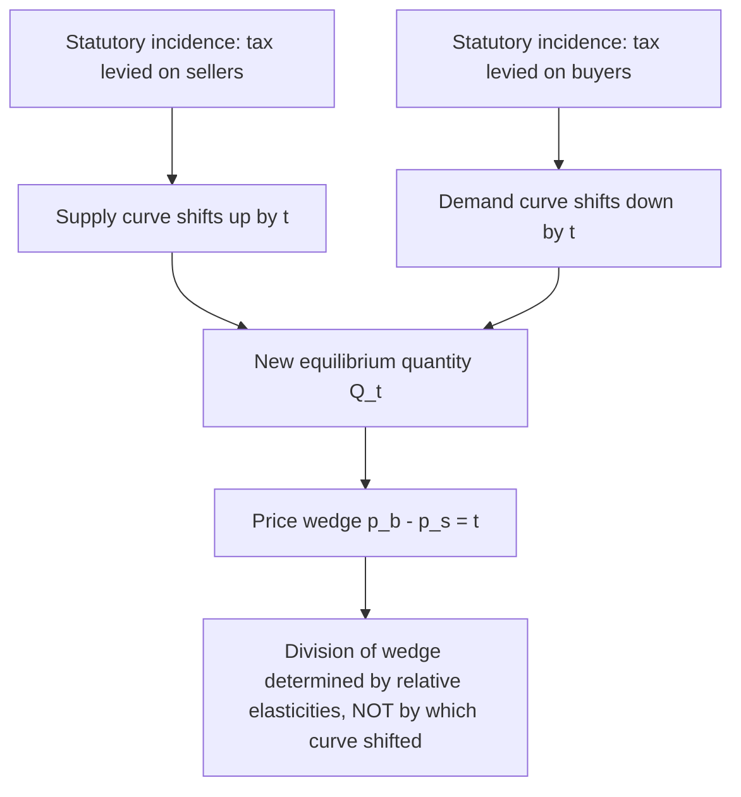

## Statutory versus Economic Incidence

### Definitions

**Statutory incidence** (also called legal or nominal incidence) refers to who is legally responsible for remitting a tax to the government — whose name is on the check, effectively. It is determined entirely by the wording of the tax statute.

**Economic incidence** refers to who actually bears the burden of the tax in terms of real economic welfare loss — measured as the change in real income (or consumer/producer surplus) a party experiences as a result of the tax.

The central insight of tax incidence theory is that these two need not coincide, and in general do not. A tax statutorily levied on sellers can be economically borne primarily by buyers, and vice versa.

### Why Statutory Incidence Is Irrelevant to Economic Burden

This result follows from the **invariance of equilibrium to statutory assignment**: in a competitive market, the equilibrium quantity and the division of the price wedge between buyers and sellers are the same regardless of which side of the market is legally required to remit the tax.

Consider a per-unit tax $t$ on a good with supply $S(p)$ and demand $D(p)$.

**Case 1 — tax levied on sellers.** Sellers receive $p_s$ per unit sold but must remit $t$ to the government, so the price buyers pay is $p_b = p_s + t$. Equilibrium requires:

$$D(p_s + t) = S(p_s)$$

**Case 2 — tax levied on buyers.** Buyers pay $p_b$ but only $p_b - t$ reaches sellers. Equilibrium requires:

$$D(p_b) = S(p_b - t)$$

Substituting $p_b = p_s + t$ into the second condition reproduces the first condition exactly. The equilibrium $(p_b, p_s)$ pair — and therefore the wedge $t = p_b - p_s$ — is identical under both statutory assignments. Only the *labeling* of who writes the check to the tax authority differs.

### Determinants of Economic Incidence: Relative Elasticities

Economic incidence is governed by the **relative elasticities of supply and demand**, not by statutory assignment. The side of the market that is less elastic (less able to adjust quantity in response to price) bears a larger share of the economic burden, because that side has fewer substitution possibilities to escape the tax.

The burden borne by consumers, as a share of the total tax, is:

$$\text{Consumer share} = \frac{\varepsilon_S}{\varepsilon_S - \varepsilon_D}$$

where $\varepsilon_S > 0$ is the price elasticity of supply and $\varepsilon_D < 0$ is the price elasticity of demand (both evaluated at the pre-tax equilibrium, using the standard sign convention). Equivalently, the producer share is:

$$\text{Producer share} = \frac{-\varepsilon_D}{\varepsilon_S - \varepsilon_D}$$

**Key Points**

- If $\varepsilon_D \to 0$ (perfectly inelastic demand), consumers bear the entire tax regardless of statutory assignment.
- If $\varepsilon_S \to 0$ (perfectly inelastic supply), producers bear the entire tax.
- If $\varepsilon_D \to -\infty$ (perfectly elastic demand), producers bear the entire tax, since consumers can costlessly substitute away.
- If $\varepsilon_S \to \infty$ (perfectly elastic supply), consumers bear the entire tax.

### Graphical Intuition

An equivalent way to see this: shifting the supply curve up by $t$ (tax on sellers) or shifting the demand curve down by $t$ (tax on buyers) produces parallel-shift diagrams that yield the *same* $Q_t$, $p_b$, and $p_s$. The vertical wedge between the original supply and demand curves at $Q_t$ splits into a consumer portion (above original equilibrium price) and producer portion (below it) according to the curves' slopes — i.e., elasticities — not according to which curve was shifted.

### Worked Example

Suppose at the pre-tax equilibrium, $\varepsilon_D = -0.5$ and $\varepsilon_S = 1.5$, and a $2 per-unit tax is imposed.

Consumer share $= \dfrac{1.5}{1.5 - (-0.5)} = \dfrac{1.5}{2.0} = 0.75$

Producer share $= \dfrac{0.5}{2.0} = 0.25$

**Example**

Consumers bear $1.50 of the $2 tax and producers bear $0.50 — even if the statute names the seller as the remitting party. If the statute were rewritten to name the buyer as remitter instead, the $1.50/$0.50 split would be unchanged; only the mechanics of collection differ.

### Perfect Competition Assumption and Its Role

The equivalence result above relies on the market being competitive and the tax being a **specific (per-unit) tax** with no transaction costs, compliance costs, or salience differences between the two statutory arrangements. Under these idealized conditions, statutory and economic incidence are cleanly separable, and only elasticities matter.

### Departures from the Baseline Equivalence

Several factors can cause statutory incidence to matter for economic incidence in practice, breaking the clean elasticity-only result above:

- **Tax salience.** [Inference] Empirical work (e.g., Chetty, Looney, and Kroft's studies on sales tax salience) finds that when a tax is less visible to consumers at the point of decision (e.g., added at the register rather than posted on the shelf tag), consumers respond less to it than standard theory predicts, so statutory framing can affect behavioral — and hence economic — incidence even though the basic supply-and-demand model says it shouldn't.
- **Administrative and compliance costs.** If remittance imposes real resource costs (bookkeeping, compliance risk) that differ depending on which side is designated as remitter, this asymmetry can make statutory assignment economically relevant.
- **Imperfect competition.** Under monopoly, oligopoly, or monopsony, the pass-through rate of a tax can depend on the functional form of demand/cost and need not follow the simple elasticity-ratio formula; in some cases (e.g., monopoly with linear demand vs. constant-elasticity demand), over-shifting (pass-through exceeding 100% of the tax) is possible.
- **General equilibrium effects.** Partial equilibrium incidence analysis (as above) ignores how the tax affects incomes and prices in other markets. In a general equilibrium framework (à la Harberger), incidence also depends on factor mobility and substitutability across sectors, meaning the burden can ultimately fall on factor owners (capital, labor) rather than "consumers" or "producers" in the taxed market per se.

### Statutory Incidence and Political Economy

Even though it doesn't determine economic incidence, statutory incidence is not irrelevant to policy design. It affects:

- **Compliance cost allocation** — who must track, file, and remit, which has real administrative costs typically assigned to the party better able to bear them (e.g., firms rather than individual consumers, due to economies of scale in compliance).
- **Political visibility and perception** — legislators often choose statutory incidence strategically because voters/consumers may misperceive who "really" bears a tax, a phenomenon sometimes called **fiscal illusion**.
- **Enforcement feasibility** — remittance is often assigned to the party with better recordkeeping or fewer, larger entities (e.g., taxing gasoline at the wholesale/distributor level rather than at each retail pump).

### Common Misconceptions

**Key Points**

- "A payroll tax split 50/50 between employer and employee statutorily means the burden is split 50/50." — False. The economic split depends on labor supply and labor demand elasticities, and empirical estimates generally find employees bear the majority of the statutory employer share as well, through wage adjustment.
- "If a tax is levied on producers, prices won't rise for consumers." — False in general; prices typically rise by the consumer's elasticity-determined share of $t$, regardless of statutory assignment.
- "Economic incidence can be read off which party writes the check." — False; this conflates statutory and economic incidence, the core distinction this topic addresses.

### Related Topics

- Tax incidence with ad valorem (percentage) taxes vs. specific (per-unit) taxes
- Pass-through and incidence under imperfect competition (monopoly, oligopoly)
- General equilibrium (Harberger) tax incidence model
- Payroll tax incidence and labor market applications
- Tax salience and behavioral responses to statutory framing
- Incidence of capital taxation and international capital mobility