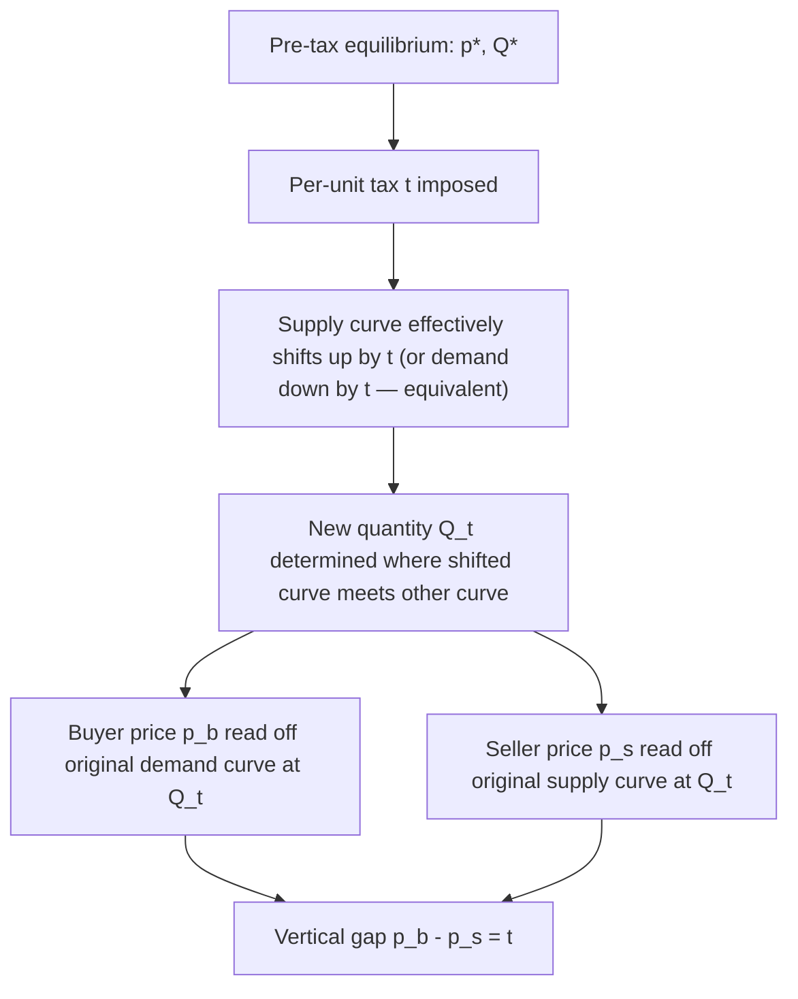

## Partial Equilibrium Incidence in Competitive Markets

### Framework Overview

Partial equilibrium incidence analysis studies how a tax imposed in a single market affects prices, quantities, and welfare in *that market alone*, holding all other markets, income effects, and cross-market price adjustments fixed. It is the standard workhorse model for introducing tax incidence because it isolates the elasticity-driven mechanics of burden-sharing without the complexity of a full multi-market system.

The model assumes:

- A single competitive market with well-behaved supply $S(p)$ and demand $D(p)$ curves
- Price-taking buyers and sellers
- No spillover effects into other markets (the taxed good is a small part of the economy, or cross-price elasticities with other goods are negligible)
- No income effects large enough to feed back into demand for the taxed good

### Setting Up the Model

Let $p_b$ denote the price paid by buyers and $p_s$ denote the price received by sellers. A specific (per-unit) tax $t$ creates a wedge:

$$p_b - p_s = t$$

Pre-tax equilibrium occurs at $p^*$ where $D(p^*) = S(p^*) = Q^*$. Post-tax equilibrium requires:

$$D(p_b) = S(p_s) = Q_t \quad \text{with} \quad p_b = p_s + t$$

This is two equations in two unknowns ($p_b$, $p_s$), pinning down the new equilibrium quantity $Q_t < Q^*$ (assuming normal upward/downward sloping curves) and the wedge division.

### Comparative Statics: The Elasticity Formulas

Totally differentiating the equilibrium conditions with respect to $t$ yields the standard pass-through (incidence) formulas. Define elasticities at the pre-tax equilibrium:

$$\varepsilon_D = \frac{dQ}{dp}\cdot\frac{p}{Q}\bigg|_{\text{demand}} \quad (\varepsilon_D < 0), \qquad \varepsilon_S = \frac{dQ}{dp}\cdot\frac{p}{Q}\bigg|_{\text{supply}} \quad (\varepsilon_S > 0)$$

The change in buyer price and seller price as a fraction of $t$:

$$\frac{dp_b}{dt} = \frac{\varepsilon_S}{\varepsilon_S - \varepsilon_D}, \qquad \frac{dp_s}{dt} = \frac{\varepsilon_D}{\varepsilon_S - \varepsilon_D}$$

Note $\dfrac{dp_b}{dt} - \dfrac{dp_s}{dt} = 1$, confirming the full wedge $t$ is accounted for between the two prices.

**Key Points**

- $\frac{dp_b}{dt}$ is the **pass-through rate** to consumers — the fraction of the tax reflected in the price consumers actually pay.
- When $\varepsilon_D = 0$ (perfectly inelastic demand), $dp_b/dt = 1$: full pass-through, consumers absorb the entire tax.
- When $\varepsilon_S \to \infty$ (perfectly elastic supply, e.g., a constant-cost industry), $dp_b/dt \to 1$ as well, for the same underlying reason: the inelastic side cannot escape the tax by adjusting quantity supplied cheaply, so the burden falls on the relatively less flexible/elastic side.

### The Quantity Effect

Beyond the price split, the model also pins down the equilibrium quantity reduction:

$$\frac{dQ}{dt} = \frac{\varepsilon_D \cdot \varepsilon_S}{\varepsilon_S - \varepsilon_D} \cdot \frac{Q}{p}$$

This is negative (since $\varepsilon_D < 0 < \varepsilon_S$), confirming the tax reduces equilibrium quantity traded. The magnitude of this reduction — not just the price split — is what drives deadweight loss (covered separately, but mechanically linked here).

### Graphical Representation

In the standard diagram, draw the original $S$ and $D$ curves. At the new (lower) quantity $Q_t$, the vertical distance between the demand curve and the supply curve equals $t$. The portion of that vertical distance above the original $p^*$ is the consumer burden per unit; the portion below $p^*$ is the producer burden per unit.

### Welfare Accounting in Partial Equilibrium

**Example**

With linear supply and demand, the total tax revenue collected is $t \times Q_t$ (a rectangle in the standard diagram), which splits into a consumer-paid portion and a producer-paid portion according to the pass-through shares above. The **deadweight loss** is the triangular area between the original and new quantity, reflecting the value of mutually beneficial trades ($Q^* - Q_t$ units) that no longer occur because the tax-inclusive price wedge exceeds any surviving surplus on those marginal units.

### Extension: Ad Valorem Taxes

The specific-tax case above generalizes to an **ad valorem** (percentage) tax $\tau$, where $p_b = p_s(1+\tau)$. The comparative statics are analogous but expressed in percentage terms:

$$\frac{d\ln p_b}{d\tau} \approx \frac{\varepsilon_S}{\varepsilon_S - \varepsilon_D}$$

with the same qualitative elasticity-driven logic. [Inference] For most textbook applications with locally linear or constant-elasticity curves, specific and ad valorem taxes that raise equivalent revenue produce very similar incidence outcomes near the initial equilibrium, though the two can diverge more substantially away from that neighborhood or under non-standard curve shapes.

### Limitations of the Partial Equilibrium Approach

**Key Points**

- Ignores factor market feedback — e.g., a tax that depresses output in one industry may free up labor/capital that flows to other sectors, with incidence implications the partial equilibrium model cannot capture.
- Ignores income effects on the demand side from the tax revenue's ultimate disposition (assumes revenue is simply removed from the economy or is a lump-sum matter separate from the analysis).
- Assumes the taxed market is "small" relative to the whole economy; this breaks down for taxes on broad-based goods (e.g., a general sales tax), where general equilibrium analysis (Harberger-style) is more appropriate.
- Assumes perfectly competitive price-taking behavior; incidence under market power follows different pass-through rules (relevant for the "departures" content covered under Statutory versus Economic Incidence).

### Related Topics

- General equilibrium tax incidence (the Harberger model)
- Deadweight loss and the excess burden of taxation
- Tax incidence under monopoly and imperfect competition
- Ad valorem versus specific taxation: efficiency comparisons
- Incidence in factor markets (labor and capital taxation)
- Tax capitalization in asset markets