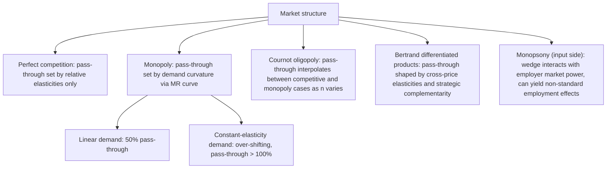

## Incidence under Imperfect Competition

### Why This Departs from the Competitive Case

Under perfect competition, tax incidence is fully determined by the relative elasticities of supply and demand, independent of statutory assignment (see *Statutory versus Economic Incidence*). Under imperfect competition — monopoly, oligopoly, or monopolistic competition — this clean result breaks down. The pass-through rate now depends on the **curvature of the demand curve** and the firm's optimal pricing rule, not just elasticity magnitudes at a point. Notably, **over-shifting** (pass-through exceeding 100% of the tax) becomes possible, which cannot occur in the standard competitive model with normally-sloped curves.

### Monopoly with a Specific Tax

Consider a monopolist facing inverse demand $p(Q)$ and constant marginal cost $c$. Absent a tax, the monopolist sets marginal revenue equal to marginal cost:

$$MR(Q) = c$$

With a specific tax $t$ per unit, the tax acts like an addition to marginal cost:

$$MR(Q_t) = c + t$$

The monopoly price $p_t = p(Q_t)$ increases, but *by how much relative to $t$* depends on the shape of the marginal revenue curve, which in turn depends on the curvature of demand.

### Pass-Through and Demand Curvature

Differentiating the monopolist's first-order condition with respect to $t$ gives the pass-through rate:

$$\frac{dp}{dt} = \frac{1}{2 + \dfrac{p''(Q) \cdot Q}{p'(Q)}}$$

**Key Points**

- **Linear demand** ($p'' = 0$): pass-through rate $= 1/2$. The monopolist passes through exactly half the tax — *less* than full pass-through, unlike the competitive perfectly-elastic-supply benchmark.
- **Constant-elasticity demand** ($p(Q) = AQ^{-1/\varepsilon}$): pass-through rate $= \dfrac{\varepsilon}{\varepsilon - 1} > 1$ for $\varepsilon > 1$. This is **over-shifting** — the price rises by *more* than the tax itself.
- **Convex demand curves** (demand that becomes less elastic as price rises, or specific functional forms like constant-elasticity) generally produce pass-through rates exceeding those under linear demand, and can exceed 100%.
- The intuition for over-shifting: a monopolist already restricts output below the competitive level to exploit market power; the tax gives further incentive to raise price, and if marginal revenue falls off slowly as quantity is cut (typical of highly convex/constant-elasticity demand), the profit-maximizing response is to raise price by more than the cost increase.

### Ad Valorem versus Specific Taxes under Monopoly

A notable departure from the competitive-market equivalence result: under monopoly, **ad valorem and specific taxes that raise the same revenue are not equivalent** in their effects on price, quantity, and welfare.

With an ad valorem tax $\tau$, the monopolist's problem becomes maximizing $(1-\tau)p(Q)Q - cQ$, giving first-order condition:

$$(1-\tau)\left[p(Q) + p'(Q)Q\right] = c$$

**Example**

For a revenue-equivalent specific tax and ad valorem tax, the ad valorem tax generally induces a *smaller* price increase and *smaller* output reduction than the specific tax, because the ad valorem tax scales down the marginal revenue the monopolist earns from marginal units, effectively making the monopolist's own incentive to restrict output work partly against the tax's price-raising effect. This is a classical result (going back to analyses by Suits and Musgrave) with policy relevance: **ad valorem taxation is generally welfare-superior to specific taxation under monopoly** for a given revenue target, in contrast to the competitive case where the two are essentially equivalent.

### Oligopoly (Cournot Competition)

Under Cournot oligopoly with $n$ symmetric firms, each firm $i$ chooses quantity $q_i$ to maximize profit given rivals' quantities. With a per-unit tax $t$ imposed on all firms, the symmetric equilibrium condition is:

$$p(Q) + q_i \, p'(Q) = c + t$$

**Key Points**

- As $n \to \infty$, the model converges to the competitive benchmark, and incidence converges to the standard elasticity-ratio formula.
- As $n \to 1$, it converges to the monopoly case above.
- [Inference] For intermediate $n$, pass-through generally lies between the competitive and monopoly benchmarks, though the exact relationship depends on demand curvature and conduct parameters, and can be non-monotonic in $n$ for some demand specifications.
- Pass-through under Cournot can also exceed 100% under sufficiently convex demand, similar to the monopoly case, though the threshold curvature differs by market structure.

### Bertrand Competition with Differentiated Products

Under Bertrand price competition with differentiated goods, each firm sets price directly rather than quantity. Incidence here depends on:

- **Cross-price elasticities of demand** between competing varieties (how much a tax-induced price increase by one firm causes substitution toward untaxed or differently-taxed rivals)
- **Strategic complementarity in pricing** — because prices are strategic complements in most Bertrand-differentiated-goods models, a tax-induced price increase by one firm induces rivals to also raise prices somewhat, amplifying pass-through relative to a single-firm monopoly benchmark facing the same own-price elasticity.

### Monopsony (Buyer-Side Market Power)

Incidence analysis is symmetric on the input/buyer side. A monopsonist facing an upward-sloping supply curve for an input (e.g., labor) sets the marginal cost of the input above the supply price. A tax on the input (e.g., a payroll tax) interacts with this wedge in ways that depend on the elasticity of labor supply the monopsonist faces, and — notably — under monopsony a *small* tax or minimum-price floor can in some ranges *increase* employment relative to the untaxed monopsony outcome, a result with no analogue in competitive labor markets. This connects directly to minimum wage and payroll tax incidence debates under employer market power.

### Graphical/Structural Summary

### Why This Matters for Policy

**Key Points**

- Assuming competitive incidence formulas in markets with substantial market power (e.g., concentrated industries, platform markets, some agricultural input markets) can significantly mis-predict who bears a proposed tax.
- The ad valorem vs. specific tax welfare ranking flips depending on market structure — a reason cigarette and alcohol excise design (often specific taxes) versus general sales taxation (ad valorem) draws on this literature.
- Over-shifting has direct relevance to "sin tax" policy debates (soda taxes, tobacco taxes), where empirical pass-through estimates exceeding 100% have been used as evidence of imperfectly competitive local retail markets. [Inference] This is an active empirical research area rather than a settled universal finding, and estimated pass-through rates vary substantially by product, geography, and study design.

### Related Topics

- Statutory versus Economic Incidence (the competitive-market benchmark this topic departs from)
- General equilibrium tax incidence and the Harberger model
- Monopsony and employer labor market power
- Ad valorem versus specific taxation: efficiency comparisons
- Empirical estimation of tax pass-through rates
- Two-part tariffs and non-linear pricing under market power