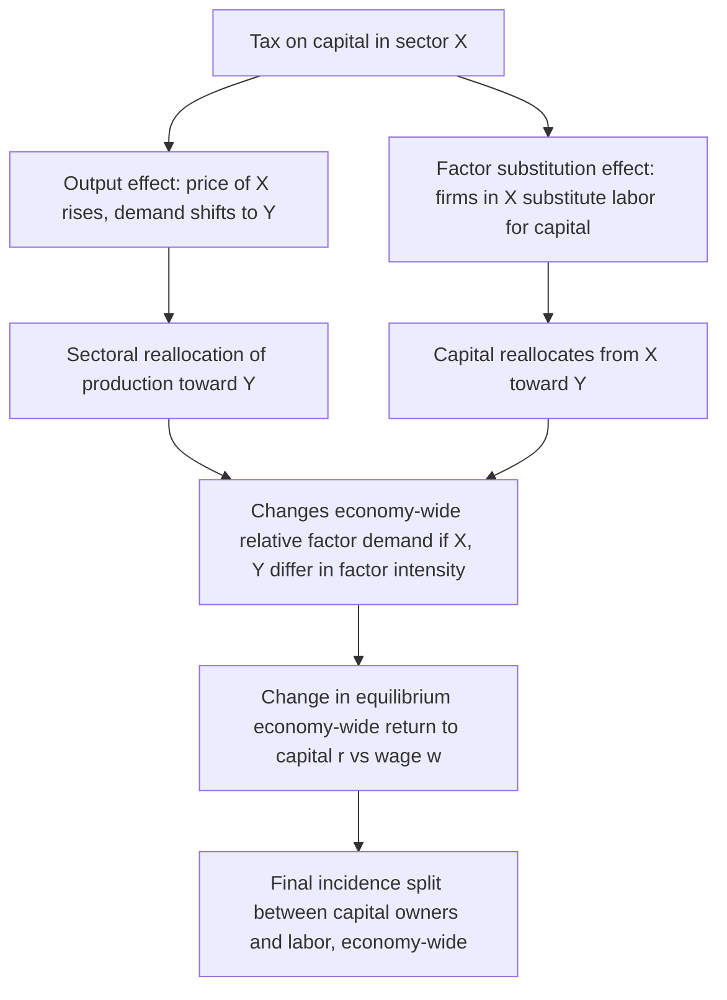

## General Equilibrium Tax Incidence and the Harberger Model

### Motivation: Why Partial Equilibrium Is Insufficient

Partial equilibrium incidence analysis (see *Partial Equilibrium Incidence in Competitive Markets*) studies a single market in isolation, holding factor prices and other goods' markets fixed. This is a reasonable approximation for taxes on narrow markets, but breaks down for taxes affecting a broad sector — e.g., a tax on all corporate capital income, or on an entire industry that employs a significant share of an economy's capital or labor. Such taxes trigger **factor reallocation across sectors**, and the ultimate burden falls not just on "consumers" or "producers" of the taxed good, but on the **owners of factors of production** (capital and labor) economy-wide, in proportions that depend on how mobile and substitutable those factors are.

Arnold Harberger's 1962 model ("The Incidence of the Corporation Income Tax") is the foundational general equilibrium framework for analyzing this.

### The Two-Sector, Two-Factor Structure

The canonical Harberger model assumes:

- Two sectors/industries, e.g., a "corporate" sector ($X$) and a "non-corporate" sector ($Y$)
- Two factors of production, capital ($K$) and labor ($L$), both **perfectly mobile between sectors** in the long run (a key assumption)
- Fixed total factor supplies in the economy (closed economy, no international factor flows)
- Constant returns to scale production functions in each sector
- Competitive factor and product markets
- Full employment of both factors maintained throughout

A tax is imposed on capital used in one sector only (e.g., a corporate income tax applies to capital in sector $X$ but not sector $Y$).

### Two Channels of Incidence: Output Effect and Factor Substitution Effect

The Harberger model decomposes the ultimate burden into two distinct economic channels:

**Output effect.** The tax raises the cost of producing good $X$ (the taxed sector), causing its relative price to rise and consumers to substitute toward good $Y$. Production shifts from $X$ to $Y$. If the two sectors use capital and labor in different proportions (differing **factor intensities**), this sectoral reallocation changes the *economy-wide* relative demand for capital versus labor, even though total factor supplies are fixed. This channel operates through the **product market**.

**Factor substitution effect.** Within sector $X$, the tax raises the cost of capital relative to labor, inducing firms in $X$ to substitute toward labor and away from capital (holding output fixed). Since capital is mobile, capital flees sector $X$ for sector $Y$, driving down the *after-tax* return to capital economy-wide (because total capital supply is fixed, and the untaxed sector cannot absorb the fleeing capital without capital's economy-wide return falling). This channel operates through **factor markets** directly.

**Key Points**

- Both channels generally push in the same direction *if* $X$ is the more capital-intensive sector and demand for $X$ and $Y$ are reasonably substitutable — both tend to depress the after-tax return to capital economy-wide, meaning capital bears more of the burden than a naive partial-equilibrium "the tax is on capital in sector $X$, so capital in sector $X$ bears it" story would suggest.
- The two channels can also work in *opposite* directions under certain factor-intensity and substitution-elasticity configurations, which is part of why Harberger's central finding — that capital broadly bears roughly the full burden of the corporate income tax — was influential but also debated.

### Formal Sketch of the Model

Let $\sigma_X, \sigma_Y$ denote elasticities of substitution between capital and labor within each sector, and $\sigma_D$ denote the elasticity of substitution in demand between goods $X$ and $Y$. Let $\theta_{KX}, \theta_{LX}$ denote capital's and labor's distributive shares in sector $X$ (and analogously for $Y$). Harberger's approximate formula for the change in the capital-labor income ratio (a proxy for the incidence split) as a function of a small tax $t$ on capital in sector $X$ takes the form:

$$\frac{d(r/w)}{r/w} \approx -t \cdot \left[\lambda_{KX}\left(\sigma_X - \sigma_D\right) \frac{\theta_{LX}}{\theta_{KX}} \cdot (\text{factor-intensity difference terms})\right]$$

where $\lambda_{KX}$ is the share of the economy's total capital stock employed in sector $X$, and $r$, $w$ are the equilibrium returns to capital and labor respectively. [Inference] The exact algebraic form varies somewhat across textbook expositions and depends on normalization choices; the qualitative content — that the sign and magnitude of the effect on capital's after-tax return depends on the gap between the within-sector substitution elasticities ($\sigma_X$, $\sigma_Y$) and the between-goods demand substitution elasticity ($\sigma_D$), combined with relative factor intensities — is the standard, well-established takeaway.

### Key Qualitative Results

**Key Points**

- If sector $X$ (taxed) is **more capital-intensive** than sector $Y$, and $\sigma_D$ (demand substitutability between $X$ and $Y$) is small relative to the within-sector substitution elasticities, capital tends to bear *more* than 100% of the tax burden in relative-return terms (over-shifting onto capital), because the output effect reinforces the factor-substitution effect.
- If $\sigma_D$ is large (consumers substitute readily away from $X$), the output effect is strong, reinforcing capital's burden further, since demand shifts rapidly away from the capital-intensive good.
- If the factor substitution elasticities $\sigma_X, \sigma_Y$ are very high (firms can easily substitute labor for capital within each sector), firms escape the tax by adjusting input mix, which can shift more burden onto labor instead, since capital doesn't need to flee the sector as dramatically to avoid the tax's bite on the margin.
- In the special case where both sectors have **identical factor intensities**, the output effect vanishes (reallocating output between $X$ and $Y$ doesn't change the economy's aggregate capital-labor employment ratio), and incidence is driven purely by the factor substitution effect.

### Diagrammatic Summary

### Harberger's Original Empirical Conclusion

[Unverified] Harberger's 1962 calibration, using then-available estimates of U.S. factor shares and substitution elasticities, concluded that capital bears **approximately the full burden** of the U.S. corporate income tax — a result that was influential in public finance for decades. This specific numerical conclusion has been extensively revisited and challenged in the subsequent literature (e.g., work incorporating open-economy capital mobility, which tends to shift more burden onto labor since capital can flee abroad rather than just to the untaxed domestic sector), so the *qualitative framework* is the durable contribution, while the *specific "capital bears it all" number* should be treated as one calibration under a particular closed-economy setup rather than a settled universal empirical fact.

### Open-Economy Extensions

A major modern extension relaxes the closed-economy assumption. If capital is internationally mobile (can flow to/from foreign markets) while labor is not, a domestic capital tax can be largely or entirely shifted onto domestic **labor**, since capital simply relocates abroad until the after-tax domestic return matches the (unchanged) world return, and the resulting reduction in the domestic capital stock lowers labor's marginal product and hence wages. This is a central argument in debates over corporate tax incidence in small open economies, and has featured prominently in CBO and Treasury incidence-scoring methodology debates.

### Limitations and Extensions of the Basic Model

**Key Points**

- The two-sector, two-factor, fixed-factor-supply setup is a stylized simplification; real economies have many sectors and factors, and computable general equilibrium (CGE) models are used in practice to quantify incidence with more realism.
- The model assumes full employment is maintained throughout — it is not designed to capture short-run unemployment or adjustment-cost effects from a newly imposed tax.
- Factor supply is assumed fixed (inelastic in aggregate); relaxing this (e.g., allowing labor supply or savings to respond to after-tax factor returns) introduces additional incidence channels beyond the pure reallocation story above.
- Modern applied incidence work (e.g., by the CBO, Treasury OTA, and academic public finance economists) blends Harberger-style general equilibrium intuition with richer CGE modeling and, increasingly, open-economy capital mobility assumptions.

### Related Topics

- Statutory versus Economic Incidence
- Partial Equilibrium Incidence in Competitive Markets
- Incidence under Imperfect Competition
- Corporate income tax incidence in open economies
- Computable general equilibrium (CGE) tax modeling
- Capital mobility and international tax competition