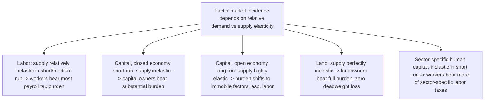

## Incidence in Factor Markets

### Overview: From Goods Markets to Factor Markets

The elasticity-based incidence logic developed for goods markets (see *Partial Equilibrium Incidence in Competitive Markets*) applies symmetrically to factor markets — labor, capital, and land — but with sector-specific institutional features (payroll tax splitting conventions, capital mobility, land's fixed supply) that shape how the general framework plays out in practice. This topic surveys incidence analysis specifically for taxes on factors of production.

### General Principle Restated for Factors

For any factor market, a tax wedge $t$ between what buyers of the factor (firms) pay and what sellers of the factor (factor owners) receive splits according to relative elasticities of factor demand and factor supply:

$$\text{Factor owner's burden share} = \frac{\varepsilon_{D}}{\varepsilon_{D} - \varepsilon_{S}}$$

where $\varepsilon_D$ is the elasticity of factor demand (from firms) and $\varepsilon_S$ is the elasticity of factor supply (from factor owners), using the convention that demand elasticities are negative. The side with the **less elastic response** bears more of the burden — identical logic to goods markets, but the "less elastic side" in factor markets is often driven by specific institutional or physical constraints rather than pure preference-based substitution.

### Labor Markets: Payroll Tax Incidence

Payroll taxes (e.g., U.S. Social Security/Medicare taxes) are typically split statutorily between employer and employee (e.g., 50/50 in the U.S. system). As with any tax, **statutory splitting is economically irrelevant** — the true burden division depends on labor supply and labor demand elasticities.

**Key Points**

- Labor supply is typically estimated to be **quite inelastic** in the aggregate, especially for prime-age male workers, though more elastic for secondary earners, low-income workers, and at the extensive margin (whether to work at all) versus intensive margin (hours conditional on working).
- Labor demand is generally considered more elastic than aggregate labor supply in most empirical settings, particularly in the long run as firms can substitute toward capital or relocate.
- Given inelastic supply relative to demand, most empirical public finance work finds that **employees bear the large majority of the payroll tax burden**, including the nominal "employer share," through lower wages than they would otherwise receive — this is one of the most replicated findings in applied labor/public economics.
- This has direct policy relevance: proposals to shift the statutory employer/employee split (e.g., "have employers pay more") are frequently noted by economists to have limited effect on the *actual* distribution of burden, since wages adjust to offset the statutory reassignment.

### Minimum Wages and Payroll Tax Interaction

A subtlety: the standard "employees bear most of the payroll tax" result assumes wages can freely adjust downward. If a **binding minimum wage** prevents wages from falling to absorb the tax, the burden shifts differently — potentially onto employers (via reduced profits) or onto consumers (via higher output prices) or onto workers via reduced *employment* rather than reduced wages. This interaction is a recurring theme in labor economics research on minimum wage and payroll tax policy design.

### Capital Markets: Mobility as the Key Elasticity Determinant

For capital taxation, the crucial elasticity is the **elasticity of capital supply**, which is heavily shaped by capital's geographic mobility:

- **Closed economy, immobile capital** (short run): capital supply to a sector or economy is relatively inelastic in the short run (existing capital stock is largely fixed/sunk), so capital owners bear a substantial share of a newly imposed capital tax in the short run.
- **Open economy, internationally mobile capital** (long run): capital supply becomes highly elastic, since capital can relocate to jurisdictions with lower taxation. In the limiting case of perfectly elastic capital supply at the world rate of return, domestic capital owners bear **none** of a domestic capital tax in the long run — the burden shifts entirely onto immobile factors, principally domestic labor (via a lower capital stock reducing labor's marginal product) — connecting directly to the open-economy extension of the Harberger model.

**Example**

A small open economy that unilaterally raises its corporate tax rate will, in the long run, see capital flow out until the after-tax return to capital matches the unchanged world rate of return. The resulting smaller domestic capital stock reduces labor productivity and wages — so even though the tax is statutorily and even initially economically borne by "capital," the long-run general equilibrium incidence falls substantially on domestic workers.

### Land Markets: The Fully Inelastic Supply Case

Land is the textbook example of a **perfectly inelastic supply** factor (in aggregate, ignoring reclamation/development at the margin). Applying the elasticity formula with $\varepsilon_S = 0$:

$$\text{Landowner's burden share} = \frac{\varepsilon_D}{\varepsilon_D - 0} = 1$$

**Key Points**

- A tax on land value (in its pure form, e.g., a tax on unimproved land value rather than structures) is borne **entirely by landowners**, regardless of the elasticity of demand for land use, because landowners have no supply-side margin to escape the tax — they cannot reduce the quantity of land supplied in response.
- This is the classical efficiency argument (traceable to Henry George's "single tax" proposal) for land value taxation as a theoretically **non-distortionary** tax: since supply is perfectly inelastic, there is no deadweight loss from a pure land tax, in contrast to taxes on producible factors like capital and labor, whose supply *can* respond.
- This result depends critically on distinguishing **land value** from **structures/improvements** built on the land, since improvements have elastic supply (more can be built) and a tax on improved property behaves more like a capital tax.

### Human Capital and the Quasi-Fixity of Skills

A related nuance: labor supply elasticity itself is not homogeneous across skill types or time horizons.

- **Short-run/specific human capital**: workers with skills specific to a particular firm, industry, or occupation have more inelastic supply in that specific market (switching costs, retraining costs), so they bear more burden from sector-specific labor taxes, similarly to land's fixed-supply logic.
- **Long-run/general human capital**: over a longer horizon, individuals can retrain or relocate across sectors, increasing the effective elasticity of labor supply to any particular sector or skill category, which shifts more burden onto employers/consumers in that market and less onto the specific workers, though not onto labor economy-wide.

### Summary Comparison Across Factor Types

### Empirical Estimation Challenges

**Key Points**

- Estimating factor supply and demand elasticities credibly is central to applied incidence work and is methodologically difficult, since observed wage/price and quantity data reflect *equilibrium* outcomes, not the underlying structural curves directly — this motivates the broader empirical methods literature (natural experiments, quasi-experimental designs) used throughout applied public and labor economics.
- [Inference] Estimates of key elasticities (aggregate labor supply, international capital mobility) vary meaningfully across studies, time periods, and countries, so incidence conclusions drawn from any single calibration should be treated as sensitive to that underlying elasticity assumption rather than as fixed structural constants.

### Related Topics

- General Equilibrium Tax Incidence and the Harberger Model
- Statutory versus Economic Incidence
- Monopsony and Employer Labor Market Power
- Land value taxation and Georgist tax theory
- International capital mobility and tax competition
- Empirical Methods and the Credibility Revolution (labor economics)