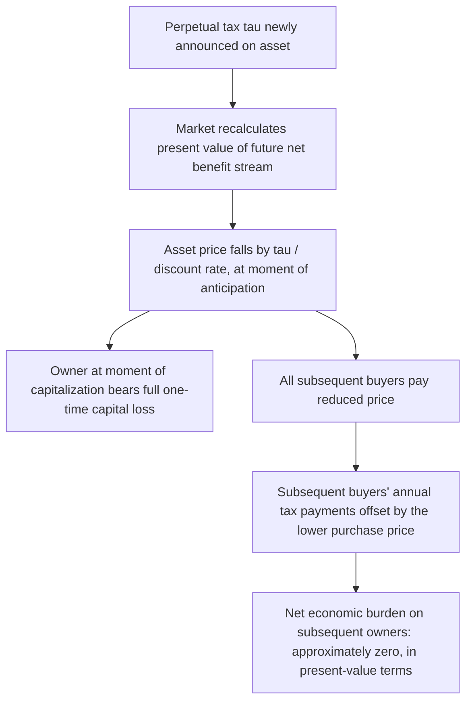

## Tax Capitalization

### Definition

**Tax capitalization** refers to the phenomenon in which a recurring tax liability on an asset becomes embedded in — "capitalized into" — the asset's price at the moment the tax is imposed, expected, or changed. The **buyer at the time of the tax change bears no ongoing burden**; instead, the **owner of the asset at the moment the tax is capitalized bears the entire discounted present value of the tax**, as a one-time capital loss, even though future owners are the ones who will nominally pay the tax each period going forward.

This is a distinct but closely related concept to standard flow-incidence analysis: capitalization concerns the **timing and distribution across successive owners** of a tax on a durable, tradeable asset, rather than the split between buyers and sellers in a single transaction.

### The Core Mechanism: Present Value Pricing

Consider an asset (e.g., land, a house, a bond) that generates a stream of benefits (rent, dividends, coupon payments) $B$ per period in perpetuity, with market discount rate $\rho$. Absent any tax, the asset's price is:

$$P_0 = \frac{B}{\rho}$$

Suppose a perpetual annual tax $\tau$ on the asset is newly imposed (and expected to persist). The after-tax net benefit stream becomes $B - \tau$, and rational forward-looking buyers will only pay:

$$P_1 = \frac{B - \tau}{\rho} = P_0 - \frac{\tau}{\rho}$$

The price drops immediately by $\tau/\rho$ — the present value of the entire future tax stream — at the moment the tax is imposed or becomes anticipated by the market.

### Who Bears the Burden?

**Key Points**

- The owner **at the instant the tax is capitalized** (announced, enacted, or first credibly anticipated) suffers a one-time capital loss equal to $\tau/\rho$, even if they hold the asset for only one more day before selling.
- Every **subsequent buyer** pays the already-discounted price $P_1$ and therefore pays exactly enough less upfront to exactly offset the annual tax they'll owe going forward — in present-value terms, they are made whole and bear **no net economic burden** despite being the ones who nominally remit the tax each year.
- This means the *statutory* taxpayer in every year after the initial capitalization event is **not** the economic bearer of the burden — the entire burden was already extracted from the original owner at the point of sale (or immediately, if they don't sell).

### Worked Numerical Example

**Example**

A piece of land generates $10,000/year in net rental income, with a market discount rate of 5%. Its pre-tax price is $P_0 = \dfrac{10{,}000}{0.05} = \$200{,}000$.

Suppose the government announces a new perpetual annual property tax of $2,000/year on this parcel. The capitalized price becomes:

$$P_1 = \frac{10{,}000 - 2{,}000}{0.05} = \frac{8{,}000}{0.05} = \$160{,}000$$

The original owner suffers an immediate $40,000 capital loss — exactly the present value of the $2,000/year tax stream ($2{,}000 / 0.05 = 40{,}000$) — the moment the tax is credibly announced, regardless of whether they sell. If they *do* sell at $160,000 to a new buyer, that buyer pays $40,000 less than they otherwise would have, and the $2,000/year they remit annually thereafter is exactly offset by having paid a lower purchase price — leaving the new buyer's economic position unaffected in present-value terms.

### Capitalization Requires No New Ongoing Distortion (Post-Announcement)

An important and somewhat counterintuitive implication: **once a tax is fully anticipated and capitalized**, it does not create an ongoing incentive distortion for future buyers, because they've already "paid" for the tax via a lower purchase price. The efficiency cost, if any, is realized entirely at the point of capitalization (the value destruction/transfer at announcement), not as a repeated flow distortion on each subsequent transaction.

**Key Points**

- This differs sharply from a tax on a *flow* that is not fully capitalized (e.g., a labor income tax), which distorts behavior in every period it's in effect, since labor supply decisions are made fresh each period rather than being a one-time asset purchase.
- Capitalization is therefore sometimes cited as an argument that certain asset-based recurring taxes (e.g., well-anticipated property taxes) may be less distortionary on an ongoing basis than they first appear, though this doesn't mean they're costless — the initial wealth transfer/loss at capitalization is real, and anticipation effects *before* formal enactment can still create timing distortions (e.g., accelerated selling).

### Conditions Required for Full Capitalization

Full capitalization as derived above relies on several conditions:

- **Perfect foresight / rational expectations** — the market must correctly anticipate the tax (or its change) for the price adjustment to occur precisely at that anticipation point rather than being spread out or mistimed.
- **No offsetting change in the asset's services** — the tax must not be tied to a corresponding change in benefits the asset provides (see the benefit-tax discussion below, which is the classic exception).
- **Well-functioning capital/asset markets** — buyers must be able to accurately discount the tax stream at the relevant market rate, and there should be no binding liquidity constraints, informational frictions, or bargaining frictions preventing the price from adjusting fully.
- **Tax is asset-specific and durable** — capitalization is most cleanly derived for a fixed, identifiable asset with a well-defined future income stream; it applies less cleanly to taxes with uncertain future rates or bases.

### The Benefit Tax Exception

**Key Points**

- If a "tax" is actually a payment for **local public goods/services that raise the asset's value** by at least as much as the tax itself (the "benefit view" of local property taxation, associated with the Tiebout model of local public finance), then **no net capitalization loss** occurs — the tax is capitalized dollar-for-dollar, but so is the *offsetting benefit* (e.g., better local schools funded by the property tax), leaving asset value roughly unchanged or even increased.
- This is the basis of the classic **Tiebout sorting** argument: households "vote with their feet," choosing jurisdictions where the property tax/local-public-good package best matches their preferences, and competitive capitalization of both taxes and benefits into home prices is what makes this sorting mechanism work efficiently in the idealized model.
- Distinguishing pure tax capitalization from benefit capitalization is central to empirical property tax and local public finance research (e.g., studies asking whether school funding referenda or new local amenities raise home values by more or less than the associated tax increase).

### Empirical Tests of Capitalization

[Inference] A standard empirical approach in local public finance is to compare housing prices across jurisdictions (or before/after a tax change) using hedonic pricing models, controlling for housing and neighborhood characteristics, to estimate whether property tax differentials are reflected (fully, partially, or not at all) in home price differentials — findings across this literature have historically ranged from partial to nearly full capitalization depending on the study, time period, and local housing market conditions, rather than converging on one universal estimate.

### Diagrammatic Summary

### Relevance to Other Incidence Topics

Tax capitalization connects directly to the broader chapter: it demonstrates that **economic incidence is not just about elasticities in a single flow market** (as in the competitive and Harberger models), but also about the **timing of asset ownership** relative to when a tax becomes anticipated. A durable asset subject to a tax is, in effect, a claim on a future income stream, and standard asset-pricing logic — not just supply/demand elasticity — governs who ultimately bears the burden.

### Related Topics

- Incidence in Factor Markets (land taxation and its connection to capitalization)
- General Equilibrium Tax Incidence and the Harberger Model
- The Tiebout model and local public goods
- Property tax incidence: benefit view versus capital tax view
- Hedonic pricing methods in empirical public finance
- Deadweight loss and the excess burden of taxation