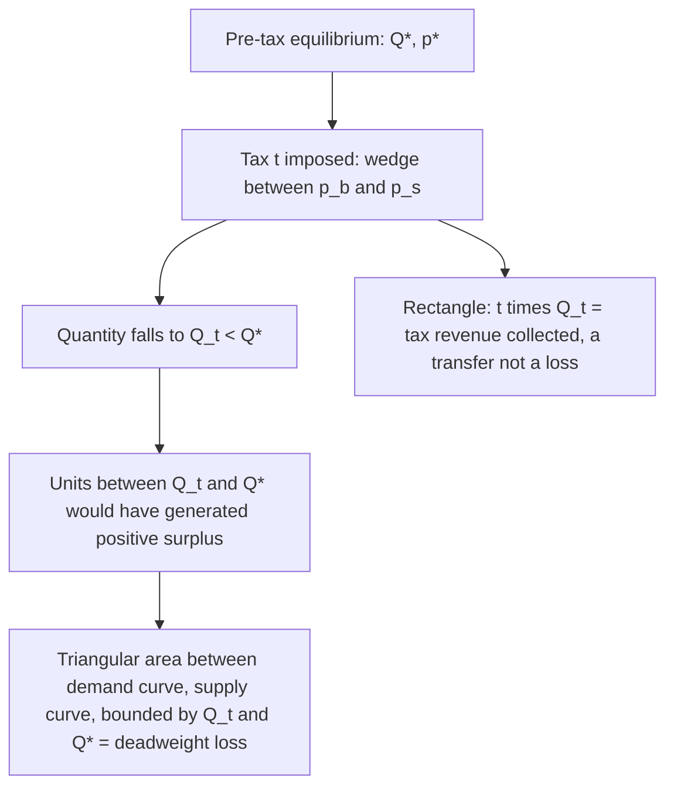
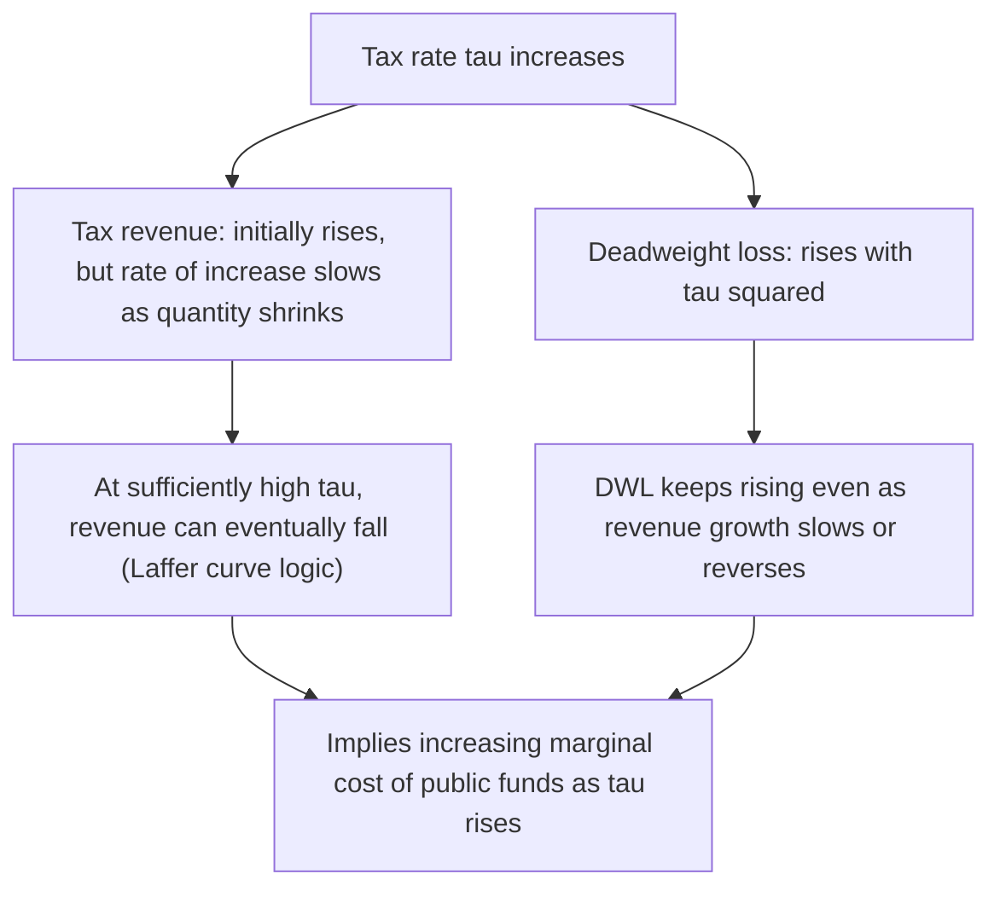

## Deadweight Loss and the Harberger Triangle

### Definition

**Deadweight loss (DWL)**, also called **excess burden** of taxation, is the loss in total economic surplus (consumer plus producer surplus) that exceeds the revenue actually collected by the government. It represents mutually beneficial trades that no longer occur because the tax wedge between buyer and seller prices exceeds the surviving surplus on marginal units, and it is the standard measure of the **efficiency cost** of a distortionary tax, distinct from the **distributional** question of incidence covered in the prior chapter.

### Why Deadweight Loss Exists: The Core Intuition

A tax drives a wedge $t$ between the price buyers pay ($p_b$) and the price sellers receive ($p_s$). Under perfect competition, the equilibrium quantity falls from $Q^*$ (no tax) to $Q_t$ (with tax). For every unit between $Q_t$ and $Q^*$, the buyer's willingness to pay exceeds the seller's cost of production — these are trades that *would* have been mutually beneficial absent the tax, generating positive surplus. But because the tax makes the combined price wedge exceed the remaining gains from trade on those units, they simply don't happen.

**Key Points**

- The **revenue collected** ($t \times Q_t$) is a *transfer* from private agents to the government — it is not itself a social loss, since the government (and by extension, society, if revenue is used productively) receives that value.
- The **deadweight loss** is the surplus lost on the $Q^* - Q_t$ units that no longer trade — this value is destroyed entirely; no one receives it.

### The Harberger Triangle: Geometric Derivation

On a standard supply-and-demand diagram, plot the demand curve $D(p)$ and supply curve $S(p)$ with the pre-tax equilibrium at $(Q^*, p^*)$. After the tax, quantity falls to $Q_t$, with buyers paying $p_b$ and sellers receiving $p_s = p_b - t$.

The deadweight loss is the **triangular area** bounded by:

- The demand curve (above)
- The supply curve (below)
- The vertical line at $Q_t$ (right edge)
- The vertical line at $Q^*$ (left edge, where the triangle comes to a point)

This triangle is often called the **Harberger triangle**, after Arnold Harberger's influential 1964 work systematizing the empirical measurement of deadweight loss using this geometric approach (applying the same "Harberger" name as in the general equilibrium incidence model, though these are two distinct contributions from the same economist).

### The Harberger Formula

For small taxes, the deadweight loss triangle can be approximated using the standard "area of a triangle" formula: one-half times base times height. The base is the change in quantity $\Delta Q = Q^* - Q_t$, and the height is the tax wedge $t$:

$$DWL \approx \frac{1}{2} \cdot \Delta Q \cdot t$$

Expressing $\Delta Q$ in terms of elasticities and the tax rate gives the canonical **Harberger formula**. Using the compensated (Hicksian) demand elasticity $\varepsilon^c_D$ and supply elasticity $\varepsilon_S$ (both evaluated at the pre-tax equilibrium), and letting $\tau = t/p^*$ denote the tax as a fraction of the pre-tax price:

$$DWL \approx \frac{1}{2} \cdot \frac{\varepsilon^c_D \cdot \varepsilon_S}{\varepsilon^c_D - \varepsilon_S} \cdot \tau^2 \cdot p^* \cdot Q^*$$

**Key Points**

- **The DWL is proportional to the square of the tax rate** ($\tau^2$) — this is the single most important qualitative result in the theory of excess burden. Doubling a tax rate roughly **quadruples** the deadweight loss, not doubles it.
- This "convexity" result is why economists generally favor **broad-based taxes at low rates** over narrow-based taxes at high rates for raising a given amount of revenue — spreading the same revenue target across a wider base at a lower rate produces substantially less aggregate deadweight loss than concentrating it at a high rate on a narrow base, essentially because DWL is convex in the rate on each individual base.
- **DWL depends on the compensated (Hicksian) elasticity**, not the ordinary (Marshallian) elasticity — a distinction elaborated further below.

### Why Compensated Elasticities, Not Ordinary Elasticities

**Key Points**

- Deadweight loss measures a pure **substitution effect** — the change in behavior due to the change in *relative* prices, holding real utility (welfare) constant.
- Ordinary (Marshallian) demand curves conflate substitution effects with **income effects** (the fact that a tax also reduces real purchasing power, like a general income reduction).
- Compensated (Hicksian) demand curves strip out the income effect by hypothetically compensating the consumer to keep them on the same indifference curve, isolating the pure substitution/distortion effect that is the actual source of inefficiency.
- Using the ordinary elasticity instead of the compensated elasticity in the Harberger formula would **overstate** deadweight loss for a normal good (since it would incorrectly attribute some of the quantity reduction, which is really due to a negative income effect, to distortionary substitution), which is why rigorous excess burden analysis specifically calls for the compensated elasticity.

### Deadweight Loss Under Income Taxation: The Labor Supply Case

The same triangle logic applies directly to labor income taxation, using the **compensated labor supply elasticity** $\varepsilon^c_L$:

$$DWL \approx \frac{1}{2} \cdot \varepsilon^c_L \cdot \tau^2 \cdot wL$$

where $w$ is the wage, $L$ is labor supply, and $\tau$ is the marginal tax rate. This formula underlies a large applied public finance literature estimating the efficiency cost of income taxation, and is central to discussions of optimal marginal tax rates (connecting to the separate Optimal Taxation literature).

### The Marginal Excess Burden and Increasing Marginal Cost of Taxation

Because DWL is convex ($\propto \tau^2$), the **marginal** excess burden of raising the tax rate further (holding the base fixed) is *increasing* in the tax rate:

$$\frac{d(DWL)}{d\tau} \propto \tau$$

**Example**

Raising a tax rate from 10% to 11% creates far less *additional* deadweight loss than raising it from 40% to 41%, even though both are one-percentage-point increases — because the marginal excess burden scales with the *level* of the existing tax rate, not just the size of the increment. This is a core input into the **Marginal Cost of Public Funds (MCPF)** concept used in cost-benefit analysis of public projects, since the last dollar of tax revenue raised at high existing rates costs society substantially more than one dollar in true resource terms.

### Deadweight Loss and Elasticity Magnitudes

**Key Points**

- Larger $\varepsilon^c_D$ and/or $\varepsilon_S$ (more elastic compensated demand/supply — more substitution possibilities) → larger deadweight loss for a given tax rate, since the quantity response $\Delta Q$ is larger.
- This creates a direct **efficiency rationale (the "inverse elasticity rule") for taxing relatively inelastic goods more heavily** — since inelastic goods generate less behavioral distortion per dollar of revenue — a result that connects directly to Ramsey optimal commodity taxation (covered separately under Optimal Taxation), though it stands in tension with equity considerations since necessities are often relatively inelastic.
- Perfectly inelastic supply or demand (e.g., land, as discussed under *Incidence in Factor Markets*) implies **zero deadweight loss**, since $\Delta Q = 0$ regardless of the tax rate — reinforcing why land value taxation is held up as the efficiency-ideal (non-distortionary) tax base.

### Deadweight Loss and Ad Valorem versus Specific Taxes

[Inference] For small tax rates in a competitive market, ad valorem and specific taxes generating the same revenue produce essentially the same deadweight loss, consistent with the equivalence result discussed under *Partial Equilibrium Incidence in Competitive Markets*; the two forms can diverge more at larger tax rates or under non-linear supply/demand curvature, though this is a second-order consideration relative to the dominant $\tau^2$ scaling result.

### Empirical Estimates and Applications

**Key Points**

- Applied public finance research uses estimated compensated elasticities (for labor supply, taxable income more broadly, and specific commodities) plugged into Harberger-style formulas to produce empirical deadweight loss estimates for real-world tax policy evaluation.
- The **Elasticity of Taxable Income (ETI)** framework extends this logic beyond simple labor supply to the full range of behavioral margins (effort, tax avoidance, income shifting, timing) by which taxpayers respond to marginal tax rates, using a single reduced-form elasticity estimated from tax return data — a major modern extension of the classical Harberger triangle approach to income taxation.

### Diagrammatic Summary: Revenue versus Deadweight Loss

### Related Topics

- Optimal commodity taxation and the Ramsey rule (inverse elasticity rule)
- The Elasticity of Taxable Income (ETI) literature
- Marginal Cost of Public Funds and cost-benefit analysis of public projects
- Statutory versus Economic Incidence
- Compensated versus uncompensated demand: Slutsky decomposition
- The Laffer curve and revenue-maximizing tax rates