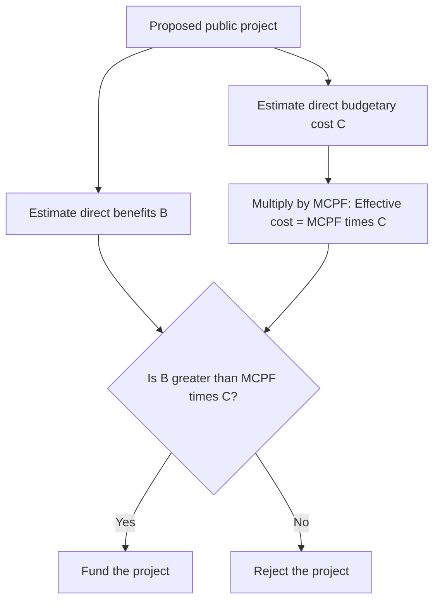

## Marginal Cost of Public Funds

### Definition and Conceptual Overview

The Marginal Cost of Public Funds (MCPF), also called the Marginal Cost of Funds (MCF), measures the total resource cost to society of raising one additional dollar of tax revenue, inclusive of both the dollar transferred to the government and the deadweight loss generated in collecting it. It is the central bridge concept linking excess burden theory to applied cost-benefit analysis of public expenditure.

**[Confirmed]** Formally:

$$MCPF = 1 + MEB$$

where $MEB$ is the marginal excess burden per dollar of revenue raised (see related topic). The "1" represents the direct dollar-for-dollar resource transfer from the private sector to the public sector, while $MEB$ represents the additional efficiency cost layered on top due to behavioral distortions from the tax.

Since $MEB \geq 0$ for any distortionary tax, $MCPF \geq 1$ always holds, meaning **every dollar spent by government through distortionary taxation costs society more than one dollar** in real resource terms — a foundational result for evaluating whether public projects are worth financing.

### Formal Derivation

Consider a tax $t$ on a good with pre-tax price $p$ and quantity $q(t)$. Revenue is:

$$R(t) = t \cdot p \cdot q(t)$$

Differentiating with respect to $t$:

$$\frac{dR}{dt} = p \cdot q + t \cdot p \cdot \frac{dq}{dt}$$

The government's real resource cost of raising this additional revenue must account for the value of resources removed from the private economy beyond the revenue itself. Using the Harberger approximation for the marginal deadweight loss $dEB/dt = \varepsilon \cdot p \cdot q \cdot t$ (see Marginal Excess Burden), the MCPF is defined as the ratio of total marginal social cost to marginal revenue raised:

$$MCPF = \frac{dR/dt + dEB/dt}{dR/dt} = 1 + \frac{dEB/dt}{dR/dt} = 1 + MEB$$

**[Confirmed]** This decomposition shows MCPF is not an independent concept but an additive transformation of MEB — MCPF and MEB always move together and differ only by the constant 1.

### Numerical Example

**Example**

Using the gasoline tax example from the Marginal Excess Burden topic: $t = 0.20$, $\varepsilon = 0.4$ (magnitude), $p = \$3.00$, $q = 100$ billion gallons, giving $MEB \approx 0.087$.

$$MCPF = 1 + 0.087 = 1.087$$

**Interpretation**: To raise one additional dollar of gasoline tax revenue, society gives up $1.087 in real resources. If the government is considering a public project financed by this tax, the project's expected social benefits must exceed $1.087 per dollar spent — not just $1.00 — to be welfare-improving.

### Role in Cost-Benefit Analysis

**Key Points**

- The standard cost-benefit decision rule without considering financing distortions is: **fund the project if $B > C$** (benefits exceed costs).
- Once MCPF is incorporated, the rule becomes: **fund the project if $B > MCPF \times C$**, where $C$ is the direct budgetary cost.
- This means a project with a benefit-cost ratio of, say, 1.05 might appear worthwhile in isolation but should be **rejected** if $MCPF = 1.15$, since $1.05 < 1.15$.
- MCPF thus raises the effective hurdle rate for public spending, making the case for **fewer but higher-value public projects** when distortionary financing is unavoidable.

### Distinguishing MCPF from Simple Revenue Cost

**[Inference]** A common analytical error is to treat the cost of a $1 government program as exactly $1 (the budgetary outlay). MCPF corrects this by pricing in the shadow cost of taxation itself. This has direct implications for:

- **Program evaluation**: Government programs financed by highly distortionary taxes (e.g., taxes on narrow, elastic bases) face a higher effective cost hurdle than those financed by broad-based, low-elasticity taxes (e.g., some forms of property or land taxation).
- **Privatization and user-fee debates**: If a service can be financed through user fees (which may have lower or zero MCPF, depending on whether fees themselves distort behavior) rather than general distortionary taxation, the effective social cost of provision can differ substantially.
- **Tax-financed vs. debt-financed spending**: MCPF calculations traditionally focus on current tax financing; extending the framework to debt-financed spending requires additional assumptions about future taxation and intergenerational incidence, which is a more complex and debated extension.

### MCPF Across Different Tax Instruments

**Key Points**

- **Broad-based consumption taxes** (e.g., a uniform VAT) generally exhibit lower MCPF than narrow excise taxes on elastic goods, because the "no substitute to shift to" property of broad bases limits behavioral distortion.
- **Labor income taxes**: MCPF for labor taxation depends critically on the **elasticity of taxable income (ETI)**, which captures not just labor supply hours but also tax avoidance, income shifting, and reporting behavior. **[Unverified]** Empirical MCPF estimates for labor income taxes in developed economies commonly range from approximately 1.2 to 1.5 at prevailing marginal rates, though estimates vary considerably by country, income group, and elasticity assumptions used.
- **Corrective (Pigouvian) taxes**: For taxes that correct a pre-existing externality (e.g., carbon taxes), the MCPF framework requires modification — **[Inference]** the marginal unit of such a tax can have an MCPF **below 1**, or even negative in some formulations, because the tax simultaneously raises revenue and corrects an externality that itself imposes a social cost. This is sometimes referred to as a "double dividend" possibility, though the existence and size of a double dividend is debated in the literature.
- **Lump-sum taxes**: In the theoretical benchmark case of a non-distortionary lump-sum tax, $MEB = 0$ and therefore $MCPF = 1$ exactly — the efficiency-cost-free baseline against which all real-world taxes are compared.

### Graphical Illustration: MCPF and the Effective Cost Hurdle

<svg xmlns="http://www.w3.org/2000/svg" viewBox="0 0 640 400" font-family="Helvetica, Arial, sans-serif">
<text x="320" y="24" text-anchor="middle" font-size="16" font-weight="bold" fill="#1a1a1a">MCPF Effective Cost Hurdle (svg_diagram)</text>

<rect x="120" y="300" width="100" height="40" fill="#2874a6" />
<text x="170" y="325" text-anchor="middle" font-size="13" fill="#fff">$1.00</text>
<text x="170" y="360" text-anchor="middle" font-size="12" fill="#333">Direct budgetary cost</text>

<rect x="320" y="260" width="100" height="80" fill="#c0392b" />
<text x="370" y="305" text-anchor="middle" font-size="13" fill="#fff">$1.087</text>
<text x="370" y="360" text-anchor="middle" font-size="12" fill="#333">MCPF-adjusted cost</text>

<rect x="320" y="260" width="100" height="40" fill="#e67e22" opacity="0.85" />
<text x="480" y="280" font-size="12" fill="#e67e22" font-weight="bold">MEB portion (0.087)</text>
<line x1="420" y1="280" x2="470" y2="280" stroke="#e67e22" stroke-width="2" />

<line x1="90" y1="230" x2="560" y2="230" stroke="#555" stroke-dasharray="5,4" />
<text x="560" y="225" text-anchor="end" font-size="12" fill="#555">Required benefit level to justify project</text>
</svg>

### Policy Implications and Applications

**Key Points**

- **Optimal government size**: MCPF enters models of optimal public sector size — governments should expand spending only up to the point where the marginal social benefit of the last dollar spent equals MCPF times the marginal cost, not simply where benefits equal $1.
- **Tax mix design**: When multiple tax instruments are available, efficient tax design equalizes MCPF (equivalently, MEB) across instruments at the margin, consistent with the Ramsey rule.
- **International and institutional comparisons**: MCPF estimates are used by finance ministries and multilateral institutions (e.g., in guidance historically referenced by bodies such as HM Treasury in the UK and various OECD analyses) as a standard multiplier applied to the direct cost side of public cost-benefit appraisals. **[Unverified]** Specific numerical multipliers used by particular governments change over time and by jurisdiction, so current official guidance should be consulted directly for applied appraisal work rather than relying on any single historical figure.
- **Behavioral responses may vary**: MCPF estimates rely on elasticity parameters that are context-, time-, and country-specific; a value estimated for one tax base or population cannot be assumed to transfer directly to another without re-estimation.

### Common Pitfalls in Analysis

**Key Points**

- Treating MCPF as a **universal constant** (e.g., "MCPF = 1.3") rather than a parameter specific to the tax instrument, jurisdiction, and time period in question.
- Confusing MCPF with the **average** cost of the tax system as a whole, rather than the marginal cost of raising the *next* dollar.
- Applying MCPF to corrective/Pigouvian taxes without adjusting for the externality-correction benefit, which can push the effective figure below the standard distortionary-tax range.
- Ignoring **general equilibrium interactions** across tax bases when multiple taxes are adjusted simultaneously, which can cause simple partial-equilibrium MCPF estimates to misstate the true social cost.

### Related Topics

- Marginal Excess Burden (MEB)
- Ramsey Rule and Optimal Commodity Taxation
- Pigouvian Taxation and the Double Dividend Hypothesis
- Elasticity of Taxable Income
- Cost-Benefit Analysis of Public Projects
- Optimal Size of Government
- Debt Financing vs. Tax Financing of Public Expenditure
- Deadweight Loss and the Laffer Curve