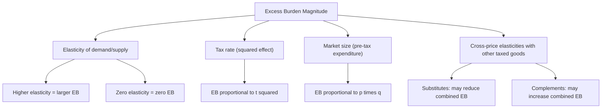

## Determinants of Excess Burden

### Definition and Conceptual Overview

The determinants of excess burden refer to the structural and behavioral factors that govern the magnitude of deadweight loss created by a distortionary tax. Excess burden does not depend solely on the presence of a tax, but on a specific set of parameters — elasticities, the tax rate itself, market size, and the interaction between taxed and untaxed goods — that jointly determine how much economic efficiency is sacrificed to raise a given amount of revenue. Understanding these determinants allows policymakers to predict, compare, and minimize the efficiency costs of alternative tax designs.

### The Core Formula and Its Components

**[Confirmed]** The standard Harberger triangle approximation for excess burden from a tax $t$ on a single good is:

$$EB \approx \frac{1}{2} \varepsilon \cdot p \cdot q \cdot t^2$$

where:

- $\varepsilon$ = compensated (Hicksian) price elasticity of demand (or supply, whichever is more elastic in determining the quantity response)
- $p \cdot q$ = pre-tax total expenditure on the good (market size)
- $t$ = the ad valorem tax rate

Each term in this formula corresponds to a distinct determinant, examined individually below.

### Determinant 1: Elasticity of Demand and Supply

**Key Points**

- Excess burden is **directly proportional** to the compensated elasticity $\varepsilon$. A good with $\varepsilon = 0$ (perfectly inelastic demand or supply) generates **zero excess burden** regardless of the tax rate, since quantity does not change — only price adjusts, and the tax is a pure transfer with no efficiency cost.
- The **relevant elasticity** is the compensated (income-effect-removed) elasticity, not the ordinary (Marshallian) elasticity, because excess burden isolates the pure substitution effect of the tax, stripping out the income effect which represents a transfer rather than a distortion.
- **Joint elasticity of supply and demand**: When both sides of the market are elastic, the relevant elasticity for the excess burden formula is a harmonic-mean-like combination of supply elasticity $\eta_s$ and demand elasticity $\eta_d$:

$$\varepsilon_{combined} = \frac{\eta_s \cdot \eta_d}{\eta_s + \eta_d}$$

- **[Inference]** This implies that if either side of the market is perfectly inelastic (e.g., a fixed factor like land, or a good with no substitutes), the combined elasticity approaches zero and excess burden approaches zero, **regardless of how elastic the other side is** — the classic rationale behind taxing perfectly inelastic bases (e.g., unimproved land value) as efficiency-neutral.

### Determinant 2: The Tax Rate (Squared Relationship)

**[Confirmed]** Excess burden rises with the **square** of the tax rate, not linearly. Doubling the tax rate quadruples the excess burden (holding elasticity and market size fixed), because both the price distortion and the resulting quantity response scale with $t$, and excess burden is the product of these two effects (the area of the Harberger triangle, $\frac{1}{2} \times \text{base} \times \text{height}$, where both base and height scale with $t$).

$$EB(2t) = \frac{1}{2}\varepsilon \cdot p \cdot q \cdot (2t)^2 = 4 \times EB(t)$$

This quadratic relationship is the theoretical foundation for two major policy prescriptions:

- **Prefer broad-based, low-rate taxation** over narrow, high-rate taxation for a given revenue target, since spreading a tax burden over many goods at low rates generates far less aggregate deadweight loss than concentrating it on few goods at high rates.
- **Rate increases become increasingly costly** at the margin — this is the direct link to Marginal Excess Burden, which is why MEB rises with $t$ even though average excess burden per dollar of revenue rises more slowly.

### Determinant 3: Market Size (Pre-Tax Expenditure)

**Key Points**

- Excess burden scales linearly with the pre-tax expenditure base $p \cdot q$. A tax imposed on a larger market generates proportionally more deadweight loss for the same rate and elasticity, simply because more transactions are being distorted.
- **[Inference]** This creates a policy tension: broadening the tax base to reduce the required rate (leveraging the quadratic rate effect) must be weighed against the linear scaling of excess burden with the size of each newly included market — the net effect on total excess burden depends on the relative elasticities of the goods added to the base versus those already taxed.

### Determinant 4: Cross-Price Elasticities and Interaction Effects

**[Confirmed]** In a multi-good economy with several pre-existing taxes, the excess burden of any single tax is not independent of taxes on other goods. If two goods are **substitutes**, taxing one shifts demand toward the other; if the other good is also taxed, this shift generates *additional* revenue and interacts with the excess burden calculation in ways that simple single-market (partial equilibrium) formulas do not capture.

- **Complements**: Taxing a good that is complementary to an already-taxed good can **reduce** demand for the already-taxed good, lowering the revenue collected there and effectively raising the combined excess burden of the tax system beyond what either tax would generate in isolation.
- **Substitutes**: Taxing a good that is a substitute for an already-taxed good can **increase** demand for the already-taxed good, partially offsetting revenue losses and potentially reducing combined excess burden relative to the sum of isolated calculations.
- **[Unverified]** The magnitude of these interaction effects depends on the specific cross-elasticities in the economy, which are difficult to estimate precisely and vary substantially by context; computable general equilibrium (CGE) models are typically used in applied work to capture these effects rather than relying on partial equilibrium approximations alone.

### Determinant 5: Pre-Existing Distortions

**[Inference]** The excess burden of a new or increased tax is not evaluated in a distortion-free vacuum. If a market already carries a distortion (e.g., a pre-existing tax, a regulatory price floor/ceiling, or a monopoly markup), imposing an *additional* tax interacts with that pre-existing wedge. This is the domain of **theory of the second best**, which shows that adding a tax to an already-distorted market does not necessarily produce a straightforward incremental excess burden calculable from the untaxed baseline — the interaction can either compound or partially offset the existing distortion depending on the direction and relative size of the wedges involved.

### Determinant 6: Time Horizon and Adjustment Elasticities

**Key Points**

- Elasticities — and therefore excess burden — are generally **larger in the long run than the short run**, since economic agents have more margins of adjustment available over longer horizons (e.g., firms can relocate capital, workers can retrain or switch industries, consumers can adopt substitute goods more fully).
- **[Inference]** This implies that static excess burden estimates using short-run elasticities will systematically understate the true long-run efficiency cost of a tax, a consideration especially relevant for capital income taxation, where long-run capital mobility elasticities substantially exceed short-run estimates.

### Numerical Comparison: Effect of Each Determinant

**Example**

Holding a baseline case of $\varepsilon = 0.5$, $p \cdot q = \$200$ billion, $t = 0.10$:

$$EB_{baseline} = \frac{1}{2}(0.5)(200\text{B})(0.10)^2 = \$0.5\text{B}$$

- **Doubling elasticity** ($\varepsilon = 1.0$): $EB = \$1.0\text{B}$ (2x baseline — linear effect)
- **Doubling the tax rate** ($t = 0.20$): $EB = \$2.0\text{B}$ (4x baseline — quadratic effect)
- **Doubling market size** ($pq = \$400\text{B}$): $EB = \$1.0\text{B}$ (2x baseline — linear effect)

This comparison makes clear **[Confirmed]** that, dollar-for-dollar of parameter change, the tax rate has the most severe (quadratic) impact on excess burden relative to elasticity or market size, which scale only linearly.

### Policy Applications

**Key Points**

- **Ramsey Rule / inverse elasticity rule**: Because excess burden depends directly on elasticity, efficient (though not necessarily equitable) tax design taxes inelastic goods more heavily and elastic goods more lightly, to minimize aggregate deadweight loss for a given revenue target.
- **Base-broadening tax reforms**: Leveraging the quadratic tax-rate effect, reforms that broaden the tax base and lower rates (holding revenue constant) are generally efficiency-improving, provided the newly included tax bases are not disproportionately elastic.
- **Corrective taxation exception**: When a tax targets a good associated with a negative externality, the standard determinants above still apply to the *private* market distortion, but must be netted against the *social* benefit of correcting the externality — a market with high elasticity and an externality may still be a good tax target if the corrective benefit dominates the standard excess burden cost.

### Common Pitfalls in Analysis

**Key Points**

- Using **Marshallian** (uncompensated) elasticities instead of **Hicksian** (compensated) elasticities, which conflates income effects with the pure substitution-effect distortion that excess burden is meant to measure.
- Assuming excess burden scales **linearly** with the tax rate rather than quadratically, leading to underestimation of the cost of high tax rates.
- Ignoring **cross-market interaction effects** when evaluating a tax in isolation, especially in economies with several substantial pre-existing taxes on related goods.
- Applying **short-run** elasticity estimates to **long-run** policy evaluation, understating the true steady-state efficiency cost.

### Related Topics

- Marginal Excess Burden (MEB)
- Marginal Cost of Public Funds (MCPF)
- Ramsey Rule and the Inverse Elasticity Rule
- Theory of the Second Best
- Compensated vs. Uncompensated (Hicksian vs. Marshallian) Demand
- Pigouvian Taxation and Externality Correction
- Optimal Commodity Taxation
- General Equilibrium Tax Interaction Effects